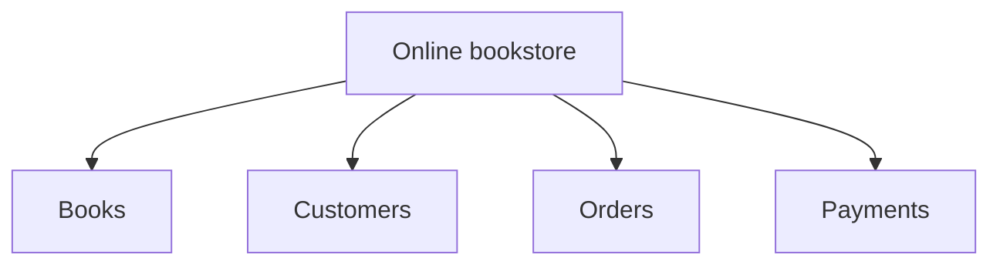
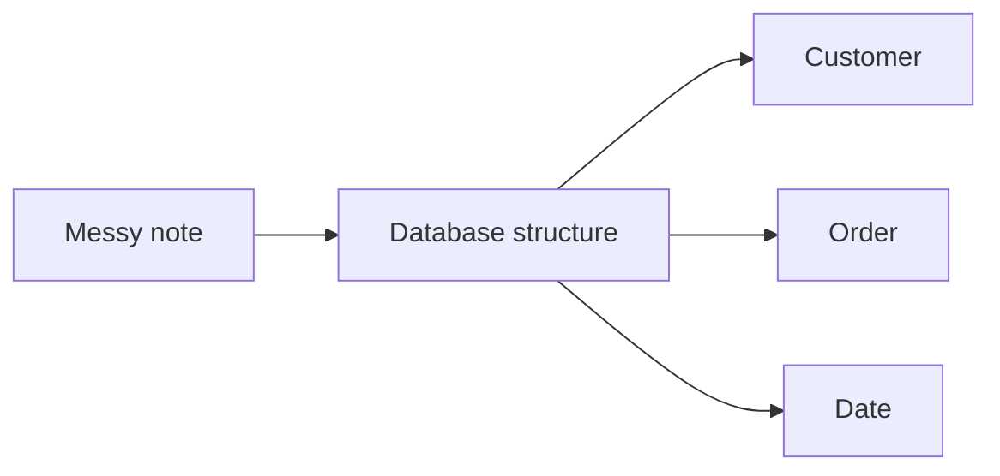
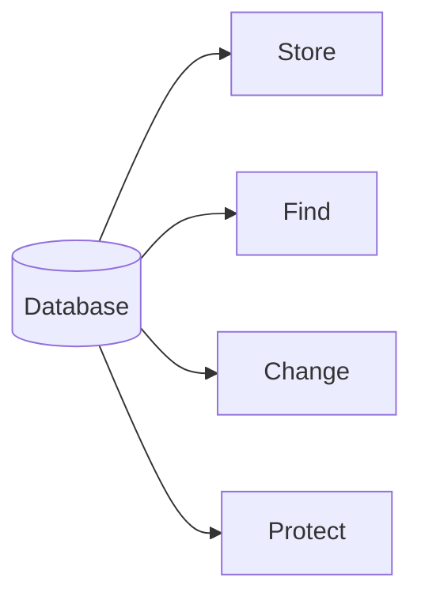
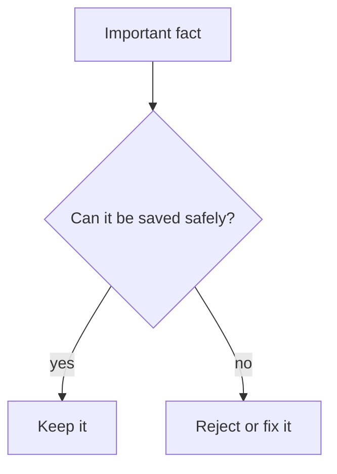
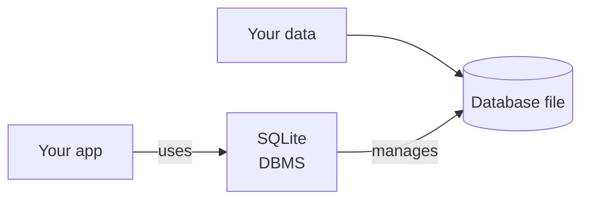
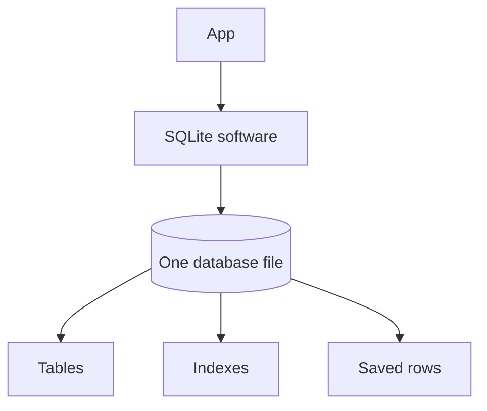
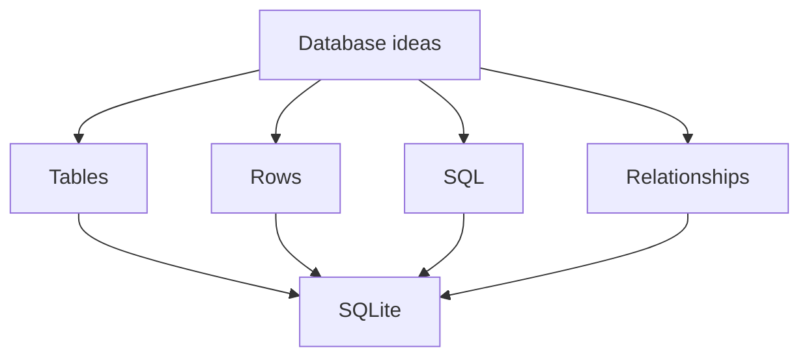

A database is an organized place to store information so you can find it, change it, and trust it later.

That sounds simple, but it is a big idea.

A notebook can store information. A spreadsheet can store information. A folder full of text files can store information. But a database gives you a more reliable way to work with information when it matters that the data is consistent, searchable, and protected.

SQLite is a real database management system. It may be small enough to live inside an app, but it still stores structured data, answers SQL questions, protects saved changes, and manages a real database file.

<svg
  viewBox="0 0 640 230"
  role="img"
  aria-label="A card-catalog box with neatly tabbed cards standing in order, and one card lifted out along a dotted trail exactly when needed — a database is an organized place where facts can be stored, found again, and trusted"
  style={{ display: "block", width: "100%", maxWidth: "560px", height: "auto", margin: "2.5rem auto" }}
>
  <g fill="currentColor" opacity="0.22">
    <rect x="172" y="118" width="296" height="14" rx="6" />
  </g>
  <g fill="currentColor" opacity="0.16">
    <rect x="196" y="70" width="46" height="52" rx="4" />
    <rect x="252" y="76" width="46" height="46" rx="4" />
    <rect x="308" y="72" width="46" height="50" rx="4" />
    <rect x="364" y="78" width="46" height="44" rx="4" />
    <rect x="412" y="74" width="46" height="48" rx="4" transform="rotate(7 435 98)" />
  </g>
  <g style={{ color: "var(--ds-blue-500)" }} fill="currentColor">
    <rect x="202" y="60" width="24" height="12" rx="4" />
    <path d="M 160 126 L 480 126 L 466 204 Q 464 212 456 212 L 184 212 Q 176 212 174 204 Z" fillOpacity="0.22" />
    <rect x="160" y="120" width="320" height="12" rx="6" fillOpacity="0.55" />
  </g>
  <g style={{ color: "var(--ds-yellow-500)" }} fill="currentColor">
    <rect x="258" y="66" width="24" height="12" rx="4" />
    <rect x="370" y="68" width="24" height="12" rx="4" />
  </g>
  <g style={{ color: "var(--ds-red-500)" }} fill="currentColor">
    <rect x="424" y="62" width="24" height="12" rx="4" transform="rotate(7 436 68)" />
  </g>
  <g fill="currentColor" opacity="0.3">
    <circle cx="350" cy="96" r="3" />
    <circle cx="362" cy="76" r="3" />
    <circle cx="378" cy="58" r="3" />
    <circle cx="398" cy="44" r="3" />
    <circle cx="422" cy="34" r="3" />
  </g>
  <g fill="currentColor" opacity="0.14">
    <rect x="448" y="14" width="120" height="74" rx="8" />
  </g>
  <g fill="currentColor" opacity="0.4">
    <rect x="462" y="40" width="78" height="5" rx="2.5" />
    <rect x="462" y="52" width="92" height="5" rx="2.5" />
    <rect x="462" y="64" width="58" height="5" rx="2.5" />
  </g>
  <g style={{ color: "var(--ds-green-500)" }} fill="currentColor">
    <rect x="456" y="4" width="26" height="13" rx="4" />
    <circle cx="548" cy="28" r="6" />
  </g>
</svg>

## A database stores facts

Imagine a small online bookstore. It needs to remember things like:

- which books are for sale
- how much each book costs
- which customers have accounts
- which orders have been placed
- whether an order has shipped

Those pieces of information are **facts**.

A database stores facts in a structured way.

The structure matters because a computer needs more than a pile of words. It needs to know which facts belong together.

For example, this is a clear fact:

> Customer 12 placed order 9001 on March 3.

This is less clear:

> March 3 customer order 9001 maybe customer 12?

Databases help keep facts organized enough that software can use them.

## A database helps you do four jobs

Most database work is some version of these four jobs:

### Store

You add new information.

Examples:

- add a new customer
- record a payment
- save a message
- remember a product review

### Find

You ask for information later.

Examples:

- find all orders for one customer
- show the five newest messages
- search for products under $20
- count how many students passed a quiz

### Change

You update information when the real world changes.

Examples:

- mark an order as shipped
- change a user's email address
- update a product price
- cancel a reservation

### Protect

You prevent accidental or invalid changes.

Examples:

- do not allow an order without a customer
- do not store a negative quantity
- do not lose data if a program crashes
- keep overlapping edits from damaging the same fact

<MultipleChoice
  markdown={`Which job is a database doing when it answers "show me all orders from yesterday"?

- Store
  > Storing means adding new information, not asking for existing information.
- [o] Find
  > Finding means asking the database to return information that is already stored.
- Change
  > Changing means updating existing information.
- Protect
  > Protecting means preventing bad or unsafe changes.`}
/>

## Database vs. DBMS

People often use the word "database" in two related ways.

A **database** is the stored information itself.

A **database management system**, or **DBMS**, is the software that manages that information.

SQLite is a DBMS. It is the software library that lets an application create a database, store rows, ask questions, and protect information.

SQLite databases are commonly stored as a single ordinary file on disk. The file contains the database. SQLite is the software that knows how to read and change that file safely.

In everyday speech, people may say "open the database" when they mean "open the SQLite database file." That is okay. As a learner, it helps to know the difference between the file that stores data and the DBMS that manages it.

## What a database is not

A database is not magic.

It does not automatically know what your rules should be. You still decide what information matters, what counts as valid, and how the pieces relate.

A database is not always a spreadsheet replacement.

Spreadsheets are excellent for quick lists, budgets, and one-person analysis. Databases are better when software needs to safely store and query structured facts over time.

A database is not only for huge companies.

Small apps, personal projects, phone apps, embedded devices, and command-line tools can all use databases. SQLite is especially common in places where a full database server would be too much.

A database is not the same as the app screen.

The screen shows buttons and forms. The database stores the facts those screens need.

## Where SQLite fits

SQLite is one specific DBMS.

It is widely used in phones, browsers, desktop apps, command-line tools, test suites, small websites, embedded devices, and many other software projects.

SQLite is beginner-friendly because it is zero-config and stores everything in one file, but it is not a toy. It is a serious database engine used in real software around the world.

## The main idea

A database is an organized system for storing facts so software can find them, change them, and protect them.

You do not need to understand every database feature yet. For now, remember this:

> A database helps a program remember important facts reliably.

## Check your understanding

<MultipleChoice
  markdown={`In beginner-friendly terms, what is a database?

- A programming language for drawing screens
  > A database stores information; it does not draw the user interface.
- [o] An organized place to store information so it can be found, changed, and trusted later
  > A database keeps information organized for later use.
- A password manager only
  > A database may store protected information, but it is not only a password manager.
- A replacement for every spreadsheet
  > Spreadsheets are still useful; databases solve different problems.`}
/>

<MultipleChoice
  markdown={`What is a DBMS?

- A row inside a table
  > A row is one stored record, not the software that manages records.
- [o] Software that manages databases
  > A database management system creates, reads, changes, and protects stored data.
- A chart type
  > A DBMS is not a chart.
- A file extension
  > Some database files have extensions, but a DBMS is software.`}
/>

<MultipleChoice
  markdown={`Which statement about SQLite is true?

- SQLite is only a drawing tool
  > SQLite manages data, not screen drawings.
- SQLite is not a real database system
  > SQLite is a real DBMS used in many production applications.
- [o] SQLite is a real DBMS that often stores a database in one ordinary file
  > SQLite manages tables, rows, SQL queries, and saved database files.
- SQLite can only store one word
  > SQLite databases can store many tables and rows.`}
/>

<MultipleChoice
  markdown={`Why does structure matter in a database?

- It makes data harder to search
  > Good structure usually makes data easier to search.
- It removes the need to think about rules
  > You still need to decide what rules your data should follow.
- [o] It helps software know which facts belong together
  > Structure tells the computer how pieces of information relate.
- It turns every fact into a paragraph
  > Databases usually break facts into smaller fields, not paragraphs.`}
/>
