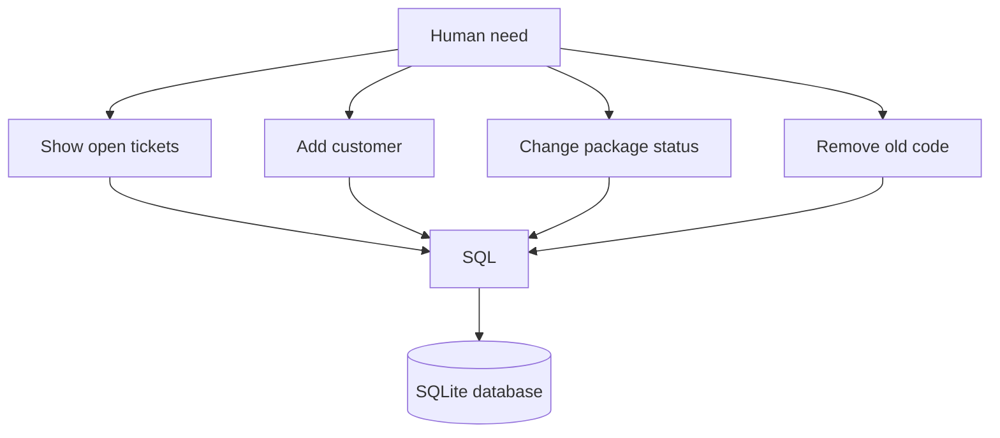
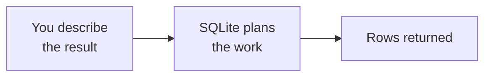
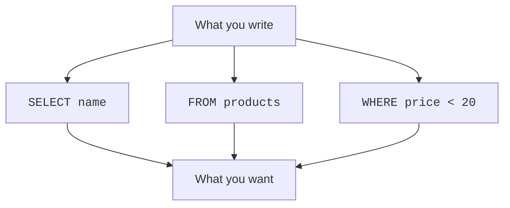
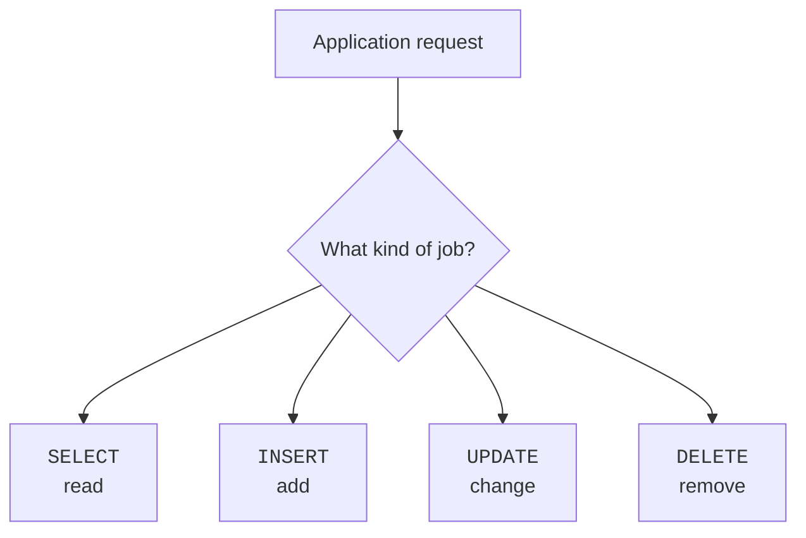
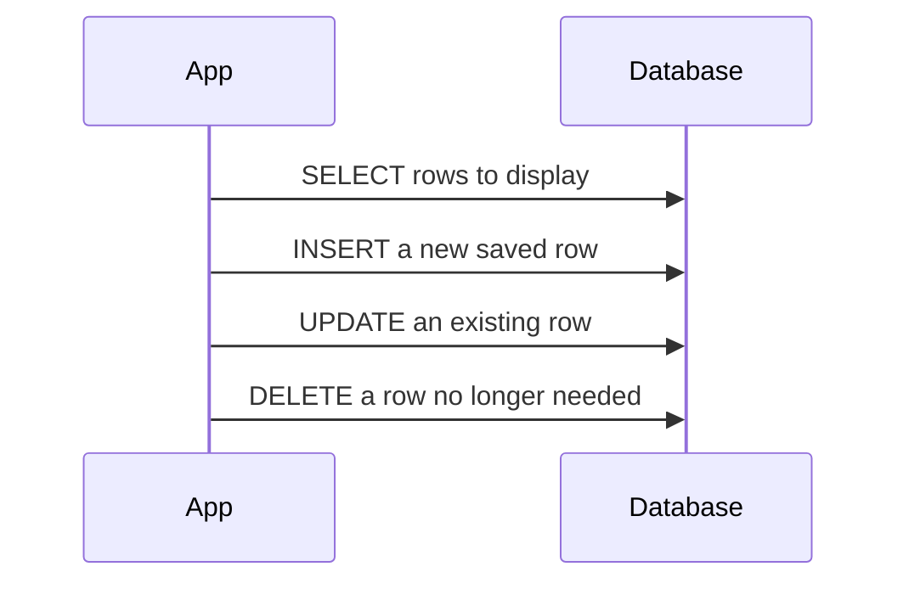
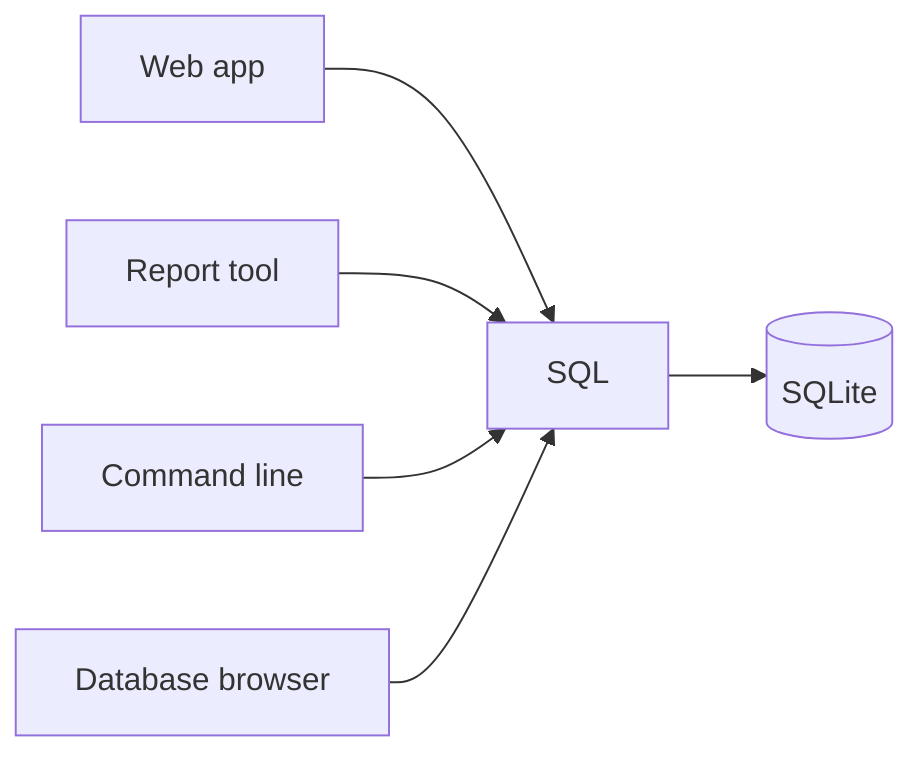
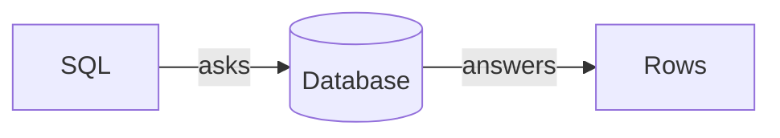

SQL exists because people needed a common way to ask structured questions about structured data.

SQL stands for **Structured Query Language**.

It is the language most relational databases understand, including SQLite.

Instead of telling the computer every tiny step, SQL lets you describe the result you want.

## A shared language

Before a database can answer questions, people and programs need a way to express those questions clearly.

Examples:

- Show me all open support tickets.
- Add this new customer.
- Change this package from "processing" to "shipped."
- Delete this expired discount code.

SQL gives these requests a common shape.



## SQL describes what, not every how

SQL is often called **declarative**.

That means you describe what result you want, and the database figures out many of the steps.

For example, you might ask SQLite:

<SqlCodeBlock
  dialect="sqlite"
  title="Describe the rows you want"
  initSql={`CREATE TABLE products (
  id INTEGER PRIMARY KEY,
  name TEXT,
  price NUMERIC
);
INSERT INTO products (name, price) VALUES
  ('Notebook', 4.99),
  ('Backpack', 34.50),
  ('Pen', 1.25);`}
  starterCode={`SELECT
  name
FROM
  products
WHERE
  price < 20;`}
/>

You are saying:

> Give me the names of products where the price is less than 20.

You are not saying:

> Open the storage file, read byte 900, compare it, jump to another page, then draw the answer.

SQLite handles those lower-level details.





<MultipleChoice
  markdown={`What does it mean that SQL is declarative?

- You must describe every byte SQLite should read from disk
  > SQL hides low-level storage steps from the beginner query.
- [o] You describe the result you want, not every low-level step
  > SQL lets you ask for matching rows without describing the internal storage work.
- You must draw every database page by hand
  > The database manages storage details.
- SQL can only delete data
  > SQL can read, add, change, and delete data.`}
/>

## The four everyday verb families

Most beginner SQL fits into four categories:

```text
SELECT  read existing rows
INSERT  add new rows
UPDATE  change existing rows
DELETE  remove rows
```

These match the basic things applications do with stored information.





### SELECT reads

`SELECT` asks for information that is already stored.

### INSERT adds

`INSERT` saves a new row.

### UPDATE changes

`UPDATE` edits rows that already exist.

### DELETE removes

`DELETE` removes rows you no longer want to keep.

<MultipleChoice
  markdown={`Which SQL verb usually adds a new row?

- SELECT
  > SELECT reads rows.
- [o] INSERT
  > INSERT adds new rows to a table.
- UPDATE
  > UPDATE changes rows that already exist.
- DELETE
  > DELETE removes rows.`}
/>

## Why one language matters

SQL became important because many tools can speak it.

A reporting tool, a web application, a command-line program, and a database browser can all send SQL to a relational database.



Each database system has its own features and small differences, but the core ideas transfer widely.

SQLite, PostgreSQL, MySQL, SQL Server, and many other systems understand SQL.

## SQL is not the database

SQL is the language.

The database is the stored information and the system that manages it.

That is like the difference between a question and the library that answers it.



## The main idea

SQL exists so people and applications can ask structured questions and request structured changes using a shared language.

You will learn SQL gradually. At first, focus on the idea:

> SQL says what information you want the database to read or change.

## Check your understanding

<MultipleChoice
  markdown={`What does SQL stand for?

- Simple Question List
  > That is not what SQL stands for.
- [o] Structured Query Language
  > SQL is the shared language for working with structured data in relational databases.
- Storage Queue Logic
  > SQL is not a queue system.
- Screen Quality Layout
  > SQL is not about screen design.`}
/>

<MultipleChoice
  markdown={`Which SQL command usually reads existing rows?

- [o] SELECT
  > SELECT asks the database to return stored information.
- INSERT
  > INSERT adds new rows.
- UPDATE
  > UPDATE changes existing rows.
- DELETE
  > DELETE removes rows.`}
/>

<MultipleChoice
  markdown={`Why did SQL become useful across many tools?

- It only works when one person types into one spreadsheet cell
  > SQL is used by many tools and applications, not just manual cell editing.
- [o] It gives many programs a shared way to talk to relational databases
  > SQL is understood by many databases and tools.
- It only works for one brand of database
  > Core SQL ideas work across many database systems.
- It replaces every programming language
  > SQL works with programming languages; it does not replace all of them.`}
/>

<MultipleChoice
  markdown={`What is SQL not responsible for? 

- Describing which rows you want
  > SQL commonly describes the rows to read or change.
- Helping apps request database work
  > Applications often send SQL to databases.
- [o] Drawing the app's buttons and screens
  > The application draws the interface; SQL talks to the database.
- Reading rows with SELECT
  > SELECT is a SQL command for reading rows.`}
/>
