Databases exist because important information is hard to manage safely with simple files, memory, or human discipline alone.

At a tiny scale, almost anything works. You can write names in a notebook, save a list in a text file, or keep a budget in a spreadsheet.

But as soon as more people, more rules, more history, and more questions appear, information becomes harder to keep correct.

Databases were invented to help with that.

<svg
  viewBox="0 0 640 240"
  role="img"
  aria-label="A balloon carrying a fact drifts away and a sticky note peels off a wall losing its dot, while the same facts rest safely in a sturdy chest on the right — fragile ways of remembering versus a database built to keep them"
  style={{ display: "block", width: "100%", maxWidth: "640px", height: "auto", margin: "2.5rem auto" }}
>
  <g style={{ color: "var(--ds-yellow-500)" }} fill="currentColor">
    <circle cx="120" cy="58" r="26" fillOpacity="0.45" />
    <path d="M 113 82 L 127 82 L 120 92 Z" fillOpacity="0.45" />
  </g>
  <g style={{ color: "var(--ds-blue-500)" }} fill="currentColor">
    <circle cx="120" cy="58" r="8" fillOpacity="0.35" />
  </g>
  <g fill="currentColor" opacity="0.25">
    <circle cx="122" cy="102" r="2.5" />
    <circle cx="128" cy="116" r="2.5" />
    <circle cx="126" cy="130" r="2.5" />
    <circle cx="118" cy="143" r="2.5" />
    <circle cx="112" cy="156" r="2.5" />
  </g>
  <g style={{ color: "var(--ds-yellow-500)" }} fill="currentColor">
    <path d="M 240 96 L 304 90 L 310 146 L 268 152 Q 244 132 240 96 Z" fillOpacity="0.5" />
    <path d="M 268 152 Q 262 134 240 130 Q 252 144 268 152 Z" fillOpacity="0.8" />
  </g>
  <g style={{ color: "var(--ds-red-500)" }} fill="currentColor">
    <circle cx="290" cy="176" r="7" fillOpacity="0.8" />
  </g>
  <g fill="currentColor" opacity="0.12">
    <rect x="60" y="196" width="520" height="6" rx="3" />
  </g>
  <g style={{ color: "var(--ds-green-500)" }} fill="currentColor">
    <path d="M 408 116 L 568 116 L 568 190 Q 568 196 562 196 L 414 196 Q 408 196 408 190 Z" fillOpacity="0.3" />
    <path d="M 408 116 Q 408 88 488 88 Q 568 88 568 116 Z" fillOpacity="0.55" />
    <rect x="478" y="108" width="20" height="16" rx="4" />
  </g>
  <g style={{ color: "var(--ds-blue-500)" }} fill="currentColor">
    <circle cx="438" cy="156" r="8" />
    <circle cx="463" cy="156" r="8" fillOpacity="0.75" />
    <circle cx="488" cy="156" r="8" fillOpacity="0.55" />
  </g>
  <g style={{ color: "var(--ds-yellow-500)" }} fill="currentColor">
    <circle cx="513" cy="156" r="8" fillOpacity="0.8" />
  </g>
  <g style={{ color: "var(--ds-red-500)" }} fill="currentColor">
    <circle cx="538" cy="156" r="8" fillOpacity="0.8" />
  </g>
  <g fill="currentColor" opacity="0.3">
    <circle cx="438" cy="176" r="2.5" />
    <circle cx="463" cy="176" r="2.5" />
    <circle cx="488" cy="176" r="2.5" />
    <circle cx="513" cy="176" r="2.5" />
    <circle cx="538" cy="176" r="2.5" />
  </g>
</svg>

## The simple version

A database helps an application:

- remember information after the program closes
- find the right facts quickly
- keep related facts consistent
- handle overlapping requests safely
- recover when something goes wrong

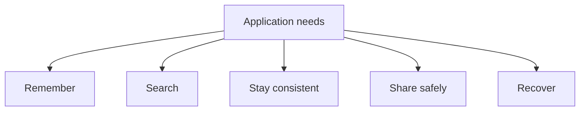

Without a database, every application would have to reinvent these abilities.

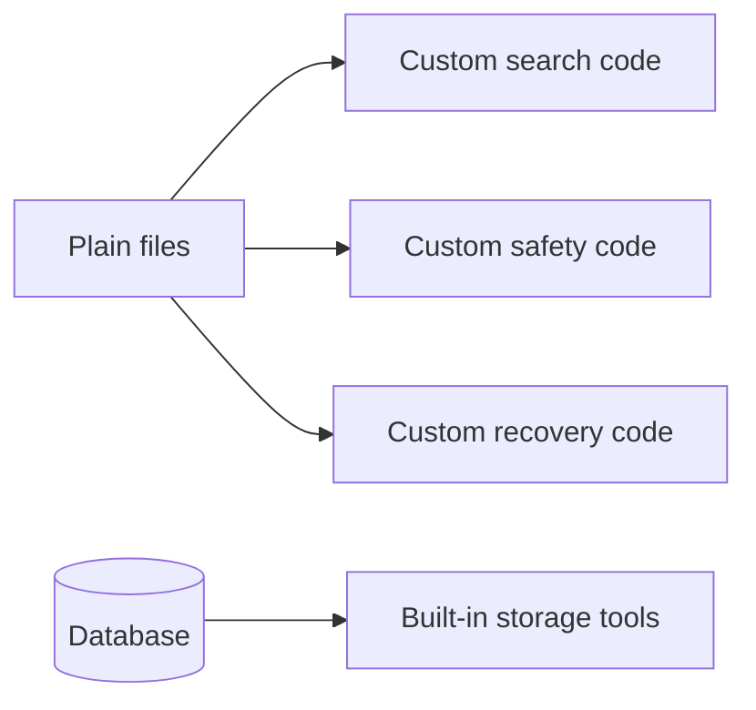

## Problem 1: memory disappears

Programs use memory while they run.

Memory is fast, but temporary.

If an application stores your shopping cart only in memory, the cart disappears when the app stops.

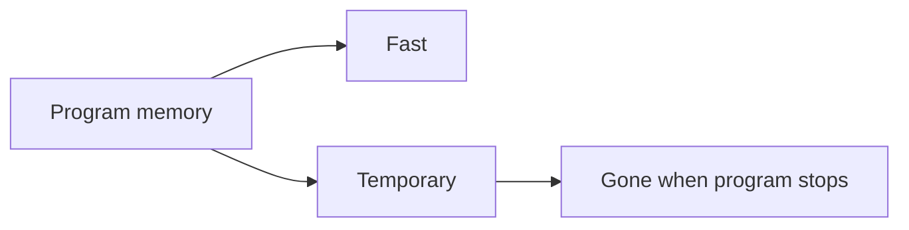

Databases store information durably, which means the information is meant to survive after the program exits.

With SQLite, durable data usually lives in a database file on disk. Your app can close, open later, and read the saved facts again.

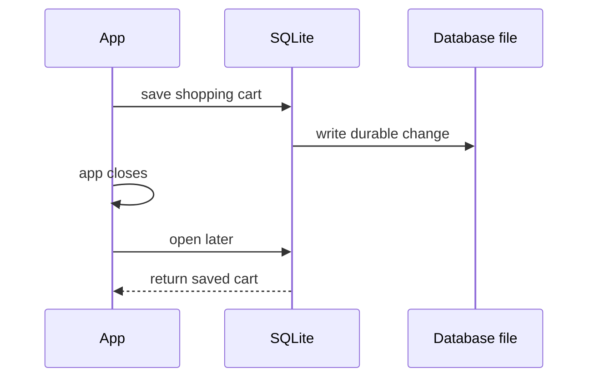

## Problem 2: files become messy

Files are useful. SQLite itself stores a database in a file under the hood.

But if each application invents its own pile of files, it must also invent:

- how to search them
- how to update one fact without breaking another
- how to stop two writes from colliding
- how to recover after a crash
- how to tell whether the data is valid

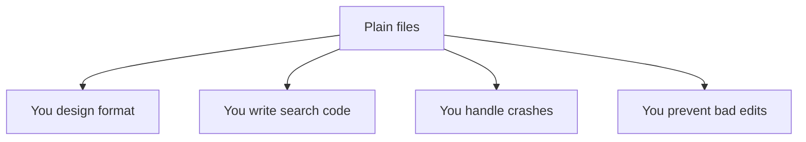

A database gives you a tested system for those jobs.

## Problem 3: many actions can touch the same data

Imagine two employees editing the last available seat on a tour bus.

If both people see "1 seat left" and both click "book," the application must not sell the same seat twice.

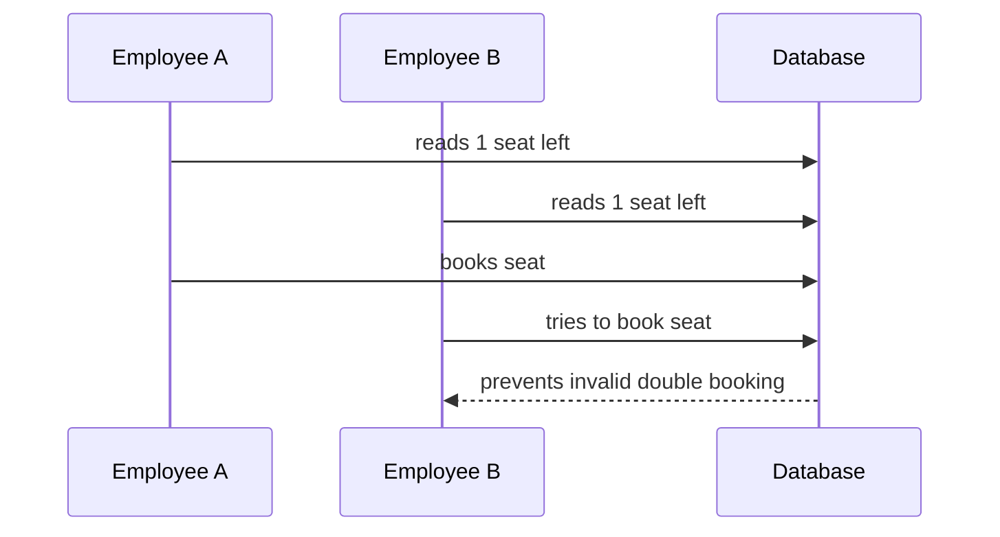

This is called a **concurrency** problem: more than one thing is happening at the same time.

SQLite is especially good for apps with many readers and simpler write patterns. It can protect writes so the database file is not corrupted, but it is not designed for huge numbers of users writing at the exact same moment like a large client-server database might handle.

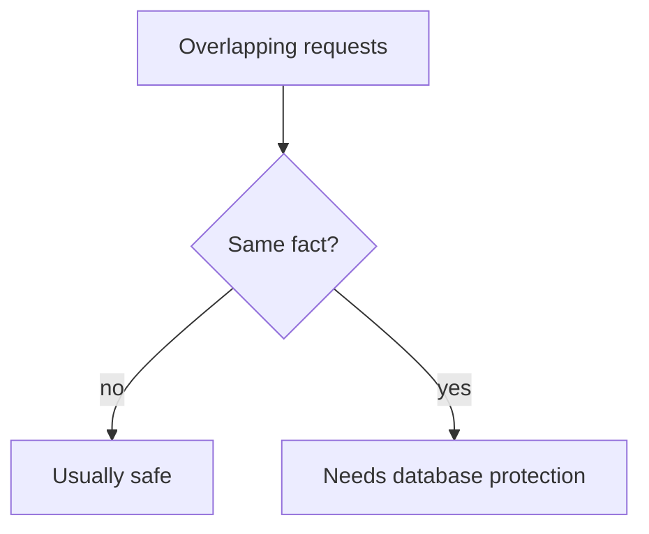

## Problem 4: facts must stay correct together

Some changes involve more than one fact.

Example: when a customer places an order, the application may need to:

- create the order
- add order items
- reduce inventory
- record payment status

If only half of those changes happen, the data becomes confusing or wrong.

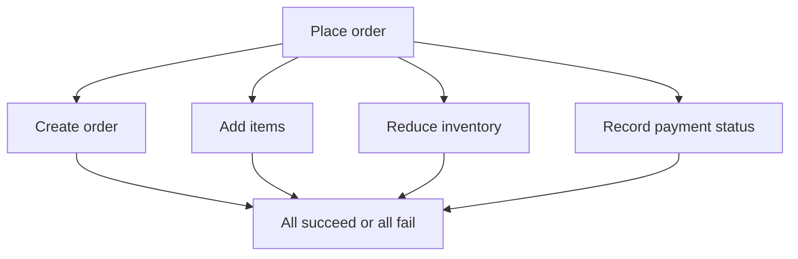

Databases support **transactions**, which let a group of changes be treated as one unit.

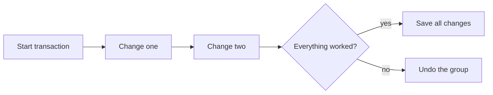

<MultipleChoice
  markdown={`Why is "sell the last seat twice" a database problem?

- It is about choosing a font
  > Fonts do not decide whether a seat can be sold twice.
- [o] Two overlapping actions can conflict unless the data is protected
  > Concurrency means more than one action may touch the same fact at the same time.
- It only happens when nobody uses computers
  > The problem is common in software systems.
- It proves files cannot store text
  > Files can store text; the hard part is safe shared change.`}
/>

## Problem 5: questions get more complicated

Simple storage is not enough. Applications need to ask questions.

Examples:

- Which customers ordered this month?
- Which products are almost out of stock?
- What was our total revenue last week?
- Which students have missing assignments?

A database gives you a query language so you can ask for exactly the data you need.

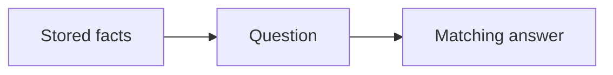

<SqlCodeBlock
  dialect="sqlite"
  title="Ask a small question"
  initSql={`CREATE TABLE tasks (
  id INTEGER PRIMARY KEY,
  title TEXT,
  done INTEGER
);
INSERT INTO tasks (title, done) VALUES
  ('Buy milk', 0),
  ('Pay rent', 1),
  ('Call dentist', 0);`}
  starterCode={`SELECT
  title
FROM
  tasks
WHERE
  done = 0;`}
/>

## Problem 6: data grows

What works for 20 rows may not work for 20 million.

As data grows, applications need better ways to:

- organize it
- search it
- avoid reading everything
- keep repeated operations predictable

Databases are built around these needs. They can use structures such as indexes to find information without scanning every row every time.

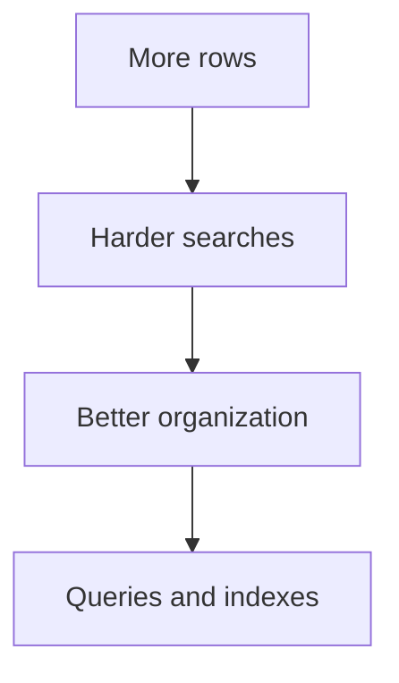

## Problem 7: things fail

Computers crash. Power goes out. Bugs happen.

A database cannot prevent every failure, but it can reduce how often failures corrupt your data.

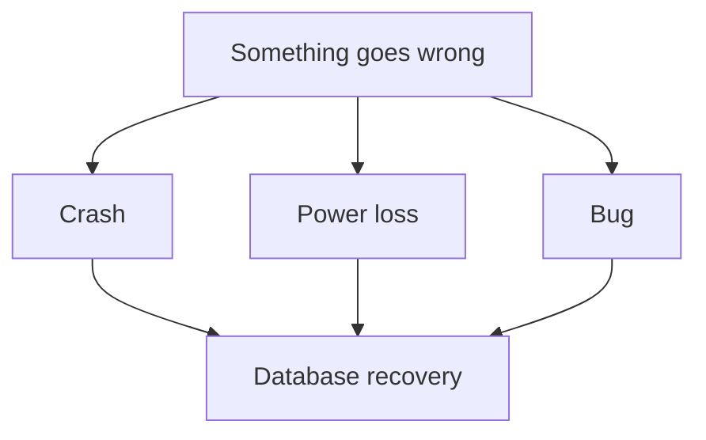

Durability means that once the database says a change is saved, it should not vanish just because the program ended.

## Why not just use files?

Sometimes files are exactly right.

A profile photo, a PDF receipt, a configuration file, or a short note may belong in a regular file.

The question is not "files or databases forever?"

<svg
  viewBox="0 0 640 190"
  role="img"
  aria-label="A single photo card hangs happily from one clip while a grid of interrelated facts sits on the other side of a question diamond — some information is fine as a plain file, and structured facts belong in a database"
  style={{ display: "block", width: "100%", maxWidth: "560px", height: "auto", margin: "2.5rem auto" }}
>
  <g fill="currentColor" opacity="0.18">
    <rect x="60" y="22" width="520" height="5" rx="2.5" />
  </g>
  <g fill="currentColor" opacity="0.35">
    <rect x="142" y="27" width="6" height="22" rx="3" />
  </g>
  <g fill="currentColor" opacity="0.14">
    <rect x="100" y="48" width="90" height="104" rx="6" transform="rotate(-4 145 100)" />
  </g>
  <g style={{ color: "var(--ds-blue-500)" }} fill="currentColor">
    <path d="M 110 116 L 134 84 L 152 104 L 168 88 L 184 112 L 184 124 L 110 124 Z" transform="rotate(-4 145 100)" fillOpacity="0.55" />
    <circle cx="126" cy="70" r="8" transform="rotate(-4 145 100)" fillOpacity="0.8" />
  </g>
  <g style={{ color: "var(--ds-yellow-500)" }} fill="currentColor">
    <rect x="296" y="76" width="48" height="48" rx="9" transform="rotate(45 320 100)" fillOpacity="0.85" />
  </g>
  <g fill="currentColor" opacity="0.5">
    <text x="320" y="108" textAnchor="middle" fontFamily="ui-monospace, monospace" fontSize="24" fontWeight="700">?</text>
  </g>
  <g style={{ color: "var(--ds-green-500)" }} fill="currentColor">
    <rect x="430" y="48" width="44" height="30" rx="5" fillOpacity="0.75" />
    <rect x="482" y="48" width="44" height="30" rx="5" fillOpacity="0.35" />
    <rect x="430" y="86" width="44" height="30" rx="5" fillOpacity="0.35" />
    <rect x="482" y="86" width="44" height="30" rx="5" fillOpacity="0.55" />
    <rect x="430" y="124" width="44" height="30" rx="5" fillOpacity="0.45" />
    <rect x="482" y="124" width="44" height="30" rx="5" fillOpacity="0.25" />
  </g>
  <g fill="currentColor" opacity="0.3">
    <circle cx="478" cy="82" r="3" />
    <circle cx="478" cy="120" r="3" />
  </g>
</svg>

The better question is:

> Does this information need structure, searching, rules, safe updates, or long-term trust?

If yes, a database is often the better tool.

## The main idea

Databases exist because software needs a dependable way to remember, search, change, and protect important information.

They are not just storage. They are systems for keeping data useful as people and applications depend on it.

## Check your understanding

<MultipleChoice
  markdown={`What does durability mean?

- The database is always colorful
  > Durability is about saved information surviving, not appearance.
- [o] Saved data should survive after the program stops or something goes wrong
  > Durable storage is meant to keep committed data over time.
- Every query returns every row
  > Queries usually return selected rows.
- Users never make mistakes
  > Databases help reduce damage from mistakes, but they cannot prevent all human error.`}
/>

<MultipleChoice
  markdown={`What is a transaction?

- A picture stored in a folder
  > A picture may be data, but it is not a transaction.
- A random spreadsheet color
  > Formatting is unrelated to transactions.
- [o] A group of database changes treated as one unit
  > A transaction helps related changes succeed or fail together.
- A username only
  > A username is one piece of data, not a group of changes.`}
/>

<MultipleChoice
  markdown={`Why do databases help when data grows?

- They make every question slower on purpose
  > Databases are designed to keep common operations manageable.
- They remove the need to organize information
  > Organization becomes more important as data grows.
- [o] They provide structures and query tools for finding information efficiently
  > Databases can use organization, indexes, and query planning to avoid unnecessary work.
- They only work with tiny lists
  > Databases are often chosen because information may grow.`}
/>

<MultipleChoice
  markdown={`What is one honest limitation of SQLite compared with large client-server databases?

- It cannot store data in tables
  > SQLite stores data in tables.
- It cannot read saved data after an app closes
  > SQLite is commonly used for durable storage.
- [o] It is not the best fit for heavy multi-user write concurrency
  > SQLite is excellent for many embedded and local uses, but many simultaneous writers may call for a server database.
- It cannot run SQL
  > SQLite uses SQL.`}
/>
