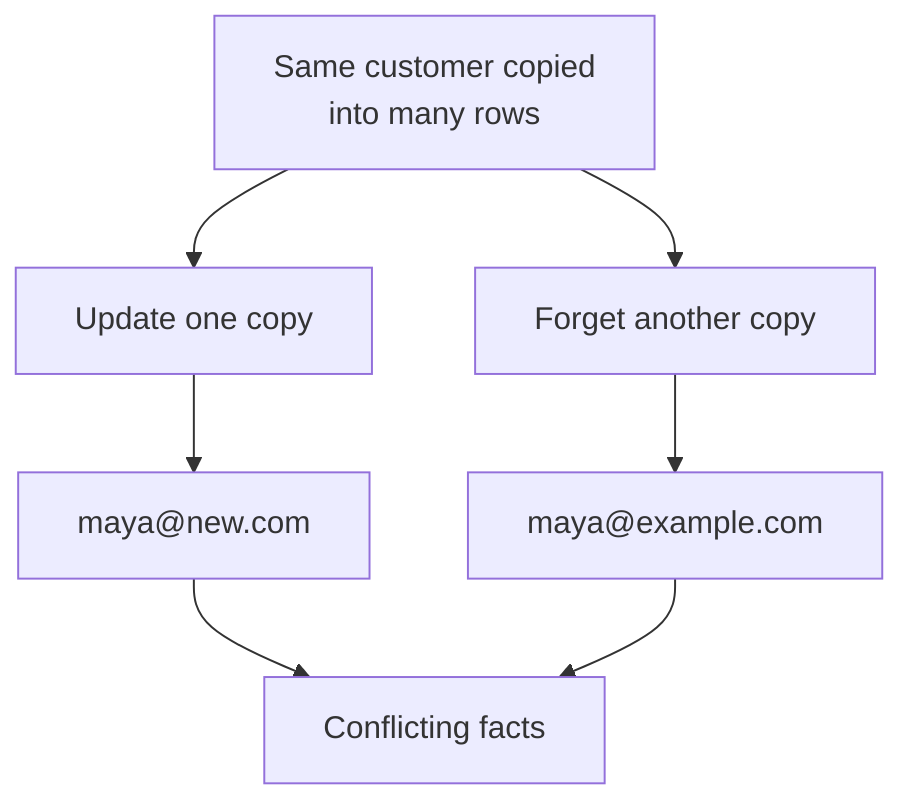
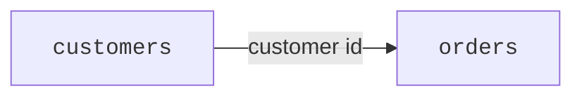
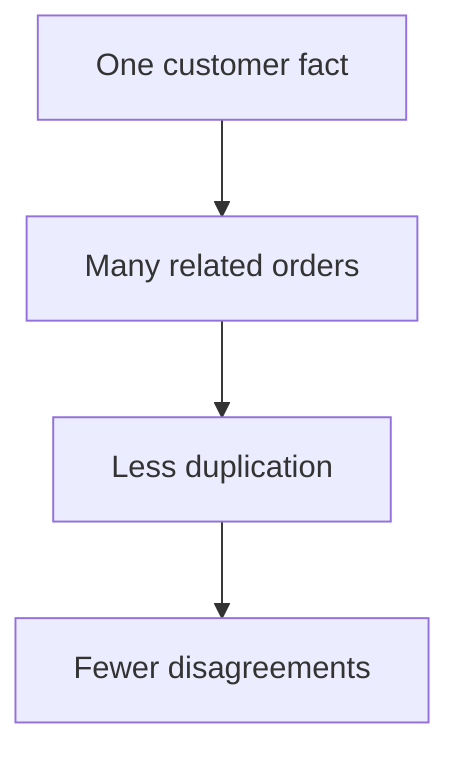
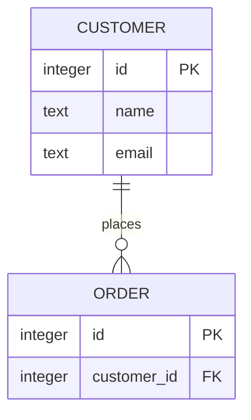
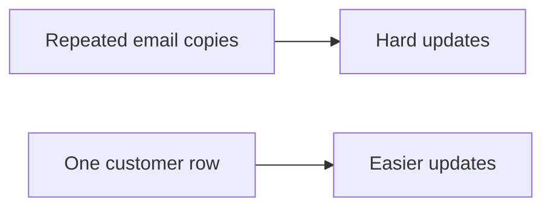
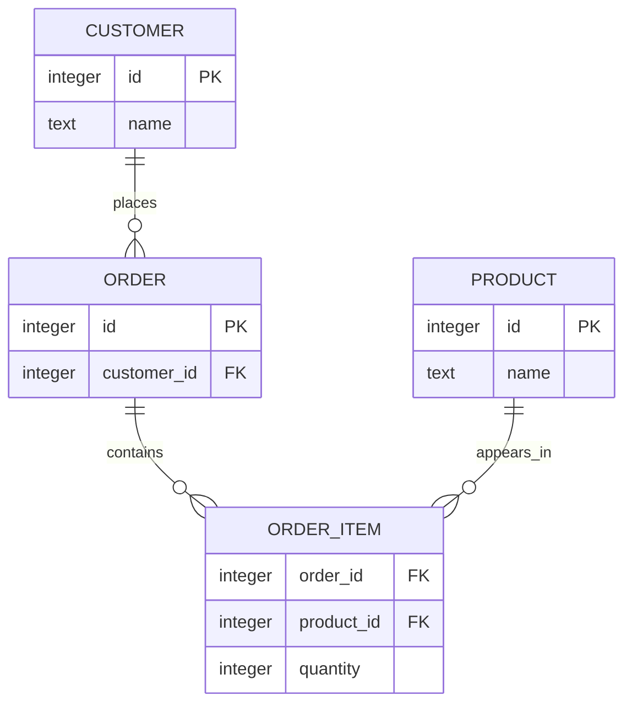
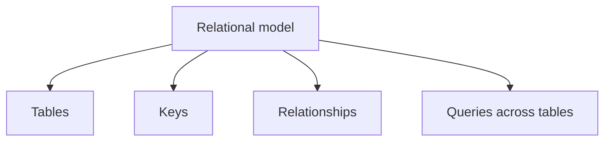

Relational databases became popular because they give you a simple way to store connected facts without repeating everything everywhere.

That may sound small, but it changes how reliably software can work with information.

SQLite is a relational database system. It stores data in tables and lets you connect rows using keys.

<svg
  viewBox="0 0 640 230"
  role="img"
  aria-label="On the left, three cards each carry their own copy of the same yellow fact and one copy has drifted red; on the right, the fact lives once on a central card and small order chips simply hold a thread to it — store a fact one time and point to it"
  style={{ display: "block", width: "100%", maxWidth: "640px", height: "auto", margin: "2.5rem auto" }}
>
  <g fill="currentColor" opacity="0.12">
    <rect x="48" y="38" width="120" height="44" rx="7" />
    <rect x="48" y="92" width="120" height="44" rx="7" />
    <rect x="48" y="146" width="120" height="44" rx="7" />
  </g>
  <g style={{ color: "var(--ds-yellow-500)" }} fill="currentColor">
    <rect x="62" y="54" width="74" height="11" rx="5.5" fillOpacity="0.8" />
    <rect x="62" y="108" width="74" height="11" rx="5.5" fillOpacity="0.8" />
  </g>
  <g style={{ color: "var(--ds-red-500)" }} fill="currentColor">
    <rect x="62" y="162" width="74" height="11" rx="5.5" fillOpacity="0.85" />
  </g>
  <g fill="currentColor" opacity="0.22">
    <circle cx="216" cy="114" r="3" />
    <circle cx="234" cy="114" r="3" />
    <circle cx="252" cy="114" r="3" />
  </g>
  <g fill="currentColor" opacity="0.16">
    <rect x="358" y="80" width="140" height="68" rx="9" />
  </g>
  <g style={{ color: "var(--ds-yellow-500)" }} fill="currentColor">
    <rect x="374" y="96" width="88" height="12" rx="6" fillOpacity="0.9" />
  </g>
  <g style={{ color: "var(--ds-blue-500)" }} fill="currentColor">
    <circle cx="380" cy="126" r="8" />
    <rect x="396" y="121" width="48" height="9" rx="4.5" fillOpacity="0.35" />
  </g>
  <g fill="currentColor" opacity="0.25">
    <circle cx="345" cy="62" r="2.5" />
    <circle cx="332" cy="48" r="2.5" />
    <circle cx="320" cy="34" r="2.5" />
    <circle cx="528" cy="62" r="2.5" />
    <circle cx="548" cy="48" r="2.5" />
    <circle cx="568" cy="34" r="2.5" />
    <circle cx="528" cy="168" r="2.5" />
    <circle cx="548" cy="182" r="2.5" />
    <circle cx="568" cy="196" r="2.5" />
  </g>
  <g style={{ color: "var(--ds-green-500)" }} fill="currentColor">
    <rect x="262" y="6" width="74" height="34" rx="8" fillOpacity="0.3" />
    <rect x="560" y="6" width="74" height="34" rx="8" fillOpacity="0.3" />
    <rect x="560" y="190" width="74" height="34" rx="8" fillOpacity="0.3" />
  </g>
  <g style={{ color: "var(--ds-blue-500)" }} fill="currentColor">
    <circle cx="278" cy="23" r="6" />
    <circle cx="576" cy="23" r="6" />
    <circle cx="576" cy="207" r="6" />
  </g>
  <g style={{ color: "var(--ds-green-500)" }} fill="currentColor">
    <rect x="290" y="19" width="34" height="8" rx="4" fillOpacity="0.6" />
    <rect x="588" y="19" width="34" height="8" rx="4" fillOpacity="0.6" />
    <rect x="588" y="203" width="34" height="8" rx="4" fillOpacity="0.6" />
  </g>
</svg>

## The problem: repeated facts drift apart

Imagine tracking bookstore orders in one big list:

```text
order_id | customer_name | customer_email     | book_title   | quantity
-------- | ------------- | ------------------ | ------------ | --------
1001     | Maya Chen     | maya@example.com   | SQL Basics   | 1
1002     | Maya Chen     | maya@example.com   | Data Stories | 2
1003     | Jordan Lee    | jordan@example.com | SQL Basics   | 1
```

This looks convenient at first.

But what happens when Maya changes her email address?

You must update every row where Maya appears.

If one row is missed, the data disagrees with itself.



This is a duplication problem. The same fact lives in more than one place.

## The relational answer

A relational database separates different kinds of facts into different tables, then connects them.

Instead of copying the full customer information into every order row, you store the customer once.

Then each order points to that customer.

```text
customers
id | name       | email
-- | ---------- | ----------------
1  | Maya Chen  | maya@example.com
2  | Jordan Lee | jordan@example.com

orders
id   | customer_id
---- | -----------
1001 | 1
1002 | 1
1003 | 2
```

Now if Maya changes her email, there is one customer row to update.





## Relationships use keys

A **key** is a value that identifies a row.

Most tables have a primary key, often named `id`.

Another table can store that id to create a relationship.



In this example:

- `customers.id` identifies one customer.
- `orders.customer_id` points to the customer who placed the order.

The relationship lets you ask questions across tables:

- Which orders belong to Maya?
- Which customers have placed no orders?
- How many orders has each customer placed?

<MultipleChoice
  markdown={`Why is storing one customer row and pointing orders to it useful?

- It requires copying the customer's email into every order forever
  > The relational design reduces repeated copies instead of requiring them.
- [o] It makes customer changes happen in one place
  > Updating one customer row avoids chasing repeated copies in many order rows.
- It prevents all orders from having ids
  > Orders can still have their own ids.
- It turns rows into pictures
  > Relationships connect rows; they do not change rows into images.`}
/>

## One fact in one place

A useful relational design goal is:

> Store each important fact in one place when you reasonably can.

That does not mean every database is perfect or every repeated value is wrong. It means you should notice when repeated facts can drift apart.



## Relational does not mean spreadsheet

Tables may look like spreadsheets, but the relational model adds an important idea: relationships between tables are part of the design.

A spreadsheet can have multiple sheets, formulas, and lookups. A relational database is built around formally storing related sets of facts and querying across them.



## Why this model lasted

The relational model became dominant because it is:

- **simple enough to understand**: tables, rows, columns
- **strong enough to model real work**: customers place orders, students enroll in classes, posts have comments
- **flexible to query**: you can combine facts in many ways later
- **good at reducing duplication**: one fact can live in one place



<SqlCodeBlock
  dialect="sqlite"
  title="Relate orders to customers"
  initSql={`CREATE TABLE customers (
  id INTEGER PRIMARY KEY,
  name TEXT,
  email TEXT
);
CREATE TABLE orders (
  id INTEGER PRIMARY KEY,
  customer_id INTEGER,
  total NUMERIC
);
INSERT INTO customers (name, email) VALUES
  ('Maya Chen', 'maya@example.com'),
  ('Jordan Lee', 'jordan@example.com');
INSERT INTO orders (customer_id, total) VALUES
  (1, 24.99),
  (1, 15.50),
  (2, 9.99);`}
  starterCode={`SELECT
  customers.name,
  orders.total
FROM
  customers
  JOIN orders ON orders.customer_id = customers.id;`}
/>

## The main idea

Relational databases help you store connected facts without copying everything everywhere.

Tables hold one kind of thing. Keys identify rows. Relationships let rows refer to other rows.

That is why the model has lasted for decades.

## Check your understanding

<MultipleChoice
  markdown={`What is a primary key usually used for?

- Decorating the table with a color
  > A primary key identifies data; it is not visual formatting.
- [o] Identifying one row in a table
  > A primary key gives each row a reliable identifier.
- Choosing text color
  > Keys are about identifying data, not formatting.
- Deleting every table automatically
  > A key does not automatically delete tables.`}
/>

<MultipleChoice
  markdown={`What is a foreign key idea, in plain language?

- A key that unlocks a physical door
  > A foreign key is a database relationship idea, not a physical key.
- [o] A value in one table that points to a row in another table
  > For example, orders.customer_id can point to customers.id.
- A password written in another language
  > It is not a password.
- A chart title
  > Foreign keys describe relationships between rows.`}
/>

<MultipleChoice
  markdown={`Why did the relational model become so useful?

- It requires every fact to be copied into every table
  > The relational model helps avoid unnecessary repeated copies.
- [o] It can model connected facts while reducing repeated copies
  > Tables and keys let one fact live in one place while related rows point to it.
- It only stores images
  > Relational databases store structured values, not only images.
- It forbids questions across tables
  > Querying across related tables is one of the model's strengths.`}
/>

<MultipleChoice
  markdown={`What is the risk of copying the same customer email into many order rows?

- The email will automatically update itself in every plain copied cell
  > Repeated copies often require separate updates unless the design avoids duplication.
- [o] The copies can drift apart when one is updated and another is missed
  > Repeated facts can become conflicting facts.
- It makes tables impossible to create
  > Tables can still be created, but the design may be harder to maintain.
- It prevents SQL from reading rows
  > SQL can read rows, but the data may be less trustworthy.`}
/>
