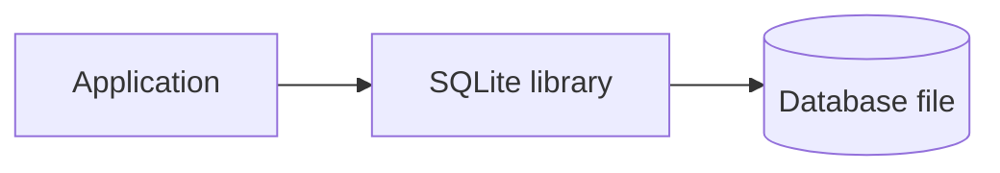
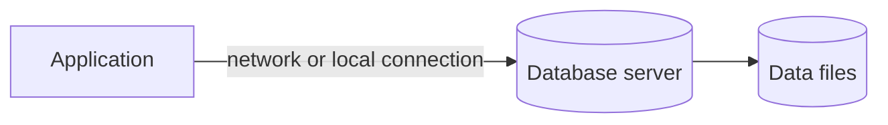
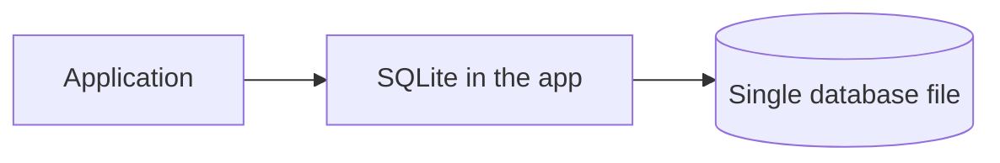
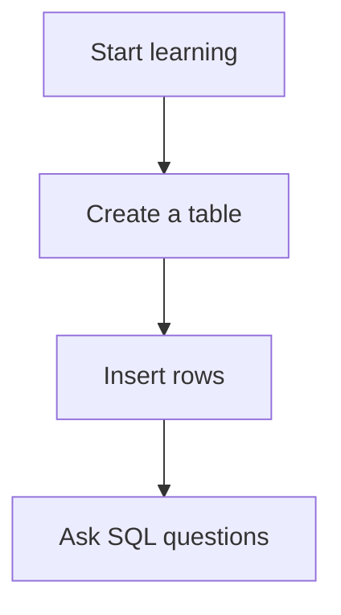
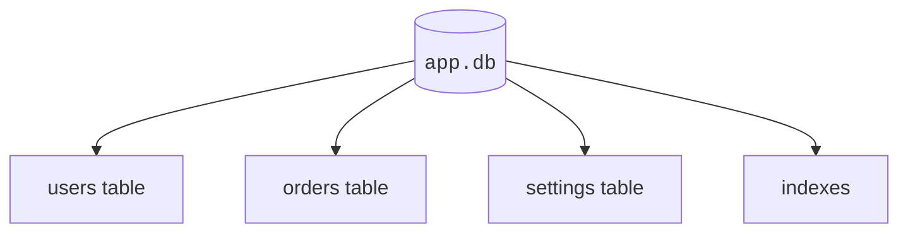
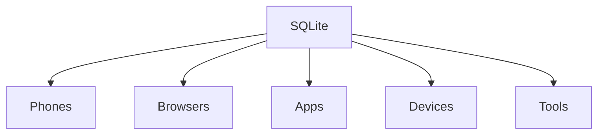
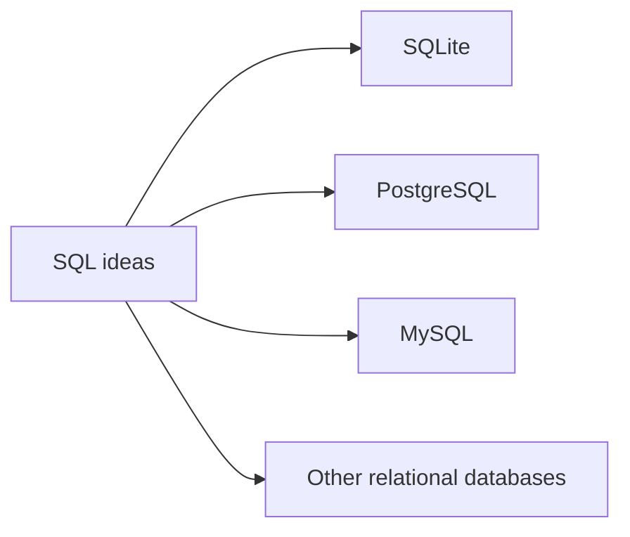
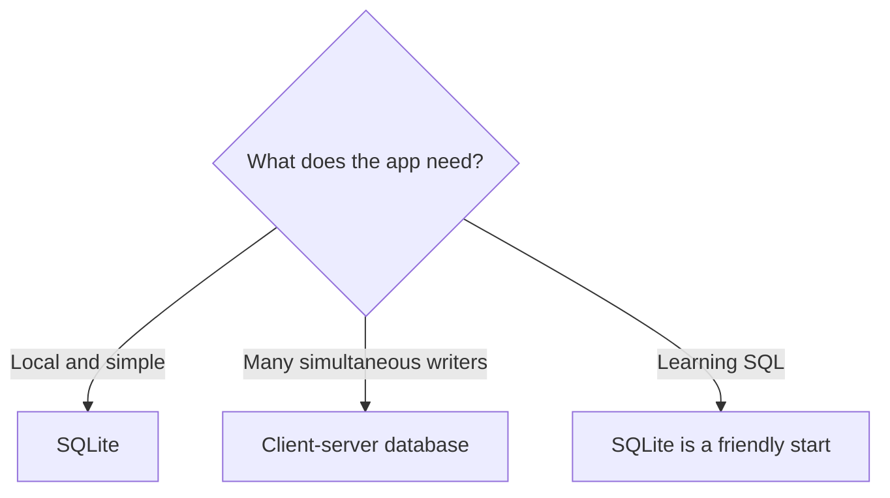

SQLite is popular because it is small, reliable, zero-config, and built directly into applications.

It is one of the most widely used database engines in the world. You may use it many times a day without noticing.

SQLite is not a toy database. It is a real relational DBMS that understands SQL and stores durable data.

<svg
  viewBox="0 0 640 240"
  role="img"
  aria-label="Tall faded server racks loom on the left while the same colored data dots sit packed in a small bright suitcase on the right — SQLite carries a whole database in one little file, no server room required"
  style={{ display: "block", width: "100%", maxWidth: "640px", height: "auto", margin: "2.5rem auto" }}
>
  <g fill="currentColor" opacity="0.1">
    <rect x="72" y="24" width="78" height="186" rx="8" />
    <rect x="162" y="44" width="78" height="166" rx="8" />
  </g>
  <g fill="currentColor" opacity="0.2">
    <rect x="84" y="40" width="54" height="9" rx="4.5" />
    <rect x="84" y="58" width="54" height="9" rx="4.5" />
    <rect x="84" y="76" width="54" height="9" rx="4.5" />
    <rect x="84" y="94" width="54" height="9" rx="4.5" />
    <rect x="174" y="60" width="54" height="9" rx="4.5" />
    <rect x="174" y="78" width="54" height="9" rx="4.5" />
    <rect x="174" y="96" width="54" height="9" rx="4.5" />
  </g>
  <g style={{ color: "var(--ds-blue-500)" }} fill="currentColor">
    <circle cx="96" cy="126" r="5" fillOpacity="0.35" />
  </g>
  <g style={{ color: "var(--ds-green-500)" }} fill="currentColor">
    <circle cx="120" cy="146" r="5" fillOpacity="0.35" />
  </g>
  <g style={{ color: "var(--ds-yellow-500)" }} fill="currentColor">
    <circle cx="198" cy="130" r="5" fillOpacity="0.35" />
  </g>
  <g fill="currentColor" opacity="0.25">
    <circle cx="270" cy="160" r="3" />
    <circle cx="294" cy="156" r="3" />
    <circle cx="318" cy="153" r="3" />
    <circle cx="342" cy="152" r="3" />
  </g>
  <g fill="currentColor" opacity="0.14">
    <rect x="40" y="210" width="560" height="6" rx="3" />
  </g>
  <g style={{ color: "var(--ds-blue-500)" }} fill="currentColor">
    <path d="M 478 100 Q 478 84 494 84 L 522 84 Q 538 84 538 100 L 538 108 L 524 108 L 524 102 Q 524 98 520 98 L 496 98 Q 492 98 492 102 L 492 108 L 478 108 Z" fillOpacity="0.9" />
    <rect x="430" y="106" width="156" height="104" rx="14" fillOpacity="0.3" />
    <rect x="430" y="106" width="156" height="22" rx="11" fillOpacity="0.6" />
  </g>
  <g style={{ color: "var(--ds-blue-500)" }} fill="currentColor">
    <circle cx="460" cy="152" r="8" />
    <circle cx="460" cy="182" r="8" fillOpacity="0.55" />
  </g>
  <g style={{ color: "var(--ds-green-500)" }} fill="currentColor">
    <circle cx="490" cy="152" r="8" />
    <circle cx="490" cy="182" r="8" fillOpacity="0.55" />
  </g>
  <g style={{ color: "var(--ds-yellow-500)" }} fill="currentColor">
    <circle cx="520" cy="152" r="8" />
    <circle cx="520" cy="182" r="8" fillOpacity="0.55" />
  </g>
  <g style={{ color: "var(--ds-red-500)" }} fill="currentColor">
    <circle cx="550" cy="152" r="8" />
    <circle cx="550" cy="182" r="8" fillOpacity="0.55" />
  </g>
  <g style={{ color: "var(--ds-yellow-500)" }} fill="currentColor">
    <path d="M 600 70 L 605 82 L 617 87 L 605 92 L 600 104 L 595 92 L 583 87 L 595 82 Z" fillOpacity="0.8" />
  </g>
</svg>

## SQLite is embedded

Many database systems run as a separate server process. An application connects to that server.

SQLite works differently. SQLite is usually embedded inside the application process.

This means an app can use SQLite without installing, configuring, or running a separate database server.

## Client-server database vs. embedded SQLite

A client-server database often looks like this:

SQLite often looks like this:

Both designs are useful. They solve different problems.

## SQLite is zero-config

Zero-config means you can start using it without setting up a database server, users, ports, background services, or server permissions.

For beginners, that matters. You can focus on the core ideas:

- tables
- rows
- columns
- SQL
- relationships
- queries

## SQLite stores data in one ordinary file

A SQLite database is commonly one file on disk.

That file can contain many tables, indexes, and rows.

This single-file design makes SQLite easy to copy, back up, move, attach to tests, or include with an application.

<MultipleChoice
  markdown={`What does SQLite's single-file design mean?

- Every SQLite table must be stored in a separate cloud server
  > SQLite does not require a separate server for each table.
- [o] A SQLite database is commonly stored as one ordinary file on disk
  > The file can contain tables, rows, and indexes.
- SQLite can only store one row
  > A SQLite database file can store many rows and tables.
- SQLite requires a separate server for every table
  > SQLite does not require a separate database server.`}
/>

## SQLite runs almost everywhere

SQLite appears in many places, including:

- phones
- browsers
- desktop apps
- command-line tools
- games
- embedded devices
- test suites
- aircraft and other specialized systems

It is useful when an application needs dependable local storage without a separate database server.

## SQLite is public-domain and extremely well tested

SQLite is public-domain software, which makes it unusually easy for projects to use.

It is also famous for careful testing. Beginners do not need to understand the testing details yet. The beginner version is:

<svg
  viewBox="0 0 640 180"
  role="img"
  aria-label="A small database file stands calmly in the middle of an orbit of green check marks — SQLite has earned trust through an enormous amount of careful testing"
  style={{ display: "block", width: "100%", maxWidth: "420px", height: "auto", margin: "2.5rem auto" }}
>
  <g style={{ color: "var(--ds-blue-500)" }} fill="currentColor">
    <path d="M 286 56 L 344 56 L 364 76 L 364 132 Q 364 138 358 138 L 292 138 Q 286 138 286 132 Z" fillOpacity="0.3" />
    <path d="M 344 56 L 344 70 Q 344 76 350 76 L 364 76 Z" fillOpacity="0.7" />
    <rect x="298" y="90" width="36" height="6" rx="3" fillOpacity="0.8" />
    <rect x="298" y="102" width="26" height="6" rx="3" fillOpacity="0.5" />
    <rect x="298" y="114" width="42" height="6" rx="3" fillOpacity="0.5" />
  </g>
  <g style={{ color: "var(--ds-green-500)" }} fill="currentColor">
    <path d="M 318 18 L 324 26 L 338 8 L 330 30 L 318 26 Z" fillOpacity="0.9" />
    <path d="M 416 44 L 422 52 L 436 34 L 428 56 L 416 52 Z" fillOpacity="0.6" />
    <path d="M 444 104 L 450 112 L 464 94 L 456 116 L 444 112 Z" fillOpacity="0.8" />
    <path d="M 386 152 L 392 160 L 406 142 L 398 164 L 386 160 Z" fillOpacity="0.5" />
    <path d="M 244 152 L 250 160 L 264 142 L 256 164 L 244 160 Z" fillOpacity="0.7" />
    <path d="M 192 96 L 198 104 L 212 86 L 204 108 L 192 104 Z" fillOpacity="0.55" />
    <path d="M 218 40 L 224 48 L 238 30 L 230 52 L 218 48 Z" fillOpacity="0.8" />
  </g>
  <g fill="currentColor" opacity="0.2">
    <circle cx="172" cy="140" r="3" />
    <circle cx="470" cy="60" r="3" />
    <circle cx="480" cy="148" r="3" />
    <circle cx="166" cy="48" r="3" />
  </g>
</svg>

> SQLite is trusted because a huge amount of software relies on it to store important local data correctly.

## SQLite uses SQL

SQLite understands SQL, the shared language of relational databases.

That means the ideas you learn are not trapped in one product.

## When SQLite is a great fit

SQLite is often a great choice when:

- your app needs local storage
- you want a simple database for a personal project
- you are building a prototype
- you are writing tests
- you are making a desktop or mobile app
- you want to learn SQL without server setup
- your app has many reads and modest write concurrency

## When SQLite may not be the best fit

SQLite is not the best answer for every situation.

You may want a client-server database when:

- many users write to the database at the same time
- the database must live on a central server for many applications
- you need advanced permission roles for many different users
- your workload is a large, busy web application with heavy write concurrency

Being honest about tradeoffs is part of choosing tools well.

## The main idea

SQLite is a real, widely used relational DBMS that is embedded, zero-config, single-file, portable, public-domain, and carefully tested.

It is a wonderful place to learn database foundations because you can focus on the ideas instead of server setup.

## Check your understanding

<MultipleChoice
  markdown={`What is SQLite?

- A tool for choosing spreadsheet fonts
  > SQLite stores and queries data; it is not a font tool.
- [o] A relational database management system
  > SQLite is software that manages relational databases.
- A spreadsheet color theme
  > SQLite is not a color theme.
- A phone brand
  > SQLite is not hardware.`}
/>

<MultipleChoice
  markdown={`What does embedded mean for SQLite?

- SQLite must always run on a separate database server process
  > SQLite is commonly embedded directly into the application process.
- [o] SQLite usually runs inside the application process instead of as a separate server
  > The application uses the SQLite library directly.
- SQLite can only be used on paper
  > SQLite is software.
- SQL stops working
  > SQLite understands SQL.`}
/>

<MultipleChoice
  markdown={`Why is SQLite beginner-friendly?

- It requires beginners to configure server users and network ports first
  > SQLite is often chosen because it avoids that setup.
- [o] It usually requires no separate database server setup
  > Zero-config lets beginners focus on database ideas and SQL.
- It refuses to store rows
  > SQLite stores rows in tables.
- It only works if you already run a large server team
  > SQLite is often chosen because it avoids server setup.`}
/>

<MultipleChoice
  markdown={`When might another database be a better fit than SQLite?

- A tiny local notes app
  > SQLite is often excellent for local app storage.
- Learning SQL basics without server setup
  > SQLite is a friendly learning database.
- [o] A large system with many users writing at the same time
  > Heavy multi-user write concurrency is often better served by a client-server database.
- A test database for a small project
  > SQLite is commonly useful in tests.`}
/>
