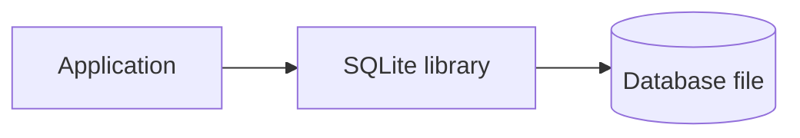
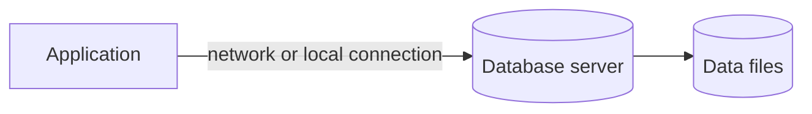
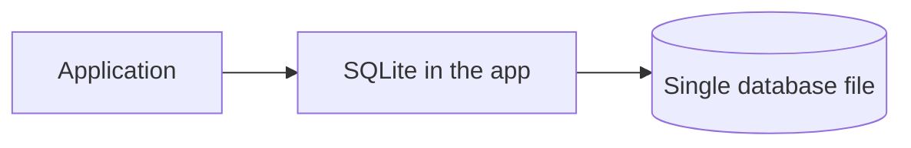
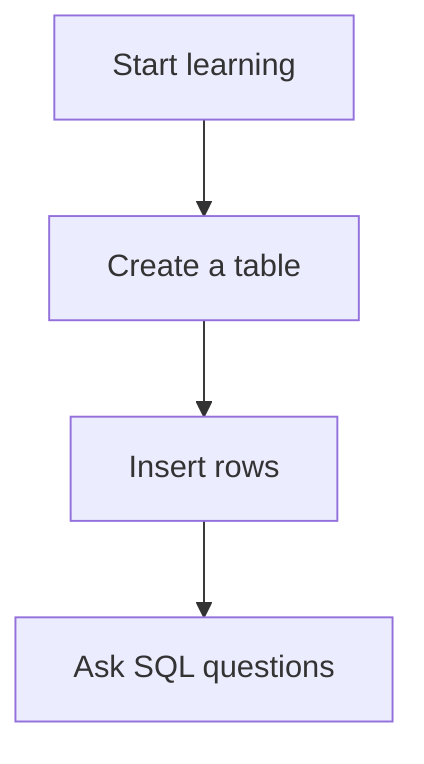
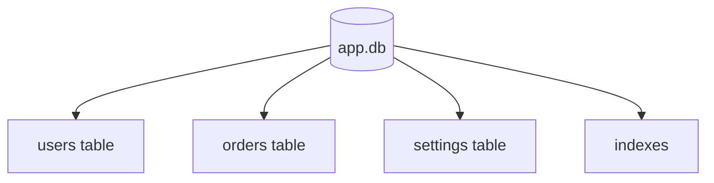
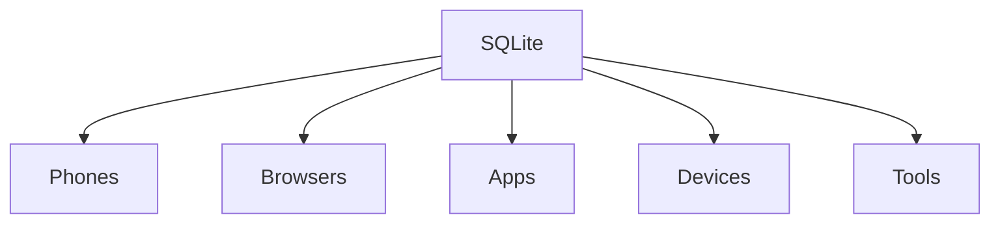
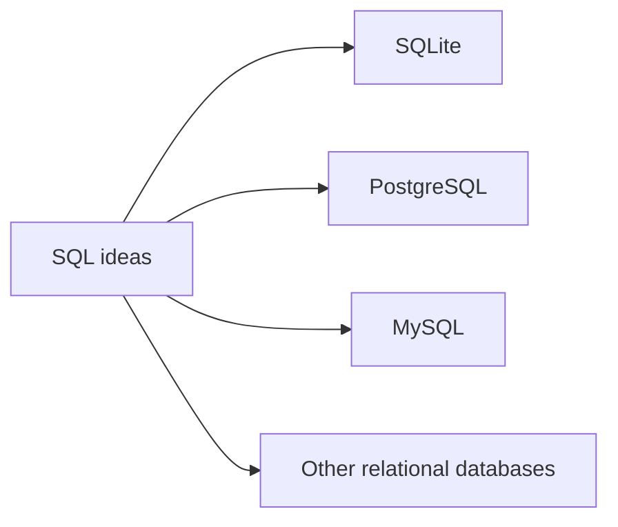
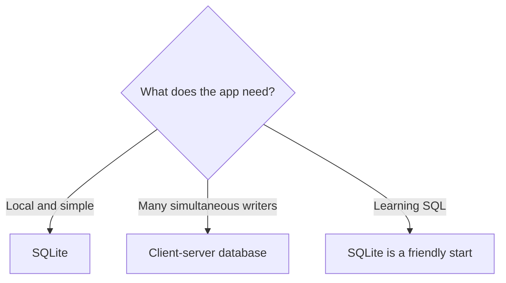

SQLite is popular because it is small, reliable, zero-config, and built directly into applications.

It is one of the most widely used database engines in the world. You may use it many times a day without noticing.

SQLite is not a toy database. It is a real relational DBMS that understands SQL and stores durable data.

## SQLite is embedded

Many database systems run as a separate server process. An application connects to that server.

SQLite works differently. SQLite is usually embedded inside the application process.

This means an app can use SQLite without installing, configuring, or running a separate database server.

## Client-server database vs. embedded SQLite

A client-server database often looks like this:

SQLite often looks like this:

Both designs are useful. They solve different problems.

## SQLite is zero-config

Zero-config means you can start using it without setting up a database server, users, ports, background services, or server permissions.

For beginners, that matters. You can focus on the core ideas:

- tables
- rows
- columns
- SQL
- relationships
- queries

## SQLite stores data in one ordinary file

A SQLite database is commonly one file on disk.

That file can contain many tables, indexes, and rows.

This single-file design makes SQLite easy to copy, back up, move, attach to tests, or include with an application.

<MultipleChoice
  markdown={`What does SQLite's single-file design mean?

- Every SQLite table must be stored in a separate cloud server
  > SQLite does not require a separate server for each table.
- [o] A SQLite database is commonly stored as one ordinary file on disk
  > The file can contain tables, rows, and indexes.
- SQLite can only store one row
  > A SQLite database file can store many rows and tables.
- SQLite requires a separate server for every table
  > SQLite does not require a separate database server.`}
/>

## SQLite runs almost everywhere

SQLite appears in many places, including:

- phones
- browsers
- desktop apps
- command-line tools
- games
- embedded devices
- test suites
- aircraft and other specialized systems

It is useful when an application needs dependable local storage without a separate database server.

## SQLite is public-domain and extremely well tested

SQLite is public-domain software, which makes it unusually easy for projects to use.

It is also famous for careful testing. Beginners do not need to understand the testing details yet. The beginner version is:

> SQLite is trusted because a huge amount of software relies on it to store important local data correctly.

## SQLite uses SQL

SQLite understands SQL, the shared language of relational databases.

That means the ideas you learn are not trapped in one product.

## When SQLite is a great fit

SQLite is often a great choice when:

- your app needs local storage
- you want a simple database for a personal project
- you are building a prototype
- you are writing tests
- you are making a desktop or mobile app
- you want to learn SQL without server setup
- your app has many reads and modest write concurrency

## When SQLite may not be the best fit

SQLite is not the best answer for every situation.

You may want a client-server database when:

- many users write to the database at the same time
- the database must live on a central server for many applications
- you need advanced permission roles for many different users
- your workload is a large, busy web application with heavy write concurrency

Being honest about tradeoffs is part of choosing tools well.

## The main idea

SQLite is a real, widely used relational DBMS that is embedded, zero-config, single-file, portable, public-domain, and carefully tested.

It is a wonderful place to learn database foundations because you can focus on the ideas instead of server setup.

## Check your understanding

<MultipleChoice
  markdown={`What is SQLite?

- A tool for choosing spreadsheet fonts
  > SQLite stores and queries data; it is not a font tool.
- [o] A relational database management system
  > SQLite is software that manages relational databases.
- A spreadsheet color theme
  > SQLite is not a color theme.
- A phone brand
  > SQLite is not hardware.`}
/>

<MultipleChoice
  markdown={`What does embedded mean for SQLite?

- SQLite must always run on a separate database server process
  > SQLite is commonly embedded directly into the application process.
- [o] SQLite usually runs inside the application process instead of as a separate server
  > The application uses the SQLite library directly.
- SQLite can only be used on paper
  > SQLite is software.
- SQL stops working
  > SQLite understands SQL.`}
/>

<MultipleChoice
  markdown={`Why is SQLite beginner-friendly?

- It requires beginners to configure server users and network ports first
  > SQLite is often chosen because it avoids that setup.
- [o] It usually requires no separate database server setup
  > Zero-config lets beginners focus on database ideas and SQL.
- It refuses to store rows
  > SQLite stores rows in tables.
- It only works if you already run a large server team
  > SQLite is often chosen because it avoids server setup.`}
/>

<MultipleChoice
  markdown={`When might another database be a better fit than SQLite?

- A tiny local notes app
  > SQLite is often excellent for local app storage.
- Learning SQL basics without server setup
  > SQLite is a friendly learning database.
- [o] A large system with many users writing at the same time
  > Heavy multi-user write concurrency is often better served by a client-server database.
- A test database for a small project
  > SQLite is commonly useful in tests.`}
/>
