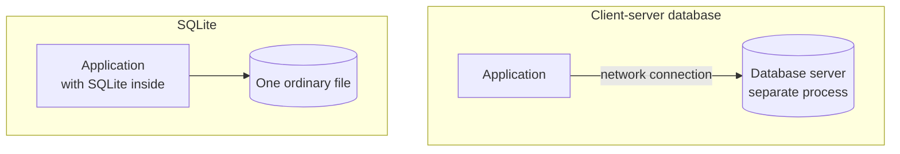
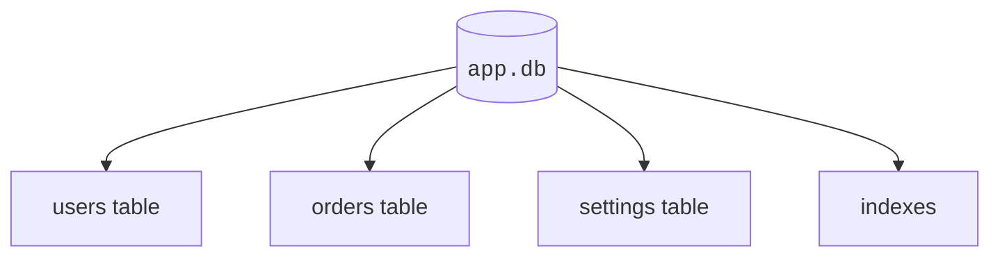
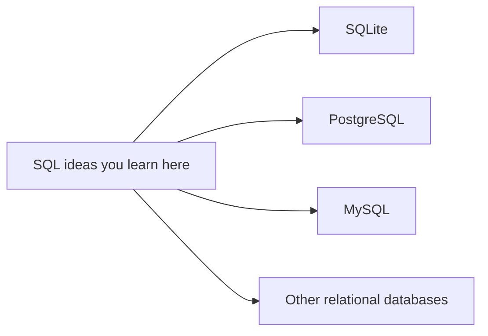
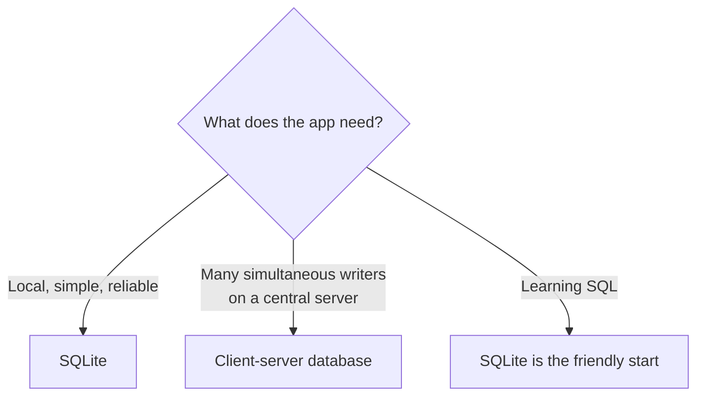

Every database course has to pick an engine, and this one picks
SQLite. That choice deserves an explanation, because SQLite is a
genuinely odd database — and the things that make it odd are the
things that make it perfect for learning. The explanation starts,
of all places, on a warship.

## A database born on a destroyer program

In 2000, a software engineer named **D. Richard Hipp** was working
on a contract for General Dynamics, writing software used aboard
the U.S. Navy's guided-missile destroyers. His program needed a
database, and the standard answer at the time was a client-server
system: a separate database server process that his application
connected to.

The arrangement had a failure mode that drove him up the wall.
Whenever the database server was down or misconfigured — which
was not his code and not his fault — his application could not
run, and *his* program was the one showing the error dialog. The
people seeing the failure blamed the software in front of them.

So Hipp asked a heretical question: what if the database were not
a separate server at all? What if it were just a **library** —
code living inside the application itself, reading and writing an
ordinary file, with no server to be down? In mid-2000 he built
exactly that and released it as SQLite. There was nothing to
install, nothing to configure, nothing to administer, and nothing
else to blame.

This design is called an **embedded** database. Both designs are
useful — they solve different problems — but the embedded design
turned out to solve a problem almost every program has.

<svg
  viewBox="0 0 640 240"
  role="img"
  aria-label="Tall faded server racks loom on the left while the same colored data dots sit packed in a small bright suitcase on the right — SQLite carries a whole database in one little file, no server room required"
  style={{ display: "block", width: "100%", maxWidth: "640px", height: "auto", margin: "2.5rem auto" }}
>
  <g fill="currentColor" opacity="0.1">
    <rect x="72" y="24" width="78" height="186" rx="8" />
    <rect x="162" y="44" width="78" height="166" rx="8" />
  </g>
  <g fill="currentColor" opacity="0.2">
    <rect x="84" y="40" width="54" height="9" rx="4.5" />
    <rect x="84" y="58" width="54" height="9" rx="4.5" />
    <rect x="84" y="76" width="54" height="9" rx="4.5" />
    <rect x="84" y="94" width="54" height="9" rx="4.5" />
    <rect x="174" y="60" width="54" height="9" rx="4.5" />
    <rect x="174" y="78" width="54" height="9" rx="4.5" />
    <rect x="174" y="96" width="54" height="9" rx="4.5" />
  </g>
  <g style={{ color: "var(--ds-blue-500)" }} fill="currentColor">
    <circle cx="96" cy="126" r="5" fillOpacity="0.35" />
  </g>
  <g style={{ color: "var(--ds-green-500)" }} fill="currentColor">
    <circle cx="120" cy="146" r="5" fillOpacity="0.35" />
  </g>
  <g style={{ color: "var(--ds-yellow-500)" }} fill="currentColor">
    <circle cx="198" cy="130" r="5" fillOpacity="0.35" />
  </g>
  <g fill="currentColor" opacity="0.25">
    <circle cx="270" cy="160" r="3" />
    <circle cx="294" cy="156" r="3" />
    <circle cx="318" cy="153" r="3" />
    <circle cx="342" cy="152" r="3" />
  </g>
  <g fill="currentColor" opacity="0.14">
    <rect x="40" y="210" width="560" height="6" rx="3" />
  </g>
  <g style={{ color: "var(--ds-blue-500)" }} fill="currentColor">
    <path d="M 478 100 Q 478 84 494 84 L 522 84 Q 538 84 538 100 L 538 108 L 524 108 L 524 102 Q 524 98 520 98 L 496 98 Q 492 98 492 102 L 492 108 L 478 108 Z" fillOpacity="0.9" />
    <rect x="430" y="106" width="156" height="104" rx="14" fillOpacity="0.3" />
    <rect x="430" y="106" width="156" height="22" rx="11" fillOpacity="0.6" />
  </g>
  <g style={{ color: "var(--ds-blue-500)" }} fill="currentColor">
    <circle cx="460" cy="152" r="8" />
    <circle cx="460" cy="182" r="8" fillOpacity="0.55" />
  </g>
  <g style={{ color: "var(--ds-green-500)" }} fill="currentColor">
    <circle cx="490" cy="152" r="8" />
    <circle cx="490" cy="182" r="8" fillOpacity="0.55" />
  </g>
  <g style={{ color: "var(--ds-yellow-500)" }} fill="currentColor">
    <circle cx="520" cy="152" r="8" />
    <circle cx="520" cy="182" r="8" fillOpacity="0.55" />
  </g>
  <g style={{ color: "var(--ds-red-500)" }} fill="currentColor">
    <circle cx="550" cy="152" r="8" />
    <circle cx="550" cy="182" r="8" fillOpacity="0.55" />
  </g>
  <g style={{ color: "var(--ds-yellow-500)" }} fill="currentColor">
    <path d="M 600 70 L 605 82 L 617 87 L 605 92 L 600 104 L 595 92 L 583 87 L 595 82 Z" fillOpacity="0.8" />
  </g>
</svg>

## The most deployed database engine on Earth

What began as one engineer's fix for an annoying error dialog is
now, by a wide margin, **the most widely deployed database engine
in the world**. SQLite ships inside every iPhone and every Android
phone. It is inside every major web browser — Chrome, Firefox,
Safari — and built into Windows and macOS. It stores your text
message history, your browser history, your photo metadata, your
podcast subscriptions. The SQLite project estimates there are over
a *trillion* SQLite databases in active use.

You have probably used SQLite hundreds of times today without
knowing it. There is a decent chance a copy of it is involved in
displaying this very page.

And the entire thing is **public domain** — not just open source,
but given away with no license at all. Anyone may use it, for
anything, forever. That generosity is a large part of why it
spread everywhere.

<MultipleChoice
  markdown={`What does embedded mean for SQLite?

- SQLite must always run on a separate database server process
  > SQLite is commonly embedded directly into the application process.
- [o] SQLite runs inside the application process instead of as a separate server
  > The application uses the SQLite library directly, with no server to administer.
- SQLite can only be used on paper
  > SQLite is software.
- SQL stops working
  > SQLite understands SQL.`}
/>

## Trusted because it is tested like an aircraft

A database that lives in two billion phones cannot afford to lose
data, so the SQLite project developed one of the most famous
testing cultures in all of software. The test suites contain
*hundreds of times* more code than the library itself, and they
exercise **100% of the branches** in the code — verified to the
strict MC/DC standard used to certify avionics software. The
tests deliberately simulate power failures, full disks, out-of-
memory conditions, and corrupted files, because somewhere out
there, every one of those things is happening to a SQLite
database right now.

<svg
  viewBox="0 0 640 180"
  role="img"
  aria-label="A small database file stands calmly in the middle of an orbit of green check marks — SQLite has earned trust through an enormous amount of careful testing"
  style={{ display: "block", width: "100%", maxWidth: "420px", height: "auto", margin: "2.5rem auto" }}
>
  <g style={{ color: "var(--ds-blue-500)" }} fill="currentColor">
    <path d="M 286 56 L 344 56 L 364 76 L 364 132 Q 364 138 358 138 L 292 138 Q 286 138 286 132 Z" fillOpacity="0.3" />
    <path d="M 344 56 L 344 70 Q 344 76 350 76 L 364 76 Z" fillOpacity="0.7" />
    <rect x="298" y="90" width="36" height="6" rx="3" fillOpacity="0.8" />
    <rect x="298" y="102" width="26" height="6" rx="3" fillOpacity="0.5" />
    <rect x="298" y="114" width="42" height="6" rx="3" fillOpacity="0.5" />
  </g>
  <g style={{ color: "var(--ds-green-500)" }} fill="currentColor">
    <path d="M 318 18 L 324 26 L 338 8 L 330 30 L 318 26 Z" fillOpacity="0.9" />
    <path d="M 416 44 L 422 52 L 436 34 L 428 56 L 416 52 Z" fillOpacity="0.6" />
    <path d="M 444 104 L 450 112 L 464 94 L 456 116 L 444 112 Z" fillOpacity="0.8" />
    <path d="M 386 152 L 392 160 L 406 142 L 398 164 L 386 160 Z" fillOpacity="0.5" />
    <path d="M 244 152 L 250 160 L 264 142 L 256 164 L 244 160 Z" fillOpacity="0.7" />
    <path d="M 192 96 L 198 104 L 212 86 L 204 108 L 192 104 Z" fillOpacity="0.55" />
    <path d="M 218 40 L 224 48 L 238 30 L 230 52 L 218 48 Z" fillOpacity="0.8" />
  </g>
  <g fill="currentColor" opacity="0.2">
    <circle cx="172" cy="140" r="3" />
    <circle cx="470" cy="60" r="3" />
    <circle cx="480" cy="148" r="3" />
    <circle cx="166" cy="48" r="3" />
  </g>
</svg>

The point for you as a learner: SQLite is small and friendly, but
it is **not a toy**. It is a real relational DBMS, holding real
data in some of the most demanding environments in the world.

## One database, one ordinary file

A SQLite database — all its tables, indexes, and rows — lives in
a single ordinary file on disk, often named something like
`app.db`. You can copy it, email it, back it up by dragging it,
and hand it to a colleague. That single-file design is why apps,
games, phones, and test suites adopt SQLite so readily, and it
keeps the mental model refreshingly small:

<MultipleChoice
  markdown={`What does SQLite's single-file design mean?

- Every SQLite table must be stored in a separate cloud server
  > SQLite does not require a separate server for each table.
- [o] A SQLite database is commonly stored as one ordinary file on disk
  > The file can contain many tables, rows, and indexes.
- SQLite can only store one row
  > A SQLite database file can store many rows and tables.
- SQLite requires a separate server for every table
  > SQLite does not require a separate database server.`}
/>

## Why this makes SQLite ideal for learning

Put the pieces together and you get an unusually good classroom:

- **Zero configuration.** No server to install, no users or ports
  to set up. You spend your attention on tables, rows, and SQL —
  the ideas — instead of on plumbing. (In this course it goes one
  step further: SQLite compiled to WebAssembly runs right in your
  browser.)
- **Real SQL.** SQLite speaks the same core SQL as PostgreSQL,
  MySQL, and SQL Server. The `SELECT`, `JOIN`, and `GROUP BY` you
  learn here transfer almost unchanged to every major database.
- **Real stakes.** You are learning the actual engine that runs in
  your own pocket, not a teaching simulator.

## The honest tradeoff

No tool is right for everything, and SQLite's documentation is
refreshingly blunt about its limits. Because the whole database is
one file with no central server, SQLite shines when an
application needs **local** storage — and struggles when *many
users must write to the same database at the same moment* from
different machines. A busy social network or a bank's central
ledger calls for a client-server database, where a dedicated
process coordinates thousands of simultaneous writers.

Knowing a tool's limits is part of knowing the tool. For learning
— and for an enormous share of real software — SQLite is exactly
right.

## Check your understanding

<MultipleChoice
  markdown={`What problem pushed D. Richard Hipp to create SQLite?

- He needed a database that could store images
  > Image storage was not the motivation.
- [o] His software depended on a separate database server, and when that server was down his application took the blame
  > Building the database into the application as a library removed the server as a point of failure.
- SQL did not exist yet
  > SQL had existed for decades; SQLite adopted it.
- He wanted to sell an expensive commercial license
  > SQLite was released into the public domain, free for any use.`}
/>

<MultipleChoice
  markdown={`Which statement about SQLite's reach is accurate?

- It is rarely used outside classrooms
  > SQLite is the most widely deployed database engine in the world.
- [o] It ships inside every major smartphone and web browser, with an estimated trillion-plus databases in use
  > Phones, browsers, and operating systems all bundle SQLite.
- It only runs on naval ships
  > It began on a Navy contract, but it now runs almost everywhere.
- It was replaced by spreadsheets
  > Spreadsheets and databases solve different problems, and SQLite remains everywhere.`}
/>

<MultipleChoice
  markdown={`Why is SQLite's testing culture famous?

- It has no tests, which makes it fast
  > The opposite is true: its test suites are enormous.
- [o] Its tests contain hundreds of times more code than the library and reach 100% branch coverage to an avionics-grade standard
  > The project deliberately simulates crashes, power loss, and corruption to earn trust.
- Its tests are written by users after bugs appear
  > The project maintains its own exhaustive test harnesses.
- Testing is only done once per decade
  > Testing is continuous and central to the project.`}
/>

<MultipleChoice
  markdown={`When might another database be a better fit than SQLite?

- A tiny local notes app
  > SQLite is often excellent for local app storage.
- Learning SQL basics without server setup
  > SQLite is a friendly learning database.
- [o] A large system with many users writing at the same time from different machines
  > Heavy multi-user write concurrency is the classic case for a client-server database.
- A test database for a small project
  > SQLite is commonly useful in tests.`}
/>

You now know what a database is, why the relational model won,
and why this course's engine fits in your browser tab. Time to
stop reading about tables and start taking them apart: the next
section opens up rows, columns, keys, and types — the anatomy of
everything you will query for the rest of the course.
