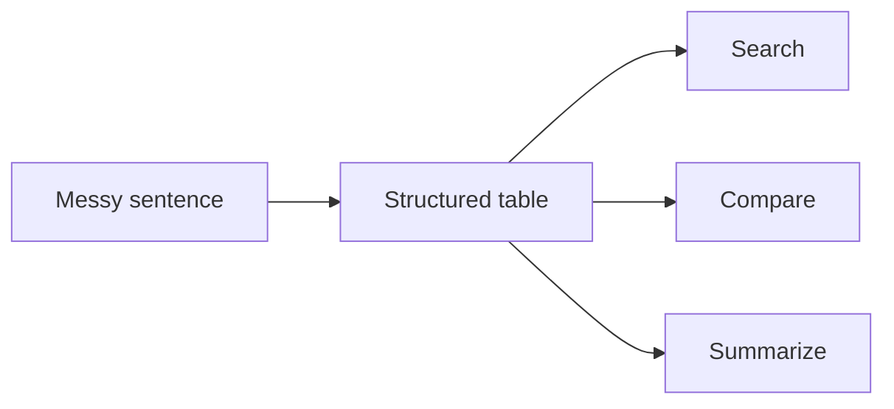
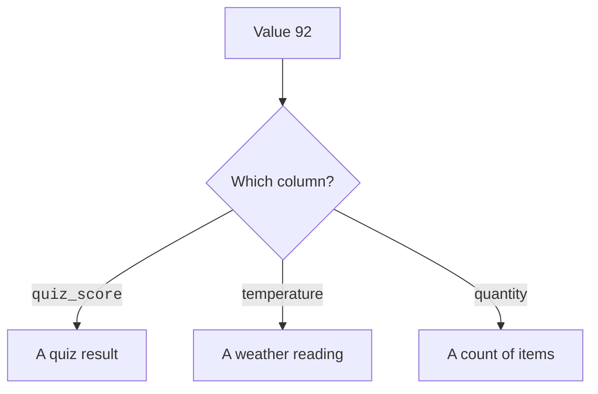
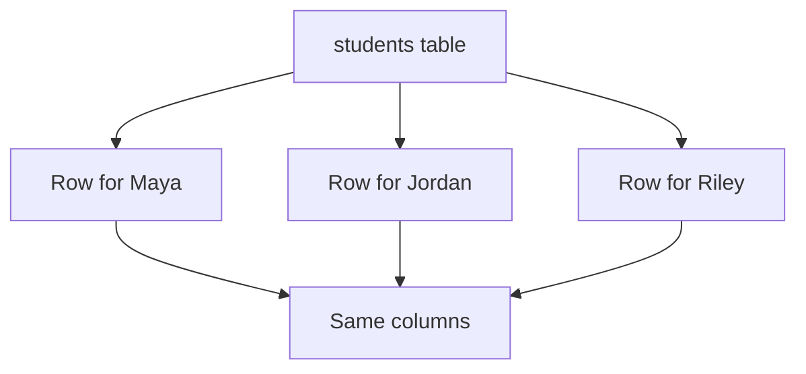
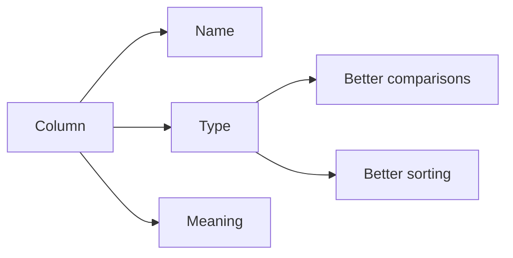
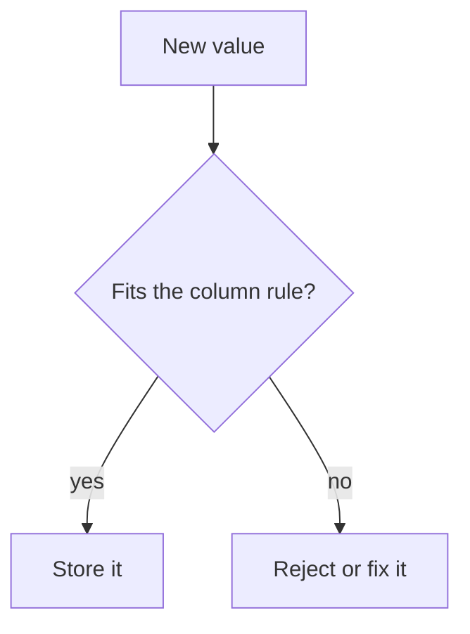
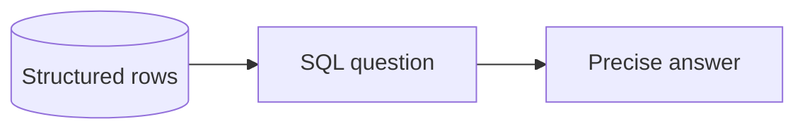
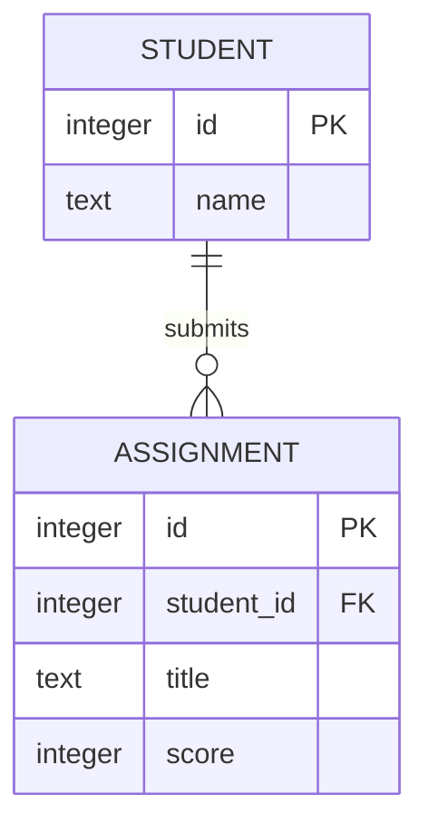
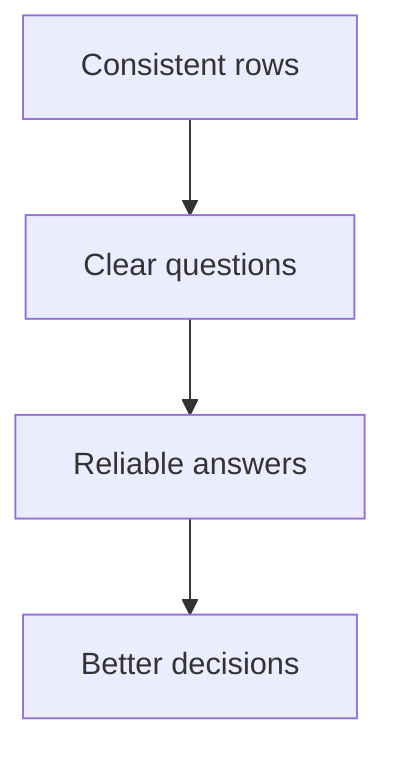

Structured data means information is stored in a predictable shape.

Instead of one long note, the facts are separated into named pieces. In a relational database, that usually means tables, rows, and columns.

This structure is powerful because software can understand it.

## Messy notes are easy for people, hard for computers

Imagine a teacher writes this note:

> Maya got 92 on the quiz, Jordan got 85, and Riley has not taken it yet.

A person can understand that sentence. A computer has a harder time answering precise questions from it.

For example:

- Who scored above 90?
- Who has not taken the quiz?
- What is the average score?

A table makes those facts easier to use.

```text
students

name   | quiz_score
------ | ----------
Maya   | 92
Jordan | 85
Riley  | NULL
```



## Columns give facts names

A column name tells you what a value means.

`92` by itself is just a number. In a `quiz_score` column, it becomes a score. In a `temperature` column, it means something else.



Good structure turns isolated values into meaningful facts.

## Rows give facts a repeated shape

Each row in a table follows the same basic shape.

In a `students` table, every row might have a name, an email address, and a quiz score.



That repeated shape is what lets the database answer questions reliably.

## Types communicate what kind of value belongs there

A column type says what kind of value a column is meant to store.

Common SQLite types you will see in this course include:

- `INTEGER` for whole numbers
- `TEXT` for words and strings
- `REAL` for decimal numbers
- `NUMERIC` for values such as money-like numbers
- `BLOB` for raw binary data

SQLite is flexible with types, so it is more forgiving than many other databases. Still, choosing clear column types helps you and your application understand the intended shape of the data.



<MultipleChoice
  markdown={`Why is the column name important?

- It chooses the app's background color
  > Column names describe data meaning, not screen styling.
- [o] It tells you what a stored value means
  > The same value can mean different things in different columns.
- It makes every value disappear
  > Column names describe values; they do not remove them.
- It prevents rows from existing
  > Columns and rows work together.`}
/>

## Structure enables validation

Validation means checking whether data follows rules.

Examples:

- A score should not be below 0.
- An email address should not be missing for an account.
- A quantity should be a number.
- A due date should have a consistent format like `YYYY-MM-DD`.

Structured data gives those rules a place to attach.



SQLite can help enforce some rules with table design, and applications can enforce others before sending data to SQLite.

## Structure enables querying

A query is a question you ask the database.

Structured columns make precise questions possible:

- `quiz_score > 90`
- `done = 0`
- `state = 'CA'`
- `due_date < '2026-05-01'`

<SqlCodeBlock
  dialect="sqlite"
  title="Query structured columns"
  initSql={`CREATE TABLE assignments (
  id INTEGER PRIMARY KEY,
  student TEXT,
  score INTEGER,
  submitted_on TEXT
);
INSERT INTO assignments (student, score, submitted_on) VALUES
  ('Maya', 92, '2026-04-01'),
  ('Jordan', 85, '2026-04-02'),
  ('Riley', NULL, NULL);`}
  starterCode={`SELECT
  student,
  score
FROM
  assignments
WHERE
  score >= 90;`}
/>



## Structure enables relationships

Real-world facts are connected.

A student submits assignments. A customer places orders. A message belongs to a conversation.

Structured data lets one row refer to another row instead of copying every detail everywhere.



Relationships are one reason databases become more useful than a pile of notes.

## Structure builds trust

Trust means you can use the data without constantly wondering what each value means.

Messy data makes every answer suspicious:

```text
score
-----
92
A minus
not done
85ish
```

Structured data makes answers more dependable:

```text
student | score
------- | -----
Maya    | 92
Jordan  | 85
Riley   | NULL
```

`NULL` means a missing or unknown value. It is different from zero.



## The main idea

Structured data turns messy real-world information into facts a computer can validate, search, compare, connect, and trust.

You do not structure data to make life harder. You structure it so your future questions have clear answers.

## Check your understanding

<MultipleChoice
  markdown={`What does structured data mean in this page?

- Information stored with no labels or repeated pattern
  > Missing labels and patterns make data less structured.
- [o] Information stored in a predictable shape
  > Tables, rows, and columns give data a repeatable structure.
- A random paragraph with no labels
  > A paragraph may be readable to people, but it is less structured for database questions.
- A picture with no stored facts
  > Structured data is about organized facts.`}
/>

<MultipleChoice
  markdown={`Why are consistent rows useful?

- They make each row use completely unrelated columns
  > Consistent rows use a repeated shape rather than unrelated columns.
- [o] They let the database compare and summarize the same kinds of facts
  > Repeated shape makes reliable queries possible.
- They require every answer to be a paragraph
  > Rows usually separate facts into smaller values.
- They make questions impossible
  > Consistent rows make questions easier.`}
/>

<MultipleChoice
  markdown={`What does NULL usually mean in SQL?

- The number zero
  > Zero is a known value; NULL means no value is stored.
- [o] Missing or unknown value
  > NULL is the SQL marker for absent or unknown information.
- The text value 'NULL'
  > The SQL NULL marker is not the same as a word stored as text.
- A table name
  > NULL is a value marker, not a table.`}
/>

<MultipleChoice
  markdown={`How does structure help with relationships?

- Rows become unable to refer to anything else
  > Structured keys make references between rows possible.
- [o] Rows can point to related rows instead of copying every detail everywhere
  > This is how databases connect customers to orders, students to assignments, and many other facts.
- It prevents tables from having columns
  > Relationships depend on columns such as ids.
- It forces all data into one sentence
  > Structure separates facts instead of hiding them in one sentence.`}
/>
