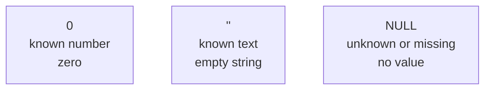
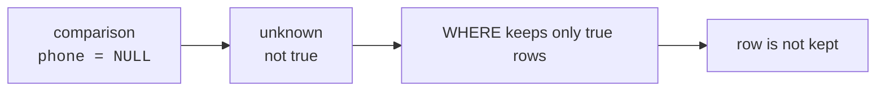
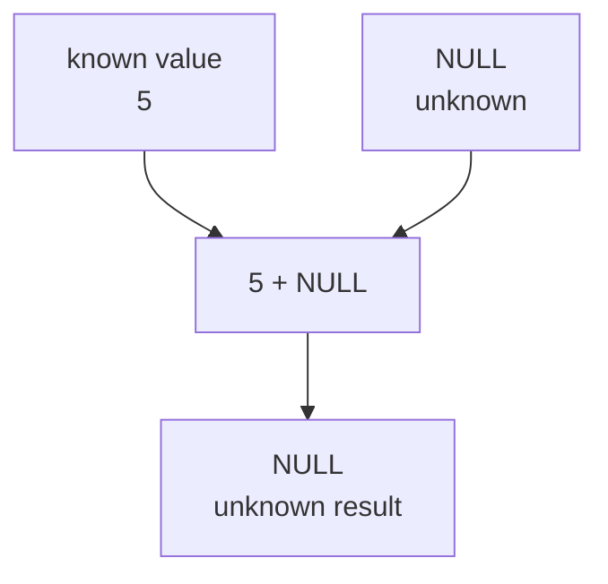
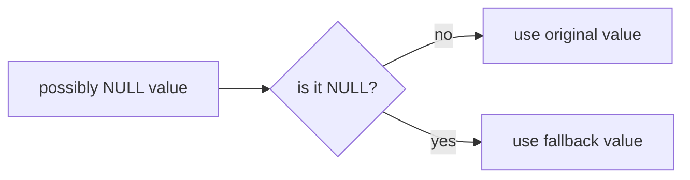

`NULL` is SQL's way to say, "there is no known value here."

That sounds simple, but it changes how comparisons, filters, and
calculations behave. Many beginner SQL bugs come from treating `NULL`
like a normal value. It is not zero. It is not an empty string. It is
missing or unknown.

<svg
  viewBox="0 0 640 230"
  role="img"
  aria-label="A tiled mosaic where most tiles hold a colored dot, one tile is present but empty, and one tile is missing entirely with only dotted corners marking the gap — an empty value is still a value, but NULL is the tile that was never placed"
  style={{ display: "block", width: "100%", maxWidth: "560px", height: "auto", margin: "2.5rem auto" }}
>
  <g fill="currentColor" opacity="0.1">
    <rect x="130" y="24" width="70" height="40" rx="7" />
    <rect x="210" y="24" width="70" height="40" rx="7" />
    <rect x="290" y="24" width="70" height="40" rx="7" />
    <rect x="370" y="24" width="70" height="40" rx="7" />
    <rect x="450" y="24" width="70" height="40" rx="7" />
    <rect x="130" y="74" width="70" height="40" rx="7" />
    <rect x="210" y="74" width="70" height="40" rx="7" />
    <rect x="290" y="74" width="70" height="40" rx="7" />
    <rect x="450" y="74" width="70" height="40" rx="7" />
    <rect x="130" y="124" width="70" height="40" rx="7" />
    <rect x="210" y="124" width="70" height="40" rx="7" />
    <rect x="290" y="124" width="70" height="40" rx="7" />
    <rect x="370" y="124" width="70" height="40" rx="7" />
    <rect x="450" y="124" width="70" height="40" rx="7" />
    <rect x="130" y="174" width="70" height="40" rx="7" />
    <rect x="210" y="174" width="70" height="40" rx="7" />
    <rect x="290" y="174" width="70" height="40" rx="7" />
    <rect x="370" y="174" width="70" height="40" rx="7" />
    <rect x="450" y="174" width="70" height="40" rx="7" />
  </g>
  <g style={{ color: "var(--ds-blue-500)" }} fill="currentColor">
    <circle cx="165" cy="44" r="8" fillOpacity="0.8" />
    <circle cx="325" cy="44" r="8" fillOpacity="0.6" />
    <circle cx="165" cy="144" r="8" fillOpacity="0.7" />
    <circle cx="485" cy="194" r="8" fillOpacity="0.5" />
  </g>
  <g style={{ color: "var(--ds-green-500)" }} fill="currentColor">
    <circle cx="245" cy="44" r="8" fillOpacity="0.7" />
    <circle cx="485" cy="94" r="8" fillOpacity="0.8" />
    <circle cx="245" cy="194" r="8" fillOpacity="0.6" />
    <circle cx="405" cy="144" r="8" fillOpacity="0.7" />
  </g>
  <g style={{ color: "var(--ds-yellow-500)" }} fill="currentColor">
    <circle cx="485" cy="44" r="8" fillOpacity="0.8" />
    <circle cx="165" cy="94" r="8" fillOpacity="0.6" />
    <circle cx="325" cy="94" r="8" fillOpacity="0.75" />
    <circle cx="325" cy="194" r="8" fillOpacity="0.6" />
    <circle cx="405" cy="44" r="8" fillOpacity="0.55" />
  </g>
  <g style={{ color: "var(--ds-red-500)" }} fill="currentColor">
    <circle cx="485" cy="144" r="8" fillOpacity="0.7" />
    <circle cx="245" cy="94" r="8" fillOpacity="0.55" />
  </g>
  <g fill="currentColor" opacity="0.35">
    <circle cx="374" cy="78" r="2.5" />
    <circle cx="406" cy="78" r="2.5" />
    <circle cx="436" cy="78" r="2.5" />
    <circle cx="374" cy="94" r="2.5" />
    <circle cx="436" cy="94" r="2.5" />
    <circle cx="374" cy="110" r="2.5" />
    <circle cx="406" cy="110" r="2.5" />
    <circle cx="436" cy="110" r="2.5" />
  </g>
</svg>

## NULL is not zero or empty text

These three values mean different things:

- `0` means a known number: zero.
- `''` means known text with no characters.
- `NULL` means no value is known.

For a `phone` column, an empty string could mean someone intentionally
entered a blank phone. `NULL` means the phone number is not known.

<SqlCodeBlock
  dialect="sqlite"
  title="See zero, empty text, and NULL"
  initSql={`CREATE TABLE contacts (
  id INTEGER PRIMARY KEY,
  name TEXT,
  phone TEXT,
  reward_points INTEGER
);
INSERT INTO contacts (name, phone, reward_points) VALUES
  ('Ada', '555-0101', 10),
  ('Grace', NULL, 0),
  ('Linus', '', NULL),
  ('Mae', '555-0104', 25);`}
  starterCode={`SELECT
  name,
  phone,
  reward_points
FROM
  contacts;`}
/>

The blank-looking cells may not all mean the same thing. A `NULL` value
means SQLite does not have a known value for that cell.

<MultipleChoice
  markdown={`What does NULL mean in SQL?

- The number zero.
  > Zero is a known number.
- An empty string.
  > Empty text is known text with no characters.
- [o] A missing or unknown value.
  > NULL records that no known value is present.
- The word NULL stored as text.
  > Text would be written as a quoted string, not the NULL marker.`}
/>

## Use IS NULL and IS NOT NULL

Because `NULL` means unknown, you do not test for it with `=`. Use the
special tests `IS NULL` and `IS NOT NULL`.

<SqlCodeBlock
  dialect="sqlite"
  title="Find missing phone numbers"
  initSql={`CREATE TABLE contacts (
  id INTEGER PRIMARY KEY,
  name TEXT,
  phone TEXT,
  reward_points INTEGER
);
INSERT INTO contacts (name, phone, reward_points) VALUES
  ('Ada', '555-0101', 10),
  ('Grace', NULL, 0),
  ('Linus', '', NULL),
  ('Mae', '555-0104', 25);`}
  starterCode={`SELECT
  name,
  phone
FROM
  contacts
WHERE
  phone IS NULL;`}
/>

<SqlCodeBlock
  dialect="sqlite"
  title="Find present phone numbers"
  initSql={`CREATE TABLE contacts (
  id INTEGER PRIMARY KEY,
  name TEXT,
  phone TEXT,
  reward_points INTEGER
);
INSERT INTO contacts (name, phone, reward_points) VALUES
  ('Ada', '555-0101', 10),
  ('Grace', NULL, 0),
  ('Linus', '', NULL),
  ('Mae', '555-0104', 25);`}
  starterCode={`SELECT
  name,
  phone
FROM
  contacts
WHERE
  phone IS NOT NULL;`}
/>

Notice that `IS NOT NULL` includes Linus, whose phone is an empty string.
That cell has a known value, even though the value is blank text.

<Callout type="warning" title="Do not write = NULL">
`WHERE phone = NULL` is a classic mistake. It does not find missing
phones, because ordinary comparisons with `NULL` do not evaluate to
true. Use `IS NULL` instead.
</Callout>

## Comparisons with NULL are unknown

When SQLite compares a value to `NULL`, the answer is usually `NULL`,
not true and not false. You can think of SQL logic as having three
possible outcomes: true, false, and unknown.

<SqlCodeBlock
  dialect="sqlite"
  title="Comparing with NULL"
  starterCode={`SELECT
  NULL = NULL AS null_equals_null,
  5 = NULL AS five_equals_null,
  NULL IS NULL AS null_is_null;`}
/>

`NULL IS NULL` is true, so SQLite shows `1`. The equality comparisons
produce `NULL`, often displayed as a blank cell.

<MultipleChoice
  markdown={`Why does WHERE phone = NULL fail to find missing phone numbers?

- NULL is the same as an empty string.
  > NULL and empty text have different meanings.
- [o] Comparing with NULL gives unknown, not true.
  > WHERE keeps only rows where the condition is true.
- SQLite does not allow NULL in tables.
  > SQLite tables can store NULL unless a column prevents it.
- The phone column must be numeric.
  > The issue is NULL comparison logic, not the column type.`}
/>

## NULL can propagate through expressions

A calculation involving an unknown value usually has an unknown result.
If you do not know someone's reward points, you also do not know their
reward points plus 5.

<SqlCodeBlock
  dialect="sqlite"
  title="NULL in arithmetic and text"
  starterCode={`SELECT
  5 + NULL AS five_plus_null,
  10 * NULL AS ten_times_null,
  'Hello, ' || NULL AS greeting;`}
/>

This behavior is useful because it avoids pretending to know an answer
when part of the answer is missing.

<SqlCodeBlock
  dialect="sqlite"
  title="A missing value affects a calculation"
  initSql={`CREATE TABLE contacts (
  id INTEGER PRIMARY KEY,
  name TEXT,
  phone TEXT,
  reward_points INTEGER
);
INSERT INTO contacts (name, phone, reward_points) VALUES
  ('Ada', '555-0101', 10),
  ('Grace', NULL, 0),
  ('Linus', '', NULL),
  ('Mae', '555-0104', 25);`}
  starterCode={`SELECT
  name,
  reward_points,
  reward_points + 5 AS points_after_bonus
FROM
  contacts;`}
/>

Linus has `NULL` reward points, so adding 5 still gives `NULL`.

## Use COALESCE for fallback values

`COALESCE` returns the first value in its list that is not `NULL`. It is
one of the most useful tools for displaying or calculating with missing
values.

<svg
  viewBox="0 0 640 150"
  role="img"
  aria-label="A hopping dotted trail checks a line of cups: the first two are empty holes, the third holds a green value, and the trail stops there and carries it to the result — COALESCE takes the first value that is not NULL"
  style={{ display: "block", width: "100%", maxWidth: "480px", height: "auto", margin: "2.5rem auto" }}
>
  <g fill="currentColor" opacity="0.14">
    <path d="M 80 80 L 144 80 L 136 122 Q 135 128 129 128 L 95 128 Q 89 128 88 122 Z" />
    <path d="M 196 80 L 260 80 L 252 122 Q 251 128 245 128 L 211 128 Q 205 128 204 122 Z" />
    <path d="M 312 80 L 376 80 L 368 122 Q 367 128 361 128 L 327 128 Q 321 128 320 122 Z" />
    <path d="M 428 80 L 492 80 L 484 122 Q 483 128 477 128 L 443 128 Q 437 128 436 122 Z" />
  </g>
  <g fill="currentColor" opacity="0.3">
    <circle cx="96" cy="56" r="2.5" />
    <circle cx="112" cy="44" r="2.5" />
    <circle cx="128" cy="56" r="2.5" />
    <circle cx="180" cy="44" r="2.5" />
    <circle cx="212" cy="56" r="2.5" />
    <circle cx="228" cy="44" r="2.5" />
    <circle cx="244" cy="56" r="2.5" />
    <circle cx="296" cy="44" r="2.5" />
    <circle cx="328" cy="56" r="2.5" />
  </g>
  <g style={{ color: "var(--ds-green-500)" }} fill="currentColor">
    <circle cx="344" cy="104" r="11" />
    <circle cx="344" cy="32" r="8" fillOpacity="0.85" />
  </g>
  <g style={{ color: "var(--ds-yellow-500)" }} fill="currentColor">
    <circle cx="460" cy="104" r="9" fillOpacity="0.4" />
  </g>
  <g fill="currentColor" opacity="0.45">
    <text x="122" y="112" textAnchor="middle" fontFamily="var(--font-mono), ui-monospace, monospace" fontSize="16" fontWeight="600">?</text>
    <text x="238" y="112" textAnchor="middle" fontFamily="var(--font-mono), ui-monospace, monospace" fontSize="16" fontWeight="600">?</text>
  </g>
</svg>

<SqlCodeBlock
  dialect="sqlite"
  title="Show a friendly phone label"
  initSql={`CREATE TABLE contacts (
  id INTEGER PRIMARY KEY,
  name TEXT,
  phone TEXT,
  reward_points INTEGER
);
INSERT INTO contacts (name, phone, reward_points) VALUES
  ('Ada', '555-0101', 10),
  ('Grace', NULL, 0),
  ('Linus', '', NULL),
  ('Mae', '555-0104', 25);`}
  starterCode={`SELECT
  name,
  COALESCE(phone, 'No phone on file') AS phone_display
FROM
  contacts;`}
/>

`COALESCE(phone, 'No phone on file')` means: use `phone` if it is known;
otherwise use the fallback text.

<SqlCodeBlock
  dialect="sqlite"
  title="Calculate with a fallback"
  initSql={`CREATE TABLE contacts (
  id INTEGER PRIMARY KEY,
  name TEXT,
  phone TEXT,
  reward_points INTEGER
);
INSERT INTO contacts (name, phone, reward_points) VALUES
  ('Ada', '555-0101', 10),
  ('Grace', NULL, 0),
  ('Linus', '', NULL),
  ('Mae', '555-0104', 25);`}
  starterCode={`SELECT
  name,
  reward_points,
  COALESCE(reward_points, 0) + 5 AS points_after_bonus
FROM
  contacts;`}
/>

This query treats missing reward points as 0 for the purpose of the
calculation. That may or may not be the right business choice, but the
query is explicit about it.

## IFNULL is a shorter two-value form

SQLite also provides `IFNULL(value, fallback)`. It is similar to
`COALESCE`, but it takes exactly two arguments. `COALESCE` can take two
or more.

<SqlCodeBlock
  dialect="sqlite"
  title="Use IFNULL for a two-value fallback"
  initSql={`CREATE TABLE contacts (
  id INTEGER PRIMARY KEY,
  name TEXT,
  phone TEXT,
  reward_points INTEGER
);
INSERT INTO contacts (name, phone, reward_points) VALUES
  ('Ada', '555-0101', 10),
  ('Grace', NULL, 0),
  ('Linus', '', NULL),
  ('Mae', '555-0104', 25);`}
  starterCode={`SELECT
  name,
  IFNULL(phone, 'No phone on file') AS phone_display
FROM
  contacts;`}
/>

For beginners, `COALESCE` is a great default because it is standard SQL
and can handle more than two choices.

## Check your understanding

<MultipleChoice
  markdown={`Which condition correctly finds rows where phone is missing?

- phone = NULL
  > Equality comparison with NULL is unknown, not true.
- phone = ''
  > Empty text is a known value, not NULL.
- [o] phone IS NULL
  > IS NULL is the special test for missing values.
- phone LIKE NULL
  > LIKE is for text patterns and does not test for missing values.`}
/>

<MultipleChoice
  markdown={`What does NULL = NULL evaluate to?

- true
  > SQL cannot prove that one unknown equals another unknown.
- false
  > The result is unknown rather than false.
- [o] NULL, meaning unknown
  > Comparing unknown values with equality produces an unknown result.
- The number zero
  > SQLite may display false as 0, but this expression is NULL, not false.`}
/>

<MultipleChoice
  markdown={`What happens to 5 + NULL in SQLite?

- It returns 5.
  > SQLite does not silently treat NULL as zero in arithmetic.
- It returns 0.
  > NULL is not the same as zero.
- [o] It returns NULL.
  > A calculation with an unknown value usually has an unknown result.
- It causes the table to be deleted.
  > The expression is safe; it just produces NULL.`}
/>

<MultipleChoice
  markdown={`What does COALESCE(phone, 'No phone') return when phone is NULL?

- NULL
  > COALESCE skips NULL values and looks for a fallback.
- [o] 'No phone'
  > COALESCE returns the first non-NULL value in its list.
- The text COALESCE
  > A function returns a value, not its own name.
- An empty string every time
  > It returns the fallback you provide, not automatically an empty string.`}
/>

<MultipleChoice
  markdown={`How is IFNULL(value, fallback) different from COALESCE(value, fallback, another_fallback)?

- IFNULL can take many fallback choices.
  > IFNULL is the two-argument form.
- [o] IFNULL takes exactly two arguments, while COALESCE can check two or more.
  > COALESCE is more flexible when several possible values are available.
- COALESCE only works with numbers.
  > COALESCE works with text, numbers, and other values.
- IFNULL changes NULLs stored in the table permanently.
  > IFNULL affects the query result, not stored data.`}
/>
