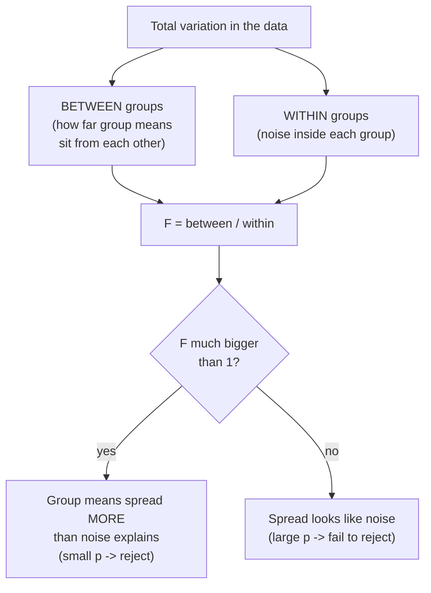
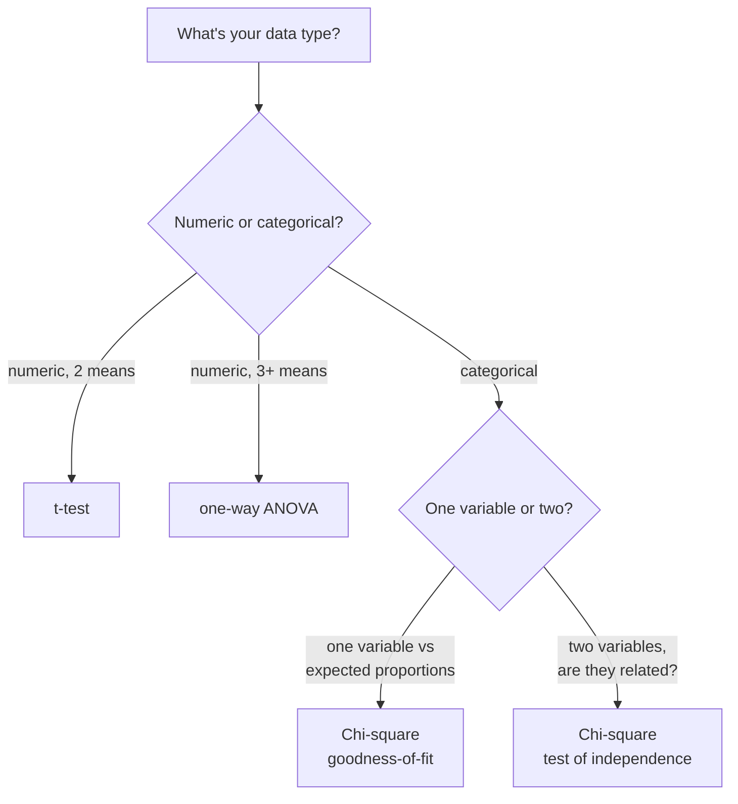
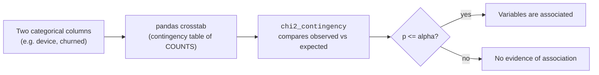

The t-test compares **two** means. But real questions rarely stop at two.
Does conversion differ across **four** landing pages? Do delivery times
differ across **three** warehouses? And what about questions that aren't
about means at all — is **device type** related to **whether a user
churns**? Those are counts of categories, not averages.

This page covers the two tools that handle these cases:

- **One-way ANOVA** — compares the means of **3+ groups** at once.
- **Chi-square tests** — work with **categorical** data: are two
  categorical variables associated (independence), and does a category's
  counts match an expected pattern (goodness-of-fit)?

Both are one-liners in `scipy.stats`. As always, the value is in picking
the right one and reading the result honestly.

## Part A — One-way ANOVA: comparing 3+ group means

### Why not just run a bunch of t-tests?

The tempting move with four groups is to t-test every pair: A vs B, A vs
C, A vs D, B vs C, B vs D, C vs D — six tests. The problem is the
**multiplicity** of chances to be wrong. Each test at α = 0.05 carries a
5% false-positive risk. Run six and the chance that *at least one* fires
by pure luck climbs well above 5%.

<CodeBlock
  adapter="python"
  starterCode={`import numpy as np
from scipy import stats

rng = np.random.default_rng(0)

# FIVE groups drawn from the EXACT same process -- no real differences.
# Run all 10 pairwise t-tests and count the false alarms.
alpha = 0.05
n_trials = 2000
any_false_alarm = 0

for _ in range(n_trials):
    groups = [rng.normal(100, 15, size=30) for _ in range(5)]
    fired = False
    for i in range(5):
        for j in range(i + 1, 5):
            if stats.ttest_ind(groups[i], groups[j]).pvalue <= alpha:
                fired = True
    any_false_alarm += fired

rate = any_false_alarm / n_trials
print(f"Groups are all identical, yet at least one of the 10 pairwise")
print(f"t-tests was 'significant' in {rate:.0%} of trials.")
print(f"That is FAR above the 5% you thought you were risking.")
`}
/>

That inflation is the heart of the **multiple comparisons problem** —
we'll formalize it in *Errors and Power*. ANOVA's job is to ask the
**single, global** question first — *"is there any difference among these
groups at all?"* — with one test at one α, so your false-positive rate
stays where you set it.

<Callout type="warn" title="Misconception: just run all the pairwise t-tests">
Testing every pair separately quietly inflates your overall false-positive
rate above α. With enough groups you're almost *guaranteed* a spurious
"significant" result. Run **one** ANOVA for the overall question; only if
it's significant do you drill into pairs (with a correction). More on
controlling this in *Errors and Power*.
</Callout>

### The F-statistic: between-group vs within-group variance

ANOVA's test statistic, **F**, compares two kinds of spread:

`F = (variance BETWEEN group means) / (variance WITHIN groups)`

The intuition: if the groups truly have the same mean, then the group
averages should differ only as much as the noise *inside* the groups
would predict — so between-spread ≈ within-spread and **F ≈ 1**. But if
some groups are genuinely shifted, the group means spread out *more* than
within-group noise alone can explain, pushing **F well above 1**.

Same shape as the t-test: a signal (between-group spread) divided by
noise (within-group spread), turned into a p-value by the F-distribution.

### Running a one-way ANOVA

A delivery company suspects three warehouses have different average
fulfillment times. One call to `scipy.stats.f_oneway` answers the global
question.

<CodeBlock
  adapter="python"
  starterCode={`import numpy as np
from scipy import stats

rng = np.random.default_rng(11)

# Fulfillment time (hours) at three warehouses.
east = rng.normal(24.0, 4.0, size=40)
west = rng.normal(24.5, 4.0, size=40)
south = rng.normal(27.5, 4.0, size=40)  # this one is genuinely slower
alpha = 0.05

# One-way ANOVA: do ANY of the three group means differ?
F_stat, p_value = stats.f_oneway(east, west, south)

print(
    f"Means -> east {east.mean():.1f}, west {west.mean():.1f}, south {south.mean():.1f}"
)
print(f"F-statistic : {F_stat:.3f}")
print(f"p-value     : {p_value:.4f}")
print()
if p_value <= alpha:
    print("REJECT H0: at least one warehouse's mean differs from the others.")
    print("(ANOVA does NOT say which one -- that needs a post-hoc test.)")
else:
    print("FAIL TO REJECT H0: no evidence the warehouse means differ.")
`}
/>

**How to read it.** The hypotheses are:

- H₀: all group means are equal (μ₁ = μ₂ = μ₃).
- H₁: **at least one** group mean differs from the rest.

A large F with a small p-value says the group means are spread out more
than within-group noise can explain — so you reject H₀ and conclude
*some* difference exists. Crucially, that is *all* it tells you.

<Callout type="danger" title="Misconception: ANOVA tells you WHICH group differs">
It does not. A significant ANOVA says *"at least one group is
different"* — it's an **omnibus** test. To find out *which* pairs differ,
you run **post-hoc** comparisons (e.g. Tukey's HSD) that correct for
multiplicity. Think of ANOVA as the smoke alarm: it tells you there's a
fire somewhere, not which room.
</Callout>

<Callout type="info" title="ANOVA's assumptions (close cousins of the t-test's)">
One-way ANOVA assumes **independent** observations, **approximately
normal** within-group values (the CLT helps for larger groups), and
**roughly equal variances** across groups (homogeneity of variance). If
variances differ a lot, a Welch-style ANOVA is the robust analogue —
same spirit as preferring Welch's t-test. If normality is badly violated
with small groups, the **Kruskal–Wallis** test is the nonparametric
counterpart (a cousin of the methods in *Correlation and Nonparametric
Tests*).
</Callout>

<MultipleChoice
  markdown={`A one-way ANOVA across four marketing channels returns F = 6.1, p = 0.0004. What may you correctly conclude?

- Channel A has the highest conversion rate
  > ANOVA does not single out any group. Identifying which channel is best requires post-hoc pairwise comparisons, not the omnibus test.
- All four channels have different conversion rates from each other
  > A significant ANOVA only implies *at least one* group differs, not that *all* pairs differ. Some channels could still be equal.
- [o] At least one channel's mean conversion rate differs from the others, but ANOVA alone doesn't say which
  > The omnibus test detects that the group means are spread further apart than within-group noise explains, without identifying the specific group(s) responsible.
- The differences are large and important
  > F and p speak to whether differences are distinguishable from noise, not to their magnitude or business importance. Effect size addresses that separately.

ANOVA is the smoke alarm: it signals a difference exists somewhere, then post-hoc tests locate it.`}
/>

## Part B — Chi-square: tests for categorical data

ANOVA and t-tests need **numbers** (heights, times, dollars). But masses
of real data are **categorical**: device type, subscription tier,
yes/no churn, survey response. Chi-square (χ²) tests are built
for exactly this. They come in two main flavors.

### Test of independence: are two categorical variables related?

**The question it answers:** in a **contingency table** (a cross-tab of
two categorical variables), are the variables **associated**, or
independent?

The idea is to compare the **observed** counts with the counts you'd
**expect** if the two variables were completely unrelated. If observed and
expected are close, no association; if they diverge a lot, the variables
are linked.

Let's test whether **device type** is associated with **churn**.

<CodeBlock
  adapter="python"
  starterCode={`import numpy as np
import pandas as pd
from scipy import stats

rng = np.random.default_rng(5)
n = 600

device = rng.choice(["mobile", "desktop", "tablet"], size=n, p=[0.5, 0.4, 0.1])
# Make churn depend a bit on device (mobile churns more) -> a real association.
base = np.where(device == "mobile", 0.32, np.where(device == "desktop", 0.18, 0.22))
churned = rng.random(n) < base

df = pd.DataFrame({"device": device, "churned": churned})

# Step 1: build the contingency table of COUNTS with crosstab.
table = pd.crosstab(df["device"], df["churned"])
print("Observed counts (contingency table):")
print(table)
print()

# Step 2: chi-square test of independence.
chi2, p_value, dof, expected = stats.chi2_contingency(table)
print(f"chi-square statistic : {chi2:.3f}")
print(f"degrees of freedom   : {dof}")
print(f"p-value              : {p_value:.4f}")
print()
print("Expected counts if device and churn were INDEPENDENT:")
print(np.round(expected, 1))
print()
if p_value <= 0.05:
    print("REJECT H0: device type and churn are associated.")
else:
    print("FAIL TO REJECT H0: no evidence of association.")
`}
/>

**How to read it.** The hypotheses are:

- H₀: the two variables are **independent** (no association).
- H₁: they are **associated** (not independent).

`chi2_contingency` returns four things: the statistic, the p-value, the
degrees of freedom, and the **expected** counts table. A small p-value
means observed and expected diverge more than chance would allow — so the
variables are related. Notice the expected table: it's what each cell
*would* look like if device had no bearing on churn. Chi-square is just a
measure of how far reality strays from that "no relationship" world.

<Callout type="danger" title="Misconception: feed proportions or percentages into chi-square">
Chi-square tests work on **raw counts**, never proportions or
percentages. The test's entire logic rests on *how many* observations
fall in each cell — 30-out-of-100 carries far less evidence than
3,000-out-of-10,000, even though both are "30%." If you pass in
percentages, the math is meaningless. Always build the table from
**counts** (which is exactly what `pd.crosstab` gives you).
</Callout>

<Callout type="warn" title="Chi-square tests EXISTENCE, not STRENGTH">
A significant chi-square tells you an association **exists** — it says
nothing about how **strong** it is. With a huge sample, even a trivial,
practically irrelevant association becomes "significant." To measure
*strength*, use an effect size for tables like **Cramér's V** (a
companion to the effect sizes in *Effect Sizes*). Existence and magnitude
are different questions, just as with every other test.
</Callout>

### Goodness-of-fit: does one variable match an expected distribution?

**The question it answers:** do the observed counts of a *single*
categorical variable match a set of **expected** proportions?

Classic uses: is a die fair (each face 1/6)? Do website visits split
across days the way we assumed? Did this quarter's support tickets follow
last year's category mix? Here you use `stats.chisquare`.

<CodeBlock
  adapter="python"
  starterCode={`import numpy as np
from scipy import stats

rng = np.random.default_rng(9)

# A store expects weekday traffic split: Mon-Fri = 15%, 15%, 20%, 20%, 30%.
expected_props = np.array([0.15, 0.15, 0.20, 0.20, 0.30])
days = ["Mon", "Tue", "Wed", "Thu", "Fri"]
total = 1000

# Simulate this week's ACTUAL visitor counts (close-ish to expected).
observed = rng.multinomial(total, expected_props)

# chisquare needs EXPECTED COUNTS (not proportions): scale by the total.
expected_counts = expected_props * total

chi2, p_value = stats.chisquare(f_obs=observed, f_exp=expected_counts)

print("Day :", days)
print("Obs :", observed)
print("Exp :", expected_counts.astype(int))
print()
print(f"chi-square : {chi2:.3f}")
print(f"p-value    : {p_value:.4f}")
print()
if p_value <= 0.05:
    print("REJECT H0: traffic does NOT follow the expected weekday split.")
else:
    print("FAIL TO REJECT H0: traffic is consistent with the expected split.")
`}
/>

The hypotheses: H₀ says the counts follow the expected proportions;
H₁ says they don't. Same logic as before — observed vs expected — just
for one variable against a reference pattern instead of two variables
against each other.

<Callout type="warn" title="Watch out for small expected counts">
The chi-square approximation gets unreliable when **expected** counts in
cells are very small (a common rule of thumb: be wary if any expected
count is below 5). With sparse tables — rare categories, small samples —
the p-value can be off. Fixes include combining small categories or using
**Fisher's exact test** for 2×2 tables. Note this is about *expected*
counts, not observed ones.
</Callout>

<MultipleChoice
  markdown={`You have a table showing the **percentage** of users in each subscription tier who churned. You want a chi-square test of independence between tier and churn. What must you do first?

- Nothing — chi-square works directly on percentages
  > Chi-square's logic depends on the number of observations per cell, so percentages alone are not valid input. Sample size information is lost when you only have percentages.
- [o] Convert back to raw counts per cell, because chi-square requires counts, not percentages
  > The test weighs evidence by how many observations fall in each cell, so you must reconstruct the actual counts (e.g. via a crosstab) before running it.
- Multiply each percentage by 100 to get whole numbers
  > Scaling percentages by 100 does not recover the true counts and does not encode the sample size, so the test would still be meaningless.
- Use a t-test instead, since percentages are numeric
  > A churn percentage by tier is summarizing categorical outcomes; the right tool is chi-square on the underlying counts, not a t-test on percentages.

Chi-square needs counts because the strength of evidence depends on how many observations there are, which percentages hide.`}
/>

## Challenge 1 — One-way ANOVA across three groups

<ChallengeCard
  adapter="python"
  title="Compare three teaching methods"
  instructions={`Three groups of students learned the same material with three different methods. You have each group's **test scores**. Test whether the average score differs across methods.

- Run a **one-way ANOVA** across \`method_a\`, \`method_b\`, and \`method_c\`.
- Store the F-statistic as a float **\`F_stat\`** and the p-value as a float **\`p_value\`**.
- Set a string **\`conclusion\`** to **\`"at least one differs"\`** if the result is significant at \`alpha = 0.05\`, otherwise **\`"no difference detected"\`**.

Use the right \`scipy.stats\` function for comparing 3+ group means — do **not** run separate t-tests.`}
  initCode={`import numpy as np
from scipy import stats

rng = np.random.default_rng(303)
method_a = rng.normal(72, 9, size=35)
method_b = rng.normal(75, 9, size=35)
method_c = rng.normal(81, 9, size=35)   # this method genuinely helps
alpha = 0.05`}
  starterCode={`# TODO: one-way ANOVA; set F_stat, p_value (floats) and conclusion (str)
F_stat = None
p_value = None
conclusion = None
`}
  solutionCode={`F_stat, p_value = stats.f_oneway(method_a, method_b, method_c)
F_stat = float(F_stat)
p_value = float(p_value)
conclusion = "at least one differs" if p_value <= alpha else "no difference detected"
print(F_stat, p_value, conclusion)
`}
  tests={[
    {
      id: "types",
      name: "F_stat and p_value are floats",
      description: "Both numeric",
      code: `assert isinstance(F_stat, float) and isinstance(p_value, float)`,
    },
    {
      id: "anova_p",
      name: "p_value matches one-way ANOVA",
      description: "Used f_oneway on the three groups",
      code: `from scipy import stats
ef, ep = stats.f_oneway(method_a, method_b, method_c)
assert abs(p_value - float(ep)) < 1e-9`,
    },
    {
      id: "anova_f",
      name: "F_stat matches one-way ANOVA",
      description: "F from f_oneway",
      code: `from scipy import stats
ef, ep = stats.f_oneway(method_a, method_b, method_c)
assert abs(F_stat - float(ef)) < 1e-9`,
    },
    {
      id: "conclusion",
      name: "conclusion follows the rule",
      description: "Significant at alpha 0.05",
      code: `expected = "at least one differs" if p_value <= alpha else "no difference detected"
assert conclusion == expected`,
    },
  ]}
/>

## Challenge 2 — Chi-square test of independence

<ChallengeCard
  adapter="python"
  title="Is plan type associated with churn?"
  instructions={`You have a DataFrame \`df\` with two categorical columns: \`plan\` (\`"basic"\`/\`"pro"\`/\`"enterprise"\`) and \`churned\` (\`True\`/\`False\`). Test whether the two variables are **associated**.

- Build a **contingency table of counts** named **\`table\`** using \`pd.crosstab(df["plan"], df["churned"])\`.
- Run a **chi-square test of independence** on that table.
- Store the p-value as a float named **\`p_value\`**.
- Set a boolean **\`associated\`** to whether the variables are associated at \`alpha = 0.05\` (reject \`H0\` when \`p_value <= alpha\`).

Remember: chi-square needs **counts**, which is exactly what \`crosstab\` produces.`}
  initCode={`import numpy as np
import pandas as pd
from scipy import stats

rng = np.random.default_rng(404)
n = 700
plan = rng.choice(["basic", "pro", "enterprise"], size=n, p=[0.5, 0.35, 0.15])
rate = np.where(plan == "basic", 0.30, np.where(plan == "pro", 0.16, 0.10))
churned = rng.random(n) < rate
df = pd.DataFrame({"plan": plan, "churned": churned})
alpha = 0.05`}
  starterCode={`# TODO: build 'table' with crosstab, run chi-square, set p_value (float) and associated (bool)
table = None
p_value = None
associated = None
`}
  solutionCode={`table = pd.crosstab(df["plan"], df["churned"])
chi2, p_value, dof, expected = stats.chi2_contingency(table)
p_value = float(p_value)
associated = bool(p_value <= alpha)
print(table)
print(p_value, associated)
`}
  tests={[
    {
      id: "table",
      name: "table is the crosstab of counts",
      description: "Contingency table from crosstab",
      code: `import pandas as pd
expected_table = pd.crosstab(df["plan"], df["churned"])
assert table.shape == expected_table.shape
assert int(table.values.sum()) == len(df)`,
    },
    {
      id: "type",
      name: "p_value is a float",
      description: "Numeric p-value",
      code: `assert isinstance(p_value, float)`,
    },
    {
      id: "chi2_p",
      name: "p_value matches chi2_contingency",
      description: "Used chi2_contingency on the table",
      code: `import pandas as pd
from scipy import stats
t = pd.crosstab(df["plan"], df["churned"])
expected_p = float(stats.chi2_contingency(t)[1])
assert abs(p_value - expected_p) < 1e-9`,
    },
    {
      id: "associated",
      name: "associated is the correct boolean",
      description: "p_value <= alpha",
      code: `assert isinstance(associated, bool)
assert associated == bool(p_value <= alpha)`,
    },
  ]}
/>

## Common misconceptions, gathered

<Callout type="danger" title="Five ANOVA and chi-square traps">
1. **Running many t-tests instead of ANOVA.** Each extra test adds
   false-positive risk; ANOVA asks the global question once.
2. **Thinking a significant ANOVA names the group.** It's an omnibus
   "*something* differs"; use post-hoc tests to find which.
3. **Feeding proportions/percentages into chi-square.** It needs raw
   **counts** — the sample size is part of the evidence.
4. **Reading chi-square as strength of association.** It tests
   *existence*, not *size*; use Cramér's V for magnitude.
5. **Ignoring small expected counts.** Below ~5 per cell, the chi-square
   approximation wobbles; combine categories or use Fisher's exact test.
</Callout>

## Check your understanding

<MultipleChoice
  markdown={`Why prefer a single one-way ANOVA over running every pairwise t-test among five groups?

- ANOVA is more powerful for every individual pair than a t-test
  > ANOVA answers a different, global question; it is not simply a stronger per-pair test. Pairwise power is what post-hoc tests address.
- t-tests cannot be applied to more than two groups at once
  > A t-test can be applied to any single pair; the issue is not capability but the cumulative error from doing it many times.
- [o] Running many pairwise tests inflates the overall false-positive rate above alpha, while one ANOVA tests the global question at the chosen alpha
  > Each test carries its own chance of a false alarm, so many tests make at least one spurious "significant" result likely; the omnibus ANOVA keeps the overall error rate controlled.
- ANOVA never requires any assumptions
  > ANOVA assumes independence, approximate normality, and roughly equal variances, so it is not assumption-free. The advantage is about multiplicity, not freedom from assumptions.

The motivation is controlling the family-wise false-positive rate, which many separate t-tests quietly inflate.`}
/>

<MultipleChoice
  markdown={`The F-statistic in one-way ANOVA is essentially which ratio?

- [o] Variance between the group means divided by variance within the groups
  > When groups truly share a mean, the between-group spread matches what within-group noise predicts, so F is near 1; genuine differences push the between-group term up and F above 1.
- The largest group mean divided by the smallest group mean
  > A ratio of extreme means ignores the spread inside groups and the number of groups, which the F-statistic accounts for. This is not how F is built.
- The total sample size divided by the number of groups
  > That ratio is roughly the average group size, not a measure of how separated the means are relative to noise.
- The p-value divided by the significance level
  > The p-value is derived from F via the F-distribution; it is an output, not an input to the statistic.

F contrasts how far apart the group means sit against the noise inside the groups — signal over noise, again.`}
/>

<MultipleChoice
  markdown={`A chi-square test of independence between region and product preference gives p = 0.002 on a sample of 50,000 customers. What is the safest interpretation?

- Region strongly determines product preference
  > A small p-value with a very large sample signals that *some* association exists, not that it is strong. Strength needs an effect size like Cramér's V.
- [o] There is evidence that region and preference are associated, but the test says nothing about how strong that association is
  > Chi-square detects departure from independence; with 50,000 observations even a tiny association is detectable, so existence is established while magnitude remains unknown.
- The association is definitely large because the sample is large
  > Large samples make even negligible associations significant, so sample size cannot be used to infer that the association is large.
- Region and preference are independent
  > A significant result is evidence *against* independence, so concluding independence reverses the finding.

Chi-square confirms an association exists; quantifying its strength requires a separate effect-size measure.`}
/>

<MultipleChoice
  markdown={`Which scenario calls for a chi-square **goodness-of-fit** test (rather than a test of independence)?

- Comparing average revenue across four store locations
  > Comparing several means is a job for one-way ANOVA, not chi-square. The outcome here is numeric, not categorical counts.
- [o] Checking whether observed counts of dice rolls (1 through 6) match the equal proportions of a fair die
  > A single categorical variable compared against a set of expected proportions is exactly the goodness-of-fit setup.
- Testing whether browser type is related to whether a user converts
  > Two categorical variables and their relationship call for the test of *independence*, not goodness-of-fit.
- Measuring the correlation between height and weight
  > A relationship between two numeric variables is measured with correlation, not a chi-square test.

Goodness-of-fit compares one variable's observed counts to an expected distribution; independence compares two variables to each other.`}
/>

<MultipleChoice
  markdown={`A one-way ANOVA on three groups is significant. A colleague concludes "so group C is the best." What's the issue?

- Nothing is wrong; a significant ANOVA identifies the top group
  > ANOVA is an omnibus test and never names a specific group. Concluding which is best from ANOVA alone is unsupported.
- [o] ANOVA only signals that at least one group differs; identifying which group(s) requires post-hoc pairwise comparisons
  > The significant omnibus result establishes that the means are not all equal, but pinpointing the responsible group needs follow-up tests that correct for multiplicity.
- ANOVA requires exactly two groups, so the test was invalid
  > ANOVA is specifically designed for three or more groups, so the test itself is appropriate here. The error is in over-interpreting it.
- The colleague should have used a chi-square test
  > Chi-square is for categorical data; comparing three numeric group means is ANOVA territory. The fix is post-hoc tests, not switching to chi-square.

A significant ANOVA is the start of the investigation, not the end; post-hoc comparisons locate the difference.`}
/>

## Key takeaways

<Callout type="success" title="What to carry forward">
- **One-way ANOVA** compares **3+ group means** with a single test; its
  statistic **F = between-group variance ÷ within-group variance** is
  signal over noise, and a large F (small p) means at least one group
  differs.
- Don't replace ANOVA with **many t-tests** — that inflates false
  positives (*Errors and Power*). And ANOVA is an **omnibus** test: it
  says *something* differs, not *which* (use post-hoc tests).
- **Chi-square** handles **categorical** data: **independence** (two
  variables, via a `crosstab` + `chi2_contingency`) and **goodness-of-fit**
  (one variable vs expected proportions, via `chisquare`).
- Chi-square needs **counts, not proportions**, tests **existence not
  strength** (use Cramér's V for magnitude), and gets shaky with **small
  expected counts** (< ~5 per cell).
- Match the test to the **data type**: numeric means → t-test/ANOVA;
  categorical counts → chi-square.
</Callout>
