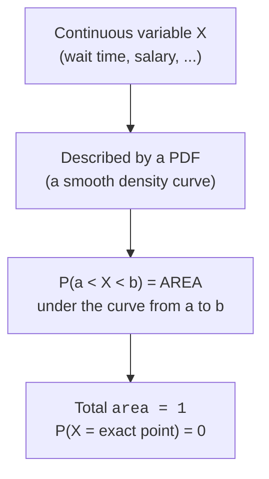
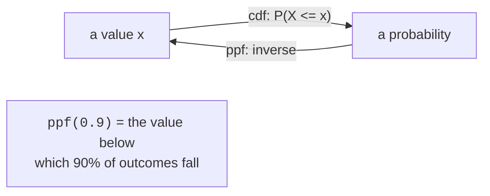

Wait times, salaries, temperatures, response latencies, heights — these
don't come in whole-number counts. They're **continuous**: between any
two possible values there's always another. That one fact forces a
different way of thinking about probability than the discrete world of
*Discrete Distributions*, and it trips up almost everyone the first
time.

Here's the shift. For a count, "what's the probability of exactly 3
tickets?" is a sensible question with a real answer. For a continuous
quantity, "what's the probability the wait is exactly 5.000000... minutes?"
has the answer **zero** — there are infinitely many possible values, so
no single one carries any probability on its own. Instead, probability
for continuous variables lives in **intervals**, and it's computed as
**area under a curve**. Internalize that and the rest of this page falls
into place.

<svg
  viewBox="0 0 640 200"
  role="img"
  aria-label="Three density silhouettes stand along one baseline — a flat plateau, a decaying slide, and a bell — with one green interval slice holding real probability and a red hairline at a single point holding none — for continuous variables probability is area, and a point has zero width"
  style={{ display: "block", width: "100%", maxWidth: "640px", height: "auto", margin: "2.5rem auto" }}
>
  <rect x="50" y="160" width="540" height="5" rx="2.5" fill="currentColor" opacity="0.2" />
  <g style={{ color: "var(--ds-blue-500)" }} fill="currentColor" fillOpacity="0.3">
    <rect x="70" y="96" width="120" height="64" rx="6" />
    <path d="M 228 160 L 228 72 C 268 76 300 120 360 148 C 380 155 396 158 410 160 Z" />
    <path d="M 440 160 C 472 160 478 84 510 84 C 542 84 548 160 580 160 Z" />
  </g>
  <g style={{ color: "var(--ds-green-500)" }} fill="currentColor">
    <path d="M 268 160 L 268 86 C 290 96 310 124 330 140 L 330 160 Z" fillOpacity="0.55" />
  </g>
  <g style={{ color: "var(--ds-red-500)" }} fill="currentColor">
    <rect x="129" y="96" width="2.5" height="64" fillOpacity="0.9" />
    <text x="130" y="86" textAnchor="middle" fontFamily="var(--font-mono), ui-monospace, monospace" fontSize="14">0</text>
  </g>
</svg>

## The big idea: probability is area under the PDF

A continuous distribution is described by a **probability density
function (PDF)** — a smooth curve. The curve itself is *not*
probability. Probability is the **area** under the curve between two
values:

`P(a < X < b) = area under the PDF from a to b`

The total area under any PDF is exactly 1 (something must happen). A
single point has zero width, so it has zero area — which is why
P(X = exact value) = 0 for continuous variables. You always ask
about ranges.

<Callout type="danger" title="Misconception #1: the PDF height is a probability">
The **height** of a PDF is a *density*, not a probability. It can even
be **greater than 1**. For a `Uniform(0, 0.5)`, the density is 2
everywhere on that interval — a perfectly valid PDF, because what must
stay ≤ 1 is the **area** (2 × 0.5 = 1), not the height. Never read a
y-axis density value as "the probability of that x." Probability is
always an area, never a height.
</Callout>

### Discrete PMF vs continuous PDF

The contrast with the discrete world is worth pinning down, because the
mental model is genuinely different.

| | **Discrete (PMF)** | **Continuous (PDF)** |
| --- | --- | --- |
| Shape | Bars at 0, 1, 2, … | A smooth curve |
| Height means | `P(X = k)` — directly a probability | A *density* — **not** a probability |
| `P` over a range | **Sum** of bar heights | **Area** under the curve |

<Callout type="info" title="Why P(X = x) = 0 isn't a paradox">
"The probability of any exact value is zero" sounds like it means
nothing can happen — but *some* value always occurs. The resolution:
with infinitely many possibilities, probability spreads across
intervals, not points. It's like asking which exact real number a dart
lands on along a line — the dart lands *somewhere*, yet the chance of
any pre-named exact point is zero. So we ask "within 1mm of here?"
(an interval) instead.
</Callout>

## Uniform: every value equally likely

The **Uniform** distribution spreads probability **evenly** over an
interval [a, b] — a flat PDF. It's the simplest continuous
distribution and the natural model when you have no reason to favor any
value over another in a range: a random timestamp within an hour, a
spawn point along a line, the raw output of a random-number generator.

In scipy the convention is `loc = a` (the left edge) and
`scale = b - a` (the **width**), so `Uniform(0, 10)` is
`stats.uniform(loc=0, scale=10)`. This `loc`/`scale` convention runs
through almost every scipy distribution — learn it once here.

<CodeBlock
  adapter="python"
  files={[
    {
      filename: "main.py",
      starterCode: `import numpy as np
import plotly.express as px
from scipy import stats

# Uniform on [0, 10]: loc = 0 (left edge), scale = 10 (width).
d = stats.uniform(loc=0, scale=10)

# Constant density of 0.1 across the interval (so area = 0.1 * 10 = 1).
print("PDF height everywhere on [0,10] =", d.pdf(5))
print("P(3 < X < 7) = cdf(7) - cdf(3)  =", round(float(d.cdf(7) - d.cdf(3)), 4))

x = np.linspace(-2, 12, 400)
fig = px.line(
    x=x,
    y=d.pdf(x),
    labels={"x": "x", "y": "density"},
    title="Uniform(0, 10) PDF — flat; area, not height, is probability",
)
fig.show()
`,
    },
  ]}
/>

<Callout type="tip" title="Interval probability = cdf(b) − cdf(a)">
The **cumulative distribution function (CDF)** gives P(X ≤ x) — the
area to the *left* of x. So the area between a and b is just
`cdf(b) - cdf(a)`. This one identity computes *every* interval
probability for *every* continuous distribution. You'll use it
constantly.
</Callout>

## Exponential: waiting time until the next event

The **Exponential** distribution models the **time between** independent
events that happen at a constant rate — the continuous partner of the
Poisson from *Discrete Distributions*. If support tickets arrive
Poisson-style at some rate, the *gap* between consecutive tickets is
Exponential. Real uses:

- **Wait times**: time until the next customer, request, or arrival.
- **Time-to-failure**: how long a component lasts before breaking.
- **Inter-event gaps**: seconds between clicks, days between incidents.

In scipy, parameterize by `scale = mean`. So a process with a **mean
wait of 5 minutes** is `stats.expon(scale=5)`. (There's also a `loc`
shift, but you'll almost always leave it at 0.)

<CodeBlock
  adapter="python"
  files={[
    {
      filename: "main.py",
      starterCode: `import numpy as np
import plotly.express as px
from scipy import stats

# Mean wait of 5 minutes -> scale = 5.
d = stats.expon(scale=5)

print(f"Mean wait               = {d.mean()} min")
print(f"P(wait < 3 min)         = {d.cdf(3):.4f}")
# P(wait > 10) = survival function = 1 - cdf(10).
print(f"P(wait > 10 min) sf(10) = {d.sf(10):.4f}")
print(f"P(2 < wait < 8 min)     = {d.cdf(8) - d.cdf(2):.4f}")

x = np.linspace(0, 30, 400)
fig = px.line(
    x=x,
    y=d.pdf(x),
    labels={"x": "minutes until next event", "y": "density"},
    title="Exponential(mean=5): wait times — most short, a long right tail",
)
fig.show()
`,
    },
  ]}
/>

The exponential is **right-skewed**: short waits are most likely, but
there's a long tail of occasional long waits. Its defining quirk is
*memorylessness* — having already waited 10 minutes tells you nothing
about how much longer you'll wait. That's a strong assumption, and a
reason it sometimes *doesn't* fit (a machine that wears out gets *more*
likely to fail over time, violating memorylessness).

<Callout type="warn" title="Exponential vs Poisson: gaps vs counts">
They describe the **same** stream of events from two angles. **Poisson**
(discrete) counts *how many* events land in a fixed interval.
**Exponential** (continuous) measures *how long until* the next one.
Same rate parameter underneath; choose based on whether you're counting
events or timing the gaps between them.
</Callout>

## Normal: the bell curve (a first look)

The **Normal** (Gaussian) distribution is the famous symmetric bell
curve, defined by a mean μ (center) and standard deviation σ
(spread): `stats.norm(loc=mu, scale=sigma)`. It models quantities that
pile up around a center with symmetric tails — measurement errors,
aggregated noise, many natural and human measurements. It's so central
that it gets its own page next, *The Normal Distribution*, where we
cover the 68–95–99.7 rule and z-scores. Here we just meet it as another
continuous distribution and practice the same area-based questions.

<CodeBlock
  adapter="python"
  files={[
    {
      filename: "main.py",
      starterCode: `import numpy as np
import plotly.express as px
from scipy import stats

# Test scores: mean 100, standard deviation 15.
d = stats.norm(loc=100, scale=15)

print(f"P(score < 100)        = {d.cdf(100):.4f}   (half — it's symmetric)")
print(f"P(90 < score < 120)   = {d.cdf(120) - d.cdf(90):.4f}")
print(f"P(score > 130)        = {d.sf(130):.4f}")

x = np.linspace(40, 160, 400)
fig = px.line(
    x=x,
    y=d.pdf(x),
    labels={"x": "score", "y": "density"},
    title="Normal(mean=100, sd=15) PDF",
)
fig.show()
`,
    },
  ]}
/>

## Quantiles: inverting the question with ppf

So far we've gone *value → probability* with `cdf`. Often you need the
reverse: *probability → value*. "What wait time are 90% of waits below?"
"What score puts you in the top 5%?" That's the **percent-point function
(`ppf`)**, the inverse of the CDF, also called the **quantile function**.

`ppf(0.9)` returns the value x such that P(X ≤ x) = 0.9 — the 90th
percentile. It's the tool for setting thresholds, SLAs, and cutoffs.

<CodeBlock
  adapter="python"
  files={[
    {
      filename: "main.py",
      starterCode: `from scipy import stats

# Response times, exponential with mean 200 ms.
d = stats.expon(scale=200)

# The 95th percentile: 95% of requests finish faster than this.
p95 = d.ppf(0.95)
print(f"95th percentile response time = {p95:.1f} ms")

# Sanity check: cdf of that value should return 0.95.
print(f"Check: cdf(p95) = {d.cdf(p95):.4f}")

# A normal example: the median is exactly the mean by symmetry.
scores = stats.norm(loc=100, scale=15)
print(f"\\nMedian score (ppf 0.5) = {scores.ppf(0.5):.1f}")
print(f"90th percentile score  = {scores.ppf(0.9):.1f}")
`,
    },
  ]}
/>

<svg
  viewBox="0 0 640 190"
  role="img"
  aria-label="A bell curve with most of its area filled green up to a yellow cutoff post, and a small percent badge pointing down at the post along a dotted trail — the ppf question runs in reverse: name the probability, get back the value that traps it"
  style={{ display: "block", width: "100%", maxWidth: "560px", height: "auto", margin: "2.5rem auto" }}
>
  <rect x="80" y="150" width="480" height="4" rx="2" fill="currentColor" opacity="0.18" />
  <g style={{ color: "var(--ds-blue-500)" }} fill="currentColor">
    <path d="M 120 150 C 200 150 210 54 320 54 C 430 54 440 150 520 150 Z" fillOpacity="0.18" />
  </g>
  <g style={{ color: "var(--ds-green-500)" }} fill="currentColor">
    <path d="M 120 150 C 200 150 210 54 320 54 C 380 54 402 90 430 122 L 430 150 Z" fillOpacity="0.45" />
  </g>
  <g style={{ color: "var(--ds-yellow-500)" }} fill="currentColor">
    <rect x="427" y="116" width="5" height="44" rx="2.5" />
    <circle cx="429.5" cy="166" r="6" />
    <circle cx="478" cy="48" r="17" fillOpacity="0.2" />
  </g>
  <text x="478" y="54" textAnchor="middle" fontFamily="var(--font-mono), ui-monospace, monospace" fontSize="16" fill="currentColor" opacity="0.6">%</text>
  <g fill="currentColor" opacity="0.35">
    <circle cx="466" cy="74" r="2.5" />
    <circle cx="454" cy="92" r="2.5" />
    <circle cx="442" cy="108" r="2.5" />
  </g>
</svg>

<Callout type="tip" title="cdf and ppf are inverses">
`cdf` takes a value and returns a probability (area to the left). `ppf`
takes a probability and returns the value. `d.ppf(d.cdf(x)) == x` and
`d.cdf(d.ppf(p)) == p`. Use `cdf`/`sf` for "what's the chance?" and
`ppf`/`isf` for "what's the cutoff?".
</Callout>

<ChallengeCard
  adapter="python"
  title="Interval probability for a normal variable"
  instructions={`Adult resting heart rate is modeled as **Normal** with mean **70** bpm and standard deviation **8** bpm.

Using \`scipy.stats.norm\`, compute the probability that a randomly chosen person's heart rate is **between 60 and 80 bpm**, \`P(60 < X < 80)\`.

- Build a frozen distribution \`d = stats.norm(loc=70, scale=8)\`.
- An interval probability is \`cdf(upper) - cdf(lower)\`.
- Store the answer as a plain Python \`float\` in **\`p_between\`**.`}
  files={[
    {
      filename: "main.py",
      initCode: `from scipy import stats
mu, sigma = 70, 8`,
      starterCode: `# TODO: compute P(60 < X < 80)
p_between = None

print("P(60 < X < 80):", p_between)
`,
      solutionCode: `d = stats.norm(loc=mu, scale=sigma)
p_between = float(d.cdf(80) - d.cdf(60))

print("P(60 < X < 80):", p_between)
`,
    },
  ]}
  tests={[
    {
      id: "type",
      name: "p_between is a float",
      description: "Returns a numeric value",
      code: `assert isinstance(p_between, float)`,
    },
    {
      id: "range",
      name: "p_between is a valid probability",
      description: "Between 0 and 1",
      code: `assert 0.0 <= p_between <= 1.0`,
    },
    {
      id: "value",
      name: "p_between matches cdf(80) - cdf(60)",
      description: "Correct interval probability",
      code: `from scipy import stats
d = stats.norm(loc=70, scale=8)
expected = float(d.cdf(80) - d.cdf(60))
assert abs(p_between - expected) < 1e-9`,
    },
  ]}
/>

<ChallengeCard
  adapter="python"
  title="Find a threshold with ppf"
  instructions={`Customer wait times follow an **Exponential** distribution with a **mean of 4 minutes**.

You want to publish a service-level promise: "**90%** of customers are served within X minutes." Find that X — the value such that \`P(X <= x) = 0.90\`.

- Build \`d = stats.expon(scale=4)\` (the \`scale\` is the mean).
- Use the **percent-point function**: \`d.ppf(0.90)\`.
- Store the answer as a plain Python \`float\` in **\`cutoff\`**.`}
  files={[
    {
      filename: "main.py",
      initCode: `from scipy import stats
mean_wait = 4`,
      starterCode: `# TODO: find the 90th-percentile wait time
cutoff = None

print("90% served within:", cutoff, "minutes")
`,
      solutionCode: `d = stats.expon(scale=mean_wait)
cutoff = float(d.ppf(0.90))

print("90% served within:", cutoff, "minutes")
`,
    },
  ]}
  tests={[
    {
      id: "type",
      name: "cutoff is a float",
      description: "Returns a numeric value",
      code: `assert isinstance(cutoff, float)`,
    },
    {
      id: "value",
      name: "cutoff is the 90th percentile",
      description: "Matches ppf(0.90)",
      code: `from scipy import stats
expected = float(stats.expon(scale=4).ppf(0.90))
assert abs(cutoff - expected) < 1e-6`,
    },
    {
      id: "roundtrip",
      name: "cdf(cutoff) is about 0.90",
      description: "ppf and cdf are inverses",
      code: `from scipy import stats
d = stats.expon(scale=4)
assert abs(d.cdf(cutoff) - 0.90) < 1e-6`,
    },
  ]}
/>

## Reading a density plot correctly

One more guard against the height-is-probability trap. When you plot a
PDF, the y-axis is **density**, and you should read *relative* heights
and *areas*, never absolute heights as probabilities.

<CodeBlock
  adapter="python"
  files={[
    {
      filename: "main.py",
      starterCode: `import numpy as np
from scipy import stats

# A tight normal: small spread pushes the peak density above 1.
tight = stats.norm(loc=0, scale=0.3)
print("Peak density at x=0:", round(float(tight.pdf(0)), 3), "(> 1, and that's fine!)")

# But the probability of any single point is still exactly 0,
# and a genuine interval probability stays a valid (<= 1) number.
print("P(X = 0)             :", 0.0, "(a single point has zero width)")
print("P(-0.3 < X < 0.3)    :", round(float(tight.cdf(0.3) - tight.cdf(-0.3)), 4))
print("\\nHeight can exceed 1; AREA never does.")
`,
    },
  ]}
/>

## Check your understanding

<MultipleChoice
  markdown={`For a continuous random variable \`X\`, what is \`P(X = 7.0)\` — the probability it equals exactly 7.0?

- It equals the height of the PDF at 7.0
  > The PDF height is a density, not a probability; a single point still has zero width and so zero area.
- [o] It is 0, because a single exact point has zero width and therefore zero area under the PDF
  > With infinitely many possible values, all probability lives in intervals (areas); any individual point contributes zero, so we ask about ranges instead.
- It is small but positive, roughly the PDF height times a tiny number
  > For a truly continuous variable the probability of an exact value is exactly zero, not merely small.
- It cannot be computed without more information
  > It can be stated immediately: for any continuous distribution the probability of an exact point is zero.

For continuous variables, always ask about an interval, never an exact value.`}
/>

<MultipleChoice
  markdown={`You plot the PDF of a \`Uniform(0, 0.5)\` distribution and notice the density is **2** across the whole interval. What does this tell you?

- The plot is wrong, because a probability can never exceed 1
  > A *probability* can't exceed 1, but this is a *density* (a height), and densities can exceed 1; nothing is wrong.
- The probability of landing in that interval is 2
  > Probability is the area, here \`2 × 0.5 = 1\`, not the height of 2.
- [o] The density height (2) is fine because what must equal 1 is the area: 2 × 0.5 = 1
  > Over a narrow interval the curve must rise above 1 so that its total area still integrates to exactly 1, which is the only constraint on a PDF.
- The distribution is invalid and should be renormalized
  > It is already a valid, normalized PDF; its area is exactly 1, so no renormalization is needed.

A skinny interval forces a tall density so the total area stays at 1 — height is not probability.`}
/>

<MultipleChoice
  markdown={`Wait times are \`Exponential\` with mean 5 minutes (\`d = stats.expon(scale=5)\`). Which expression gives the probability the wait is **between 2 and 8 minutes**?

- \`d.pdf(8) - d.pdf(2)\`
  > Subtracting PDF heights is meaningless; interval probability comes from the CDF (areas), not the PDF.
- [o] \`d.cdf(8) - d.cdf(2)\`
  > The CDF gives the area to the left of a value, so the difference \`cdf(8) - cdf(2)\` is exactly the area between 2 and 8 — the interval probability.
- \`d.cdf(8) + d.cdf(2)\`
  > Adding the two left-tail areas double-counts the region below 2 and overshoots; you need the difference.
- \`d.ppf(8) - d.ppf(2)\`
  > \`ppf\` takes probabilities (between 0 and 1), so feeding it 2 and 8 is invalid; it returns values, not probabilities.

\`cdf(b) - cdf(a)\` is the universal recipe for \`P(a < X < b)\`.`}
/>

<MultipleChoice
  markdown={`You need the value below which **95%** of a normal variable's outcomes fall (the 95th percentile). Which scipy method do you use?

- \`d.cdf(0.95)\`
  > \`cdf\` maps a *value* to a probability; passing 0.95 treats it as a value, giving the area below 0.95, not a percentile.
- [o] \`d.ppf(0.95)\`
  > The percent-point function is the inverse of the CDF: given the probability 0.95 it returns the value with 95% of outcomes below it — exactly the 95th percentile.
- \`d.sf(0.95)\`
  > \`sf\` is the right-tail probability for a *value* (1 − cdf), not a way to recover a percentile from a probability.
- \`d.pdf(0.95)\`
  > \`pdf\` returns a density height at the value 0.95 and has nothing to do with percentiles.

\`cdf\`/\`sf\` answer "what's the chance?"; \`ppf\`/\`isf\` answer "what's the cutoff?".`}
/>

<MultipleChoice
  markdown={`A teammate looks at a density plot, sees the curve peak at a height of 0.6 over the value 50, and concludes "there's a 60% chance the value is 50." What's the precise problem?

- They should have read 50, not 0.6, as the probability
  > Neither axis gives a point probability; the x-value 50 isn't a probability either.
- Nothing — that's a correct reading of a density plot
  > It is incorrect: a density height is not a probability, and a single point has zero probability.
- The height should have been read off the x-axis instead
  > The error isn't which axis; it's treating a density (height) as a probability at all.
- [o] A PDF height is a density, not a probability, and the chance of any single exact value is 0; probability is the area over an interval
  > The y-axis shows density, so its height can't be read as the chance of an exact value (which is zero for a continuous variable); only the area over a range is a probability.

Reading density heights as probabilities is the single most common error with continuous distributions.`}
/>

<Callout type="success" title="Key takeaways">
- Continuous variables use a **PDF**; **probability is area** under it,
  and the total area is 1.
- The **PDF height is a density, not a probability** — it can exceed 1.
  P(X = exact value) = 0; always ask about intervals.
- **`cdf(b) − cdf(a)`** gives any interval probability P(a < X < b);
  **`sf`** gives the right tail; **`ppf`** inverts the CDF to find
  percentiles and thresholds.
- **Uniform** = flat density over a range; **Exponential** = waiting
  time between events at a constant rate (right-skewed, memoryless);
  **Normal** = the symmetric bell curve, detailed next.
- The scipy `loc`/`scale` convention and the frozen-distribution
  pattern carry over from the discrete page and into *Working with
  Distributions*.
</Callout>
