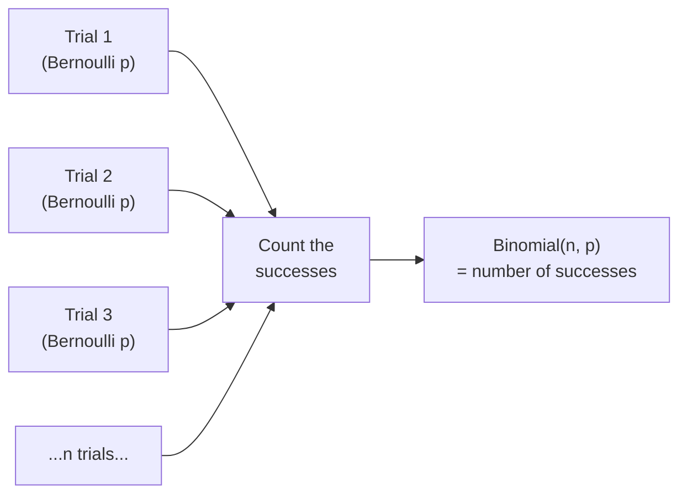
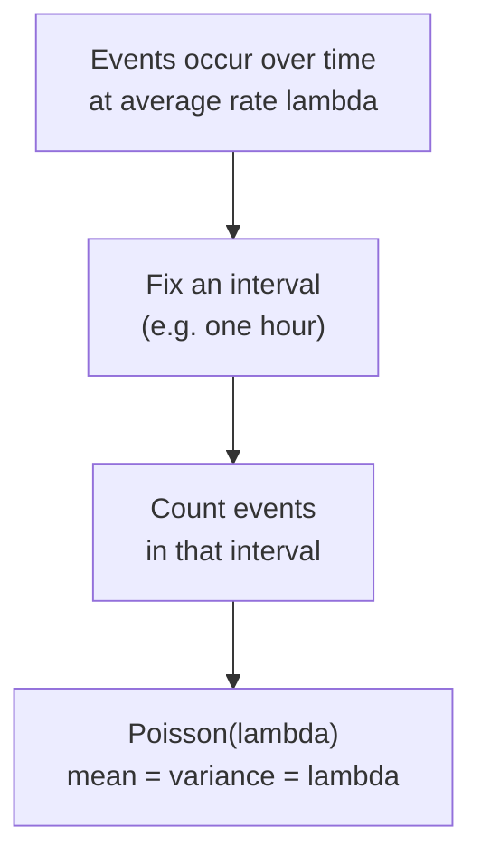
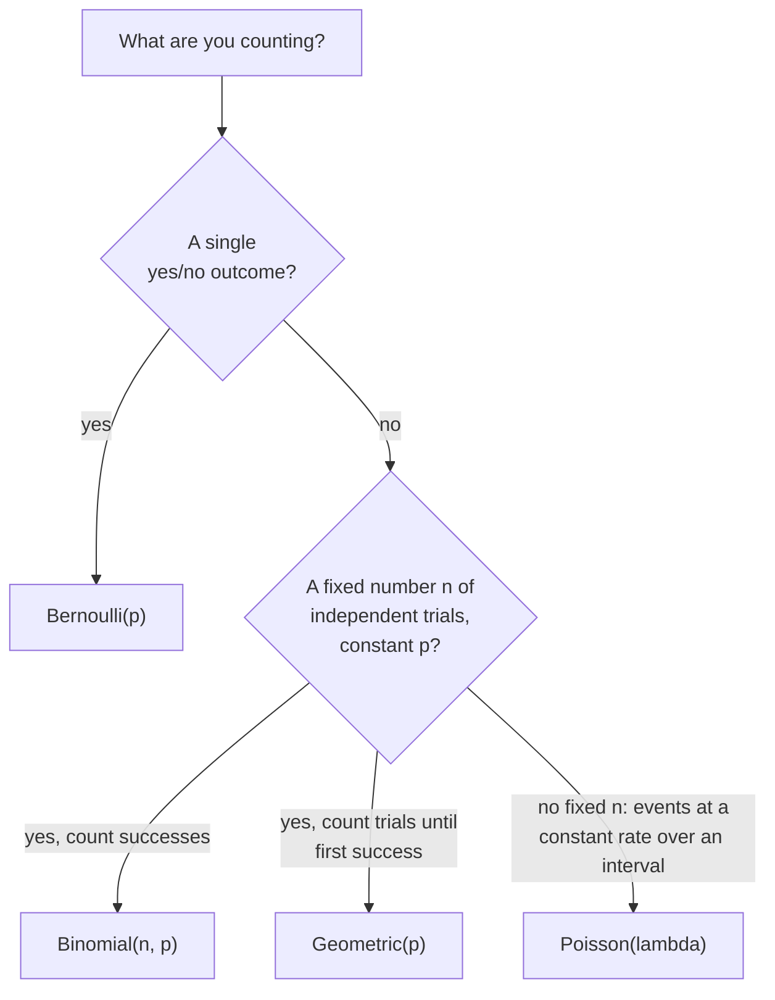

A huge share of data-science questions boil down to **counting things
that either happen or don't**. Did this visitor convert? How many of
the 10,000 emails bounced? How many support tickets will land in the
next hour? You can't write down the exact future, but you *can* write
down a model for how those counts behave — and once you have the model,
questions like "what's the chance we get 8 or more tickets this hour?"
become one line of code.

That's what a **discrete distribution** is: a rulebook assigning a
probability to each whole-number outcome a count can take. This page
covers the four you'll reach for constantly — **Bernoulli**,
**Binomial**, **Poisson**, and (briefly) **Geometric** — and, just as
important, *which one fits which situation*. Picking the wrong model is
the most common way these tools go wrong, so we'll spend real time on
when each one applies and when it doesn't.

<Callout type="info" title="Discrete means countable">
A distribution is **discrete** when the outcomes are separate, countable
values — 0, 1, 2, 3 tickets; never 2.7 tickets. The function that gives
the probability of each exact value is the **probability mass function
(PMF)**. Contrast this with continuous quantities like wait times or
heights, which we handle in *Continuous Distributions*.
</Callout>

## Bernoulli: a single yes/no trial

The **Bernoulli** distribution is the atom of everything else here: a
single trial with two outcomes, "success" (1) with probability `p` and
"failure" (0) with probability `1 − p`. One coin flip. One visitor who
either converts or doesn't. One email that either bounces or doesn't.

There's almost nothing to it — the mean is just `p` and the variance is
`p(1 − p)` — but it's the building block. Every other distribution on this
page is what happens when you start combining Bernoulli trials.

<CodeBlock
  adapter="python"
  starterCode={`from scipy import stats

# A visitor converts with probability p = 0.3.
p = 0.3
b = stats.bernoulli(p)  # a "frozen" distribution

print("P(convert)   = P(X=1) =", b.pmf(1))
print("P(no convert)= P(X=0) =", b.pmf(0))
print("mean (= p)            =", b.mean())
print("variance (= p(1-p))   =", round(float(b.var()), 4))

# Simulate 10 visitors (1 = converted, 0 = not).
sample = b.rvs(size=10, random_state=0)
print("\\n10 simulated visitors:", sample)
`}
/>

<Callout type="tip" title="The frozen-distribution pattern you'll reuse everywhere">
`stats.bernoulli(p)` returns a **frozen distribution** — an object with
the parameters baked in. You then call methods on it: `.pmf(k)`,
`.cdf(k)`, `.mean()`, `.var()`, `.rvs(size=...)`. Every distribution in
`scipy.stats` follows this same pattern, so once you learn it for one,
you know it for all of them. We lean on it hard in *Working with
Distributions*.
</Callout>

## Binomial: counting successes in n independent trials

Now stack `n` identical, independent Bernoulli trials and **count the
successes**. That count is **Binomial**. If 200 visitors each convert
independently with probability 0.03, the number who convert is
`Binomial(n=200, p=0.03)`. The binomial is the workhorse for any
"how many out of n?" question:

- **Conversions / sign-ups**: how many of 200 visitors convert?
- **Click-through**: how many of 5,000 impressions get clicked?
- **Defects in a batch**: how many of 1,000 manufactured parts are faulty?
- **Survey yes/no**: how many of 500 respondents say "yes"?

A binomial is literally a **sum of `n` independent Bernoulli trials**,
which is why its mean is `np` (each trial contributes `p` on average)
and its variance is `np(1 − p)`.

<CodeBlock
  adapter="python"
  starterCode={`from scipy import stats

# 200 visitors, each converts independently with probability 0.03.
n, p = 200, 0.03
d = stats.binom(n, p)

print(f"Expected conversions (np)     = {d.mean()}")
print(f"Std dev of conversions        = {d.std():.2f}")
print(f"P(exactly 6 convert)          = {d.pmf(6):.4f}")
print(f"P(at most 4 convert)          = {d.cdf(4):.4f}")

# P(X >= 10): use the survival function .sf, which is 1 - cdf,
# but more accurate in the tail. Note .sf(9) = P(X > 9) = P(X >= 10).
print(f"P(10 or more convert) sf(9)   = {d.sf(9):.4f}")
print(f"same via 1 - cdf(9)           = {1 - d.cdf(9):.4f}")
`}
/>

<Callout type="warn" title="Off-by-one: P(X ≥ k) is .sf(k − 1), not .sf(k)">
For a discrete distribution, `.sf(k)` computes P(X > k), which equals
P(X ≥ k+1). So P(X ≥ 10) is `.sf(9)`, and P(X ≤ 4) is
`.cdf(4)`. Mixing up `>` and `≥` here is the single most common
discrete-distribution bug. When in doubt, sanity-check that
`d.cdf(k) + d.sf(k)` is *not* 1 (it double-counts) but
`d.cdf(k) + d.sf(k-1)` *is* 1 only if you account for the value at `k`.
The safe habit: write the inequality out, then translate.
</Callout>

### Plotting a binomial PMF

Seeing the shape builds intuition fast. The PMF is just a bar for each
possible count, with bar heights summing to 1.

<CodeBlock
  adapter="python"
  starterCode={`import numpy as np
import plotly.express as px
from scipy import stats

n, p = 200, 0.03
d = stats.binom(n, p)

# Only the first ~20 counts have meaningful probability here.
k = np.arange(0, 21)
pmf = d.pmf(k)

fig = px.bar(
    x=k,
    y=pmf,
    labels={"x": "number of conversions", "y": "P(X = k)"},
    title="Binomial(n=200, p=0.03): how many of 200 visitors convert?",
)
fig.show()

print("Most likely outcomes cluster around the mean of", d.mean())
`}
/>

### The binomial assumptions (where it breaks)

The binomial is only valid when **all** of these hold. Violate one and
your probabilities can be badly wrong:

1. **Fixed number of trials `n`**, decided in advance.
2. **Each trial is independent** of the others.
3. **Constant probability `p`** across all trials.
4. **Two outcomes** per trial (success / failure).

<Callout type="danger" title="Misconception: 'it's yes/no, so it must be binomial'">
Yes/no outcomes are necessary but **not sufficient**. If conversions are
*correlated* — say a TV ad drives a burst of visitors who all behave
alike — trials aren't independent and the binomial **understates** the
real variability. If `p` drifts over the day (mobile users convert less
than desktop), the constant-`p` assumption breaks. Real funnels often
violate these; the binomial is a *model*, and you should ask whether its
assumptions actually fit before trusting its numbers.
</Callout>

<ChallengeCard
  adapter="python"
  title="Conversion rate: probability of at least k sign-ups"
  instructions={`A landing page is shown to **500** independent visitors. Each visitor signs up independently with probability **0.04**.

Using \`scipy.stats.binom\`, compute:

- **\`expected\`** — the expected number of sign-ups (a plain Python \`float\`).
- **\`p_at_least_25\`** — the probability of getting **25 or more** sign-ups, \`P(X >= 25)\`, as a \`float\`.

Hints:

- Build a frozen distribution \`d = stats.binom(n, p)\`.
- The mean is \`d.mean()\`.
- \`P(X >= 25)\` is the survival function evaluated at **24**: \`d.sf(24)\` (because \`.sf(k)\` is \`P(X > k)\`).`}
  initCode={`from scipy import stats
n = 500
p = 0.04`}
  starterCode={`# TODO: build the distribution and compute the two values
expected = None
p_at_least_25 = None

print("expected:", expected)
print("P(X >= 25):", p_at_least_25)
`}
  solutionCode={`d = stats.binom(n, p)
expected = float(d.mean())
p_at_least_25 = float(d.sf(24))  # P(X > 24) = P(X >= 25)

print("expected:", expected)
print("P(X >= 25):", p_at_least_25)
`}
  tests={[
    {
      id: "expected_type",
      name: "expected is a float",
      description: "Returns a numeric value",
      code: `assert isinstance(expected, float)`,
    },
    {
      id: "expected_value",
      name: "expected equals n*p",
      description: "Mean is 20",
      code: `assert abs(expected - 20.0) < 1e-9`,
    },
    {
      id: "prob_type",
      name: "p_at_least_25 is a float",
      description: "Returns a numeric value",
      code: `assert isinstance(p_at_least_25, float)`,
    },
    {
      id: "prob_value",
      name: "probability is correct (P(X >= 25))",
      description: "Matches scipy survival function at 24",
      code: `from scipy import stats
expected_prob = float(stats.binom(500, 0.04).sf(24))
assert abs(p_at_least_25 - expected_prob) < 1e-9`,
    },
    {
      id: "not_off_by_one",
      name: "did not compute P(X > 25) by mistake",
      description: "Guards against using sf(25)",
      code: `from scipy import stats
wrong = float(stats.binom(500, 0.04).sf(25))
assert abs(p_at_least_25 - wrong) > 1e-12`,
    },
  ]}
/>

## Poisson: counting rare events in a fixed interval

The **Poisson** distribution counts how many times a rare-ish event
happens in a fixed window of time or space, when events occur
independently at a constant average **rate** λ (lambda). There's
no fixed `n` and no per-trial `p` — just an average rate and an
interval. Classic uses:

- **Arrivals**: customers per minute, requests per second, calls per hour.
- **Server errors / failures**: 500-errors per hour, crashes per day.
- **Defects per unit**: typos per page, scratches per square meter.
- **Rare incidents**: accidents per intersection per month.

The Poisson has one beautiful property: its mean **and** its variance
both equal λ. If your event counts have a variance much larger
than their mean, that's a red flag the Poisson doesn't fit
(over-dispersion — often from events clumping together).

### Worked example: support tickets per hour

Suppose your queue gets about **3 support tickets per hour** on average,
arriving independently. What's the chance a single hour brings **8 or
more** — a spike worth staffing for?

<CodeBlock
  adapter="python"
  starterCode={`from scipy import stats

# Average rate: 3 tickets per hour.
lam = 3
d = stats.poisson(mu=lam)  # scipy calls the rate parameter 'mu'

print(f"Expected tickets/hour (lambda) = {d.mean()}")
print(f"Variance (= lambda)            = {d.var()}")
print(f"P(exactly 3 tickets)           = {d.pmf(3):.4f}")
print(f"P(0 tickets this hour)         = {d.pmf(0):.4f}")

# P(8 or more) = P(X >= 8) = P(X > 7) = sf(7).
p_spike = d.sf(7)
print(f"\\nP(8 or more tickets) = {p_spike:.4f}  (~{p_spike * 100:.1f}% of hours)")
print("So a spike that big happens in roughly 1 hour out of 84.")
`}
/>

<Callout type="tip" title="Scaling the rate to the interval">
The Poisson rate must match the interval you care about. If you get 3
tickets/hour and want a probability for a **full 8-hour shift**, use
`λ = 3 × 8 = 24`, not 3. Rates add: an interval twice as long
has twice the expected count. This linear scaling is one of the
Poisson's most useful features.
</Callout>

### When NOT to use a Poisson

<Callout type="danger" title="Misconception: 'it's a count, so use Poisson'">
The Poisson assumes events are **independent** and occur at a
**constant rate**. It breaks when:

- **Events cluster**: one outage triggers a flood of correlated error
  logs, so errors aren't independent. The variance then far exceeds the
  mean (over-dispersion), and Poisson understates the spikes.
- **The rate isn't constant**: traffic at noon ≠ traffic at 3 a.m.
  Pooling them into one λ smears two different processes.
- **The count has a natural ceiling**: if you can have at most `n`
  events out of `n` trials with non-tiny `p`, that's **binomial**, not
  Poisson. (Poisson is the limit of a binomial when `n` is large and
  `p` is small.)
</Callout>

<ChallengeCard
  adapter="python"
  title="Rare events: probability a count exceeds a threshold"
  instructions={`A web service logs errors at an average rate of **4.5 errors per minute**, independently. Model the per-minute error count as Poisson.

Using \`scipy.stats.poisson\`, compute:

- **\`mean_errors\`** — the expected errors per minute (a \`float\`; it should equal the rate).
- **\`p_more_than_9\`** — the probability of **more than 9** errors in a minute, \`P(X > 9)\`, as a \`float\`.

Hints:

- \`d = stats.poisson(mu=4.5)\`.
- \`P(X > 9)\` is exactly \`d.sf(9)\` (the survival function).`}
  initCode={`from scipy import stats
rate = 4.5`}
  starterCode={`# TODO: build the Poisson model and compute the two values
mean_errors = None
p_more_than_9 = None

print("mean errors/min:", mean_errors)
print("P(X > 9):", p_more_than_9)
`}
  solutionCode={`d = stats.poisson(mu=rate)
mean_errors = float(d.mean())
p_more_than_9 = float(d.sf(9))  # P(X > 9)

print("mean errors/min:", mean_errors)
print("P(X > 9):", p_more_than_9)
`}
  tests={[
    {
      id: "mean_type",
      name: "mean_errors is a float",
      description: "Returns a numeric value",
      code: `assert isinstance(mean_errors, float)`,
    },
    {
      id: "mean_value",
      name: "mean equals the rate",
      description: "Poisson mean is lambda = 4.5",
      code: `assert abs(mean_errors - 4.5) < 1e-9`,
    },
    {
      id: "prob_type",
      name: "p_more_than_9 is a float",
      description: "Returns a numeric value",
      code: `assert isinstance(p_more_than_9, float)`,
    },
    {
      id: "prob_value",
      name: "probability matches P(X > 9)",
      description: "Survival function at 9",
      code: `from scipy import stats
expected_prob = float(stats.poisson(mu=4.5).sf(9))
assert abs(p_more_than_9 - expected_prob) < 1e-9`,
    },
  ]}
/>

## Geometric: how many trials until the first success?

The **Geometric** distribution answers a different question: *how many
independent trials until the first success?* If a sales rep closes each
call with probability 0.2, the number of calls up to and including the
first close is `Geometric(p=0.2)`. It shows up in "time-to-first-event"
counting: attempts until first conversion, retries until a request
succeeds, days until the first failure.

<CodeBlock
  adapter="python"
  starterCode={`from scipy import stats

# Each call closes a sale with probability 0.2.
p = 0.2
d = stats.geom(
    p
)  # scipy's geom counts trials 1, 2, 3, ... (the trial of the first success)

print(f"Expected calls until first sale (1/p) = {d.mean()}")
print(f"P(first sale on the 1st call)         = {d.pmf(1):.4f}")
print(f"P(first sale on the 5th call)         = {d.pmf(5):.4f}")
print(f"P(more than 10 calls needed)          = {d.sf(10):.4f}")
`}
/>

<Callout type="info" title="Watch the convention: scipy's geom starts at 1">
`scipy.stats.geom` counts the **trial number of the first success**, so
its support is 1, 2, 3, ... and its mean is `1/p`. Some textbooks define
the geometric as the number of *failures before* the first success
(support 0, 1, 2, ... with mean `(1 − p)/p`). Same idea, shifted by one —
always check which convention a tool uses before trusting the numbers.
</Callout>

## Choosing the right discrete distribution

When you face a counting question, the model usually falls out of three
questions: Is it one trial or many? Is `n` fixed? Are you counting
events at a rate?

<Callout type="warn" title="The biggest modeling trap: a discrete model for continuous data">
All four distributions here are for **counts** — whole numbers. They are
the wrong tool for inherently continuous measurements like wait times,
revenue, temperatures, or response latencies. "Seconds until the page
loads" is continuous; reach for the **Exponential** or **Normal** in
*Continuous Distributions* instead. A quick check: if a fractional value
(2.7) is meaningful, the quantity is continuous and a discrete PMF
doesn't apply.
</Callout>

## Simulation as a sanity check

When you're unsure whether a formula is right, simulate. Draw many
samples with `.rvs`, count how often the event happens, and compare to
the analytic probability. They should match closely — that agreement is
your confidence the model is set up correctly.

<CodeBlock
  adapter="python"
  starterCode={`import numpy as np
from scipy import stats

rng = np.random.default_rng(0)

# Analytic: P(8+ tickets) when lambda = 3.
d = stats.poisson(mu=3)
analytic = d.sf(7)

# Empirical: simulate 100,000 hours and count spikes.
hours = d.rvs(size=100_000, random_state=rng)
empirical = np.mean(hours >= 8)

print(f"Analytic  P(X >= 8) = {analytic:.4f}")
print(f"Simulated P(X >= 8) = {empirical:.4f}")
print("\\nClose agreement = the model is set up correctly.")
`}
/>

## Check your understanding

<MultipleChoice
  markdown={`You record the number of customers who walk into a store **each hour**. Arrivals are independent and the average rate is steady at about 12 per hour. Which distribution best models the hourly count?

- Bernoulli, because each customer either arrives or doesn't
  > Bernoulli models a single yes/no trial, not a count of many arrivals over an interval.
- Binomial, because you're counting arrivals
  > A binomial needs a fixed number of trials \`n\` and a per-trial probability \`p\`; here there is no fixed \`n\` — just a rate over time.
- [o] Poisson, because it counts independent events occurring at a constant rate over a fixed interval
  > Counting independent events arriving at a steady average rate in a fixed window is exactly the situation the Poisson is built for, with mean equal to the rate.
- Geometric, because you're waiting for customers
  > The geometric counts trials until the *first* success, not the total number of arrivals in an interval.

No fixed \`n\`, just a rate over an interval, points squarely at the Poisson.`}
/>

<MultipleChoice
  markdown={`For \`stats.binom(n=100, p=0.2)\`, which expression gives \`P(X >= 30)\` (30 or more successes)?

- \`d.cdf(30)\`
  > \`cdf(30)\` is \`P(X <= 30)\`, the lower tail — the opposite of what's asked.
- \`d.sf(30)\`
  > \`sf(30)\` is \`P(X > 30)\` = \`P(X >= 31)\`, which excludes the value 30 and is off by one.
- [o] \`d.sf(29)\`
  > Since \`sf(k)\` is \`P(X > k)\`, evaluating it at 29 gives \`P(X > 29)\` = \`P(X >= 30)\`, the inclusive upper tail.
- \`1 - d.sf(30)\`
  > This equals \`cdf(30)\` = \`P(X <= 30)\`, again the lower tail rather than \`P(X >= 30)\`.

For discrete distributions, translate the inequality first: \`P(X >= k)\` is \`sf(k-1)\`.`}
/>

<MultipleChoice
  markdown={`A binomial model assumes a *constant* success probability \`p\` across trials. In which scenario is that assumption most clearly **violated**?

- Flipping the same fair coin 50 times
  > Each flip is independent with the same \`p = 0.5\`, so the constant-probability assumption holds well.
- Testing 1,000 manufactured chips that come off an identical, stable process
  > A stable process gives each chip the same defect probability, satisfying the assumption.
- [o] Tracking conversions over a day where mobile users (low \`p\`) dominate mornings and desktop users (high \`p\`) dominate evenings
  > Because the per-visitor conversion probability shifts with the changing user mix, \`p\` is not constant across trials, breaking a core binomial assumption.
- Surveying 500 randomly selected voters with a fixed yes/no question
  > Random selection with the same question gives each respondent the same probability of "yes," consistent with the assumption.

When \`p\` drifts across trials, a single binomial with one \`p\` misrepresents the process.`}
/>

<MultipleChoice
  markdown={`You model server errors as \`Poisson(lambda)\`, but in reality a single outage causes a burst of hundreds of correlated error logs at once. What symptom would reveal that the Poisson assumption fails?

- The sample mean of the counts is far below \`lambda\`
  > A low mean would suggest you over-estimated the rate, not that independence is violated.
- The counts are never exactly zero
  > Frequent nonzero counts is normal for a busy service and says nothing about independence.
- [o] The sample variance of the counts is much larger than the mean (over-dispersion)
  > A Poisson forces mean equal to variance, so clustered, correlated events that inflate the variance well beyond the mean signal that the independence assumption is broken.
- The PMF bars don't sum to 1
  > A valid PMF always sums to 1 by construction; that can't be the diagnostic.

Variance far exceeding the mean is the classic fingerprint of clustered, non-independent events.`}
/>

<MultipleChoice
  markdown={`Which quantity is **not** appropriate to model with any of the discrete distributions on this page?

- The number of defective items in a shipment of 500
  > A fixed number of items each pass/fail independently — a textbook binomial.
- The number of fraud alerts triggered per day
  > A count of events over a fixed interval at some average rate — a Poisson fits.
- The number of login attempts until the first success
  > Counting trials until the first success is exactly the geometric.
- [o] The exact time in seconds a page takes to load
  > Load time is a continuous measurement where fractional values are meaningful, so it needs a continuous distribution (such as the Exponential or Normal), not a discrete count model.

Counts are whole numbers; continuous measurements like time belong to the next chapter.`}
/>

<Callout type="success" title="Key takeaways">
- **Bernoulli(p)** — one yes/no trial; the atom for the rest.
- **Binomial(n, p)** — count of successes in a **fixed** number of
  independent trials with **constant** p (conversions, defects,
  yes/no survey counts). Mean `np`, variance `np(1 − p)`.
- **Poisson(λ)** — count of independent events at a **constant rate**
  over a fixed interval (arrivals, errors/hour, typos/page).
  Mean = variance = λ; rates scale linearly with the interval.
- **Geometric(p)** — number of trials until the **first** success;
  watch the start-at-1 convention in scipy.
- Match the **assumptions** to reality (fixed n, independence,
  constant p / constant rate), and never use a discrete count model
  for continuous measurements.
- The scipy recipe is universal: freeze the distribution, then call
  `.pmf`, `.cdf`, `.sf`, `.mean`, `.var`, `.rvs`. Remember `P(X ≥ k)`
  is `.sf(k − 1)`.
</Callout>
