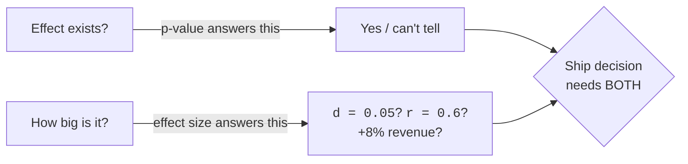
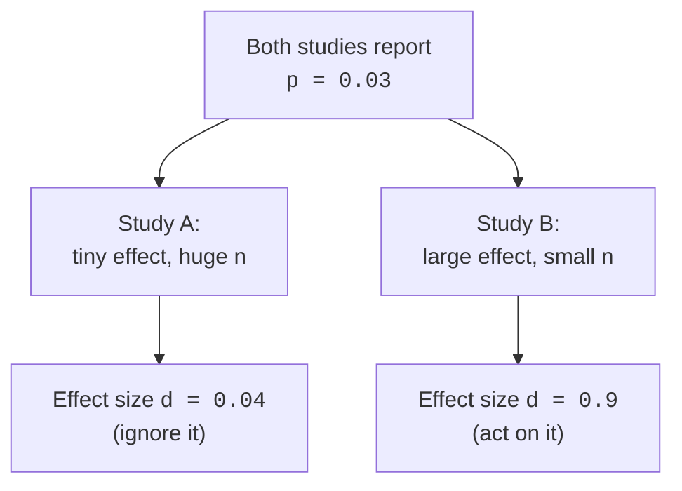
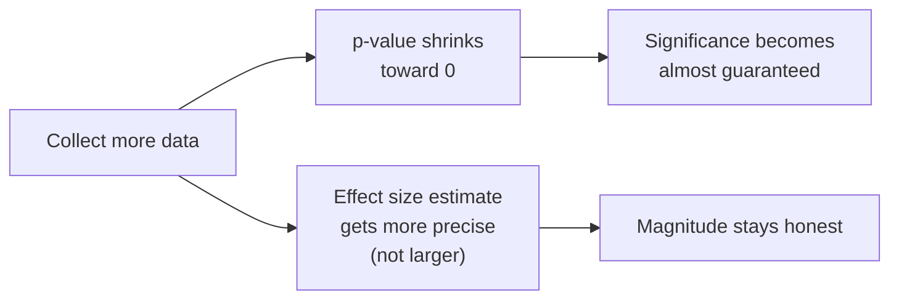

You ran the test, the p-value came back `0.001`, and the dashboard lit
up green. The new onboarding flow is "statistically significant." Time
to ship — right?

Not so fast. A p-value answers exactly one question: *is there an
effect at all?* It says nothing about the question your boss actually
cares about: *how **big** is the effect?* Those are different
questions, and conflating them is one of the most expensive mistakes in
applied data science. A medication can lower blood pressure by a
"highly significant" 0.2 mmHg — real, repeatable, and utterly useless.
A redesign can lift revenue by a thumping 8% with a p-value that only
squeaks under 0.05. Significance and importance are not the same axis.

**Effect size** is the missing axis. It's a number that says *how much*,
on a scale you can reason about, independent of how many rows you
collected. This page is about measuring magnitude — and about why, with
a big enough sample, *everything* becomes significant whether it matters
or not.

## The problem: significance is not importance

Here is the uncomfortable truth that motivates this entire page. The
p-value depends on **two** things tangled together: how big the effect
is, and how much data you have. Crank up the sample size and the
p-value shrinks toward zero *even if the underlying effect is
microscopic*. With ten million users, a difference of one-hundredth of
a percent in conversion will be "significant." Significance, past a
certain sample size, is almost guaranteed — so it stops carrying
information about whether you should care.

A decision needs both boxes. The p-value guards against fooling
yourself with noise; the effect size tells you whether the real thing
is worth acting on. Reporting one without the other is half an answer.

<Callout type="danger" title="The misconception that costs the most">
A small p-value does **not** mean a big or important effect. `p = 0.0001`
means "this is very unlikely to be pure chance," not "this is a large
effect." A trivial effect measured on a huge sample produces a tiny
p-value. Always ask *how big*, not just *is it real*.
</Callout>

### Same p-value, wildly different effects

Two studies can land on the *identical* p-value while describing effects
that are worlds apart in magnitude. The p-value alone cannot tell them
apart — only an effect size can.

The p-value is a function of *signal divided by noise divided by
sample-size-shrinkage*. Two completely different signals can produce the
same ratio. That's why mature analyses lead with the effect size and
treat the p-value as a footnote.

## Cohen's d: a standardized mean difference

The most common effect size for comparing two groups' means is
**Cohen's d**. The idea is simple and intuitive: take the difference in
means, but express it in units of the data's own spread.

`d = (x̄₁ − x̄₂) / s_pooled`

A `d` of 1 means the two group means sit one full standard deviation
apart. A `d` of 0.1 means they barely overlap-differ at all. Dividing by
the standard deviation is what makes `d` **unitless** and comparable
across contexts: a `d` of 0.5 means the same "amount of separation"
whether you're measuring dollars, milliseconds, or test scores.

<Callout type="info" title="Why divide by the standard deviation?">
A raw difference of "5" is meaningless on its own — 5 what, relative to
how much things naturally vary? If salaries range over tens of
thousands, a \\$5 gap is nothing; if they vary by \\$3, a \\$5 gap is
enormous. Cohen's d puts the difference on the ruler of the data's own
variability, so a single number captures *practical* separation.
</Callout>

Let's compute it from two groups in NumPy. The pooled standard deviation
combines both groups' spread.

<CodeBlock
  adapter="python"
  files={[
    {
      filename: "main.py",
      starterCode: `import numpy as np

rng = np.random.default_rng(7)

# Two groups: a control and a treatment with a genuine, moderate effect.
control = rng.normal(loc=100, scale=15, size=200)
treatment = rng.normal(loc=107, scale=15, size=200)

def cohens_d(a, b):
    na, nb = len(a), len(b)
    # Pooled standard deviation (uses ddof=1 sample variances).
    var_a = a.var(ddof=1)
    var_b = b.var(ddof=1)
    s_pooled = np.sqrt(((na - 1) * var_a + (nb - 1) * var_b) / (na + nb - 2))
    return (a.mean() - b.mean()) / s_pooled

d = cohens_d(treatment, control)

print(f"Control mean   : {control.mean():.2f}")
print(f"Treatment mean : {treatment.mean():.2f}")
print(f"Raw difference : {treatment.mean() - control.mean():+.2f}")
print(f"Cohen's d      : {d:.3f}")
print()
print("d ~ 0.5 means the groups are about half a standard deviation apart.")
`,
    },
  ]}
/>

### The small / medium / large guideposts (use with care)

Jacob Cohen offered rough rules of thumb so people would have *some*
anchor for interpreting `d`. They are conventions, not laws of nature.

| Cohen's d | Rough label | Overlap of the two distributions |
| --- | --- | --- |
| ~0.2 | small | the groups overlap a lot |
| ~0.5 | medium | a noticeable, visible separation |
| ~0.8 | large | the groups are clearly distinct |

<Callout type="warn" title="Context defines 'big', not a table">
These labels are starting points, not verdicts. In a domain where tiny
gains compound across millions of users (ad click-through, search
ranking), a `d` of 0.05 can be worth a fortune. In a medical trial, a
"small" `d` that reduces mortality is enormous. Never let a lookup table
override domain knowledge about what magnitude *matters here*.
</Callout>

## Demonstrating significance ≠ importance

Time to prove the central claim with code. We'll take a difference so
tiny it's practically nothing — and then collect a giant sample. Watch
the p-value collapse to "highly significant" while Cohen's d stays
negligible.

<CodeBlock
  adapter="python"
  files={[
    {
      filename: "main.py",
      starterCode: `import numpy as np
from scipy import stats

rng = np.random.default_rng(0)

# A laughably tiny true difference: 100.0 vs 100.1, with sd = 15.
# Nobody would ever care about a gap this small. But we collect a LOT.
n = 100_000
group_a = rng.normal(loc=100.0, scale=15, size=n)
group_b = rng.normal(loc=100.1, scale=15, size=n)

t, p = stats.ttest_ind(group_a, group_b)

# Cohen's d on the same data.
sa, sb = group_a.std(ddof=1), group_b.std(ddof=1)
s_pooled = np.sqrt(((n - 1) * sa**2 + (n - 1) * sb**2) / (2 * n - 2))
d = (group_b.mean() - group_a.mean()) / s_pooled

print(f"Sample size per group : {n:,}")
print(f"Observed difference   : {group_b.mean() - group_a.mean():+.3f}")
print(f"p-value               : {p:.2e}  <- 'highly significant'!")
print(f"Cohen's d             : {d:.4f}  <- utterly negligible")
print()
print("The p-value screams 'real!'. The effect size whispers 'who cares?'")
print("Both are correct. Only one of them should drive a decision.")
`,
    },
  ]}
/>

The p-value is microscopic — the difference is "real" in the sense that
it isn't pure chance. But the effect size is near zero, so the finding
is real and *irrelevant at the same time*. That is the whole lesson of
this page in one code block. We first met this tension in *P-values* and
*Hypothesis Testing*; effect sizes are the cure.

<Callout type="tip" title="The flip side: tiny samples hide real effects">
The same tangle works in reverse. A genuinely large effect can come back
*non*-significant if your sample is small — there simply wasn't enough
data to rule out chance. That's a power problem (see *Errors and Power*).
The effect size, computed on the same small sample, will still report a
large magnitude. This is exactly why you report the effect size *and* a
confidence interval, not just the p-value.
</Callout>

## Effect size does NOT depend on sample size (the p-value does)

This is the property that makes effect sizes so valuable, and it's worth
stating plainly because it's a common misconception. As you collect more
data:

- The **p-value** marches toward 0 for any nonzero effect — it depends
  heavily on `n`.
- The **effect size** converges to the true magnitude — adding data
  makes it *more precise*, not bigger or smaller.

Let's verify it. We fix a true `d` of about 0.3 and watch what happens
to the p-value versus the estimated `d` as `n` grows.

<CodeBlock
  adapter="python"
  files={[
    {
      filename: "main.py",
      starterCode: `import numpy as np
from scipy import stats

rng = np.random.default_rng(123)

def cohens_d(a, b):
    na, nb = len(a), len(b)
    sp = np.sqrt(((na - 1) * a.var(ddof=1) + (nb - 1) * b.var(ddof=1)) / (na + nb - 2))
    return (b.mean() - a.mean()) / sp

# True effect is fixed: means 100 vs 103, sd = 10  ->  true d = 0.30.
print(f"{'n per group':>12} | {'p-value':>10} | {'estimated d':>11}")
print("-" * 40)
for n in [20, 100, 500, 5000, 50000]:
    a = rng.normal(100, 10, n)
    b = rng.normal(103, 10, n)
    _, p = stats.ttest_ind(a, b)
    print(f"{n:>12,} | {p:>10.1e} | {cohens_d(a, b):>11.3f}")

print()
print("p-value plummets as n grows; d hovers around the true 0.30.")
`,
    },
  ]}
/>

The p-value falls off a cliff while `d` stays pinned near 0.30. The
effect size is a property of the *world*; the p-value is a property of
the world *and your sample size*.

## Correlation r is itself an effect size

You already met the Pearson correlation `r` in *Correlation and
Nonparametric Tests*. It does double duty: it's both a descriptive
statistic and a perfectly good effect size for the *strength* of a
linear relationship. It's already standardized (it lives in `[-1, 1]`),
so no extra scaling is needed.

| \|r\| | Rough strength |
| --- | --- |
| ~0.1 | weak |
| ~0.3 | moderate |
| ~0.5+ | strong |

A handy companion is r², the **proportion of variance explained**:
an `r` of 0.3 means the relationship accounts for only `0.09` — about 9%
— of the variation. That reframing often deflates an impressive-sounding
correlation.

<CodeBlock
  adapter="python"
  files={[
    {
      filename: "main.py",
      starterCode: `import numpy as np
from scipy import stats

rng = np.random.default_rng(5)

# Simulate study hours vs exam score with a moderate real relationship.
hours = rng.uniform(0, 10, size=300)
score = 55 + 3.0 * hours + rng.normal(0, 12, size=300)

r, p = stats.pearsonr(hours, score)

print(f"Pearson r        : {r:.3f}   (the effect size)")
print(f"r-squared        : {r**2:.3f}   (variance explained)")
print(f"p-value          : {p:.2e}")
print()
print(f"The relationship explains about {100 * r**2:.0f}% of the variation in scores.")
print("r itself tells you the STRENGTH; the p-value only tells you it's not zero.")
`,
    },
  ]}
/>

<Callout type="info" title="r as a bridge between worlds">
Because `r` is a standardized effect size, it's the natural way to
report "how strongly are X and Y related?" without dragging in the units
of X or Y. The p-value next to it only answers "is the correlation
distinguishable from zero?" — once again, existence versus magnitude.
</Callout>

## Effect sizes for proportions: risk difference and relative risk

When your outcome is a yes/no event — converted or not, churned or not,
recovered or not — the natural effect sizes compare two proportions.
There are two complementary ways to do it, and they tell genuinely
different stories.

- **Risk difference** (absolute): `p_treat − p_control`. "The
  conversion rate went up by 2 percentage points."
- **Relative risk / risk ratio** (relative): `p_treat / p_control`.
  "The conversion rate was 1.4× higher."

<CodeBlock
  adapter="python"
  files={[
    {
      filename: "main.py",
      starterCode: `import numpy as np

# A/B test on a checkout button. Counts of conversions out of visitors.
conv_control, n_control = 90, 3000  # control arm
conv_treatment, n_treatment = 126, 3000  # new button

p_control = conv_control / n_control
p_treatment = conv_treatment / n_treatment

risk_difference = p_treatment - p_control  # absolute
relative_risk = p_treatment / p_control  # ratio
relative_uplift = (p_treatment - p_control) / p_control

print(f"Control conversion   : {p_control:.4f}  ({p_control * 100:.2f}%)")
print(f"Treatment conversion : {p_treatment:.4f}  ({p_treatment * 100:.2f}%)")
print()
print(
    f"Risk difference      : {risk_difference:+.4f}  ({risk_difference * 100:+.2f} pp)"
)
print(f"Relative risk (ratio): {relative_risk:.3f}x")
print(f"Relative uplift      : {relative_uplift * 100:+.1f}%")
`,
    },
  ]}
/>

<Callout type="warn" title="Relative numbers can mislead">
"40% more likely!" sounds huge, but if the baseline is 0.001%, the
*absolute* gain is 0.0004% — practically nothing. Headlines love
relative risk because it sounds dramatic; honest analysis reports
**both** the absolute risk difference and the relative risk so the
reader can judge magnitude in context.
</Callout>

## Always pair an effect size with a confidence interval

An effect size is still a single number estimated from a noisy sample —
so it has its own uncertainty. Reporting `d = 0.42` alone repeats the
exact sin of reporting a bare point estimate that *Confidence Intervals*
warned against. The grown-up move is to report the effect size **with a
confidence interval** around it: `d = 0.42, 95% CI [0.20, 0.64]`.

That interval does triple duty:

- It shows the **precision** of the magnitude (narrow = pinned down).
- If it **excludes 0**, you have significance *and* a sense of size, in
  one object.
- If it **straddles 0** or includes both trivial and large values, it
  honestly signals "we don't yet know how big this is."

<CodeBlock
  adapter="python"
  files={[
    {
      filename: "main.py",
      starterCode: `import numpy as np
from scipy import stats

rng = np.random.default_rng(11)

control = rng.normal(100, 15, size=120)
treatment = rng.normal(106, 15, size=120)

def cohens_d(a, b):
    na, nb = len(a), len(b)
    sp = np.sqrt(((na - 1) * a.var(ddof=1) + (nb - 1) * b.var(ddof=1)) / (na + nb - 2))
    return (b.mean() - a.mean()) / sp

d = cohens_d(control, treatment)

# A quick bootstrap CI for Cohen's d: resample both groups many times.
boot = []
for _ in range(2000):
    a = rng.choice(control, size=len(control), replace=True)
    b = rng.choice(treatment, size=len(treatment), replace=True)
    boot.append(cohens_d(a, b))
lo, hi = np.percentile(boot, [2.5, 97.5])

print(f"Cohen's d        : {d:.3f}")
print(f"95% bootstrap CI : [{lo:.3f}, {hi:.3f}]")
print()
if lo > 0:
    print("The CI excludes 0: there's a real effect AND we know roughly how big.")
else:
    print("The CI includes 0: we can't even be sure of the direction.")
`,
    },
  ]}
/>

<Callout type="success" title="The reporting standard to adopt">
Never report a p-value by itself. Report the **effect size** (how big),
its **confidence interval** (how precise), and the p-value (is it
distinguishable from no effect) together. That trio answers every
question a decision-maker actually has. You'll use exactly this trio when
we run a full experiment in *A/B Testing*.
</Callout>

## Practice

<ChallengeCard
  adapter="python"
  title="Compute Cohen's d for two samples"
  instructions={`Two NumPy arrays, \`before\` and \`after\`, have been created for you (independent groups, not paired).

Compute **Cohen's d** for the difference \`after - before\` and store it as a float in a variable named \`d\`.

Use the **pooled standard deviation** with sample variances (\`ddof=1\`):

- \`s_pooled = sqrt( ((na-1)*var_before + (nb-1)*var_after) / (na+nb-2) )\`
- \`d = (mean_after - mean_before) / s_pooled\`

\`d\` must be a Python \`float\` and, for this data, positive.`}
  files={[
    {
      filename: "main.py",
      initCode: `import numpy as np
rng = np.random.default_rng(99)
before = rng.normal(50, 8, size=150)
after  = rng.normal(55, 8, size=150)`,
      starterCode: `import numpy as np

# TODO: compute Cohen's d (after - before) into a float called d
d = None
`,
      solutionCode: `import numpy as np

na, nb = len(before), len(after)
s_pooled = np.sqrt(
    ((na - 1) * before.var(ddof=1) + (nb - 1) * after.var(ddof=1)) / (na + nb - 2)
)
d = float((after.mean() - before.mean()) / s_pooled)
print(d)
`,
    },
  ]}
  tests={[
    {
      id: "type",
      name: "d is a float",
      description: "Returns a numeric value",
      code: `assert isinstance(d, float)`,
    },
    {
      id: "sign",
      name: "d is positive",
      description: "after > before, so d should be > 0",
      code: `assert d > 0`,
    },
    {
      id: "value",
      name: "d matches the pooled-sd formula",
      description: "Matches a direct computation",
      code: `import numpy as np
na, nb = len(before), len(after)
sp = np.sqrt(((na-1)*before.var(ddof=1) + (nb-1)*after.var(ddof=1)) / (na+nb-2))
expected = (after.mean() - before.mean()) / sp
assert abs(d - expected) < 1e-9`,
    },
    {
      id: "magnitude",
      name: "d is in a sensible range",
      description: "Around half a standard deviation",
      code: `assert 0.3 < d < 0.9`,
    },
  ]}
/>

<ChallengeCard
  adapter="python"
  title="Significant yet negligible"
  instructions={`Two arrays, \`a\` and \`b\`, have been created from almost-identical processes but with a **very large sample size**.

Demonstrate the gap between significance and importance by computing **both**:

- \`p\`: the p-value from \`scipy.stats.ttest_ind(a, b)\` — store it as a float.
- \`d\`: Cohen's d for \`b - a\` (pooled sd, \`ddof=1\`) — store it as a float.

For this data, \`p\` should be **below 0.05** (significant) while \`abs(d)\` should be **below 0.1** (negligible). Your job is to show both can be true at once.`}
  files={[
    {
      filename: "main.py",
      initCode: `import numpy as np
rng = np.random.default_rng(2024)
n = 80_000
a = rng.normal(100.00, 15, size=n)
b = rng.normal(100.12, 15, size=n)`,
      starterCode: `import numpy as np
from scipy import stats

# TODO: compute p (from ttest_ind) and d (Cohen's d for b - a)
p = None
d = None
`,
      solutionCode: `import numpy as np
from scipy import stats

_, p = stats.ttest_ind(a, b)
p = float(p)

na, nb = len(a), len(b)
sp = np.sqrt(((na - 1) * a.var(ddof=1) + (nb - 1) * b.var(ddof=1)) / (na + nb - 2))
d = float((b.mean() - a.mean()) / sp)

print(f"p = {p:.2e},  d = {d:.4f}")
`,
    },
  ]}
  tests={[
    {
      id: "types",
      name: "p and d are floats",
      description: "Both are numeric",
      code: `assert isinstance(p, float) and isinstance(d, float)`,
    },
    {
      id: "significant",
      name: "p is significant",
      description: "p < 0.05",
      code: `assert p < 0.05`,
    },
    {
      id: "negligible",
      name: "d is negligible",
      description: "abs(d) < 0.1",
      code: `assert abs(d) < 0.1`,
    },
    {
      id: "lesson",
      name: "significant AND negligible together",
      description: "Demonstrates the core point",
      code: `assert p < 0.05 and abs(d) < 0.1`,
    },
  ]}
/>

## Check your understanding

<MultipleChoice
  markdown={`A study with 2 million users finds that a new font color increases time-on-page by 0.3 seconds, with a p-value of 0.000001. What is the most reasonable conclusion?

- The effect is large and important because the p-value is extremely small
  > A tiny p-value reflects strong evidence the effect is nonzero, plus a very large sample — it says nothing about magnitude. 0.3 seconds may be trivial.
- [o] The effect is almost certainly real but probably too small to matter; you should check the effect size before acting
  > A huge sample makes even microscopic effects significant, so the next question is how big 0.3 seconds is relative to what matters for the business.
- The result is invalid because the p-value is suspiciously small
  > Extremely small p-values are exactly what you expect from a large sample combined with a genuine (if tiny) effect; there is nothing invalid about it.
- There is no effect because 0.3 seconds is small
  > The data does show an effect; it is just small. "Small" is not the same as "zero" — the right move is to weigh whether small is worth acting on.

The lesson: significance confirms existence; effect size judges importance.`}
/>

<MultipleChoice
  markdown={`You compute Cohen's d on a sample of 30 and again on a sample of 30,000 drawn from the **same** population. How do you expect the two estimates of d to compare?

- The d from the larger sample will be substantially bigger
  > Effect size measures magnitude in the population; collecting more data does not inflate it. More data sharpens the estimate, it does not enlarge the effect.
- The d from the larger sample will be substantially smaller
  > Larger samples do not shrink the effect either; the true magnitude is a property of the population, not of how much you sampled.
- [o] Both should be near the same true value, but the larger sample's estimate will be more precise
  > Effect size, unlike the p-value, does not systematically move with sample size; the extra data mainly tightens the confidence interval around the same magnitude.
- They are unrelated because d depends entirely on sample size
  > That describes the p-value, not the effect size. Cohen's d is standardized precisely so it does not depend on n the way significance does.

This independence from n is what makes effect sizes worth reporting.`}
/>

<MultipleChoice
  markdown={`A press release says a supplement makes an adverse event "50% more likely." Which question most directly checks whether this matters?

- What was the p-value of the comparison?
  > The p-value addresses whether the increase is distinguishable from chance, not whether a 50% relative increase is practically large.
- [o] What is the absolute risk difference — 50% more likely than what baseline rate?
  > A relative increase is meaningless without the baseline: 50% more than 0.001% is negligible in absolute terms, while 50% more than 10% is substantial.
- How large was the sample?
  > Sample size affects precision and significance, but the practical importance hinges on the absolute change, not on n.
- What is the correlation coefficient?
  > Correlation is for the strength of a linear relationship between continuous variables, not the right tool for comparing two event rates.

Always pair relative risk with the absolute risk difference.`}
/>

<MultipleChoice
  markdown={`A correlation of r = 0.2 between ad spend and sales is reported as a "meaningful relationship." Roughly how much of the variation in sales does it explain?

- About 20%
  > That confuses r with the variance explained. The strength on the variance scale is r-squared, not r itself.
- [o] About 4%
  > The proportion of variance explained is r-squared = 0.2 squared = 0.04, so only about 4% of the variation is accounted for.
- About 40%
  > That would correspond to r near 0.63 (since 0.63 squared is about 0.40), far stronger than the reported r of 0.2.
- About 80%
  > Explaining 80% of variance would require r near 0.9; an r of 0.2 is a weak relationship.

Squaring r to get the variance explained is a quick reality check on impressive-sounding correlations.`}
/>

<MultipleChoice
  markdown={`Why is it good practice to report an effect size **with a confidence interval** rather than the effect size alone?

- Because the confidence interval replaces the need for an effect size
  > The interval surrounds the effect size; it complements it rather than replacing it. You report both together.
- Because a confidence interval makes the p-value unnecessary to compute
  > While a CI that excludes zero conveys significance too, the point of pairing them is to convey precision of the magnitude, not to eliminate any single number.
- [o] Because the effect size is estimated from a noisy sample, and the interval shows how precisely the magnitude is pinned down
  > An effect size is a point estimate with its own uncertainty; the interval reveals whether the magnitude is tightly estimated or could plausibly range from trivial to large.
- Because confidence intervals are always narrower than effect sizes
  > A confidence interval and an effect size are not comparable widths; the interval is a range around the estimate, expressing its uncertainty.

A bare effect size repeats the mistake of reporting a point estimate with no measure of precision.`}
/>

<Callout type="success" title="Key takeaways">
- A **p-value answers "is there an effect?"**; an **effect size answers "how big?"** They are different axes.
- With a large enough sample, **trivial effects become significant** — so significance alone never justifies acting.
- **Cohen's d** standardizes a mean difference; **r** (and r²) measures relationship strength; **risk difference and relative risk** compare proportions. Report relative *and* absolute for rates.
- Unlike the p-value, an **effect size does not grow with sample size** — more data just makes it more precise.
- Always pair an effect size with a **confidence interval**. We put this whole toolkit to work in *A/B Testing*.
</Callout>
