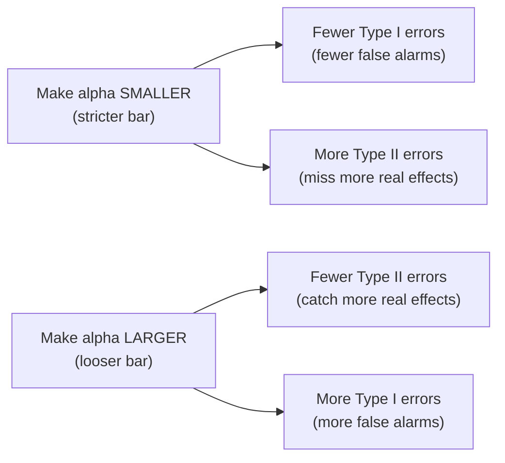
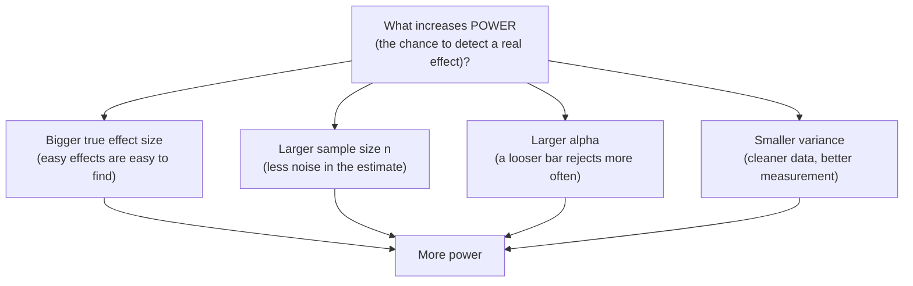
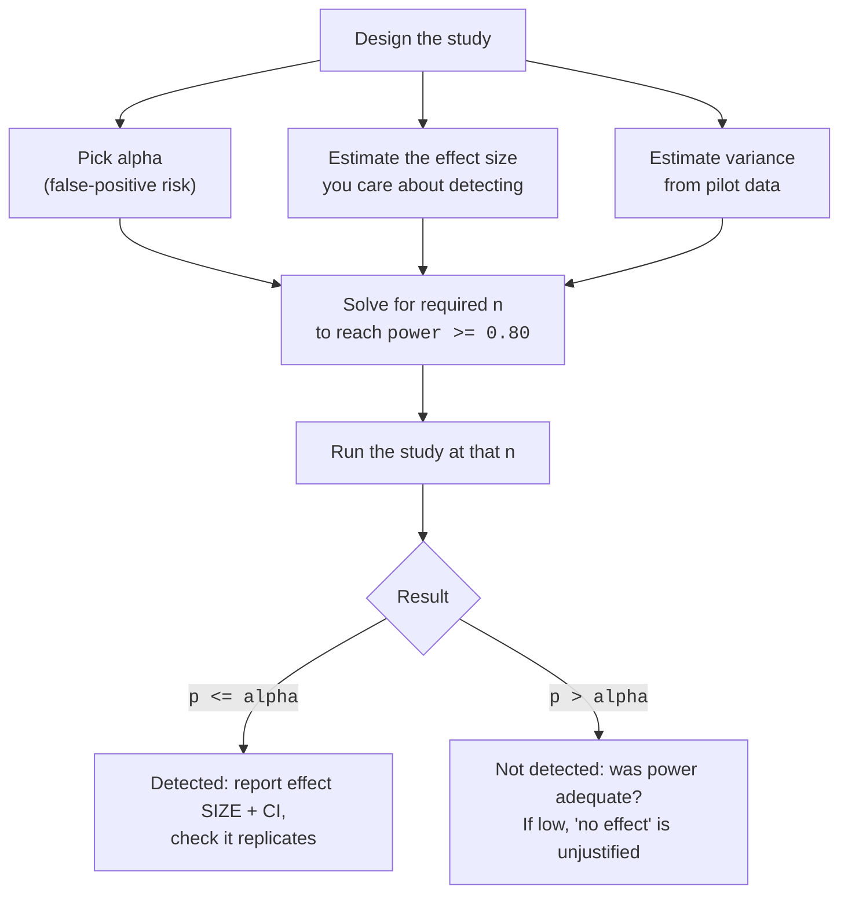

A hypothesis test makes a yes/no decision under uncertainty, so it can be
wrong in exactly two ways — and they are not symmetric. You can sound a
**false alarm** (declare an effect that isn't there) or you can **miss a
real effect** (fail to flag something that is). Understanding these two
errors, and the *power* to avoid the second one, separates analysts who
run trustworthy experiments from those who get lucky and don't know it.

This is also where the deepest misconceptions live. "We found no
significant difference, so the treatment doesn't work." "The p-value was
below 0.05, so who cares about power?" Both are dangerously wrong, and by
the end of this page you'll be able to simulate exactly why.

## The 2x2 decision matrix

Every test has an unknowable **truth** (H₀ is really true, or it's
really false) and a **decision** you make (reject H₀, or fail to
reject). Cross them and you get four outcomes — two right, two wrong.

| | **You fail to reject H₀** | **You reject H₀** |
| --- | --- | --- |
| **H₀ is true** | Correct (specificity) | **Type I error** — false positive, rate α |
| **H₀ is false** | **Type II error** — false negative, rate β | Correct detection — **power** = 1 − β |

Two definitions to memorize, because everything else builds on them:

- **Type I error** (α): rejecting a *true* null. A **false
  positive** — you "discovered" an effect that isn't real. Its rate is
  exactly the significance level α you chose.
- **Type II error** (β): failing to reject a *false* null. A **false
  negative** — there *was* a real effect and you missed it.
- **Power** = 1 − β: the probability of *correctly* rejecting a false
  null. The chance your test **catches a real effect** when one exists.

<Callout type="info" title="A mnemonic for which is which">
Type **I** comes first, and it's the error of being too eager — crying
wolf when there's no wolf (false positive). Type **II** is the error of
being too timid — missing the wolf that's really there (false negative).
The "boy who cried wolf" story has both: a Type I error early (false
alarm) and a fatal Type II error at the end (real wolf, ignored).
</Callout>

## The α/β tradeoff: you can't shrink both for free

Here's the tension. α is the bar for "convincing." Lower the bar
(smaller α) and you make fewer false alarms — but you also reject
*less often overall*, so you miss more real effects (β goes up).
Raise the bar and the reverse happens. With a fixed sample, **pushing one
error rate down pushes the other up.**

This is why the "right" α depends on which mistake is costlier. A
spam filter that flags a real email as spam (false positive) is annoying;
one that lets spam through (false negative) is mildly annoying — so you
might tolerate more false negatives. But a smoke detector should scream at
the faintest whiff: a false alarm is cheap, a missed fire is
catastrophic, so you accept many Type I errors to crush Type II.

<Callout type="tip" title="Choosing alpha is a values decision, not a math fact">
There is nothing sacred about 0.05. Pick α by asking: *in my
problem, how bad is a false positive compared to a false negative?* When
false alarms are expensive (a costly drug rollout), use a stricter
α. When missing a real effect is the disaster (early disease
screening), loosen α or — better — buy more power with a bigger
sample.
</Callout>

## The only way to shrink both: more data

The escape hatch from the tradeoff is **sample size**. With a fixed `n`
you trade α against β. But collect more data and you can lower
*both* — a bigger sample sharpens the test's ability to tell signal from
noise, so the same α buys you more power. Power has four levers.

Three of these you often can't control: the true effect size is whatever
nature made it, α is usually pinned by convention, and variance is
limited by how clean your measurement is. The one lever firmly in your
hands is **`n`**. That's why "how many samples do I need?" is the central
question of experiment design.

## Simulating power: just run the test many times and count

Power sounds abstract until you compute it, and the simulation recipe is
beautifully simple:

1. Build a world where a *real effect exists* (you set its size).
2. Draw a sample and run the test. Did it reject H₀? Yes or no.
3. Repeat thousands of times.
4. **Power = the fraction of repeats that rejected** — the rate at which
   your test catches the effect you planted.

<CodeBlock
  adapter="python"
  starterCode={`import numpy as np
from scipy import stats

rng = np.random.default_rng(0)

# A REAL effect: treatment mean is 0.5 higher than control (same spread).
true_effect = 0.5
n_per_group = 30
alpha = 0.05
n_experiments = 5000

rejections = 0
for _ in range(n_experiments):
    control = rng.normal(0.0, 1.0, n_per_group)
    treatment = rng.normal(true_effect, 1.0, n_per_group)
    p = stats.ttest_ind(control, treatment).pvalue
    if p <= alpha:
        rejections += 1

power = rejections / n_experiments
print(f"Effect = {true_effect}, n per group = {n_per_group}, alpha = {alpha}")
print(f"Estimated power = {power:.3f}")
print()
print(f"This test catches the real effect about {power * 100:.0f}% of the time.")
print(f"It MISSES it (Type II error) about {(1 - power) * 100:.0f}% of the time.")
`}
/>

With an effect of 0.5 and only 30 per group, power lands somewhere around
0.5 — meaning a *coin flip* whether you'd detect a real effect of that
size. Half the time you'd run this experiment, find nothing significant,
and (if you misread it) conclude the effect doesn't exist. It does; your
test just wasn't strong enough.

<Callout type="danger" title="The most dangerous misreading on this page">
**A non-significant result from an underpowered study does not mean "no
effect."** If power is 0.4, then even when the effect is unmistakably
real, you'll fail to reject H₀ 60% of the time. "We found no
significant difference" with low power is almost uninformative — the
effect could easily be there, undetected. Always ask "*what was my power?*"
before reading a null result as evidence of absence.
</Callout>

## Power rises with sample size and with effect size

Two of the four levers are the ones you reason about most. Let's watch
power climb as we increase `n`, and separately as we increase the true
effect. We'll draw both curves with Plotly.

<CodeBlock
  adapter="python"
  starterCode={`import numpy as np
import plotly.express as px
from scipy import stats

rng = np.random.default_rng(1)
alpha = 0.05

def estimate_power(effect, n, reps=2000):
    rej = 0
    for _ in range(reps):
        a = rng.normal(0.0, 1.0, n)
        b = rng.normal(effect, 1.0, n)
        if stats.ttest_ind(a, b).pvalue <= alpha:
            rej += 1
    return rej / reps

# Power vs sample size, for a fixed real effect of 0.5.
sizes = [10, 20, 40, 80, 160, 320]
power_by_n = [estimate_power(0.5, n) for n in sizes]

fig = px.line(
    x=sizes,
    y=power_by_n,
    markers=True,
    title="Power rises with sample size (true effect = 0.5)",
)
fig.add_hline(y=0.8, line_dash="dash", line_color="green")
fig.update_layout(
    xaxis_title="n per group", yaxis_title="estimated power", yaxis_range=[0, 1]
)
fig.show()

for n, p in zip(sizes, power_by_n):
    print(f"n = {n:>3} per group  ->  power ≈ {p:.2f}")
print()
print("The dashed line is the conventional 0.80 power target.")
`}
/>

The curve climbs toward 1.0 as `n` grows: more data, more power. The green
line marks **0.80**, the conventional minimum power people design for —
you want at least an 80% chance of catching a real effect before you bother
running the study. Now hold `n` fixed and grow the effect instead:

<CodeBlock
  adapter="python"
  starterCode={`import numpy as np
import plotly.express as px
from scipy import stats

rng = np.random.default_rng(2)
alpha = 0.05
n_per_group = 40

def estimate_power(effect, n, reps=2000):
    rej = 0
    for _ in range(reps):
        a = rng.normal(0.0, 1.0, n)
        b = rng.normal(effect, 1.0, n)
        if stats.ttest_ind(a, b).pvalue <= alpha:
            rej += 1
    return rej / reps

# Power vs effect size, for a fixed n = 40 per group.
effects = [0.0, 0.1, 0.2, 0.4, 0.6, 0.8, 1.0]
power_by_effect = [estimate_power(e, n_per_group) for e in effects]

fig = px.line(
    x=effects,
    y=power_by_effect,
    markers=True,
    title="Power rises with effect size (n = 40 per group)",
)
fig.add_hline(y=0.8, line_dash="dash", line_color="green")
fig.update_layout(
    xaxis_title="true effect size (difference in means)",
    yaxis_title="estimated power",
    yaxis_range=[0, 1],
)
fig.show()

for e, p in zip(effects, power_by_effect):
    print(f"effect = {e:.1f}  ->  power ≈ {p:.2f}")
print()
print("Notice the leftmost point: when effect = 0, H0 is TRUE,")
print("so the 'power' there is just the Type I error rate ≈ alpha = 0.05.")
`}
/>

The two punchlines: big effects are easy to detect (high power even at
modest `n`), tiny effects need either lots of data or they slip through.
And the leftmost point of the second chart is a gift — when the effect is
*zero*, H₀ is true, so "rejecting" is a Type I error. That point sits
near 0.05, which is exactly α. Let's verify that directly.

## The Type I error rate really is α

A well-behaved test, run when H₀ is *true*, should reject about
α of the time — no more, no less. Let's confirm by simulating a
world with **no effect at all** and counting false positives.

<CodeBlock
  adapter="python"
  starterCode={`import numpy as np
from scipy import stats

rng = np.random.default_rng(3)

# H0 is TRUE: both groups from the SAME distribution. Any rejection is a
# Type I error (a false positive).
n_per_group = 40
alpha = 0.05
n_experiments = 20_000

false_positives = 0
for _ in range(n_experiments):
    a = rng.normal(0.0, 1.0, n_per_group)
    b = rng.normal(0.0, 1.0, n_per_group)  # identical truth
    if stats.ttest_ind(a, b).pvalue <= alpha:
        false_positives += 1

type_I_rate = false_positives / n_experiments
print(f"Significance level alpha   : {alpha}")
print(f"Observed Type I error rate : {type_I_rate:.4f}")
print()
print("Even though there is NO real effect, the test wrongly rejects")
print(f"about {type_I_rate * 100:.1f}% of the time — by design. That IS alpha.")
print("This is the price you agree to pay every time you set alpha.")
`}
/>

The false-positive rate lands right around 0.05. That is the literal
meaning of α: *the rate at which you'll cry wolf when there's no
wolf.* It is **not** "the probability H₀ is true" — it's a property of
your decision rule, fixed in advance, that holds whenever H₀ happens to
be true.

<Callout type="danger" title="α is NOT the probability that H0 is true">
α = 0.05 means: *if H₀ is true, I will wrongly reject it 5% of
the time.* It is a long-run error rate of your procedure, not a statement
about any particular hypothesis. The probability that H₀ is true isn't
something a single test can give you at all — same trap as misreading the
p-value in *P-values*.
</Callout>

<MultipleChoice
  markdown={`In the simulation above, both groups were drawn from the *same* distribution, yet the test rejected $H_0$ about 5% of the time. What does that 5% represent?

- The power of the test
  > Power is the rejection rate when $H_0$ is *false*. Here $H_0$ is true, so these rejections are errors, not detections.
- [o] The Type I error rate, which equals the chosen $\alpha$
  > Rejecting a true null is a Type I error by definition, and a valid test produces them at the rate $\alpha$ you selected.
- The probability that $H_0$ is true
  > $\alpha$ is a long-run error rate conditional on $H_0$ being true; it is not the probability that $H_0$ is true.
- A sign the test is broken
  > Producing false positives at rate $\alpha$ is the test working exactly as designed, not a malfunction.

Setting $\alpha = 0.05$ is agreeing to a 5% false-positive rate whenever the null holds.`}
/>

## Why underpowered studies are doubly dangerous

You might think an underpowered study is merely *useless* — it often fails
to find real effects. It's worse than that. Underpowered studies don't
just miss effects; the "significant" results they *do* produce are
**inflated** — systematically too big. This is the **winner's curse** of
low power.

The logic: when power is low, a true effect only clears the significance
bar on the lucky runs where noise happened to *exaggerate* it. The
unlucky runs (where noise shrank the estimate) stay non-significant and get
filed away. So the published, significant estimates are a biased sample —
the overshoots. Let's see it.

<CodeBlock
  adapter="python"
  starterCode={`import numpy as np
from scipy import stats

rng = np.random.default_rng(4)

# A small, real effect studied with a SMALL sample (low power).
true_effect = 0.3
n_per_group = 15
alpha = 0.05
reps = 6000

all_estimates = []
significant_estimates = []
for _ in range(reps):
    a = rng.normal(0.0, 1.0, n_per_group)
    b = rng.normal(true_effect, 1.0, n_per_group)
    est = b.mean() - a.mean()
    all_estimates.append(est)
    if stats.ttest_ind(a, b).pvalue <= alpha:
        significant_estimates.append(est)

all_estimates = np.array(all_estimates)
significant_estimates = np.array(significant_estimates)

print(f"True effect                         : {true_effect}")
print(f"Average of ALL estimates            : {all_estimates.mean():.3f}  (unbiased)")
print(
    f"Average of only SIGNIFICANT estimates: {significant_estimates.mean():.3f}  (inflated!)"
)
print(f"Power (fraction significant)        : {len(significant_estimates) / reps:.2f}")
print()
print("If you only publish/believe the significant runs, the effect looks")
print("much bigger than 0.3. Low power exaggerates the effects it 'finds'.")
`}
/>

The average of *all* estimates sits near the true 0.3 — the test is
unbiased overall. But the average of just the *significant* ones is much
larger. In a world where only significant results get published or
believed, low-powered studies systematically overstate effects. This,
along with p-hacking from *P-values*, is a leading driver of the
**replication crisis** — splashy findings that shrink or vanish when
someone repeats them with adequate power.

<Callout type="warn" title="Power matters even when p < 0.05">
A tempting misconception: "I got significance, so power is irrelevant now."
Wrong. Power governs whether your significant result is *trustworthy* and
*replicable*. A p < 0.05 from a badly underpowered study is exactly the
kind of result that fails to replicate and whose effect size is inflated.
Power is not just about avoiding false negatives — it's about whether your
positives can be believed.
</Callout>

## Challenge 1 — Estimate power by simulation

<ChallengeCard
  adapter="python"
  title="Estimate the power of a t-test"
  instructions={`A real effect exists: the treatment mean is \`effect\` higher than control, both with standard deviation 1. Estimate this test's **power** at \`n_per_group\` and \`alpha\` by simulation.

- Run \`n_experiments\` simulated studies. In each, draw \`control\` from \`normal(0, 1, n_per_group)\` and \`treatment\` from \`normal(effect, 1, n_per_group)\`, then a two-sample t-test.
- Count how often the test **rejects** $H_0$ (p-value \`<= alpha\`).
- Store the rejection **rate** (rejections / n_experiments) as a float called **\`power\`**.

Use the provided \`rng\` for all randomness. Power is just the fraction of experiments that reach significance when the effect is real.`}
  initCode={`import numpy as np
from scipy import stats

rng = np.random.default_rng(2024)
effect = 0.6
n_per_group = 40
alpha = 0.05
n_experiments = 3000`}
  starterCode={`# TODO: simulate n_experiments t-tests and set power = fraction that reject H0
power = None
`}
  solutionCode={`rejections = 0
for _ in range(n_experiments):
    control = rng.normal(0.0, 1.0, n_per_group)
    treatment = rng.normal(effect, 1.0, n_per_group)
    if stats.ttest_ind(control, treatment).pvalue <= alpha:
        rejections += 1
power = float(rejections / n_experiments)
print(power)
`}
  tests={[
    {
      id: "type",
      name: "power is a float",
      description: "Returns a numeric rate",
      code: `assert isinstance(power, float)`,
    },
    {
      id: "range",
      name: "power is a valid probability",
      description: "Between 0 and 1",
      code: `assert 0.0 <= power <= 1.0`,
    },
    {
      id: "ballpark",
      name: "power is in the right ballpark",
      description: "Effect 0.6 at n=40 gives high power (~0.85)",
      code: `assert 0.7 <= power <= 0.97`,
    },
    {
      id: "above_alpha",
      name: "power for a real effect exceeds alpha",
      description: "Detecting a real effect beats the false-positive rate",
      code: `assert power > alpha`,
    },
  ]}
/>

## Challenge 2 — Confirm the Type I error rate

<ChallengeCard
  adapter="python"
  title="Show the false-positive rate equals alpha"
  instructions={`Now there is **no real effect** at all — both groups come from \`normal(0, 1, n_per_group)\`. Any rejection is a Type I error. Estimate that error rate.

- Run \`n_experiments\` simulated studies where **both** groups are drawn from \`normal(0, 1, n_per_group)\`.
- Count how often the two-sample t-test rejects $H_0$ (p-value \`<= alpha\`).
- Store the rejection **rate** as a float called **\`type_I_rate\`**.

Because $H_0$ is true here, this rate should come out close to \`alpha\` (0.05).`}
  initCode={`import numpy as np
from scipy import stats

rng = np.random.default_rng(2025)
n_per_group = 50
alpha = 0.05
n_experiments = 8000`}
  starterCode={`# TODO: simulate under H0 (no effect) and set type_I_rate = fraction that reject
type_I_rate = None
`}
  solutionCode={`false_positives = 0
for _ in range(n_experiments):
    a = rng.normal(0.0, 1.0, n_per_group)
    b = rng.normal(0.0, 1.0, n_per_group)
    if stats.ttest_ind(a, b).pvalue <= alpha:
        false_positives += 1
type_I_rate = float(false_positives / n_experiments)
print(type_I_rate)
`}
  tests={[
    {
      id: "type",
      name: "type_I_rate is a float",
      description: "Returns a numeric rate",
      code: `assert isinstance(type_I_rate, float)`,
    },
    {
      id: "range",
      name: "type_I_rate is a valid probability",
      description: "Between 0 and 1",
      code: `assert 0.0 <= type_I_rate <= 1.0`,
    },
    {
      id: "near_alpha",
      name: "type_I_rate is close to alpha",
      description: "Under H0 the false-positive rate ≈ 0.05",
      code: `assert abs(type_I_rate - alpha) < 0.015`,
    },
  ]}
/>

## Putting it together: the full picture

Notice that **power analysis happens before you collect data**, not after.
You decide the smallest effect worth detecting, then compute the `n` that
gives you an 80% (or higher) chance of catching it. Running first and
asking about power later is how underpowered studies happen.

## Check your understanding

<MultipleChoice
  markdown={`A new drug truly works, but a small trial fails to reach significance and concludes "no effect." Which error was made, and what is its rate called?

- A Type I error, with rate $\alpha$
  > A Type I error is rejecting a *true* null — a false positive. Here a *real* effect was missed, which is the opposite kind of error.
- [o] A Type II error, with rate $\beta$
  > Failing to reject a false null is a Type II error (a false negative), and its long-run rate is denoted $\beta$.
- A false positive, with rate $1 - \beta$
  > Missing a real effect is a false *negative*, not a false positive; and $1 - \beta$ is power, the rate of correctly detecting effects.
- No error — non-significant means there is no effect
  > A non-significant result does not establish absence of an effect, especially in a small (low-power) trial where real effects are often missed.

Missing a real effect is a Type II error, made more likely by low power.`}
/>

<MultipleChoice
  markdown={`Statistical power is best defined as:

- The probability of making a Type I error
  > The probability of a Type I error is $\alpha$, a false-positive rate. Power concerns correctly detecting real effects, not false alarms.
- The probability that $H_0$ is false
  > Whether $H_0$ is false is a fact about the world, not a probability the test outputs; power is about detecting that falsity when it holds.
- [o] The probability of correctly rejecting $H_0$ when $H_0$ is actually false (that is, $1 - \beta$)
  > Power is the chance the test catches a real effect, equal to one minus the Type II error rate $\beta$.
- 1 minus the p-value
  > The p-value is a single study's tail-area result; power is a design property averaged over many hypothetical studies, unrelated to $1 -$ p.

Power = the chance you catch a real effect when there is one.`}
/>

<MultipleChoice
  markdown={`Which change will **decrease** the power of a two-sample t-test, all else equal?

- Increasing the sample size
  > A larger sample reduces noise in the estimate and *raises* power, the opposite of what is asked.
- Studying a larger true effect
  > Bigger effects are easier to detect, so power goes *up*, not down.
- [o] Reducing $\alpha$ from 0.05 to 0.01
  > A stricter threshold makes the test reject less often overall, which lowers the chance of rejecting even when the null is false — reducing power.
- Reducing the variability (noise) in the measurements
  > Cleaner, less variable data sharpens the test and *increases* power.

A stricter $\alpha$ buys fewer false positives at the cost of power; the other levers raise power.`}
/>

<MultipleChoice
  markdown={`Why is reporting power especially important after a **non-significant** result?

- Because a non-significant result is always wrong
  > Non-significant results are not inherently wrong; the point is that their meaning depends on how much power the study had.
- [o] Because with low power, a real effect is frequently missed, so "not significant" may mean "undetected" rather than "absent"
  > When power is low, even a genuine effect fails to reach significance much of the time, so a null result cannot be read as evidence of no effect.
- Because power changes the p-value after the fact
  > Power does not retroactively alter the p-value you obtained; it informs how to *interpret* a non-significant outcome.
- Because high power guarantees the null is true
  > High power makes a null result more informative about absence, but nothing guarantees the null is true; power is about detection, not proof.

Absence of evidence is only evidence of absence when power was high enough to detect the effect.`}
/>

<MultipleChoice
  markdown={`A team brags that they got p < 0.05 from a tiny pilot study, and says power "doesn't matter now that it's significant." What is the flaw?

- They are right; once significant, power is irrelevant
  > Significance does not make power irrelevant; underpowered significant results are exactly the ones prone to being unreliable.
- [o] Low power makes a significant result less trustworthy and inflates the apparent effect size, so it often fails to replicate
  > In low-power studies, an effect clears the bar mainly on runs where noise exaggerated it, so the reported effect is biased upward and replication is shaky.
- Power only matters for Bayesian analyses
  > Power is a property of frequentist hypothesis tests and is directly relevant here; it is not confined to any one school of analysis.
- A significant p-value from a small sample is impossible
  > Small samples can and do produce significant p-values; the problem is the reliability of those results, not their possibility.

The "winner's curse": underpowered significant findings overstate effects and replicate poorly.`}
/>

<MultipleChoice
  markdown={`You want at least an 80% chance of detecting a difference in conversion of 1 percentage point, if it exists. What should you do **before** launching the A/B test?

- Launch immediately and check power afterward if the result is null
  > Computing power after the fact does not fix an undersized study; the sample size must be planned in advance to guarantee adequate power.
- [o] Run a power analysis to find the sample size that yields power >= 0.80 for that effect size, then collect that much data
  > Choosing the smallest effect worth detecting and solving for the required $n$ ensures the experiment can actually catch the effect at the desired power.
- Pick whatever sample size is convenient; power takes care of itself
  > Power does not take care of itself; too small an $n$ leaves the study likely to miss a real one-point difference.
- Lower $\alpha$ to 0.001 to be safe
  > Tightening $\alpha$ reduces false positives but *lowers* power, making it harder to detect the effect you care about — the opposite of the goal.

Power analysis turns "how many samples do I need?" into a number you compute before collecting data.`}
/>

## Key takeaways

<Callout type="success" title="What to carry forward">
- A test can err two ways: **Type I** (false positive, reject a true
  H₀, rate α) and **Type II** (false negative, miss a real
  effect, rate β).
- **Power = 1 − β** is the chance of detecting a real effect. Design
  for at least **0.80**.
- With a fixed sample, α and β **trade off**; the way to
  shrink both is a **larger `n`**. Power grows with **effect size**,
  **`n`**, **larger α**, and **smaller variance**.
- α is a false-positive *rate*, **not** the probability H₀ is
  true. Power still matters when `p < 0.05` — it governs trust and
  replication.
- A non-significant result from a **low-power** study means *undetected*,
  not *absent*; and low power **inflates** the effects it does detect (the
  winner's curse), feeding the replication crisis.
- Plan **power before** collecting data; interpret results with *P-values*,
  *Effect Sizes*, and the sampling logic from *Sampling Distributions*.
</Callout>
