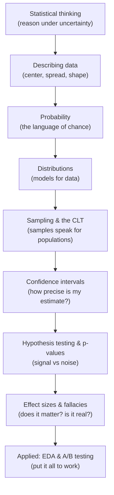
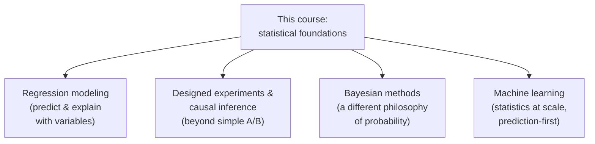

You made it. Take a moment, because you've covered a lot of ground —
and more importantly, you've built a *way of thinking* that most people
who work with data never quite acquire. This closing page looks back at
the path, names what you can now do, and points honestly toward what
comes next without pretending to teach it here.

## The journey you just took

Every page built on the last. Step back and the shape is clear: you went
from *describing* data, to *modeling* uncertainty, to *making
inferences*, to *applying* it all.

The conceptual heart was the middle: **sampling distributions**, the
**central limit theorem**, **confidence intervals**, and **p-values**. If
those four clicked, everything before them was setup and everything after
was application. The throughline never changed — the question from the
very first page, *"I observed something in a noisy, partial sample; how
much of it is real, and how sure can I be?"*, is the question you can now
answer with discipline.

<Callout type="success" title="What changed in how you think">
You no longer see a number as a fact. You see it as an *estimate* — one
draw from a noisy process, carrying uncertainty you can quantify. That
single shift, from "the data says X" to "the data *suggests* X, this
precisely," is the whole point of the course, and it's the habit that
separates careful analysts from confident-but-wrong ones.
</Callout>

## What you can now do

Concretely, you can now:

- **Reason about uncertainty, variation, and randomness** instead of
  treating every number as exact — and recognize when a difference is
  just noise.
- **Choose and interpret summary statistics**, knowing when a mean lies
  and when the median or spread tells the truer story.
- **Use probability and distributions** — normal, binomial, and friends —
  to model how data behaves and how often "rare" things happen.
- **Understand sampling and the CLT**: why a sample of a thousand can
  speak for millions, and how sampling goes wrong through bias.
- **Build and read confidence intervals** (and bootstrap them), reporting
  estimates with honest precision instead of bare points.
- **Run hypothesis tests correctly** with `scipy.stats` — t-tests, ANOVA,
  chi-square, correlation — and explain what a p-value actually is, and
  the things it is not.
- **Distinguish statistical from practical significance** using effect
  sizes, always paired with a confidence interval.
- **Spot the classic fallacies** — Simpson's paradox, confounding,
  p-hacking, base-rate neglect, survivorship bias, regression to the mean —
  before they wreck an analysis.
- **Run a credible A/B test** and a disciplined exploratory analysis,
  keeping exploration and confirmation firmly apart.

That's a genuinely professional toolkit. Most of the value a senior data
scientist adds over a dashboard lives in exactly these skills.

## Where to go next (honestly)

This course deliberately stopped at the foundations. Here's an honest map
of the bigger landscape — what each area is, and why it's a natural next
step — *without* trying to teach it in a paragraph.

**Regression modeling.** The natural next step. Instead of comparing two
groups, you model an outcome as a function of many variables at once —
linear regression, logistic regression, and beyond. Everything you
learned about estimates, uncertainty, confidence intervals, and effect
sizes transfers directly; a regression coefficient *is* an effect size
with a confidence interval and a p-value.

**Designed experiments and causal inference.** A/B testing was your first
designed experiment. The field goes much deeper: multi-arm and factorial
designs, stratification and blocking, and — crucially — methods for
estimating causal effects when you *can't* randomize (observational
causal inference, instrumental variables, difference-in-differences).
This is where "correlation is not causation" gets a rigorous answer.

**Bayesian methods.** A genuinely different *philosophy* of probability.
Where the testing you learned (the "frequentist" view) treats parameters
as fixed and asks how surprising your data is, the Bayesian view treats
your *belief* about a parameter as a probability distribution that you
update with data. It's not better or worse — it's a different lens, and
it answers some questions (like "what's the probability the effect is
positive?") more directly. Worth meeting once you're solid on the
foundations here.

**Machine learning.** ML is, to a large degree, statistics scaled up and
pointed at prediction. Train/test splits are sampling. Overfitting is
the garden of forking paths. Regularization is a bias-variance trade-off.
Cross-validation is resampling. Almost every ML idea has a statistical
ancestor you now recognize — which is exactly why this foundation makes
you a better ML practitioner, not just a button-pusher.

<Callout type="info" title="You're well-positioned for all of these">
None of these next steps starts from zero for you. Estimation,
uncertainty, distributions, and the discipline of separating signal from
noise are the shared bedrock under all of them. You built the bedrock.
The rest is construction on top of it.
</Callout>

If you want to keep sharpening the *tools* rather than the theory, the
sibling Dataslope courses are natural companions: the **Pandas** course
for heavier data wrangling, the **Plotly visualization** course for
communicating findings, and the **Scientific Computing** course for the
NumPy/SciPy machinery underneath it all. Statistics gives you the
questions; those give you sharper instruments to answer them.

## The habits worth keeping

Courses fade; habits last. If you forget every formula, keep these five
reflexes — they're the durable core of statistical thinking.

1. **Quantify uncertainty.** Never report a bare point estimate. Attach a
   confidence interval, a standard error, a range — something that says
   how sure you are. A number without its uncertainty is half a fact.
2. **Separate signal from noise.** Before believing a difference, ask
   "could this just be chance?" Two groups always differ a little; the
   question is whether they differ by *more than noise can explain*.
3. **Prefer effect sizes and CIs over p-values alone.** "Is it real?" is
   the easy question. "How big is it, and how precisely do we know?" is
   the one that drives good decisions.
4. **Beware the fallacies.** Keep Simpson's paradox, confounding,
   p-hacking, base rates, survivorship, and regression to the mean on a
   mental checklist. Most analytical disasters are one of these in
   disguise.
5. **Stay humble about what data can prove.** Description is certain;
   inference never is. Decide your hypothesis before you look, confirm
   surprises on fresh data, and remember that "not significant" means
   "we couldn't tell," not "there's nothing there."

<Callout type="tip" title="The one-sentence version">
Treat every number as an estimate from a noisy world, say how uncertain
it is, check whether it's big enough to matter, and stay suspicious of
patterns that are too convenient. That sentence is most of statistics.
</Callout>

## A reflection

<ChallengeCard
  adapter="python"
  title="Tie it together: the full reporting trio"
  instructions={`A capstone reflex check. Two independent groups, \`control\` and \`treatment\`, are provided.

Produce the three numbers you should *always* report together for a comparison, each as a float:

- \`diff\`: the difference in means, \`treatment.mean() - control.mean()\`.
- \`p_value\`: from \`scipy.stats.ttest_ind(control, treatment)\`.
- \`d\`: Cohen's d for the difference (pooled standard deviation, \`ddof=1\`).

This is the habit to carry forward: **effect size + uncertainty + significance**, never a p-value on its own.`}
  initCode={`import numpy as np
rng = np.random.default_rng(7)
control   = rng.normal(100, 15, size=200)
treatment = rng.normal(106, 15, size=200)`}
  initialCode={`import numpy as np
from scipy import stats

# TODO: compute diff, p_value, and d (all floats)
diff = None
p_value = None
d = None
`}
  solutionCode={`import numpy as np
from scipy import stats

diff = float(treatment.mean() - control.mean())
_, p = stats.ttest_ind(control, treatment)
p_value = float(p)

na, nb = len(control), len(treatment)
sp = np.sqrt(((na-1)*control.var(ddof=1) + (nb-1)*treatment.var(ddof=1)) / (na+nb-2))
d = float((treatment.mean() - control.mean()) / sp)

print(f"diff = {diff:+.2f}, p = {p_value:.4f}, d = {d:.3f}")
`}
  tests={[
    {
      id: "types",
      name: "all three are floats",
      description: "Returns numeric values",
      code: `assert all(isinstance(v, float) for v in (diff, p_value, d))`,
    },
    {
      id: "diff",
      name: "diff is the difference in means",
      description: "treatment minus control",
      code: `assert abs(diff - (treatment.mean() - control.mean())) < 1e-9`,
    },
    {
      id: "pvalue",
      name: "p_value matches the t-test",
      description: "Matches scipy ttest_ind",
      code: `from scipy import stats
_, exp = stats.ttest_ind(control, treatment)
assert abs(p_value - exp) < 1e-9`,
    },
    {
      id: "d",
      name: "d matches Cohen's d",
      description: "Pooled-sd standardized difference",
      code: `import numpy as np
na, nb = len(control), len(treatment)
sp = np.sqrt(((na-1)*control.var(ddof=1) + (nb-1)*treatment.var(ddof=1)) / (na+nb-2))
exp = (treatment.mean() - control.mean()) / sp
assert abs(d - exp) < 1e-9`,
    },
  ]}
/>

## Check your understanding

<MultipleChoice
  markdown={`Looking back, what was the single most important conceptual shift this course aimed for?

- Memorizing which scipy.stats function to call for each test
  > Knowing the functions is useful, but the course's aim was a way of thinking, not a lookup table; the functions serve the reasoning, not the other way around.
- [o] Seeing every number as an uncertain estimate from a noisy sample, and quantifying that uncertainty
  > The recurring theme from the first page to the last was crossing from "the data says X" to "the data suggests X, this precisely," which is the core of statistical reasoning.
- Learning to always reject the null hypothesis
  > Rejecting the null is neither a goal nor always appropriate; failing to reject is often the honest outcome, and the aim was sound reasoning, not a particular verdict.
- Proving results with mathematical derivations
  > The course was deliberately intuition-first and avoided proofs; the goal was reasoning under uncertainty, not formal derivation.

The durable takeaway is treating numbers as estimates with quantified uncertainty.`}
/>

<MultipleChoice
  markdown={`How does machine learning relate to the statistics you just learned?

- They are unrelated fields with nothing in common
  > They share deep foundations: sampling, overfitting, resampling, and the bias-variance trade-off are all statistical ideas at ML's core.
- Machine learning replaces statistics, making it obsolete
  > ML builds on statistical thinking rather than replacing it; concepts like train/test splits and cross-validation are statistics applied to prediction.
- [o] Machine learning is largely statistics scaled up and pointed at prediction, so this foundation directly strengthens it
  > Train/test splits are sampling, overfitting echoes the garden of forking paths, and regularization is a bias-variance trade-off — each has a statistical ancestor you now recognize.
- Machine learning only uses Bayesian methods, which weren't covered
  > ML draws on both frequentist and Bayesian ideas, and far more than Bayesian methods; the foundations here underpin much of it regardless of philosophy.

A solid statistics foundation makes you a more careful ML practitioner, not just a button-pusher.`}
/>

<MultipleChoice
  markdown={`Which habit best captures the discipline this course tried to instill?

- Always collect as much data as possible before doing anything
  > More data helps precision, but the central discipline is about *how you reason* with whatever data you have, not simply gathering more.
- Report a single best-guess number so stakeholders aren't confused by ranges
  > Hiding uncertainty behind a single number is the opposite of the lesson; reporting the range honestly is the habit to keep.
- [o] Quantify uncertainty, separate signal from noise, prefer effect sizes with CIs, and stay humble about what data can prove
  > These reflexes — uncertainty, signal-versus-noise, magnitude over mere significance, and humility about inference — are the durable core of statistical thinking.
- Reject the null whenever the p-value is below 0.05 and move on
  > Mechanically thresholding the p-value ignores effect size, confidence intervals, and the fallacies; the course argued strongly against exactly this reflex.

Habits outlast formulas — these four are the ones to carry into every analysis.`}
/>

<Callout type="success" title="One last word">
Statistics has a reputation as a tool for lying with numbers. You now
know the opposite is true: it's the toolkit for *not* lying — to others,
and especially to yourself. Every concept here was a disciplined habit
for staying honest about what a pile of noisy data can and cannot prove.
Carry that honesty into everything you build next. Go do good work.
</Callout>
