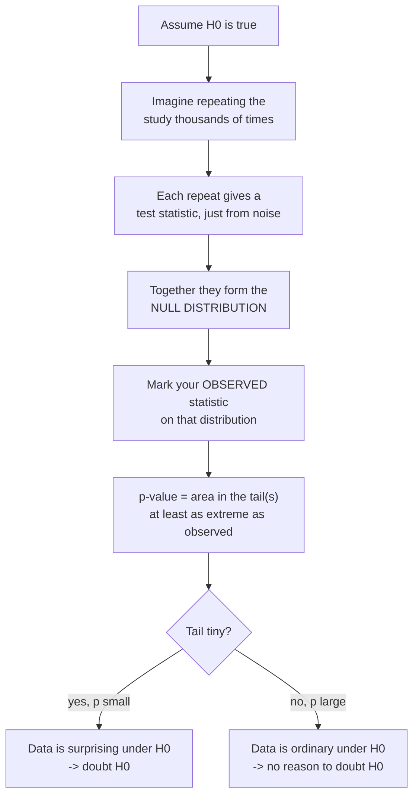
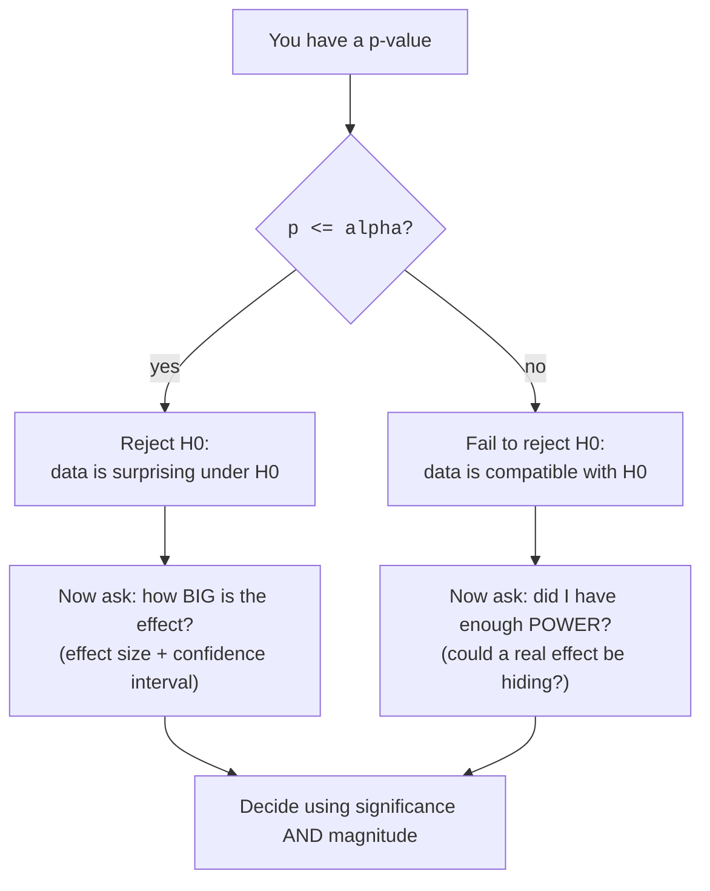

The p-value is the most quoted and most misunderstood number in all of
applied statistics. People treat it as "the probability the result is
real," "the probability we're wrong," or "the chance it was a fluke." All
of those are wrong, and believing them leads to bad decisions worth real
money and, in medicine, real lives.

This page does two things. First, it builds the p-value *from scratch*, by
simulation, so you can literally see what it measures — an area under a
curve. Second, it relentlessly clears away every classic misreading,
because knowing what a p-value is *not* is just as important as knowing
what it is.

<svg
  viewBox="0 0 640 220"
  role="img"
  aria-label="A bell-shaped pile of faint dots records every gap pure noise produced in a no-effect world; a red post marks the gap actually observed, and the few yellow dots at or beyond it are the p-value — the fraction of the boring world at least as extreme as you"
  style={{ display: "block", width: "100%", maxWidth: "640px", height: "auto", margin: "2.5rem auto" }}
>
  <rect x="90" y="184" width="440" height="4" rx="2" fill="currentColor" opacity="0.2" />
  <g fill="currentColor" opacity="0.3">
    <circle cx="130" cy="172" r="5.5" />
    <circle cx="162" cy="172" r="5.5" />
    <circle cx="162" cy="158" r="5.5" />
    <circle cx="194" cy="172" r="5.5" />
    <circle cx="194" cy="158" r="5.5" />
    <circle cx="194" cy="144" r="5.5" />
    <circle cx="226" cy="172" r="5.5" />
    <circle cx="226" cy="158" r="5.5" />
    <circle cx="226" cy="144" r="5.5" />
    <circle cx="226" cy="130" r="5.5" />
    <circle cx="226" cy="116" r="5.5" />
    <circle cx="258" cy="172" r="5.5" />
    <circle cx="258" cy="158" r="5.5" />
    <circle cx="258" cy="144" r="5.5" />
    <circle cx="258" cy="130" r="5.5" />
    <circle cx="258" cy="116" r="5.5" />
    <circle cx="258" cy="102" r="5.5" />
    <circle cx="258" cy="88" r="5.5" />
    <circle cx="290" cy="172" r="5.5" />
    <circle cx="290" cy="158" r="5.5" />
    <circle cx="290" cy="144" r="5.5" />
    <circle cx="290" cy="130" r="5.5" />
    <circle cx="290" cy="116" r="5.5" />
    <circle cx="290" cy="102" r="5.5" />
    <circle cx="290" cy="88" r="5.5" />
    <circle cx="290" cy="74" r="5.5" />
    <circle cx="322" cy="172" r="5.5" />
    <circle cx="322" cy="158" r="5.5" />
    <circle cx="322" cy="144" r="5.5" />
    <circle cx="322" cy="130" r="5.5" />
    <circle cx="322" cy="116" r="5.5" />
    <circle cx="322" cy="102" r="5.5" />
    <circle cx="322" cy="88" r="5.5" />
    <circle cx="322" cy="74" r="5.5" />
    <circle cx="354" cy="172" r="5.5" />
    <circle cx="354" cy="158" r="5.5" />
    <circle cx="354" cy="144" r="5.5" />
    <circle cx="354" cy="130" r="5.5" />
    <circle cx="354" cy="116" r="5.5" />
    <circle cx="354" cy="102" r="5.5" />
    <circle cx="386" cy="172" r="5.5" />
    <circle cx="386" cy="158" r="5.5" />
    <circle cx="386" cy="144" r="5.5" />
    <circle cx="386" cy="130" r="5.5" />
    <circle cx="418" cy="172" r="5.5" />
    <circle cx="418" cy="158" r="5.5" />
    <circle cx="418" cy="144" r="5.5" />
  </g>
  <g style={{ color: "var(--ds-yellow-500)" }} fill="currentColor" fillOpacity="0.9">
    <circle cx="450" cy="172" r="5.5" />
    <circle cx="450" cy="158" r="5.5" />
    <circle cx="482" cy="172" r="5.5" />
  </g>
  <g style={{ color: "var(--ds-red-500)" }} fill="currentColor">
    <rect x="434" y="78" width="4.5" height="106" rx="2.25" />
    <circle cx="436" cy="70" r="6" />
  </g>
</svg>

## The one-sentence definition

> A **p-value** is the probability of observing data **at least as
> extreme** as what you saw, **assuming the null hypothesis H₀ is
> true**.

Read it slowly. Three pieces carry all the meaning:

- **"assuming H₀ is true"** — the whole calculation lives in a
  hypothetical world where there is no effect. The p-value never asks
  whether that world is the real one.
- **"at least as extreme"** — not the probability of *your exact* result
  (which is usually near zero for continuous data), but the probability of
  your result *or anything more surprising*.
- **"data"** — summarized by a test statistic. We measure extremeness on
  that one number.

Everything else on this page is a consequence of, or a contrast with,
that sentence.

<Callout type="info" title="It's a conditional probability, and the condition matters">
In symbols, a p-value is `P(data this extreme or more | H₀)`.
The thing to the right of the bar — "given H₀" — is *assumed*, not
concluded. This is exactly why a p-value can never be the probability that
H₀ is true: you cannot end up with a probability *about* the thing you
*assumed* at the start.
</Callout>

## Build it yourself: the p-value as a tail area

Here is the idea that makes p-values click. Suppose H₀ is true. Then
there is a whole *distribution* of test-statistic values you might get,
just from random sampling — the **null distribution**. Your observed
statistic is one point on that distribution. The p-value is simply **how
much of the null distribution is at least as extreme as your point** — the
shaded tail.

Let's make that picture real. We'll simulate the null distribution for a
coin-flip example, then read the p-value straight off it. A friend claims
their coin is fair. You flip it 100 times and get 62 heads. Under H₀
("the coin is fair, `p = 0.5`"), how surprising is 62-or-more-extreme?

<CodeBlock
  adapter="python"
  files={[
    {
      filename: "main.py",
      starterCode: `import numpy as np

rng = np.random.default_rng(0)

observed_heads = 62
n_flips = 100

# Simulate the NULL world: a truly fair coin, flipped 100 times,
# repeated 100,000 times. This IS the null distribution of "heads".
sims = rng.binomial(n=n_flips, p=0.5, size=100_000)

# How far is observed from the null center (50)?
distance = abs(observed_heads - 50)  # = 12

# Two-sided p-value: as extreme as 62 means <=38 or >=62.
as_or_more_extreme = np.abs(sims - 50) >= distance
p_value = as_or_more_extreme.mean()

print(f"Null distribution mean : {sims.mean():.1f} heads (should be ~50)")
print(f"Observed               : {observed_heads} heads")
print(f"'At least as extreme'  : <= 38 or >= 62 heads")
print(f"Simulated p-value      : {p_value:.4f}")
print()
print("That p-value is literally the fraction of fair-coin runs that")
print("landed as far from 50 as your 62 did. It is an AREA, not a verdict.")
`,
    },
  ]}
/>

The p-value you get is the *proportion* of fair-coin simulations that were
as far from 50 as your real result. That's all it is: a tail area under
the null distribution. Nothing in that calculation knows or claims whether
the coin is *actually* fair — we *assumed* it was fair to draw the
distribution in the first place.

<Callout type="tip" title="Why 'two-sided' counts both tails here">
Because the claim was just "the coin is biased" (either way), a result of
38 heads would be exactly as surprising as 62 heads — both sit 12 away
from 50. So "at least as extreme" includes both tails. If the claim had
been specifically "biased toward heads," you'd count only the upper tail
and the p-value would be about half as large. This is the one-sided vs
two-sided choice from *Hypothesis Testing*, now visible as which tails you
shade.
</Callout>

### Does our hand-built p-value match the textbook one?

A simulated tail area should agree with what `scipy.stats` computes
analytically. Let's check against an exact binomial test.

<CodeBlock
  adapter="python"
  files={[
    {
      filename: "main.py",
      starterCode: `import numpy as np
from scipy import stats

rng = np.random.default_rng(0)

observed_heads = 62
n_flips = 100

# Our simulated tail-area p-value (two-sided).
sims = rng.binomial(n_flips, 0.5, size=200_000)
p_sim = (np.abs(sims - 50) >= abs(observed_heads - 50)).mean()

# scipy's exact binomial test, two-sided.
p_exact = stats.binomtest(observed_heads, n_flips, 0.5, alternative="two-sided").pvalue

print(f"Simulated p-value : {p_sim:.4f}")
print(f"scipy exact p     : {p_exact:.4f}")
print()
print("They agree. The p-value was never mysterious — it is just the")
print("tail area, which we can get by simulation OR by a formula.")
`,
    },
  ]}
/>

## Building the p-value as a tail area, visually

The same idea works for *continuous* statistics. Below we simulate the
null distribution of a difference in means (two groups with no real
difference), then shade everything at least as extreme as one observed
gap. The vertical lines are the observed difference and its mirror image;
the p-value is the shaded probability beyond them.

<CodeBlock
  adapter="python"
  files={[
    {
      filename: "main.py",
      starterCode: `import numpy as np
import plotly.express as px
from scipy import stats

rng = np.random.default_rng(42)

# Null world: two groups of 50 from the SAME distribution (no real effect).
# Repeat many times and record the difference in means each time.
n_per_group = 50
null_diffs = np.empty(20_000)
for i in range(null_diffs.size):
    a = rng.normal(0, 1, n_per_group)
    b = rng.normal(0, 1, n_per_group)  # identical truth
    null_diffs[i] = a.mean() - b.mean()

observed_diff = 0.45  # a gap we supposedly saw in a real experiment

# Two-sided p-value = fraction of null diffs at least this far from 0.
p_value = (np.abs(null_diffs) >= abs(observed_diff)).mean()

fig = px.histogram(
    null_diffs, nbins=60, title="Null distribution of the difference in means"
)
fig.add_vline(x=observed_diff, line_color="red", line_width=2)
fig.add_vline(x=-observed_diff, line_color="red", line_width=2, line_dash="dash")
fig.update_layout(
    xaxis_title="difference in group means under H0",
    yaxis_title="count",
    showlegend=False,
)
fig.show()

print(f"Observed difference : {observed_diff}")
print(f"p-value (two-sided) : {p_value:.4f}")
print("The p-value is the share of the histogram beyond the red lines.")
`,
    },
  ]}
/>

Look at the histogram. It is centered on **zero** — because under H₀
the two groups are identical, so most random gaps are near nothing. Your
observed difference sits out in the tail. The further out it sits, the
thinner the tail beyond it, and the smaller the p-value. *A small p-value
just means "the null distribution rarely reaches this far."*

<MultipleChoice
  markdown={`In the histogram above, the null distribution of the difference in means is centered on **zero**. Why?

- Because the observed difference happened to be small
  > The centering does not depend on the observed difference at all; the null distribution is built before looking at any single observed value.
- [o] Because under $H_0$ the two groups come from the same process, so most random differences are near zero
  > When there is genuinely no effect, the typical gap between two samples is around nothing, with symmetric noise on either side, so the distribution piles up at zero.
- Because differences in means are always zero on average in any dataset
  > Real samples with a true effect produce differences centered on that effect, not on zero. The zero center is specific to the *null* world.
- Because we subtracted the mean from the data first
  > No mean-subtraction was applied to the raw groups; the zero center comes from the two groups sharing an identical underlying distribution under $H_0$.

The null distribution shows what "pure noise" looks like, and pure noise averages out to no difference.`}
/>

## What a p-value is NOT

This is the heart of the page. Every item below is a misreading you will
hear from smart people. Burn the corrections in.

A p-value is `P(data this extreme or more | H0 true)` — and nothing else.
Each misreading below, with why it fails:

| A p-value is NOT… | Why |
| --- | --- |
| `P(H0 is true)` | It *assumes* H₀; it cannot output a probability about H₀. |
| `P(result was "due to chance")` | It already assumes chance-only; it can't also measure it. |
| the probability you are wrong | Being wrong depends on whether H₀ is actually true, which `p` never uses. |
| `1 − P(H1)` | It says nothing about how likely the alternative is. |
| the effect size or its importance | A tiny effect plus a huge sample gives a tiny `p`. |
| the probability the result replicates | Replication depends on power and the true effect, not on `p`. |

Let's take the four most damaging ones in turn.

### It is NOT the probability that H₀ is true

This is the big one. A p-value is computed *assuming* H₀. You cannot
feed "H₀ is true" into a calculation and have its probability fall out
the other end. `P(data | H₀)` and `P(H₀ | data)` are
different quantities, and confusing them is called the **prosecutor's
fallacy**.

A medical-screening example makes the gap vivid. The probability of a
positive test *given* you're healthy is small. The probability you're
healthy *given* a positive test can still be large, if the disease is
rare. Flipping the condition changes the answer entirely.

<CodeBlock
  adapter="python"
  files={[
    {
      filename: "main.py",
      starterCode: `# A rare disease: 1% of people have it.
# Test: if you have it, it flags positive 99% of the time (p-value-like:
# P(positive | healthy) = 5%, a "5% false-positive rate").
prevalence = 0.01
true_positive = 0.99  # P(positive | disease)
false_positive = 0.05  # P(positive | healthy)   <- the "p-value" analog

# Imagine 100,000 people.
N = 100_000
have_disease = N * prevalence
healthy = N - have_disease

pos_and_sick = have_disease * true_positive
pos_and_healthy = healthy * false_positive
total_positive = pos_and_sick + pos_and_healthy

p_disease_given_positive = pos_and_sick / total_positive

print(f"P(positive | healthy)   = {false_positive:.2f}   <- small, like a p-value")
print(f"P(disease | positive)   = {p_disease_given_positive:.2f}")
print()
print("A small 'p-value' (5%) does NOT mean a 5% chance of being healthy.")
print(
    "Here a positive test still leaves a",
    f"{(1 - p_disease_given_positive) * 100:.0f}% chance you are healthy.",
)
print("P(data | H0) is NOT P(H0 | data).")
`,
    },
  ]}
/>

The false-positive rate is 5%, yet most positives are false alarms,
because the disease is rare. In exactly the same way, a p-value of 0.05 is
**not** a 5% chance that H₀ is true. To get `P(H₀ | data)`
you'd also need the prior plausibility of H₀ — which the p-value never
uses.

<Callout type="danger" title="The prosecutor's fallacy, in one line">
"The p-value is 0.01, so there's a 99% chance the effect is real" is
**false**. The p-value is `P(data | H₀)`, not
`P(H₁ | data)`. Swapping the two is the most expensive mistake
in applied statistics.
</Callout>

### It is NOT "the probability the result happened by chance"

This one sounds reasonable and is subtly circular. The p-value is computed
in a world where the result *did* happen purely by chance — that's the
assumption. So it can't also be the probability that chance was at work;
that's baked in. What the p-value measures is: *given* chance is the only
thing operating, how often does chance reach this far?

### It is NOT 1 − P(alternative), nor the effect size

A p-value says nothing about how probable H₁ is, and nothing about how
*big* an effect is. The next cell drives the last point home: keep the
true effect *identical* and tiny, just grow the sample, and watch the
p-value collapse toward zero. Same effect, wildly different p-values.

<CodeBlock
  adapter="python"
  files={[
    {
      filename: "main.py",
      starterCode: `import numpy as np
from scipy import stats

rng = np.random.default_rng(7)

# A FIXED, tiny true effect: group B's mean is 0.1 higher. Never changes.
true_effect = 0.1

print(f"{'n per group':>12} {'p-value':>10}")
for n in [20, 100, 1000, 10_000, 100_000]:
    a = rng.normal(0.0, 1.0, n)
    b = rng.normal(true_effect, 1.0, n)
    p = stats.ttest_ind(a, b).pvalue
    print(f"{n:>12} {p:>10.4f}")

print()
print("The real effect is a constant 0.1 the whole time.")
print("The p-value still marches to ~0 as n grows.")
print("=> The p-value is NOT a measure of effect size.")
`,
    },
  ]}
/>

The effect never changed, yet the p-value swung from "not significant" to
"astronomically significant" purely by collecting more data. If a number
can do that while the underlying truth is fixed, it cannot be telling you
*how big* the effect is. For size, you need an **effect size** and a
**confidence interval** — the subjects of *Effect Sizes* and *Confidence
Intervals*.

### A non-significant p does NOT prove "no effect"

The mirror image of the above. A large p-value (say 0.40) means your data
was unremarkable under H₀ — but as the example just showed, a real
effect can easily produce a large p-value when `n` is small. "Not
significant" means *undetected*, not *absent*. This is the same
not-guilty-is-not-innocent point from *Hypothesis Testing*, and we'll
quantify exactly when real effects go undetected in *Errors and Power*.

<MultipleChoice
  markdown={`A study reports p = 0.03. A colleague says: "So there's a 97% chance the effect is real." What is wrong with that?

- Nothing — that is a fine way to read a p-value
  > That reading is the prosecutor's fallacy. A p-value is not the probability that an effect is real.
- The percentage should be 3%, not 97%
  > Neither 3% nor 97% is the probability the effect is real; the p-value is not a probability about the hypothesis in either direction.
- [o] A p-value is $P(\text{data} \mid H_0)$, not $P(\text{effect is real} \mid \text{data})$ — the two require different information and are not interchangeable
  > Getting the probability that the effect is real would require the prior plausibility of the hypotheses, which the p-value never uses; the p-value only describes how extreme the data is under the null.
- The colleague forgot to multiply by the sample size
  > Sample size does not convert a p-value into a probability that the effect is real; the objection is conceptual, not a missing arithmetic step.

$P(\text{data} \mid H_0)$ and $P(H_0 \mid \text{data})$ are different quantities — never swap them.`}
/>

## How to read a p-value, in practice

Given all the ways to misread it, here is a clean decision flow that stays
honest.

Notice that the p-value is never the *end* of the analysis. After a
significant result you ask "how big?"; after a non-significant one you ask
"did I have the power to see it?". The p-value opens the conversation; it
does not close it.

## The danger of looking many times: p-hacking

Here is the practical reason all of this matters. If H₀ is true, a
p-value is essentially a uniform random number between 0 and 1. So if you
test **20 independent things** that are all truly null, you *expect* one
of them to come up "significant" at α = 0.05 — by pure luck. Hunt
through enough comparisons and you will always find a "discovery."

<svg
  viewBox="0 0 640 190"
  role="img"
  aria-label="A wall of identical test tiles, every one of them pure noise, with exactly one glowing green and crowned by a celebratory yellow star — scan enough comparisons and luck alone will hand you a discovery to misreport"
  style={{ display: "block", width: "100%", maxWidth: "520px", height: "auto", margin: "2.5rem auto" }}
>
  <g fill="currentColor" opacity="0.12">
    <rect x="110" y="40" width="64" height="50" rx="10" />
    <rect x="186" y="40" width="64" height="50" rx="10" />
    <rect x="262" y="40" width="64" height="50" rx="10" />
    <rect x="338" y="40" width="64" height="50" rx="10" />
    <rect x="414" y="40" width="64" height="50" rx="10" />
    <rect x="110" y="102" width="64" height="50" rx="10" />
    <rect x="186" y="102" width="64" height="50" rx="10" />
    <rect x="338" y="102" width="64" height="50" rx="10" />
    <rect x="414" y="102" width="64" height="50" rx="10" />
    <rect x="34" y="40" width="64" height="50" rx="10" />
    <rect x="34" y="102" width="64" height="50" rx="10" />
    <rect x="490" y="40" width="64" height="50" rx="10" />
    <rect x="490" y="102" width="64" height="50" rx="10" />
  </g>
  <g fill="currentColor" opacity="0.25">
    <circle cx="66" cy="65" r="4" />
    <circle cx="142" cy="65" r="4" />
    <circle cx="218" cy="65" r="4" />
    <circle cx="294" cy="65" r="4" />
    <circle cx="370" cy="65" r="4" />
    <circle cx="446" cy="65" r="4" />
    <circle cx="522" cy="65" r="4" />
    <circle cx="66" cy="127" r="4" />
    <circle cx="142" cy="127" r="4" />
    <circle cx="218" cy="127" r="4" />
    <circle cx="370" cy="127" r="4" />
    <circle cx="446" cy="127" r="4" />
    <circle cx="522" cy="127" r="4" />
  </g>
  <g style={{ color: "var(--ds-green-500)" }} fill="currentColor">
    <rect x="262" y="102" width="64" height="50" rx="10" fillOpacity="0.5" />
    <circle cx="294" cy="127" r="6" />
  </g>
  <g style={{ color: "var(--ds-yellow-500)" }} fill="currentColor">
    <path d="M 294 84 L 298 94 L 308 94 L 300 100 L 303 110 L 294 104 L 285 110 L 288 100 L 280 94 L 290 94 Z" fillOpacity="0.9" />
  </g>
</svg>

<CodeBlock
  adapter="python"
  files={[
    {
      filename: "main.py",
      starterCode: `import numpy as np
from scipy import stats

rng = np.random.default_rng(123)

# Test 20 brand-new "features", ALL of which are pure noise (no real effect).
n_tests = 20
alpha = 0.05

p_values = []
for _ in range(n_tests):
    a = rng.normal(0, 1, 50)
    b = rng.normal(0, 1, 50)  # no difference, every time
    p_values.append(stats.ttest_ind(a, b).pvalue)

p_values = np.array(p_values)
false_positives = (p_values <= alpha).sum()

print("p-values from 20 tests where NOTHING is real:")
print(np.round(p_values, 3))
print()
print(f"'Significant' (p <= {alpha}) results: {false_positives}")
print("None of these effects exist. The 'significant' ones are pure luck.")
print("Report only the winners and you have manufactured a fake discovery.")
`,
    },
  ]}
/>

Run it and you'll typically see one or two "significant" results out of
twenty — all of them false, by construction. This is **p-hacking** (also
called the multiple-comparisons problem): test enough things, or peek
repeatedly as data trickles in, and false positives are guaranteed. The
fix is to plan your comparisons in advance and adjust for how many you
make. We treat the cures in *Statistical Fallacies*.

<Callout type="danger" title="Why this breaks naive A/B testing">
The same trap appears when you "peek" at a running A/B test and stop the
moment p dips below 0.05. Each peek is another chance for noise to cross
the line, so your real false-positive rate climbs far above 5%. A p-value
is only trustworthy when the number of looks and tests was fixed in
advance.
</Callout>

## Challenge 1 — Compute a p-value from a null distribution

<ChallengeCard
  adapter="python"
  title="Right-tailed p-value by simulation"
  instructions={`You ran a one-sided test. The setup gives you \`null_stats\` — an array of test-statistic values simulated under $H_0$ — and a single \`observed_stat\`. Your alternative is "the statistic is **larger** than the null predicts," so *more extreme* means *larger*.

- Compute the **right-tailed** p-value as the **proportion** of \`null_stats\` that are **greater than or equal to** \`observed_stat\`.
- Store it as a float called **\`p_value\`**.

This is just an "area in the upper tail": count how many simulated values reach at least as far as what you saw, divided by the total.`}
  files={[
    {
      filename: "main.py",
      initCode: `import numpy as np
rng = np.random.default_rng(5)
# Null distribution of some statistic (centered near 0 under H0).
null_stats = rng.normal(0, 1, size=50_000)
observed_stat = 1.9`,
      starterCode: `# TODO: right-tailed p-value = fraction of null_stats >= observed_stat
p_value = None
`,
      solutionCode: `p_value = float(np.mean(null_stats >= observed_stat))
print(p_value)
`,
    },
  ]}
  tests={[
    {
      id: "type",
      name: "p_value is a float",
      description: "Returns a numeric probability",
      code: `assert isinstance(p_value, float)`,
    },
    {
      id: "range",
      name: "p_value is a valid probability",
      description: "Between 0 and 1",
      code: `assert 0.0 <= p_value <= 1.0`,
    },
    {
      id: "value",
      name: "p_value matches the right-tail proportion",
      description: "Fraction of null_stats >= observed_stat",
      code: `import numpy as np
expected = float(np.mean(null_stats >= observed_stat))
assert abs(p_value - expected) < 1e-12`,
    },
    {
      id: "sane",
      name: "p_value is small for an extreme observation",
      description: "1.9 is far in the tail of a standard normal",
      code: `assert p_value < 0.1`,
    },
  ]}
/>

## Challenge 2 — A two-sided p-value

<ChallengeCard
  adapter="python"
  title="Two-sided p-value from a null distribution"
  instructions={`Now your alternative is just "the statistic is **different** from the null center" (which is 0 here), so *more extreme* means *farther from zero in either direction*.

- Compute the **two-sided** p-value: the proportion of \`null_stats\` whose **absolute value** is **greater than or equal to** the absolute value of \`observed_stat\`.
- Store it as a float called **\`p_two_sided\`**.

Hint: compare \`np.abs(null_stats)\` to \`abs(observed_stat)\`. The two-sided p-value should be roughly **double** the one-sided one for a symmetric null.`}
  files={[
    {
      filename: "main.py",
      initCode: `import numpy as np
rng = np.random.default_rng(5)
null_stats = rng.normal(0, 1, size=50_000)
observed_stat = 1.9`,
      starterCode: `# TODO: two-sided p-value = fraction of |null_stats| >= |observed_stat|
p_two_sided = None
`,
      solutionCode: `p_two_sided = float(np.mean(np.abs(null_stats) >= abs(observed_stat)))
print(p_two_sided)
`,
    },
  ]}
  tests={[
    {
      id: "type",
      name: "p_two_sided is a float",
      description: "Returns a numeric probability",
      code: `assert isinstance(p_two_sided, float)`,
    },
    {
      id: "value",
      name: "p_two_sided matches the absolute-value proportion",
      description: "Fraction of |null_stats| >= |observed_stat|",
      code: `import numpy as np
expected = float(np.mean(np.abs(null_stats) >= abs(observed_stat)))
assert abs(p_two_sided - expected) < 1e-12`,
    },
    {
      id: "roughly_double",
      name: "two-sided is about twice the one-sided",
      description: "Symmetric null => p_two ≈ 2 * p_one",
      code: `import numpy as np
one = float(np.mean(null_stats >= observed_stat))
assert abs(p_two_sided - 2 * one) < 0.02`,
    },
  ]}
/>

## Check your understanding

<MultipleChoice
  markdown={`Which statement is the **correct** definition of a p-value?

- The probability that the null hypothesis is true given the data
  > That is $P(H_0 \mid \text{data})$, which the p-value is not. The p-value assumes $H_0$ rather than reporting its probability.
- [o] The probability of obtaining data at least as extreme as observed, assuming the null hypothesis is true
  > This matches the formal definition: it conditions on $H_0$ and measures how far into the tail the observed (or more extreme) data falls.
- The probability that the observed result was caused by random chance
  > The calculation already assumes chance is the only mechanism, so it cannot also be the probability that chance was responsible; that reading is circular.
- The probability that the study will replicate
  > Replication depends on the true effect and the study's power, neither of which the p-value reports.

The defining feature is the condition "assuming $H_0$ is true."`}
/>

<MultipleChoice
  markdown={`A p-value of 0.02 was obtained. Which interpretation is acceptable?

- There is a 2% chance the result is a fluke
  > This is the circular "probability of chance" reading; the p-value assumes chance and so cannot quantify the chance that chance was at play.
- There is a 98% chance the alternative hypothesis is true
  > That is $P(H_1 \mid \text{data})$, which the p-value does not provide; obtaining it would require prior information the p-value never uses.
- [o] If $H_0$ were true, data this extreme or more would occur about 2% of the time
  > This restates the definition correctly: it is a statement about how often the null world produces results as extreme as the one seen.
- The effect is large because the p-value is small
  > A small p-value reflects how surprising the data is under $H_0$, not the magnitude of the effect; small p-values can accompany tiny effects.

Always phrase it as "if $H_0$ were true, then...".`}
/>

<MultipleChoice
  markdown={`Why is a p-value **not** equal to the probability that $H_0$ is true?

- Because $H_0$ is never true in real data
  > Whether $H_0$ is ever exactly true is a separate debate; the reason the p-value is not $P(H_0)$ is structural, not about realism.
- Because p-values are always biased upward
  > P-values are not systematically biased upward; under $H_0$ they are uniform. The mismatch is about which conditional probability is being computed.
- [o] Because the p-value is computed *assuming* $H_0$, so it is $P(\text{data} \mid H_0)$, and reversing the condition to $P(H_0 \mid \text{data})$ requires extra information it never uses
  > A calculation that takes $H_0$ as given cannot output the probability of $H_0$; converting between the two conditionals needs the prior plausibility of the hypotheses.
- Because the sample size is usually too small
  > Sample size affects power and precision, not the conceptual fact that conditioning on $H_0$ cannot yield the probability of $H_0$.

This is the prosecutor's fallacy: $P(\text{data} \mid H_0) \neq P(H_0 \mid \text{data})$.`}
/>

<MultipleChoice
  markdown={`You hold the true effect fixed and tiny, then increase the sample size from 50 to 50,000. The p-value drops from 0.30 to 0.0001. What does this demonstrate?

- The effect got bigger as you collected more data
  > The true effect was held constant; only the sample size changed. The data did not alter the underlying effect.
- The p-value is unreliable and should be ignored
  > The behavior is exactly what theory predicts, not a malfunction; the lesson is about what the p-value measures, not that it is broken.
- [o] The p-value reflects evidence against $H_0$, which grows with sample size even for a fixed small effect — so a p-value is not a measure of effect size
  > Larger samples make even a tiny true effect easier to distinguish from zero, shrinking the p-value while the effect itself is unchanged; magnitude must be judged separately.
- Larger samples always make effects more important
  > Detectability is not importance; a larger sample can make a trivial effect highly significant without making it matter.

To learn how big an effect is, use an effect size and a confidence interval, not the p-value.`}
/>

<MultipleChoice
  markdown={`A test gives p = 0.45. Which conclusion is the most defensible?

- There is definitely no effect
  > A non-significant p-value does not establish the absence of an effect; a real effect can produce a large p-value when power is low.
- [o] The data did not provide significant evidence against $H_0$; a real effect may still exist but went undetected
  > Failing to reach significance means the evidence was insufficient to distinguish the data from the null, which leaves open an undetected real effect.
- The probability the null is true is 0.45
  > The p-value assumes the null and is not the probability the null is true; 0.45 is a tail-area statement, not a posterior probability.
- The effect size is 0.45
  > A p-value is not an effect size; the two are different quantities measured on different scales.

"Not significant" means undetected, not absent.`}
/>

<MultipleChoice
  markdown={`A data scientist runs 40 independent A/B comparisons on metrics that truly have no effect, using $\alpha = 0.05$. About how many "significant" results should they expect, and why?

- Zero, because none of the effects are real
  > Even when no effect is real, p-values under $H_0$ are uniform, so some will fall below 0.05 by chance; expecting zero ignores random variation.
- [o] About 2, because each truly-null test has a 5% chance of a false positive, and 5% of 40 is 2
  > With every null comparison carrying an independent 5% false-positive risk, roughly 5% of 40 tests cross the threshold purely by luck.
- All 40, because the tests are being misused
  > Running many tests does not make every one significant; it makes a *small expected fraction* significant by chance, not all of them.
- Exactly 1, because only one result can be significant at a time
  > Multiple comparisons can each independently reach significance; there is no rule limiting it to one, and the expected count here is about two.

Testing many true nulls guarantees occasional false positives — the multiple-comparisons problem.`}
/>

<MultipleChoice
  markdown={`Which practice **inflates** the real false-positive rate above the stated $\alpha$?

- Fixing the sample size and the hypothesis before collecting data
  > Pre-specifying the design is exactly what keeps the false-positive rate at its stated level, not what inflates it.
- Reporting the effect size alongside the p-value
  > Adding an effect size gives more information and does not change the error rate of the test.
- [o] Repeatedly peeking at a running experiment and stopping as soon as p dips below 0.05
  > Each peek is another opportunity for noise to cross the threshold, so the chance of *some* look being significant rises well above the nominal level.
- Using a two-sided test instead of a one-sided test
  > A two-sided test is generally more conservative about reaching significance, not a source of inflated false positives.

Every extra look or extra test is another chance for chance to fool you.`}
/>

## Key takeaways

<Callout type="success" title="What to carry forward">
- A p-value is `P(data this extreme or more | H₀)` — a **tail
  area** under the null distribution, which you can get by simulation or
  by formula.
- It is **not** the probability H₀ is true, **not** the probability the
  result is chance, **not** the probability you're wrong, **not**
  `1 − P(H₁)`, **not** the effect size, and **not** the probability of
  replication.
- A small p-value says the data is surprising under H₀; it says nothing
  about *how big* the effect is — for that, see *Effect Sizes* and
  *Confidence Intervals*.
- A large p-value means *undetected*, not *absent* — a question of power,
  covered in *Errors and Power*.
- Testing many things or peeking repeatedly manufactures false positives
  (**p-hacking**); plan and adjust comparisons in advance, as in
  *Statistical Fallacies*.
</Callout>
