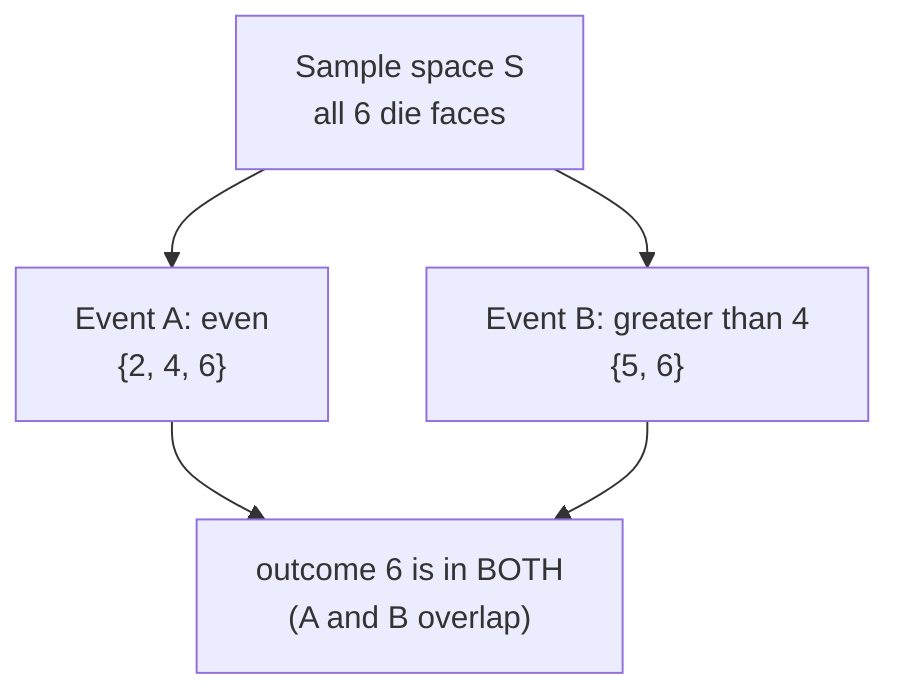
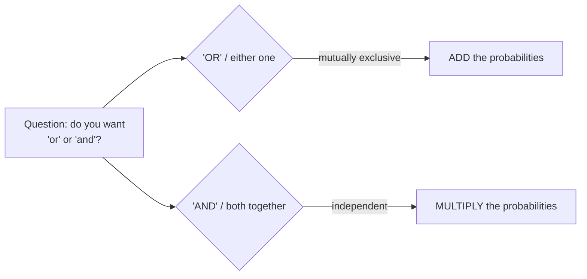
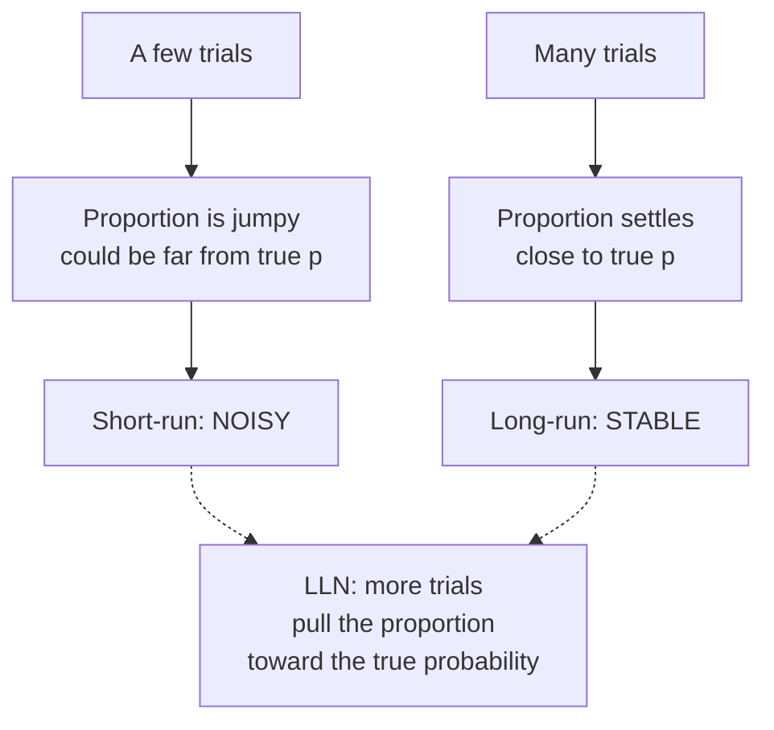

Every honest sentence in data science eventually runs into the word
"probably." *This change will probably lift conversion. That spike is
probably noise. The model will probably hold up next quarter.*
Probability is the branch of math that makes "probably" precise — it's
the **language we use to talk about uncertainty** with numbers instead
of hand-waving.

You don't need probability to describe data you already have; you count
and average it. You need probability the moment you want to reason about
what *could* happen, or how surprising what *did* happen really is. That
"how surprising?" instinct is the engine behind every confidence
interval, p-value, and A/B test later in this course. This page builds
the vocabulary and the handful of rules everything else rests on.

## Sample spaces and events

Before you can assign a probability to anything, you have to be clear
about the set of things that could happen. That set has a name.

- The **sample space** (written S) is the complete list of possible
  outcomes of some random process. For one die roll, S = {1, 2, 3, 4, 5, 6}.
- An **event** is any subset of the sample space — a thing that either
  happens or doesn't. "Roll an even number" is the event {2, 4, 6}.
- The **probability** of an event is a number between 0 and 1 that says
  how much of the sample space that event covers (weighted by how likely
  each outcome is).

When every outcome is equally likely — a fair die, a fair coin, a
well-shuffled deck — probability is just counting:

`P(event) = (number of outcomes in the event) / (number of outcomes in S)`

So P(even) = 3/6 = 0.5. That counting shortcut only works under
equal likelihood, but it's the cleanest place to build intuition.

<Callout type="info" title="Probability lives on a 0-to-1 scale">
A probability is always between **0** (impossible) and **1** (certain).
0.5 means "half the time." People often quote percentages (50%) — same
thing, just multiplied by 100. If a calculation ever hands you a
"probability" below 0 or above 1, you made an arithmetic error, full
stop.
</Callout>

## The basic rules of probability

Almost everything you'll do with probability comes from four small
rules. None of them require proofs to believe — each one is common sense
once you picture the sample space.

**1. The range rule.** Every probability satisfies 0 ≤ P(A) ≤ 1,
and the probabilities of all distinct outcomes in S add up to exactly
1. Something in the sample space must happen.

**2. The complement rule.** The chance an event does *not* happen is one
minus the chance it does:

`P(not A) = 1 − P(A)`

This is the single most useful trick in the whole page. "At least one"
problems are almost always easier to solve through their opposite
("none"), as you'll see below.

**3. The addition rule (for mutually exclusive events).** If two events
can't both happen at once — they're **mutually exclusive**, like "roll a
2" and "roll a 5" — the chance that *either* one happens is the sum:

`P(A or B) = P(A) + P(B)  (when A, B can't co-occur)`

If they *can* overlap (like "even" and "greater than 4," which share the
6), you'd be double-counting the overlap, so this simple form no longer
applies — you'd subtract the shared part.

**4. The multiplication rule (for independent events).** Two events are
**independent** when one happening tells you nothing about the other —
two separate coin flips, two unrelated users. For independent events,
the chance they *both* happen is the product:

`P(A and B) = P(A) × P(B)  (when A, B are independent)`

This is why a run of outcomes gets unlikely fast: two fair-coin heads is
0.5 × 0.5 = 0.25; ten in a row is 0.5¹⁰ ≈ 0.001.

<Callout type="warn" title="The conditions are not optional">
Add only when events are **mutually exclusive**; multiply only when they
are **independent**. Misapplying these is the #1 source of wrong
probability answers. We devote the entire next page, *Conditional
Probability*, to what happens when independence fails — because in real
data, it usually does.
</Callout>

## Where do these numbers come from? The frequentist view

We've been quoting probabilities like 0.5 as if handed down from above.
But what does "the probability of heads is 0.5" actually *mean* for one
flip? You either get heads or you don't — there's no "0.5 of a head."

The interpretation this course leans on is the **frequentist** one:
the probability of an event is the **long-run fraction of times it
happens** if you could repeat the random process over and over. Heads
has probability 0.5 because, across thousands of flips, about half come
up heads. Probability is a statement about the *long run*, not about any
single trial.

This view has a wonderful practical payoff: if you can *simulate* a
process many times, you can *estimate* any probability by just counting
how often the event occurs. You don't need a clever formula — you need a
loop and patience. This is called **Monte Carlo simulation**, and it's
one of the most powerful tools in a data scientist's kit.

<CodeBlock
  adapter="python"
  starterCode={`import numpy as np

rng = np.random.default_rng(7)

# Simulate 100,000 fair coin flips: 0 = tails, 1 = heads.
flips = rng.integers(0, 2, size=100_000)

p_heads_estimate = flips.mean()  # fraction of 1s = fraction of heads
print(f"Estimated P(heads) from simulation: {p_heads_estimate:.4f}")
print(f"True value:                         0.5000")

# Now a fair six-sided die, 100,000 rolls.
rolls = rng.integers(1, 7, size=100_000)
p_even = np.mean(rolls % 2 == 0)
print(f"\\nEstimated P(even die roll): {p_even:.4f}  (true: 0.5)")
print(f"Estimated P(roll a 6):      {np.mean(rolls == 6):.4f}  (true: {1 / 6:.4f})")
`}
/>

The estimates land very close to the true values, but not exactly — and
that wobble is the whole point. Simulation gives you an *approximation*
that gets better the more trials you run. Let's make that precise.

<Callout type="tip" title="Simulation beats formulas more often than you'd think">
For tangled questions — "what's the chance at least 3 of these 5 flaky
services are up?" — deriving an exact formula is error-prone. Simulating
the scenario a million times and counting is fast, hard to get wrong,
and easy to explain to a skeptical stakeholder. When in doubt, simulate.
</Callout>

## Estimating a real event by simulation

The coin was a warm-up. The reason simulation matters is that it handles
messy, compound events with no clean formula. Suppose a checkout flow has
three independent steps, each of which a user completes with probability
0.8. What's the chance a user completes *all three* and converts?

You could multiply (0.8³ = 0.512) — but watch how simulation gets the
same answer while staying flexible enough to handle steps that *aren't*
independent or equally likely.

<CodeBlock
  adapter="python"
  starterCode={`import numpy as np

rng = np.random.default_rng(42)

n_users = 200_000
p_step = 0.8  # each step completed independently with prob 0.8

# Simulate each user's three steps as True/False, then require all three.
step1 = rng.random(n_users) < p_step
step2 = rng.random(n_users) < p_step
step3 = rng.random(n_users) < p_step

converted = step1 & step2 & step3
p_convert = converted.mean()

print(f"Simulated P(complete all 3 steps): {p_convert:.4f}")
print(f"Exact (0.8 ** 3):                  {0.8**3:.4f}")
`}
/>

The simulated answer matches the multiplication-rule answer to a few
decimals. The advantage is that if step 2 only had probability 0.6, or
if completing step 1 made step 2 more likely, you'd change two lines of
code instead of re-deriving a formula.

## The Law of Large Numbers

Why does simulation work at all? Because of a deep result called the
**Law of Large Numbers (LLN)**: as you repeat a random process more and
more times, the observed proportion of an event converges to its true
probability. The short run is noisy; the long run is stable.

Let's watch it happen. We'll flip a fair coin 5,000 times and plot the
**running proportion** of heads after each flip. Early on it lurches
around; as the flip count climbs it homes in on 0.5.

<CodeBlock
  adapter="python"
  starterCode={`import numpy as np
import plotly.express as px

rng = np.random.default_rng(1)

n = 5_000
flips = rng.integers(0, 2, size=n)  # 0/1 heads indicator

# Running proportion: cumulative heads / number of flips so far.
running_prop = np.cumsum(flips) / np.arange(1, n + 1)

fig = px.line(
    x=np.arange(1, n + 1),
    y=running_prop,
    labels={"x": "Number of flips", "y": "Running proportion of heads"},
    title="Law of Large Numbers: running proportion converges to 0.5",
)
fig.add_hline(y=0.5, line_dash="dash", line_color="red")
fig.show()

print(f"After 10 flips:    {running_prop[9]:.3f}")
print(f"After 100 flips:   {running_prop[99]:.3f}")
print(f"After 5,000 flips: {running_prop[-1]:.3f}")
`}
/>

Notice the shape: wild swings on the left that calm into a tight hug of
the red line on the right. That's the LLN made visible. It's also
*exactly* why a sample of 1,000 survey respondents can speak for
millions — a theme we return to constantly in the sampling chapters.

<Callout type="danger" title="Misconception: the gambler's fallacy">
The LLN says the *long-run proportion* settles down — it does **not**
say outcomes "balance out" in the short run. After five heads in a row,
a fair coin is **still 50/50** on the next flip. The coin has no memory;
it doesn't owe you a tails. Believing a result is "due" because it hasn't
happened recently is the **gambler's fallacy**, and it has cost people
fortunes. Independent trials don't self-correct — they just get
swamped by the sheer volume of future trials.
</Callout>

<MultipleChoice
  markdown={`A fair roulette wheel has landed on red 8 times in a row. A gambler reasons: "black is overdue, so I should bet black." What's wrong with this?

- Nothing — after 8 reds, black really is more likely on the next spin
  > Each spin is independent and has no memory of past spins. The probability of black is unchanged by the streak; the wheel cannot "owe" an outcome.
- [o] Spins are independent, so the next spin's probability is unchanged by the streak — this is the gambler's fallacy
  > The streak feels meaningful, but independence means past results carry no information about the next spin. The probability is the same as it was on spin one.
- The streak proves the wheel is biased toward red, so he should bet red
  > An 8-red streak is unusual but not strong evidence of bias on a fair wheel — and in any case it wouldn't justify the "overdue" reasoning, which is the actual error here.
- The Law of Large Numbers guarantees black will come up soon to balance the reds
  > The LLN is about long-run proportions over many thousands of spins, not short-run "balancing." It never promises a specific outcome is coming soon.

Independent events don't self-correct; the gambler's fallacy mistakes long-run stability for short-run memory.`}
/>

## Odds vs probability

People — and especially betting markets and medical literature — often
talk in **odds** rather than probability. They're two ways of saying the
same thing, but they're easy to confuse, and the confusion can flip a
decision.

- **Probability** is `favorable / total`. If 1 of 5 equally likely
  outcomes is a win, P = 1/5 = 0.2.
- **Odds** are `favorable : unfavorable` — a ratio of the two *ways it
  can go*, not a fraction of the whole. The same scenario has odds of
  1 : 4 ("1 to 4").

So "4-to-1 odds against" does **not** mean a 1-in-4 (25%) chance — it
means 1 favorable for every 4 unfavorable, which is 1 out of 5, or 20%.
The conversions:

`odds = P / (1 − P)`   and   `P = odds / (1 + odds)`

<CodeBlock
  adapter="python"
  starterCode={`def prob_to_odds(p):
    return p / (1 - p)  # returns "to 1" odds

def odds_to_prob(odds):
    return odds / (1 + odds)

# A 20% chance.
p = 0.20
print(f"P = {p}  ->  odds = {prob_to_odds(p):.2f} to 1 in favor")
print(f"   (i.e. 1 to {1 / prob_to_odds(p):.0f} against)")

# 'Even odds' = 1 to 1.
print(f"\\nOdds of 1:1  ->  P = {odds_to_prob(1.0):.2f}")

# A common trap: '3 to 1 against' is NOT 0.25.
odds_against = 1 / 3  # 1 favorable per 3 unfavorable
print(f"\\n'3 to 1 against' -> P(win) = {odds_to_prob(odds_against):.3f}  (NOT 0.25)")
`}
/>

<Callout type="warn" title="Misconception: odds and probability are the same number">
"3-to-1 odds against" sounds like 1/3, but it's 1 favorable out of 4
total outcomes — a probability of 0.25... wait, even that's a common
slip. "3 to 1 against" is 1 favorable per 3 unfavorable = 1/4 = 0.25,
while "3 to 1 *in favor*" is 3/4 = 0.75. Always nail down direction
(for or against) and remember odds are part-to-part, probability is
part-to-whole.
</Callout>

## A note on single future events

The frequentist view defines probability through repetition, which
raises a fair question: what does "70% chance of rain tomorrow" mean?
There's only *one* tomorrow — you can't repeat it.

The honest interpretation is still a long-run one: across all the days
the forecaster called "70%," it rained on about 70% of them. The
probability is a property of the *forecasting procedure's track record*,
not a mystical fact about one specific day. For a single event you'll
never repeat, a probability is best read as a calibrated **degree of
confidence** backed by how that estimate performs over many similar
situations.

<Callout type="info" title="Why this matters for your work">
When you report "this variant has a 90% chance of being better," you're
making a claim that should be *calibrated*: over many such 90% calls,
about 90% should pan out. Probabilities are promises about long-run
accuracy. That framing keeps you honest and is exactly the mindset the
inference chapters formalize.
</Callout>

## Practice

<ChallengeCard
  adapter="python"
  title="Estimate an event probability by Monte Carlo"
  instructions={`You roll **two fair six-sided dice** and add them. Estimate the probability that the **sum equals 7** using simulation.

- Use the provided \`rng\` to simulate **200,000** rolls of two dice.
- Compute the fraction of rolls whose sum is exactly 7 into a float called **\`p7\`**.

The exact answer is \`6/36 ≈ 0.1667\`, so a good simulation should land within about \`0.01\` of that.`}
  initCode={`import numpy as np
rng = np.random.default_rng(2024)
n = 200_000`}
  starterCode={`# TODO: simulate n rolls of two dice and estimate P(sum == 7) as a float p7
p7 = None
`}
  solutionCode={`die1 = rng.integers(1, 7, size=n)
die2 = rng.integers(1, 7, size=n)
totals = die1 + die2
p7 = float(np.mean(totals == 7))
print(p7)
`}
  tests={[
    {
      id: "type",
      name: "p7 is a float",
      description: "Returns a numeric probability",
      code: `assert isinstance(p7, float)`,
    },
    {
      id: "range",
      name: "p7 is a valid probability",
      description: "Between 0 and 1",
      code: `assert 0.0 <= p7 <= 1.0`,
    },
    {
      id: "value",
      name: "p7 is close to 6/36",
      description: "Simulation matches the true probability",
      code: `assert abs(p7 - 6/36) < 0.01`,
    },
  ]}
/>

<ChallengeCard
  adapter="python"
  title="At least one success: compute and verify"
  instructions={`A flaky API call succeeds with probability **0.7** on each independent attempt. You make **4** attempts. You want the probability of **at least one** success.

Do it two ways and store both as floats:

- **\`p_exact\`** — use the **complement rule**: \`1 - P(all four fail)\`. Compute it directly from the number \`0.7\` (no simulation).
- **\`p_sim\`** — estimate the same probability by simulating **100,000** sets of 4 attempts with the provided \`rng\`.

They should agree to within about \`0.01\`.`}
  initCode={`import numpy as np
rng = np.random.default_rng(99)
p_success = 0.7
n_attempts = 4
n_trials = 100_000`}
  starterCode={`# TODO: compute p_exact via the complement rule, and p_sim via simulation
p_exact = None
p_sim = None
`}
  solutionCode={`# Complement: 1 - P(all fail). Each attempt fails with prob 1 - 0.7 = 0.3.
p_exact = float(1 - (1 - p_success) ** n_attempts)

# Simulation: each trial is 4 attempts; success if any attempt succeeds.
attempts = rng.random((n_trials, n_attempts)) < p_success
at_least_one = attempts.any(axis=1)
p_sim = float(at_least_one.mean())

print("exact:", p_exact, "sim:", p_sim)
`}
  tests={[
    {
      id: "types",
      name: "both are floats",
      description: "p_exact and p_sim are floats",
      code: `assert isinstance(p_exact, float) and isinstance(p_sim, float)`,
    },
    {
      id: "exact_value",
      name: "p_exact uses the complement rule correctly",
      description: "1 - 0.3**4",
      code: `assert abs(p_exact - (1 - 0.3**4)) < 1e-9`,
    },
    {
      id: "agree",
      name: "simulation agrees with the exact value",
      description: "Within 0.01",
      code: `assert abs(p_sim - p_exact) < 0.01`,
    },
  ]}
/>

## Check your understanding

<MultipleChoice
  markdown={`You flip a fair coin 4 times. What is the probability of getting **4 heads in a row**, and which rule did you use?

- 0.5, because each flip is 50/50
  > 0.5 is the probability of heads on a *single* flip. The question asks about all four flips happening together.
- [o] 0.0625, by the multiplication rule for independent events: 0.5 × 0.5 × 0.5 × 0.5
  > The four flips are independent, so the probability they all come up heads is the product of the individual probabilities, which is 0.5 to the 4th power.
- 0.25, by the addition rule
  > The addition rule is for "either/or" with mutually exclusive events. "All four heads" is an "and" question, which calls for multiplication.
- 2.0, by adding 0.5 four times
  > Adding probabilities here would give 2.0, which is impossible — no probability can exceed 1. That signals the wrong rule was applied.

For independent "and" questions, multiply; the result shrinks fast as you add events.`}
/>

<MultipleChoice
  markdown={`Which pair of events is **mutually exclusive** (cannot both happen on a single trial)?

- Drawing a card that is a King, and drawing a card that is a Heart
  > The King of Hearts is both at once, so these events overlap — they are not mutually exclusive.
- Rolling an even number, and rolling a number greater than 3
  > A roll of 4 or 6 satisfies both, so they can co-occur. Not mutually exclusive.
- [o] Rolling a 2, and rolling a 5, on the same single die roll
  > A single die roll cannot be both a 2 and a 5, so these events can never happen together — that is exactly what mutually exclusive means.
- A user being on mobile, and that user converting
  > A mobile user can certainly convert, so these events can both be true at once.

Mutually exclusive means zero overlap on a single trial — that is the condition that lets you simply add probabilities.`}
/>

<MultipleChoice
  markdown={`A simulation estimates a probability as 0.31 using 50 trials, while the true value is 0.25. A colleague says the simulation is "broken." What is the most likely explanation?

- The simulation code must have a bug, since it didn't return 0.25
  > A simulation almost never returns the exact true value. A gap with only 50 trials is expected, not a sign of a bug.
- [o] 50 trials is too few; by the Law of Large Numbers, more trials would pull the estimate closer to 0.25
  > Small samples produce noisy estimates. The LLN says the estimate converges to the true value as trials increase, so adding trials is the fix.
- Probabilities can't be estimated by simulation at all
  > Estimating probabilities by simulation (Monte Carlo) is a standard, valid technique — it just needs enough trials to be precise.
- The true value must actually be 0.31
  > The estimate is an approximation from limited data; it doesn't override a known true value. The discrepancy reflects sampling noise.

More trials shrink simulation noise — the estimate's wobble is a feature of the method, not a defect.`}
/>

<MultipleChoice
  markdown={`A treatment is described as having "**4 to 1 odds in favor** of success." What is the probability of success?

- 0.25, because 1 in 4
  > That reading uses the wrong direction and treats odds as a part-to-whole fraction. "4 to 1 in favor" is 4 favorable per 1 unfavorable.
- [o] 0.8, because 4 favorable out of 5 total equally weighted parts
  > Odds of 4 to 1 in favor mean 4 favorable for every 1 unfavorable, so 4 out of 5 parts, which is a probability of 0.8.
- 4.0, because the odds are 4
  > 4.0 is not a valid probability — no probability exceeds 1. Odds and probability are on different scales and must be converted.
- 0.5, because odds always mean a coin flip
  > Even odds (1 to 1) correspond to 0.5, but 4 to 1 is far from even. The specific ratio determines the probability.

Odds are part-to-part; probability is part-to-whole — convert with P = odds / (1 + odds).`}
/>

<MultipleChoice
  markdown={`Which statement best captures the **frequentist meaning** of "P(heads) = 0.5" for a fair coin?

- The next flip is guaranteed to alternate heads and tails over time
  > Outcomes don't alternate on a schedule; flips are independent. Probability says nothing about the order of results.
- Exactly half of any small batch of flips will be heads
  > Small batches are noisy — 10 flips might give 7 heads. The 0.5 is about the long run, not any particular small batch.
- [o] Over a very large number of flips, the fraction that come up heads approaches 0.5
  > The frequentist view defines probability as the long-run relative frequency, which the Law of Large Numbers shows converges to 0.5.
- There is a physical force making the coin fair on each individual flip
  > Probability is a description of long-run frequencies, not a force acting on a single flip. Each flip is just heads or tails.

Frequentist probability is a long-run-frequency statement, which is exactly why simulation can estimate it.`}
/>

<Callout type="success" title="Key takeaways">
- A **sample space** lists all outcomes; an **event** is a subset; a **probability** is a number in **[0, 1]** measuring how much of the space the event covers.
- **Complement**: `P(not A) = 1 − P(A)` — the go-to move for "at least one" problems.
- **Add** mutually exclusive probabilities (either/or); **multiply** independent ones (both/and) — and only when those conditions hold.
- Probability is a **long-run frequency**; the **Law of Large Numbers** is why simulation works and why streaks don't make outcomes "due."
- **Odds** are part-to-part (`P / (1 − P)`); **probability** is part-to-whole — don't mix them up.
</Callout>

Next, in *Conditional Probability*, we tackle what happens when events
are **not** independent — and meet a base-rate puzzle that fools doctors,
juries, and analysts alike.
