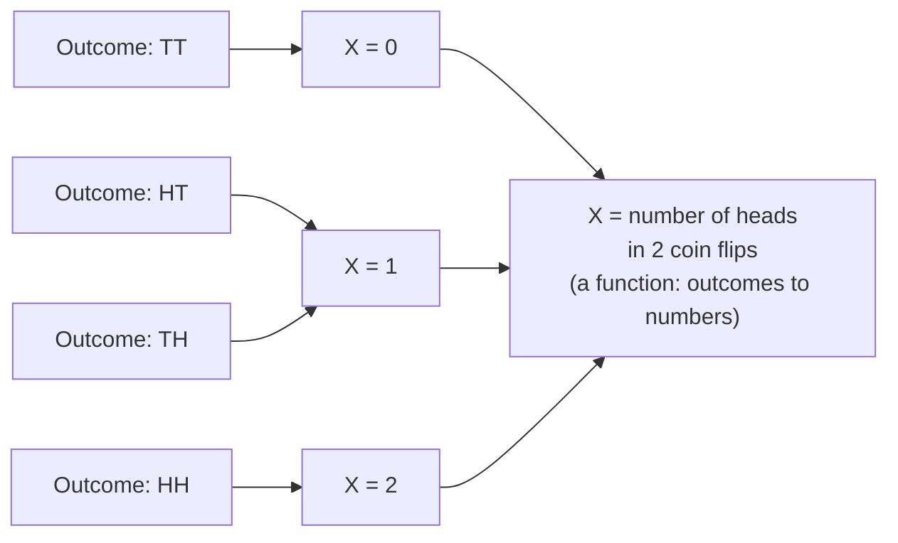
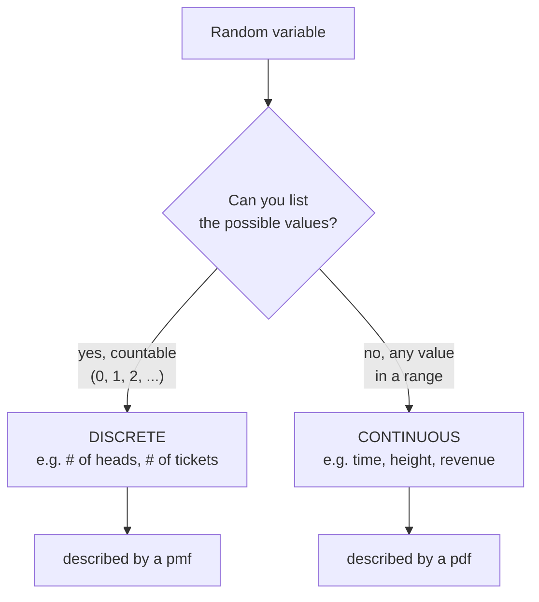
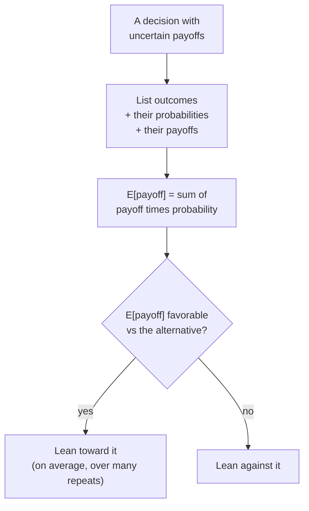

So far our outcomes have been things like "heads," "the King of Hearts,"
or "tested positive" — labels, not numbers. But to compute averages,
measure spread, or plug uncertainty into a decision, we need *numbers*.
A **random variable** is the bridge: it's a rule that assigns a number to
each possible outcome of a random process. That small move — from
outcomes to numbers — is what unlocks all the quantitative machinery of
the rest of the course.

Think of a random variable as a *function* whose input is "whatever
random thing happened" and whose output is a number you can do math on.
The number of heads in 10 flips, the dollar value of an order, the
response time of a server, the payout of a bet — each is a random
variable. This page is about describing them with two summary numbers
(**expectation** and **variance**) and using the first one to make
real-world decisions.

## A random variable maps outcomes to numbers

The mental model: the world rolls some dice you can't control, and the
random variable reads off a number from the result. We usually write
random variables with capital letters like `X`, and specific values they
take with lowercase `x`.

Notice two outcomes (HT and TH) both map to X = 1. That's fine — a
random variable can send many outcomes to the same number. What matters
is that *every* outcome gets exactly one number, so we can ask questions
like "what's the average value of `X`?"

<Callout type="info" title="Why bother turning outcomes into numbers?">
Because "average" and "spread" only make sense for numbers. You can't
average "heads" and "tails," but you *can* average the *count* of heads.
Random variables are what let you apply the describing-data tools from
earlier — center and spread — to **uncertain, not-yet-observed**
quantities.
</Callout>

## Discrete vs continuous

Random variables come in two flavors, and the distinction decides which
tools you reach for.

- A **discrete** random variable takes separate, countable values —
  often whole numbers. Number of heads, number of support tickets, number
  of items in a cart. You can list the possible values (even if the list
  is infinite, like 0, 1, 2, ...).
- A **continuous** random variable can take *any* value in a range —
  there's no gap between neighboring values. Response time (3.14159...
  seconds), height, temperature, revenue. You can't list the values;
  they form a continuum.

The split matters because probability behaves differently for each, which
brings us to how we describe their behavior.

## pmf vs pdf: the intuition

A random variable is fully described by how its probability is
distributed across values. The *form* of that description differs by
type — and this is a spot where intuition matters more than the formal
definitions.

For a **discrete** variable, the **probability mass function (pmf)**
gives the probability of *each individual value*: P(X = 2) = 0.25. The
masses are real probabilities, they're each between 0 and 1, and they sum
to 1 across all values. You can point at a bar and read off "the chance
of exactly this."

For a **continuous** variable, asking P(X = 3.14159…) exactly is
meaningless — the probability of landing on any single precise value is
0 (there are infinitely many values). Instead the **probability density
function (pdf)** describes probability as **area**: the chance that `X`
falls *in an interval* is the area under the pdf curve over that
interval. Density is not probability — it's "probability per unit of
`x`," and only becomes probability once you integrate over a range.

<Callout type="warn" title="Misconception: a pdf gives the probability of a single value">
For continuous variables, P(X = exact value) = 0, always.
Height being "exactly 180.0000... cm" has probability zero; "between
179.5 and 180.5 cm" has a real, positive probability. A pdf's *height*
can even exceed 1 — it's a density, not a probability. Probability for
continuous variables is **area under the curve**, never the height at a
point. We unpack this fully in *Continuous Distributions*.
</Callout>

We'll build whole catalogs of these — the binomial, Poisson, and others
in *Discrete Distributions*; the normal and friends in *Continuous
Distributions* and *The Normal Distribution*. For now, the key is that
both pmf and pdf answer the same question — "how is probability spread
across values?" — just with masses vs density.

## Expectation: the long-run average

The most important single number describing a random variable is its
**expected value**, written E[X]. It's the **long-run average** value
of `X` — if you drew the variable over and over and averaged the results,
E[X] is the number that average settles down to (that's the Law of
Large Numbers from *Probability Basics* at work).

For a discrete variable, E[X] is the **probability-weighted average**
of the possible values — each value times how likely it is, summed up:

`E[X] = Σ x · P(X = x)`

A vivid way to picture it: E[X] is the **balance point** (center of
mass) of the pmf. If you put each probability as a weight at its value on
a number line, E[X] is where the line balances. Let's compute one by
hand and then confirm it by simulation.

<CodeBlock
  adapter="python"
  starterCode={`import numpy as np

# A weighted die: value -> probability (a pmf).
values = np.array([1, 2, 3, 4, 5, 6])
probs  = np.array([0.10, 0.10, 0.10, 0.10, 0.10, 0.50])  # heavily favors 6
print("Probabilities sum to:", probs.sum())   # must be 1.0

# E[X] = sum of value * probability.
expected = np.sum(values * probs)
print(f"E[X] by hand = {expected:.3f}")

# Verify by simulation: draw many times and average.
rng = np.random.default_rng(0)
draws = rng.choice(values, size=500_000, p=probs)
print(f"Mean of 500,000 draws = {draws.mean():.3f}  (-> converges to E[X])")
`}
/>

The hand calculation and the simulated average agree. That's the whole
meaning of expectation: it's the value you'd average toward over many
repetitions. Note something important about this example — E[X] comes
out around 4.5, which *isn't even a face on the die you'd consider
"typical."* Hold that thought; it's a classic trap.

<Callout type="danger" title="Misconception: expectation is the most likely value">
E[X] is **not** the most probable outcome, and it need not even be a
value `X` can take. The expected number of heads in 3 flips is 1.5 —
impossible to actually observe. The expected value of a single die roll
is 3.5. Expectation is a *balance point*, an average over the long run,
not a prediction of any single result. The most likely value is the
**mode**, a different idea entirely.
</Callout>

## Variance: how spread out is it?

Expectation tells you the center; **variance** tells you how far the
variable typically strays from that center. It's the expected squared
distance from the mean:

`Var(X) = E[ (X − E[X])² ]`

We square the deviations so that overshoots and undershoots don't cancel,
exactly as in *Measures of Spread*. The catch is that variance is in
**squared units** — square dollars, square seconds — which nobody can
interpret. So we usually report its square root, the **standard
deviation** `SD(X) = √Var(X)`, which is back in the
original units and reads as a typical distance from the mean.

<CodeBlock
  adapter="python"
  starterCode={`import numpy as np

values = np.array([1, 2, 3, 4, 5, 6])
probs  = np.array([0.10, 0.10, 0.10, 0.10, 0.10, 0.50])

mu = np.sum(values * probs)                    # E[X]
var = np.sum((values - mu) ** 2 * probs)       # E[(X - mu)^2]
sd = np.sqrt(var)

print(f"E[X]        = {mu:.3f}")
print(f"Var(X)      = {var:.3f}   (squared units)")
print(f"SD(X)       = {sd:.3f}   (same units as X)")

# Confirm via a large simulation.
rng = np.random.default_rng(1)
draws = rng.choice(values, size=500_000, p=probs)
print(f"\\nSimulated mean = {draws.mean():.3f}, simulated SD = {draws.std():.3f}")
`}
/>

<Callout type="warn" title="Watch your units">
Variance is in *squared* units, so a variance of "25 square dollars" is
not directly comparable to a mean in dollars. Always convert to standard
deviation (here, \\$5) before you talk about "typical spread" in plain
language. Reporting a variance to a stakeholder as if it were in the
original units is a common and confusing slip.
</Callout>

## Let scipy.stats do the bookkeeping

You rarely hand-roll these sums in practice. A **frozen distribution**
from `scipy.stats` bundles a random variable's full behavior into one
object that exposes `.mean()`, `.var()`, `.std()`, and `.rvs()` (to draw
samples) — and `.pmf()` / `.pdf()` for the mass or density. "Frozen"
just means you've fixed the parameters once, so you can query it
repeatedly without re-passing them.

<CodeBlock
  adapter="python"
  starterCode={`from scipy import stats
import numpy as np

# A binomial RV: number of successes in 10 trials, each with p = 0.3.
# (We'll study the binomial properly in Discrete Distributions.)
X = stats.binom(n=10, p=0.3)   # "frozen": parameters fixed once

print(f"E[X]   = {X.mean():.3f}")     # theoretical expectation
print(f"Var(X) = {X.var():.3f}")
print(f"SD(X)  = {X.std():.3f}")
print(f"P(X = 3) = {X.pmf(3):.3f}")   # pmf: probability of exactly 3

# Draw 100,000 samples and check the empirical mean matches E[X].
rng = np.random.default_rng(42)
sample = X.rvs(size=100_000, random_state=rng)
print(f"\\nEmpirical mean of 100,000 draws = {sample.mean():.3f}  (vs E[X] above)")
`}
/>

This is the pattern you'll use across every distribution page: pick a
distribution, freeze its parameters, then ask it for its mean, variance,
probabilities, or random draws. The frozen object *is* the random
variable, made concrete.

## Linearity of expectation

One property of expectation is so useful it deserves a callout:
expectation is **linear**. For any random variables and constants,

`E[aX + bY] = a · E[X] + b · E[Y]`

The remarkable part: this holds **even when `X` and `Y` are dependent** —
no independence required. It means you can break a messy total into
simpler pieces, take each piece's expectation, and add them up. Want the
expected total revenue from 1,000 customers who each have expected spend
\$40? It's just 1000 × 40 = \$40,000, regardless of how
customers' spending correlates.

<CodeBlock
  adapter="python"
  starterCode={`import numpy as np

rng = np.random.default_rng(7)

# Each of 1,000 customers: expected spend $40, but spends vary a lot.
n = 1_000
spend = rng.gamma(shape=2.0, scale=20.0, size=n)   # mean = 2 * 20 = $40

# Linearity: E[total] = sum of individual E[spend] = 1000 * 40.
print(f"Per-customer mean spend (theory): $40.00")
print(f"E[total revenue] (theory):        \${n * 40:,.2f}")
print(f"Simulated total this draw:        \${spend.sum():,.2f}")
print("\\nRun it again and the total wiggles, but its long-run average is $40,000.")
`}
/>

<Callout type="tip" title="Why linearity is a superpower">
Linearity lets you compute the expected value of complicated totals
without untangling how the parts interact. Expected total tickets across
a week? Add the expected tickets per day. Expected revenue from a funnel?
Sum the expected revenue at each stage. No independence assumption
needed — which is rare and precious in probability.
</Callout>

## Expected value for decisions

Here's where expectation earns its keep. Many real decisions are bets:
you commit resources now for an uncertain payoff later. The expected
value turns "it depends" into a single comparable number — the average
outcome if you faced the same decision many times. A decision is
**favorable** (in the long run, on average) when its expected value beats
the alternative.

Consider an extended warranty: it costs \\$80, and it pays out \\$300 if
the device fails, which happens with probability 0.15. Should *the seller*
offer it? Compute the expected payout and compare to the price.

<CodeBlock
  adapter="python"
  starterCode={`import numpy as np

price = 80          # what the customer pays
payout = 300        # what the seller pays IF the device fails
p_fail = 0.15       # probability of failure

# Expected payout the seller faces per warranty sold.
e_payout = payout * p_fail + 0 * (1 - p_fail)
e_profit_seller = price - e_payout

print(f"E[payout per warranty] = \${e_payout:.2f}")
print(f"E[profit to seller]    = \${e_profit_seller:.2f} per warranty")

# Sanity-check with simulation over many warranties sold.
rng = np.random.default_rng(3)
fails = rng.random(1_000_000) < p_fail
profit = price - np.where(fails, payout, 0)
print(f"\\nSimulated mean profit  = \${profit.mean():.2f}  (matches E above)")
print("Positive expected profit -> favorable for the SELLER, on average.")
`}
/>

The seller nets about \\$35 per warranty on average — favorable for them,
which is precisely why warranties are profitable products and (on average)
a losing bet for the buyer. Expected value made the comparison crisp.

<Callout type="info" title="When expected value is NOT the whole story">
Expected value assumes you face the gamble *many times* so the average is
what matters. For a **one-shot, ruinous** risk — betting your house on a
positive-EV coin flip — variance and the chance of catastrophe matter far
more than the average. Insurance exists precisely because people will
*pay* to avoid variance even when the expected value is against them.
Expected value is the right lens for repeated, survivable decisions, not
for every decision.
</Callout>

## Practice

<ChallengeCard
  adapter="python"
  title="Compute E[X] and Var(X) from a pmf"
  instructions={`You're given a pmf for a random variable: parallel arrays \`values\` and \`probs\` (the probabilities sum to 1).

Compute, as plain Python **floats**:

- **\`ex\`** — the expected value \`E[X] = Σ value · prob\`.
- **\`varx\`** — the variance \`Var(X) = Σ (value − E[X])² · prob\`.

Use the provided \`values\` and \`probs\` arrays. Do **not** assume the values are equally likely.`}
  initCode={`import numpy as np
values = np.array([0, 1, 2, 3, 4])
probs  = np.array([0.40, 0.25, 0.20, 0.10, 0.05])`}
  starterCode={`# TODO: compute ex (E[X]) and varx (Var(X)) as floats
ex = None
varx = None
`}
  solutionCode={`ex = float(np.sum(values * probs))
varx = float(np.sum((values - ex) ** 2 * probs))
print("E[X] =", ex)
print("Var(X) =", varx)
`}
  tests={[
    {
      id: "types",
      name: "ex and varx are floats",
      description: "Both are Python floats",
      code: `assert isinstance(ex, float) and isinstance(varx, float)`,
    },
    {
      id: "ex",
      name: "E[X] is correct",
      description: "Probability-weighted average",
      code: `import numpy as np
assert abs(ex - float(np.sum(values * probs))) < 1e-9`,
    },
    {
      id: "var",
      name: "Var(X) is correct",
      description: "Expected squared deviation from the mean",
      code: `import numpy as np
mu = float(np.sum(values * probs))
expected_var = float(np.sum((values - mu) ** 2 * probs))
assert abs(varx - expected_var) < 1e-9`,
    },
    {
      id: "nonneg",
      name: "variance is non-negative",
      description: "Var(X) >= 0",
      code: `assert varx >= 0`,
    },
  ]}
/>

<ChallengeCard
  adapter="python"
  title="Is this bet favorable?"
  instructions={`A carnival game costs **\\$5** to play. You draw one ball from a bag:

- With probability **0.05** you win **\\$50** (net gain \\$45 after the \\$5 cost).
- With probability **0.20** you win **\\$10** (net gain \\$5).
- Otherwise (probability **0.75**) you win **\\$0** (net \\$−5, you lose your stake).

Work in terms of **net payoff** (winnings minus the \\$5 cost). Compute:

- **\`ev\`** — the expected **net** payoff per play, as a float.
- **\`favorable\`** — a \`bool\`, \`True\` if \`ev > 0\` (favorable to the **player**), else \`False\`.

The net payoffs are \`+45\`, \`+5\`, and \`−5\` with the probabilities above.`}
  initCode={`# Probabilities and NET payoffs (winnings minus the $5 cost to play).
p = [0.05, 0.20, 0.75]
net_payoff = [45, 5, -5]`}
  starterCode={`# TODO: compute ev (expected net payoff) and favorable (bool: ev > 0)
ev = None
favorable = None
`}
  solutionCode={`ev = float(sum(pi * xi for pi, xi in zip(p, net_payoff)))
favorable = bool(ev > 0)
print("Expected net payoff:", ev)
print("Favorable to player:", favorable)
`}
  tests={[
    {
      id: "types",
      name: "ev is float, favorable is bool",
      description: "Correct types",
      code: `assert isinstance(ev, float) and isinstance(favorable, bool)`,
    },
    {
      id: "ev_value",
      name: "expected net payoff is correct",
      description: "Probability-weighted net payoff",
      code: `expected = 0.05*45 + 0.20*5 + 0.75*(-5)
assert abs(ev - expected) < 1e-9`,
    },
    {
      id: "flag",
      name: "favorable flag matches the sign of ev",
      description: "True iff ev > 0",
      code: `assert favorable == (ev > 0)`,
    },
    {
      id: "unfavorable",
      name: "this game is unfavorable to the player",
      description: "EV is negative",
      code: `assert favorable is False`,
    },
  ]}
/>

## Check your understanding

<MultipleChoice
  markdown={`The expected number of heads in 3 fair coin flips is 1.5. What does this 1.5 mean?

- On any given set of 3 flips, you'll most likely see 1.5 heads
  > You can never observe 1.5 heads in 3 flips — it's not an attainable outcome. Expectation isn't a prediction for a single trial.
- [o] Averaged over very many sets of 3 flips, the mean number of heads per set approaches 1.5
  > Expectation is the long-run average. Individual results are whole numbers, but their average across many repetitions converges to 1.5.
- 1.5 is the most likely number of heads
  > The most likely value is the mode (here 1 or 2, tied), not the expectation. Expected value need not be the most probable outcome.
- The coin is unfair, since a fair coin can't give 1.5
  > A fair coin is exactly what produces an expectation of 1.5 heads in 3 flips. A non-integer expectation is normal and expected.

Expectation is a long-run balance point, not a value any single trial must hit.`}
/>

<MultipleChoice
  markdown={`A random variable measures order value in dollars and has variance 64. A teammate writes "typical orders vary by about \\$64 from the mean." What's wrong?

- Nothing — variance directly gives the typical spread in dollars
  > Variance is in *squared* dollars, not dollars. Quoting it as a dollar spread mixes up the units.
- [o] Variance is in squared dollars; the typical spread is the standard deviation, √64 = \\$8
  > To express spread in the original units, take the square root of the variance. Here that's \\$8, not \\$64.
- The variance should be negative for dollar amounts
  > Variance can never be negative — it's an average of squared deviations. The sign isn't the issue; the units are.
- Variance and standard deviation are the same thing
  > They're related but distinct: standard deviation is the square root of variance, and only the SD shares the variable's units.

Variance lives in squared units; convert to standard deviation before describing spread in plain language.`}
/>

<MultipleChoice
  markdown={`For a **continuous** random variable like response time, what is $P(X = 2.000\ldots\text{ seconds exactly})$?

- A small positive number you read off the pdf's height at 2
  > The pdf's height is a *density*, not a probability, and can even exceed 1. The probability of an exact point is not its density.
- [o] Exactly 0 — for a continuous variable, any single precise value has probability 0; probability lives in intervals (area under the pdf)
  > With infinitely many possible values, no single exact value carries positive probability. Only ranges (areas under the curve) do.
- Exactly 1, since the time must be something
  > The time being *some* value has probability 1, but that mass is spread across the whole continuum, not concentrated on 2.0.
- Undefined, because continuous variables have no probabilities
  > Continuous variables absolutely have probabilities — for *intervals*. It's only single exact points that have probability 0.

For continuous variables, probability is area over an interval; the chance of any exact value is 0.`}
/>

<MultipleChoice
  markdown={`A game has expected net payoff **−\\$0.50** per play. Which conclusion is best supported?

- You are guaranteed to lose \\$0.50 every time you play
  > Any single play could win or lose; −\\$0.50 is the *average* outcome over many plays, not a guaranteed per-play result.
- [o] Over many plays, you'd lose about \\$0.50 per play on average, so the game is unfavorable in the long run
  > A negative expected value means the long-run average is a loss. Played repeatedly, you'd bleed roughly \\$0.50 per play.
- The game is favorable because you might still win big
  > A possible big win is already accounted for in the expectation. A negative EV means those wins don't offset the losses on average.
- Expected value can't be negative, so this is a mistake
  > Expected value can certainly be negative — that's exactly how you flag an unfavorable bet. There's no error here.

Negative expected value flags a long-run losing proposition, even though individual plays can win.`}
/>

<Callout type="success" title="Key takeaways">
- A **random variable** assigns a number to each random outcome — a *function* from outcomes to numbers — so you can do math on uncertainty.
- **Discrete** variables (countable values) are described by a **pmf** (probability of each value); **continuous** ones by a **pdf** (probability = area, never the height at a point).
- **Expectation** E[X] is the **long-run average** / balance point — *not* the most likely value, and not necessarily attainable.
- **Variance** is the expected squared deviation (squared units); take the **standard deviation** to talk about spread in real units.
- **Expected value** turns an uncertain decision into one comparable number — favorable when it beats the alternative — but it assumes a *repeated, survivable* gamble.
</Callout>

From here, *Discrete Distributions*, *Continuous Distributions*, and *The
Normal Distribution* give you named, ready-made random variables — each
with its own pmf or pdf, mean, and variance — for modeling the patterns
you'll actually meet in data.
