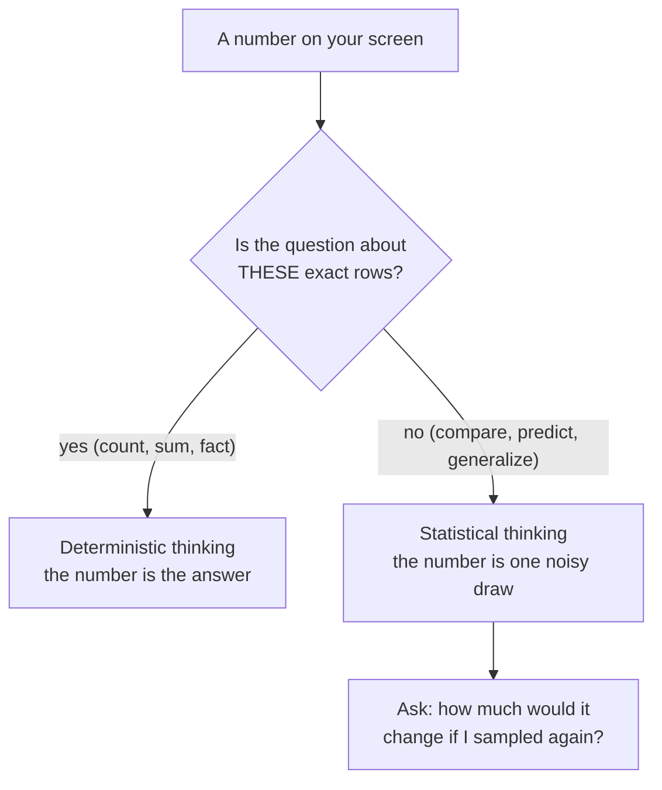
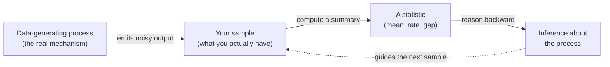
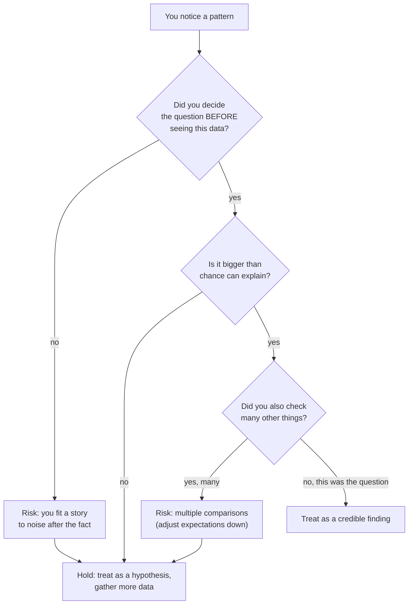

There's a quiet but enormous difference between two ways of looking at
a number. In the first, a number is *the answer*: the spreadsheet says
average order value is \$48.20, so average order value **is** \$48.20.
In the second, that \$48.20 is just *one thing that happened* — one
noisy draw from a process that could easily have handed you \$47.10 or
\$49.60 instead. This page is about deliberately switching from the
first way of thinking to the second, because that switch is what the
entire rest of the course is built on.

We'll call the first one **deterministic thinking** (the mindset of
accounting, of inventory counts, of "the number is the number") and
the second **statistical thinking** (the mindset of "the number is a
draw from a noisy process, and I care about the process"). Both are
useful. The mistake — the expensive, career-defining mistake — is
using deterministic thinking on a question that needs statistical
thinking.

<Callout type="info" title="What this page is and isn't">
This is a *mindset* page, not a techniques page. There are no formulas
to memorize. The goal is to install a handful of reflexes — variation
is everywhere, separate signal from noise, think in distributions, and
don't fool yourself — that every later page will lean on.
</Callout>

## Deterministic thinking vs. statistical thinking

When you count yesterday's shipped orders, deterministic thinking is
exactly right. The count is a fact about a fixed set of rows; run it
again and you get the same answer. Nothing is uncertain.

But the moment your question reaches beyond the rows you have — *is
this group better, is this metric trending, will this change help* —
the number in front of you stops being "the answer" and becomes
*evidence*. Same number, completely different epistemic status.

The rest of this page sharpens the right-hand branch into four habits.

## Variation is everywhere

The foundational fact of statistical thinking is that **the same
process, run again, gives a different number**. Not because anything
changed — because the process has natural spread baked in. Customers
differ, sensors jitter, people round their answers, demand wobbles.

The trap is that a *single* run of a process hides this completely. You
see one number and it looks solid, authoritative, final. Re-running the
process — which in real life you usually can't do — would show you how
much that number was free to move.

<CodeBlock
  adapter="python"
  starterCode={`import numpy as np

rng = np.random.default_rng(11)

# ONE process: "true" average response time is 200 ms, with natural spread.
# We "run the week" five times. Nothing about the system changes.
for week in range(5):
    times = rng.normal(loc=200, scale=25, size=300)
    print(
        f"Week {week + 1}: mean = {times.mean():6.2f} ms   "
        f"(min {times.min():5.1f}, max {times.max():5.1f})"
    )

print("\\nSame system every week. The mean still wanders by several ms.")
print("If you reported just one week's mean as THE number, you'd be")
print("hiding how much it was free to move.")
`}
/>

Notice the means aren't wildly different — they cluster around 200 —
but they're never identical. That clustering-with-wobble *is* the
process showing through the noise. Statistical thinking means always
asking, about any summary number, "how much would this wobble if I
could re-run it?" The wobble has a name we'll formalize later: the
*standard error* (see *Standard Error*).

<Callout type="warn" title="The point summary illusion">
A single mean, rate, or percentage printed to two decimals *looks*
precise. The decimals are real, but the stability is an illusion — most
of those digits would change on a fresh sample. Precision of display is
not precision of knowledge.
</Callout>

## Signal vs. noise

Here's where variation stops being a curiosity and starts being
dangerous. Because numbers wobble, **pure randomness can manufacture
patterns that look exactly like real findings** — trends, gaps,
"effects" — out of nothing at all.

Watch a fake trend appear from data where, by construction, there is no
trend whatsoever.

<CodeBlock
  adapter="python"
  starterCode={`import numpy as np
import plotly.express as px

rng = np.random.default_rng(3)

# 24 months of a metric that is PURE NOISE around a flat line of 100.
# There is no trend. The mean never changes. It's noise + nothing.
months = np.arange(1, 25)
metric = 100 + rng.normal(0, 8, size=24)

fig = px.line(
    x=months,
    y=metric,
    markers=True,
    labels={"x": "Month", "y": "Metric"},
    title="A 'trend' that is 100% noise",
)
fig.add_hline(y=100, line_dash="dash", annotation_text="the actual truth (flat)")
fig.show()

# It is trivially easy to find a "rising stretch" or "decline" in here.
last_six = metric[-6:]
print(
    f"'Last six months' slope looks like: "
    f"{(last_six[-1] - last_six[0]):+.1f} units of 'movement'"
)
print("...but the generating process was flat the entire time.")
`}
/>

If you squint at that chart you will *see* stories: a dip around month
8, a recovery, a strong finish. Every one of them is noise. Now imagine
that chart in a quarterly review with a confident narrator. The skill
statistical thinking builds is the reflex to ask, before believing any
pattern, **"is this bigger than what randomness alone produces?"**

A clean way to make that judgment: figure out how big differences get
*when there is no real effect*, then compare your observed difference
to that range. If your difference is comfortably inside the "no-effect"
range, it's plausibly just noise.

<CodeBlock
  adapter="python"
  starterCode={`import numpy as np

rng = np.random.default_rng(0)

# Build a "no-effect world": split one identical population in half,
# many times, and record the gap between the two halves' means.
def gap_under_no_effect():
    everyone = rng.normal(50, 10, size=200)
    rng.shuffle(everyone)
    a, b = everyone[:100], everyone[100:]
    return a.mean() - b.mean()

null_gaps = np.array([gap_under_no_effect() for _ in range(5000)])

print(f"With NO real effect, the gap between two groups typically")
print(f"falls within about +/- {2 * null_gaps.std():.2f}.")
print(f"(std of the no-effect gaps = {null_gaps.std():.2f})")

observed_gap = 1.4  # something you measured in real life
plausibly_noise = abs(observed_gap) < 2 * null_gaps.std()
print(
    f"\\nObserved gap of {observed_gap:+.2f} -> plausibly just noise? {plausibly_noise}"
)
`}
/>

That little pattern — *simulate a world with no effect, see how big
chance differences get, compare yours to it* — is the seed of
hypothesis testing. We'll grow it into a full method in *Hypothesis
Testing*. For now, just internalize the move: **noise has a size, and
you can estimate it.**

<Callout type="tip" title="The one question that prevents most blunders">
Before you act on any difference, trend, or spike, ask: *"Could this be
chance?"* If you can't rule chance out, you don't yet have a finding —
you have a hypothesis.
</Callout>

<MultipleChoice
  markdown={`A dashboard shows a metric rising for the last 4 weeks. Before celebrating, what's the most statistically sound first move?

- Extrapolate the 4-week trend forward to forecast next quarter
  > Extrapolating assumes the pattern is real and will continue — but that's the very thing you haven't checked yet. A short rising stretch appears routinely in pure noise.
- [o] Estimate how often a 4-week rise of this size shows up when nothing is actually changing, and compare
  > This pins the observed movement against the size of movement that randomness alone produces, which is exactly how you separate signal from noise.
- Declare the increase real because four weeks in a row is unlikely to be coincidence
  > A 4-in-a-row rise is far more common than intuition suggests; with weekly noise it happens often. "Feels unlikely" is not a measurement of how unlikely.
- Remove the noisiest weeks so the trend is clearer
  > Deleting inconvenient points manufactures a cleaner story rather than testing whether the story is true. The noise is information about how much the metric naturally moves.

The habit is to compare any pattern against a model of what pure chance produces.`}
/>

## The data-generating process

Step back and name the thing all of this is circling. Behind your
dataset is a **data-generating process (DGP)** — the real-world
mechanism (customers deciding, machines running, biology happening)
that produces numbers. You almost never see the process directly. You
see a *sample*: a finite, noisy slice of its output.

A useful mental model:

`observed value = signal + noise`

The **signal** is the stable, real structure of the process (the true
average, the true effect, the true relationship). The **noise** is the
run-to-run variation that smears it. Your job as a data scientist is to
peer through the noise and estimate the signal — while being honest
that you can never fully separate them from a single sample.

Read that pipeline left to right: the process emits a sample, you boil
the sample down to a statistic, and then you reason *backward* from the
statistic to a claim about the process. That backward arrow is the
entire game. It's also why uncertainty is unavoidable — you're
inferring a hidden cause from one of its many possible effects.

<Callout type="info" title="Why 'the population' is often imaginary">
It's tempting to picture the process as a big finite list you could, in
principle, fully enumerate. Sometimes it is (every current customer).
But often the DGP is *conceptual and unbounded*: "all checkout sessions
this design could ever produce," "every wafer this machine could ever
make." You're estimating a property of a process, not just counting a
list. We make this precise in *Populations and Samples*.
</Callout>

This reframing changes how you read every result. A 3% lift in an A/B
test isn't "the lift" — it's *this sample's estimate* of the process's
true lift, wrapped in noise. A churn rate of 6.2% is the process's true
churn rate, plus or minus whatever this month's randomness added.

## Thinking in distributions, not points

The single most powerful upgrade statistical thinking gives you is
this: **stop thinking in single numbers and start thinking in
distributions of plausible numbers.**

Deterministic thinking says: "average handle time is 200 ms."
Statistical thinking says: "average handle time is *somewhere around*
200, and here's the range of values that are consistent with what I
saw." The second is not vaguer — it's *more honest and more useful*,
because it carries its own error bars.

<CodeBlock
  adapter="python"
  starterCode={`import numpy as np
import plotly.express as px

rng = np.random.default_rng(7)

# The "point" answer everyone reports: one sample's mean.
sample = rng.normal(200, 25, size=300)
point_estimate = sample.mean()

# The "distribution" answer: if we could resample the process many
# times, where would the mean land? (Here we cheat by resampling the
# real process; later, the bootstrap does this from a single sample.)
many_means = np.array([rng.normal(200, 25, size=300).mean() for _ in range(2000)])

fig = px.histogram(
    many_means,
    nbins=40,
    labels={"value": "Sample mean (ms)"},
    title="The mean is not a point — it's a distribution",
)
fig.add_vline(
    x=point_estimate, line_dash="dash", annotation_text="your one sample's mean"
)
fig.show()

print(f"Point answer:        {point_estimate:.2f} ms")
print(
    f"Distribution answer: most plausible means fall in "
    f"[{np.percentile(many_means, 2.5):.1f}, "
    f"{np.percentile(many_means, 97.5):.1f}] ms"
)
`}
/>

That histogram is the heart of the course in one picture. The point
estimate is a single dot; the distribution shows *all the values that
plausibly could have come out* of the same process. Confidence
intervals (see *Confidence Intervals*), standard errors, and p-values
are all just disciplined ways of describing that distribution from a
single sample you actually have.

<Callout type="success" title="The mental upgrade">
A statistic is not a fact — it's a **random variable** with its own
distribution. "What's the mean?" becomes "what's the distribution of
the mean?" Once you think this way, error bars stop being decoration
and become the actual answer.
</Callout>

<MultipleChoice
  markdown={`Two analysts each estimate average revenue per user. Alice reports "\\$48.20." Bob reports "\\$48.20, with plausible values between \\$45.10 and \\$51.30." Which statement is most accurate?

- Alice is more precise because she gives a single exact figure
  > A single figure looks precise but hides how much it would move on a new sample. Displayed exactness is not the same as knowing the value exactly.
- They convey the same information, just formatted differently
  > They genuinely differ: Bob communicates the *uncertainty* of the estimate, which is information Alice's number omits entirely.
- [o] Bob's answer is more useful because it communicates the uncertainty around the estimate, not just a point
  > Reporting the range of plausible values reflects that the statistic is a draw from a distribution, which is what lets a reader judge how much to trust it.
- Bob's answer is wrong because the revenue per user is a fixed number, not a range
  > The true per-user revenue may be fixed, but Bob's *estimate* of it is uncertain. The range describes uncertainty about the estimate, not a belief that revenue itself is a range.

Carrying uncertainty alongside an estimate is the practical payoff of thinking in distributions.`}
/>

## Not fooling yourself

The physicist Richard Feynman put the whole discipline in one line:
*"The first principle is that you must not fool yourself — and you are
the easiest person to fool."* Statistical thinking is, more than
anything, a set of habits for not fooling yourself.

The danger is that our brains are pattern-finding machines that run
*before* skepticism kicks in. We see the dip at month 8 and invent a
cause. We notice Group A is ahead and feel certain. Left unchecked,
this turns noise into narrative every time. A few concrete defenses:

- **Decide what counts as a result *before* you look.** If you only
  draw the line after seeing where the points landed, you'll always
  find a line. (This is the intuition behind *pre-registration*:
  committing to your question and analysis up front, so the data can't
  quietly redefine success.)
- **Beware testing many things and reporting the lucky one.** Check 20
  segments and one will look "significant" by chance alone. The more
  comparisons you make, the more noise dresses up as signal — we'll
  return to this in *Statistical Fallacies*.
- **Always ask "could this be chance?" first**, and only promote a
  pattern to a finding once chance is a poor explanation.
- **Prefer being roughly right and honest over precisely wrong and
  confident.** A wide, truthful range beats a sharp, false point.

<Callout type="danger" title="The most seductive trap: HARKing">
*Hypothesizing After the Results are Known* — looking at the data,
spotting the bump, and then presenting it as the thing you set out to
test. It feels rigorous because there's a "result," but the result was
hand-picked from noise. If the hypothesis was born from the same data
that "confirms" it, you've fooled yourself. Find the pattern in one
dataset, then confirm it in fresh data.
</Callout>

These habits can feel like they slow you down. They do — on purpose.
The cost of a few minutes of skepticism is trivial next to the cost of
shipping a decision built on a random wiggle.

## Putting the mindset to work

<ChallengeCard
  adapter="python"
  title="Measure how much a summary wobbles"
  instructions={`A single process produces values. The data scientist's reflex is to ask how much a summary statistic *moves* from sample to sample.

You're given \`draw_sample()\`, which returns a fresh sample of 150 values from **one fixed process**. Repeatedly drawing from it lets you see the spread of a statistic.

- Call \`draw_sample()\` **2000 times**; from each sample compute its **mean**.
- Collect those 2000 means into a NumPy array named \`means\`.
- Compute the standard deviation of \`means\` into a float named \`wobble\`.

\`wobble\` measures how much the sample mean wanders run-to-run — a first taste of the standard error.`}
  initCode={`import numpy as np
rng = np.random.default_rng(123)

def draw_sample():
    # One fixed process: true mean 75, true sd 12.
    return rng.normal(75, 12, size=150)`}
  starterCode={`# TODO: draw 2000 samples, take each one's mean, collect into 'means'
# Then compute the std of those means into 'wobble'
means = None
wobble = None
`}
  solutionCode={`means = np.array([draw_sample().mean() for _ in range(2000)])
wobble = float(means.std())
print(f"Mean of the sample means: {means.mean():.2f}")
print(f"Wobble (std of the means): {wobble:.3f}")
`}
  tests={[
    {
      id: "means_shape",
      name: "means has 2000 values",
      description: "Collected one mean per sample",
      code: `import numpy as np
assert means is not None, "means is still None"
arr = np.asarray(means)
assert arr.shape == (2000,), f"expected shape (2000,), got {arr.shape}"`,
    },
    {
      id: "means_centered",
      name: "means cluster near the true mean",
      description: "Sample means center around 75",
      code: `import numpy as np
assert abs(float(np.mean(means)) - 75) < 1.0, "sample means should center near 75"`,
    },
    {
      id: "wobble_type",
      name: "wobble is a float",
      description: "Standard deviation stored as a float",
      code: `assert isinstance(wobble, float), "wobble must be a float"`,
    },
    {
      id: "wobble_value",
      name: "wobble has the right size",
      description: "Std of the means is near 12/sqrt(150)",
      code: `import numpy as np
expected = 12 / np.sqrt(150)
assert abs(wobble - expected) < 0.25, f"wobble {wobble:.3f} should be near {expected:.3f}"`,
    },
  ]}
/>

<ChallengeCard
  adapter="python"
  title="Is this difference plausibly just noise?"
  instructions={`A team ran a small test. The treatment group's mean was higher than control's by some observed gap. Your task: decide whether a gap that size is **plausibly explained by chance alone**.

You're given the two groups (\`control\`, \`treatment\`) and a function \`null_gap()\` that returns the gap in means you'd see if there were **no real effect** (it pools both groups, reshuffles, and re-splits).

- Compute the **observed gap** = \`treatment.mean() - control.mean()\` into a float \`observed\`.
- Call \`null_gap()\` **4000 times**, collecting results into a NumPy array \`null_gaps\`.
- Set a boolean \`plausibly_noise\` to **True** if \`abs(observed)\` is **less than** 2 times the standard deviation of \`null_gaps\`, else **False**.

This is the raw logic that *Hypothesis Testing* later formalizes.`}
  initCode={`import numpy as np
rng = np.random.default_rng(2024)

# Two groups. Are they really different, or is this gap just luck?
control = rng.normal(50, 10, size=80)
treatment = rng.normal(50, 10, size=80)  # SAME process — no real effect

_pooled = np.concatenate([control, treatment])

def null_gap():
    perm = rng.permutation(_pooled)
    a, b = perm[:len(control)], perm[len(control):]
    return b.mean() - a.mean()`}
  starterCode={`# TODO
observed = None
null_gaps = None
plausibly_noise = None
`}
  solutionCode={`observed = float(treatment.mean() - control.mean())
null_gaps = np.array([null_gap() for _ in range(4000)])
plausibly_noise = bool(abs(observed) < 2 * null_gaps.std())
print(f"Observed gap: {observed:+.3f}")
print(f"No-effect gap spread (std): {null_gaps.std():.3f}")
print(f"Plausibly just noise? {plausibly_noise}")
`}
  tests={[
    {
      id: "observed_type",
      name: "observed is a float",
      description: "Observed gap is numeric",
      code: `assert isinstance(observed, float), "observed must be a float"`,
    },
    {
      id: "observed_value",
      name: "observed gap is correct",
      description: "Matches treatment minus control means",
      code: `assert abs(observed - (float(treatment.mean()) - float(control.mean()))) < 1e-9`,
    },
    {
      id: "null_shape",
      name: "null_gaps has 4000 values",
      description: "One simulated gap per call",
      code: `import numpy as np
assert np.asarray(null_gaps).shape == (4000,), "null_gaps should hold 4000 simulated gaps"`,
    },
    {
      id: "null_centered",
      name: "no-effect gaps center near zero",
      description: "Reshuffled gaps average to roughly zero",
      code: `import numpy as np
assert abs(float(np.mean(null_gaps))) < 1.0, "no-effect gaps should center near 0"`,
    },
    {
      id: "decision",
      name: "plausibly_noise is a correct bool",
      description: "Compares observed to 2x the null spread",
      code: `import numpy as np
assert isinstance(plausibly_noise, bool), "plausibly_noise must be a bool"
expected = bool(abs(observed) < 2 * np.std(null_gaps))
assert plausibly_noise == expected, "decision rule applied incorrectly"`,
    },
  ]}
/>

<Callout type="tip" title="Notice what you just did">
You didn't memorize a test or a formula. You *built a model of a world
with no effect*, measured how big chance differences get in it, and
compared your real difference to that. Almost every formal method in
this course is a faster, sharper version of exactly that move.
</Callout>

## Check your understanding

<MultipleChoice
  markdown={`Which scenario genuinely calls for **statistical** thinking rather than plain deterministic counting?

- Reporting exactly how many invoices were issued last month
  > This is a fact about a fixed set of rows. You count it once and it's settled — no uncertainty, no generalization, so no statistics needed.
- Summing today's completed transactions for an end-of-day total
  > A sum over the exact rows you have is deterministic. Re-running it gives the same answer; there's nothing to infer.
- [o] Deciding whether a new onboarding flow improves 30-day retention for future users
  > This generalizes from a noisy sample to a process that produces *future* users, where any observed difference could partly be chance — the defining situation for statistical reasoning.
- Looking up a specific customer's lifetime spend in the database
  > Retrieving a stored value for one known entity is a lookup, not an inference about an unseen process.

Statistical thinking is required precisely when the question reaches beyond the rows in front of you.`}
/>

<MultipleChoice
  markdown={`What does "your data = signal + noise" actually mean for how you interpret a sample statistic?

- The noise is a measurement error you can fully remove with better tools
  > Some noise is measurement error, but much of it is genuine run-to-run variation in the process itself, which no instrument removes. You estimate the signal through the noise; you don't eliminate it.
- [o] The statistic you computed reflects the process's true structure blurred by run-to-run variation, so it's an estimate, not the exact truth
  > Treating the observed statistic as the stable signal contaminated by variation is what reminds you it's an estimate carrying uncertainty rather than the exact value.
- Signal and noise are the same size in every dataset
  > Their relative sizes vary enormously; a strong effect in low-variance data is nearly all signal, while a flat process is nearly all noise. The decomposition doesn't fix their ratio.
- If you collect enough data, the signal disappears and only noise remains
  > More data does the opposite: it averages out noise so the signal becomes *clearer*. The signal is the stable part that persists.

The decomposition is why a single statistic is evidence about the process, not the final word on it.`}
/>

<MultipleChoice
  markdown={`You split one identical population in half 5,000 times and record the gap between the halves' means each time. Why is this "no-effect" distribution so useful?

- It proves that two real groups are always identical
  > The two halves are identical *by construction* in this simulation; it says nothing about whether two real-world groups are identical. That's the question you're trying to answer, not an assumption.
- It tells you the exact true effect in your real experiment
  > It contains no information about any real effect — every split has zero true effect on purpose. It calibrates chance, not the effect.
- [o] It shows how large a gap pure chance can produce, giving you a yardstick to judge whether a real observed gap is surprising
  > Generating the spread of gaps under no effect provides the reference scale against which a real difference is measured, which is how you separate signal from noise.
- It removes randomness from your real data
  > Nothing about a simulation alters the randomness already present in your collected data. It models the randomness so you can reason about it.

A model of "what chance alone does" is the benchmark every significance test compares against.`}
/>

<MultipleChoice
  markdown={`A colleague scans 25 customer segments, finds that one shows a "statistically surprising" jump, and writes it up as the headline result. What's the core problem?

- Twenty-five segments is too few to find anything real
  > The issue isn't too few comparisons — it's too *many*. Checking many segments makes a lucky-looking one almost guaranteed even when nothing is going on.
- Segments should never be analyzed separately
  > Segment analysis is perfectly legitimate. The problem is cherry-picking the most extreme result from many and presenting it as if it were the only thing tested.
- [o] Testing many segments and reporting only the most extreme one lets random noise masquerade as a finding (a multiple-comparisons trap)
  > Searching across many comparisons and surfacing the luckiest one inflates the chance of a false positive, which is why the standalone "surprise" isn't trustworthy evidence.
- The jump can't be real because it was found by scanning
  > Scanning doesn't make a real effect impossible; it makes a *spurious* one likely. The right move is to confirm the candidate on fresh data, not to dismiss it outright.

The more things you check, the more noise dresses up as signal — adjust your skepticism accordingly.`}
/>

<MultipleChoice
  markdown={`Why is committing to your question *before* seeing the data (the pre-registration intuition) such a powerful safeguard?

- It makes your analysis run faster
  > Speed isn't the point and isn't affected. The safeguard is about the *validity* of the conclusion, not its runtime.
- It guarantees your hypothesis will turn out to be true
  > Nothing guarantees a hypothesis is true; pre-committing can just as easily lead to a clean *negative* result. That honesty is the feature, not a bug.
- [o] It stops you from drawing the target around wherever the data happened to land, so a "result" can't be reverse-engineered from noise
  > Fixing the question in advance prevents tailoring the hypothesis to the observed bumps, which is what keeps you from confirming a story that noise wrote for you.
- It eliminates randomness from the data-generating process
  > The process stays exactly as noisy as before. Pre-registration changes *your* behavior, not the data's variability.

Deciding what counts as a result up front is the cleanest defense against fooling yourself.`}
/>

<Callout type="success" title="Key takeaways">
- A number from a process is **one noisy draw**, not the final answer — re-running would move it.
- **Variation is everywhere**; a single point summary hides how much it could have differed.
- **Signal vs. noise**: pure randomness manufactures patterns, so always ask *"could this be chance?"* and compare against a model of no effect.
- Your data is **signal + noise** emitted by a **data-generating process** you can't see directly; you reason backward from sample to process.
- **Think in distributions, not points** — a statistic is a random variable with its own spread.
- **Don't fool yourself**: decide the question first, watch for multiple comparisons, and prefer honest ranges over false precision.
</Callout>

These reflexes are the lens for everything ahead. Next we make the
sample-to-process idea concrete in *Populations and Samples*, then
study how statistics behave across many samples in *Sampling
Distributions*, and finally turn the "could this be chance?" instinct
into a rigorous procedure in *Hypothesis Testing*.
