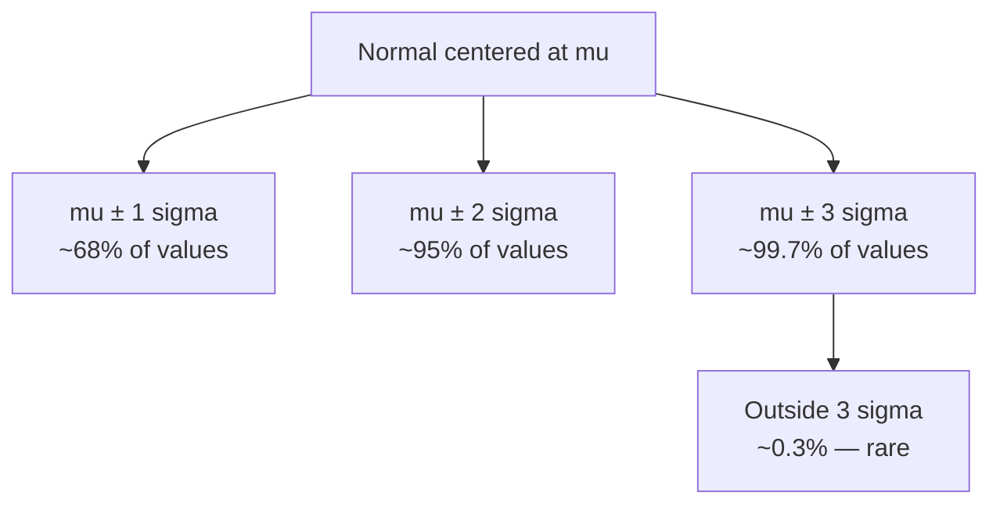
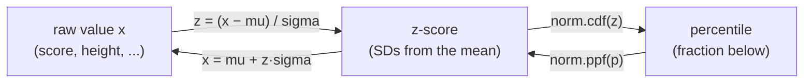

If you learn one distribution deeply, make it the **Normal** — the
symmetric bell curve. Not because the world is secretly all bell curves
(it isn't, and we'll be blunt about that), but because the normal is the
hub the rest of statistics connects to. Confidence intervals, z-scores,
the central limit theorem, most hypothesis tests — they all speak
"normal." Get fluent here and the inference chapters become much easier.

This page does three things. First, *why* the normal appears so often
(a preview of the central limit theorem). Second, the practical fluency:
the **68–95–99.7 rule**, **z-scores**, and converting freely between raw
values, z-scores, and percentiles. Third — and just as important — *when
the normal is the wrong model*, because assuming normality on skewed or
heavy-tailed data is one of the most expensive mistakes in applied
statistics.

## Why the normal shows up everywhere

The normal isn't common by coincidence. It's what you get when many
small, independent effects **add up**. A person's height is the sum of
countless genetic and environmental nudges; measurement error is the sum
of many tiny perturbations; a daily total is the sum of many
transactions. Whenever a quantity is the accumulation of lots of small,
roughly independent contributions, its distribution drifts toward a bell
curve — *regardless* of what the individual pieces look like.

<Callout type="info" title="A preview of the central limit theorem">
The deep reason is the **central limit theorem (CLT)**: sums and
**averages** of many independent values are approximately normal, even
when the underlying data is not. This is why the normal governs *sample
means* — and therefore confidence intervals and tests — even for decidedly
non-normal raw data. We give the CLT its own page later; for now, just
hold the idea: *averaging manufactures bell curves*.
</Callout>

The normal has exactly two parameters: the mean $\mu$ sets the
**center**, and the standard deviation $\sigma$ sets the **spread**.
Change $\mu$ and the curve slides; change $\sigma$ and it gets wider or
narrower. The shape is always the same symmetric bell.

<CodeBlock
  adapter="python"
  initialCode={`import numpy as np
import pandas as pd
import plotly.express as px
from scipy import stats

x = np.linspace(-6, 14, 500)

# Same shape, different center and spread.
curves = pd.DataFrame({
    "x": np.tile(x, 3),
    "density": np.concatenate([
        stats.norm(loc=0, scale=1).pdf(x),
        stats.norm(loc=4, scale=1).pdf(x),
        stats.norm(loc=4, scale=2.5).pdf(x),
    ]),
    "distribution": (["mu=0, sigma=1"] * len(x)
                     + ["mu=4, sigma=1"] * len(x)
                     + ["mu=4, sigma=2.5"] * len(x)),
})

fig = px.line(curves, x="x", y="density", color="distribution",
              title="The normal: mu moves the center, sigma sets the width")
fig.show()
`}
/>

## The 68–95–99.7 empirical rule

The normal's most useful everyday fact is the **empirical rule**: for
*any* normal distribution, the fraction of data within a fixed number of
standard deviations of the mean is fixed.

- About **68%** of values fall within **1σ** of the mean.
- About **95%** fall within **2σ**.
- About **99.7%** fall within **3σ**.

This is what lets you eyeball whether a value is ordinary or surprising.
If exam scores are normal with $\mu = 100$, $\sigma = 15$, then ~95% of
people score between 70 and 130; a score of 145 (3σ out) is genuinely
rare.

<CodeBlock
  adapter="python"
  initialCode={`from scipy import stats

d = stats.norm(loc=0, scale=1)   # standard normal

# The empirical rule, computed from the CDF (area within ±k sigma).
for k in (1, 2, 3):
    inside = d.cdf(k) - d.cdf(-k)
    print(f"Within {k} sigma: {inside*100:5.2f}% of values")

print("\\n68-95-99.7 are the rounded versions of these exact numbers.")
`}
/>

### Shading the empirical-rule bands

Seeing the bands cements the intuition. The width of each band is the
same multiple of σ for every normal — only the scale changes.

<CodeBlock
  adapter="python"
  initialCode={`import numpy as np
import plotly.graph_objects as go
from scipy import stats

mu, sigma = 100, 15
d = stats.norm(loc=mu, scale=sigma)
x = np.linspace(mu - 4*sigma, mu + 4*sigma, 500)

fig = go.Figure()
fig.add_trace(go.Scatter(x=x, y=d.pdf(x), mode="lines", name="PDF"))

# Shade the central 95% band (mu ± 2 sigma).
band = (x >= mu - 2*sigma) & (x <= mu + 2*sigma)
fig.add_trace(go.Scatter(
    x=x[band], y=d.pdf(x[band]), fill="tozeroy",
    mode="none", name="mu ± 2 sigma (~95%)"))

fig.update_layout(title="Normal(100, 15): the central ~95% band",
                  xaxis_title="score", yaxis_title="density")
fig.show()

print(f"~95% of scores fall between {mu-2*sigma} and {mu+2*sigma}.")
`}
/>

<Callout type="danger" title="Misconception: the empirical rule applies to all data">
68–95–99.7 is a fact about the **normal** distribution **only**. Apply
it to skewed income data and you'll badly miscount the tails — "within
2σ" might capture far less than 95%, and the mean ± 2σ can even dip below
zero for a strictly positive quantity. Before invoking the empirical
rule, confirm the data is actually roughly normal. On non-normal data it
simply isn't true.
</Callout>

## Standardization and z-scores

Different normals live on different scales — test scores around 100,
heights around 170 cm, temperatures around 20°C. **Standardization**
puts them all on one common ruler by converting each value to a
**z-score**: how many standard deviations it sits from its mean.

$$
z = \frac{x - \mu}{\sigma}
$$

A z-score of 0 is exactly average; +2 is two standard deviations above
the mean; −1.5 is one and a half below. Once a value is a z-score, you've
stripped away the units, and you can compare a test score to a height to
a temperature on equal footing. The distribution of z-scores is the
**standard normal**: $\mu = 0$, $\sigma = 1$ — `stats.norm()` with no
arguments.

<CodeBlock
  adapter="python"
  initialCode={`from scipy import stats

# IQ-like scores: mean 100, sd 15. How unusual is a score of 130?
mu, sigma = 100, 15
x = 130

z = (x - mu) / sigma
print(f"z-score of {x}: {z:.2f}  (it's {z:.0f} SDs above the mean)")

# The percentile: what fraction of people score BELOW 130?
# Two equivalent routes — standardize then use the standard normal,
# or just use the original distribution's cdf directly.
pct_via_z   = stats.norm().cdf(z)
pct_direct  = stats.norm(loc=mu, scale=sigma).cdf(x)
print(f"Percentile via z-score:    {pct_via_z*100:.1f}%")
print(f"Percentile via norm.cdf(x):{pct_direct*100:.1f}%")
print("\\nSame answer: standardizing and using norm.cdf are equivalent.")
`}
/>

<Callout type="danger" title="Misconception: a z-score IS a probability">
A z-score is a **position** (distance in standard deviations), not a
probability. A z of 2 doesn't mean "2%" or "0.02." To turn a z-score
into a probability or percentile you must pass it through the CDF:
`norm.cdf(2) ≈ 0.977`, meaning ~97.7% of values fall below it. The
z-score locates you; the CDF tells you what fraction is below.
</Callout>

### Converting in all directions

The three quantities — raw value, z-score, percentile — are
interchangeable. Pick the right tool for the direction you need:

- **value → z**: `z = (x - mu) / sigma`
- **z → percentile**: `norm.cdf(z)`
- **percentile → z**: `norm.ppf(p)`
- **z → value**: `x = mu + z * sigma`
- **value → percentile** (directly): `norm(loc=mu, scale=sigma).cdf(x)`
- **percentile → value** (directly): `norm(loc=mu, scale=sigma).ppf(p)`

<CodeBlock
  adapter="python"
  initialCode={`from scipy import stats

mu, sigma = 100, 15
d = stats.norm(loc=mu, scale=sigma)
z_dist = stats.norm()   # standard normal

# "What score marks the 90th percentile?" (percentile -> value)
score_90 = d.ppf(0.90)
print(f"90th-percentile score: {score_90:.1f}")

# Express that as a z-score (percentile -> z)
z_90 = z_dist.ppf(0.90)
print(f"...which is z = {z_90:.3f}")

# Round-trip check: rebuild the score from the z-score (z -> value)
print(f"Rebuild from z: mu + z*sigma = {mu + z_90 * sigma:.1f}")
`}
/>

<ChallengeCard
  adapter="python"
  title="Standardize values and find their percentiles"
  instructions={`SAT scores are modeled as **Normal** with mean **1050** and standard deviation **200**.

For three students who scored **900, 1050, and 1300**, compute:

- **\`z_scores\`** — a list of their z-scores \`(x - mu) / sigma\`, in the same order (a list of 3 \`float\`s).
- **\`percentiles\`** — a list of the fraction scoring **at or below** each value, using \`stats.norm(...).cdf(...)\`, in the same order (a list of 3 \`float\`s).

Hints:

- z-score for value \`x\`: \`(x - 1050) / 200\`.
- Percentile for value \`x\`: \`stats.norm(loc=1050, scale=200).cdf(x)\`.
- A z-score of 0 (for 1050) should give a percentile of 0.5.`}
  initCode={`from scipy import stats
mu, sigma = 1050, 200
scores = [900, 1050, 1300]`}
  initialCode={`# TODO: compute z_scores and percentiles (both lists of 3 floats, same order)
z_scores = None
percentiles = None

print("z-scores:   ", z_scores)
print("percentiles:", percentiles)
`}
  solutionCode={`d = stats.norm(loc=mu, scale=sigma)
z_scores = [float((x - mu) / sigma) for x in scores]
percentiles = [float(d.cdf(x)) for x in scores]

print("z-scores:   ", z_scores)
print("percentiles:", percentiles)
`}
  tests={[
    {
      id: "shapes",
      name: "both are lists of 3 floats",
      description: "Correct types and lengths",
      code: `assert isinstance(z_scores, list) and len(z_scores) == 3
assert isinstance(percentiles, list) and len(percentiles) == 3
assert all(isinstance(v, float) for v in z_scores)
assert all(isinstance(v, float) for v in percentiles)`,
    },
    {
      id: "z_values",
      name: "z-scores are correct",
      description: "(x - mu) / sigma for each score",
      code: `expected = [(x - 1050) / 200 for x in [900, 1050, 1300]]
assert all(abs(a - b) < 1e-9 for a, b in zip(z_scores, expected))`,
    },
    {
      id: "center",
      name: "the score of 1050 maps to the 50th percentile",
      description: "Mean sits at percentile 0.5",
      code: `assert abs(percentiles[1] - 0.5) < 1e-9`,
    },
    {
      id: "pct_values",
      name: "percentiles match norm.cdf",
      description: "Correct cumulative probabilities",
      code: `from scipy import stats
d = stats.norm(loc=1050, scale=200)
expected = [float(d.cdf(x)) for x in [900, 1050, 1300]]
assert all(abs(a - b) < 1e-9 for a, b in zip(percentiles, expected))`,
    },
  ]}
/>

<ChallengeCard
  adapter="python"
  title="Find the cutoff for the top 5%"
  instructions={`A standardized aptitude test is **Normal** with mean **1050** and standard deviation **200**. A scholarship goes to the **top 5%** of scorers.

Find the **minimum score** needed to be in the top 5% — i.e. the value with **95%** of scores at or below it (the 95th percentile).

- Build \`d = stats.norm(loc=1050, scale=200)\`.
- The top 5% starts at the 95th percentile: \`d.ppf(0.95)\`.
- Store the answer as a plain Python \`float\` in **\`cutoff\`**.`}
  initCode={`from scipy import stats
mu, sigma = 1050, 200`}
  initialCode={`# TODO: find the top-5% cutoff score
cutoff = None

print("Top-5% cutoff score:", cutoff)
`}
  solutionCode={`d = stats.norm(loc=mu, scale=sigma)
cutoff = float(d.ppf(0.95))

print("Top-5% cutoff score:", cutoff)
`}
  tests={[
    {
      id: "type",
      name: "cutoff is a float",
      description: "Returns a numeric value",
      code: `assert isinstance(cutoff, float)`,
    },
    {
      id: "value",
      name: "cutoff is the 95th percentile",
      description: "Matches ppf(0.95)",
      code: `from scipy import stats
expected = float(stats.norm(loc=1050, scale=200).ppf(0.95))
assert abs(cutoff - expected) < 1e-6`,
    },
    {
      id: "tail",
      name: "exactly 5% of scores are at or above the cutoff",
      description: "sf(cutoff) is about 0.05",
      code: `from scipy import stats
d = stats.norm(loc=1050, scale=200)
assert abs(d.sf(cutoff) - 0.05) < 1e-6`,
    },
  ]}
/>

## When the data is NOT normal

The normal is a fantastic *default* and a terrible *assumption*. Vast
amounts of real data are decidedly non-normal, and treating it as normal
produces confidently wrong answers:

- **Skewed**: income, house prices, time-on-site, and most counts have a
  long right tail. The mean sits above the median, and "mean ± 2σ" can
  fall below zero — nonsense for a positive quantity.
- **Heavy-tailed**: financial returns, insurance claims, and network
  traffic produce extreme events *far* more often than a normal predicts.
  A "6-sigma" market move should be astronomically rare under normality,
  yet they happen every few years.
- **Bounded / discrete**: proportions live in [0, 1]; counts are
  non-negative integers. A symmetric, unbounded bell can't honestly
  represent them, especially near the boundaries.

Let's *see* the misfit by forcing a normal onto right-skewed income data.

<CodeBlock
  adapter="python"
  initialCode={`import numpy as np
import plotly.graph_objects as go
from scipy import stats

rng = np.random.default_rng(0)

# Right-skewed incomes (lognormal): long tail of high earners.
income = rng.lognormal(mean=10.5, sigma=0.6, size=5000)
print(f"mean income   = {income.mean():,.0f}")
print(f"median income = {np.median(income):,.0f}  (well below the mean -> right skew)")

# Fit a normal by matching mean and SD, then overlay it on the histogram.
mu, sigma = income.mean(), income.std()
fitted = stats.norm(loc=mu, scale=sigma)

x = np.linspace(income.min(), income.max(), 400)
fig = go.Figure()
fig.add_trace(go.Histogram(x=income, histnorm="probability density",
                           nbinsx=60, name="actual income"))
fig.add_trace(go.Scatter(x=x, y=fitted.pdf(x), mode="lines",
                         name="fitted normal"))
fig.update_layout(title="A normal forced onto skewed income data — it doesn't fit",
                  xaxis_title="income", yaxis_title="density")
fig.show()

# The tell: the normal puts real probability BELOW zero, which is impossible.
print(f"\\nFitted normal says P(income < 0) = {fitted.cdf(0):.3f} — impossible for income!")
`}
/>

<Callout type="danger" title="The most expensive misconception: 'everything is normal'">
Assuming normality by default is a leading cause of underestimated risk.
A normal model assigns near-zero probability to extreme events, so it
**systematically under-prepares you for tails** — exactly where the
costly surprises live (market crashes, viral spikes, fraud bursts).
Before you assume normal, look at a histogram, check skew, and consider
whether the quantity is bounded or heavy-tailed. We'll cover principled
ways to check and choose a model in *Working with Distributions*.
</Callout>

<Callout type="tip" title="A practical reflex">
The normal earns its keep most reliably for **averages and sums** (via
the CLT) — which is why it underpins *inference about means* even when
raw data is skewed. For the **raw data itself**, treat normality as a
hypothesis to verify, not a given. "Is this approximately normal?" is a
question you answer with a plot, not an assumption you make for
convenience.
</Callout>

## Check your understanding

<MultipleChoice
  markdown={`Heights are normal with mean 170 cm and standard deviation 10 cm. Roughly what fraction of people are between **150 cm and 190 cm**?

- About 68%
  > 68% corresponds to ±1σ (160–180 cm); 150–190 cm is a wider band.
- [o] About 95%
  > The interval 150–190 cm is exactly the mean ± 2σ (170 ± 20), and the empirical rule puts about 95% of a normal distribution within two standard deviations.
- About 99.7%
  > 99.7% corresponds to ±3σ (140–200 cm), which is wider than the band given.
- About 50%
  > 50% would be everything on one side of the mean, not a symmetric ±2σ band.

150 to 190 is mean ± 2σ, the 95% band of the empirical rule.`}
/>

<MultipleChoice
  markdown={`A value has a z-score of **2.0**. Which statement is correct?

- There is a 2% chance of observing this value
  > A z-score is a position in standard-deviation units, not a probability; it doesn't translate to "2%."
- The value equals twice the mean
  > A z of 2 means two *standard deviations* above the mean, not twice the mean's magnitude.
- [o] The value sits two standard deviations above the mean, and about 97.7% of a normal distribution lies below it
  > Standardizing gives the distance in SDs (here +2), and passing that through the normal CDF (\`norm.cdf(2) ≈ 0.977\`) shows roughly 97.7% of values fall below it.
- About 95% of values are above this point
  > Only about 2.3% lie above z = 2; the ~95% figure refers to the band within ±2σ, not the area above +2σ.

A z-score locates the value; the CDF converts that location into a probability.`}
/>

<MultipleChoice
  markdown={`You have **right-skewed income** data and a colleague applies the 68–95–99.7 rule, reporting "95% of incomes fall within mean ± 2 standard deviations." Why is this unreliable here?

- The rule only works for small samples
  > Sample size isn't the issue; the empirical rule is about the *shape* of the distribution, not how much data you have.
- [o] The empirical rule holds for the normal distribution, and skewed income data violates that assumption — the actual coverage will differ and mean − 2σ may even be negative
  > Because the rule is a property of the symmetric normal curve, applying it to a long-tailed, strictly positive variable misstates the tail coverage and can produce an impossible (negative) lower bound.
- The rule requires the data to be in dollars
  > Units are irrelevant; the rule's validity depends on the distribution being approximately normal.
- The standard deviation can't be computed for skewed data
  > A standard deviation is perfectly computable for skewed data; the problem is that the 68–95–99.7 *coverage* no longer applies.

The empirical rule is a normal-distribution fact, not a universal one.`}
/>

<MultipleChoice
  markdown={`To convert a raw value \`x\` from a \`Normal(mu, sigma)\` into the **percentile** of scores at or below it, what's the correct computation?

- \`(x - mu) / sigma\`, and that is the percentile
  > That formula gives the *z-score* (a position), not a percentile; you still need to pass it through the CDF.
- [o] Compute \`z = (x - mu) / sigma\`, then \`stats.norm().cdf(z)\` (equivalently \`stats.norm(loc=mu, scale=sigma).cdf(x)\`)
  > Standardizing locates the value in SD units and the standard-normal CDF turns that location into the fraction below — and applying the CDF to the original distribution directly gives the identical result.
- \`stats.norm(loc=mu, scale=sigma).ppf(x)\`
  > \`ppf\` expects a probability (0 to 1), so feeding it a raw score is invalid and would not return a percentile.
- \`stats.norm().pdf((x - mu) / sigma)\`
  > The PDF returns a density height at that z-score, not the cumulative fraction below it.

Value to z (subtract mean, divide by σ), then z to percentile (CDF) — that's the standard pipeline.`}
/>

<MultipleChoice
  markdown={`Why does assuming a normal distribution tend to **underestimate the risk** of extreme events in finance?

- Because the normal has no mean
  > The normal has a well-defined mean; that's not the issue.
- Because financial returns are always perfectly normal
  > They are typically *heavy-tailed*, not normal, which is precisely the source of the problem.
- [o] Real returns are heavy-tailed, so extreme moves occur far more often than a normal predicts — the normal assigns near-zero probability to events that actually recur
  > A normal's tails fall off extremely fast, so a "many-sigma" move it deems essentially impossible shows up in markets every few years, leaving a normal-based model under-prepared for crashes.
- Because the standard deviation of returns is always zero
  > Returns have substantial, nonzero variability; a zero standard deviation would be the opposite problem.

Light normal tails systematically understate the frequency of the rare, costly events that matter most.`}
/>

<Callout type="success" title="Key takeaways">
- The normal arises when **many small independent effects add up**; the
  **CLT** is why it governs sums and averages even when raw data isn't
  normal.
- **68–95–99.7**: ~68% within 1σ, ~95% within 2σ, ~99.7% within 3σ —
  but only for **normal** data.
- A **z-score** $z = (x-\mu)/\sigma$ is a *position* (SDs from the mean),
  not a probability; convert with `norm.cdf` (z → percentile) and
  `norm.ppf` (percentile → z).
- Move freely among **raw value ↔ z-score ↔ percentile**; use the direct
  `norm(loc, scale).cdf`/`.ppf` when you want to skip the z step.
- **Do not assume normality by default.** Skewed, heavy-tailed, and
  bounded data break the model — and assuming normal there
  underestimates the tails where the expensive surprises live.
</Callout>
