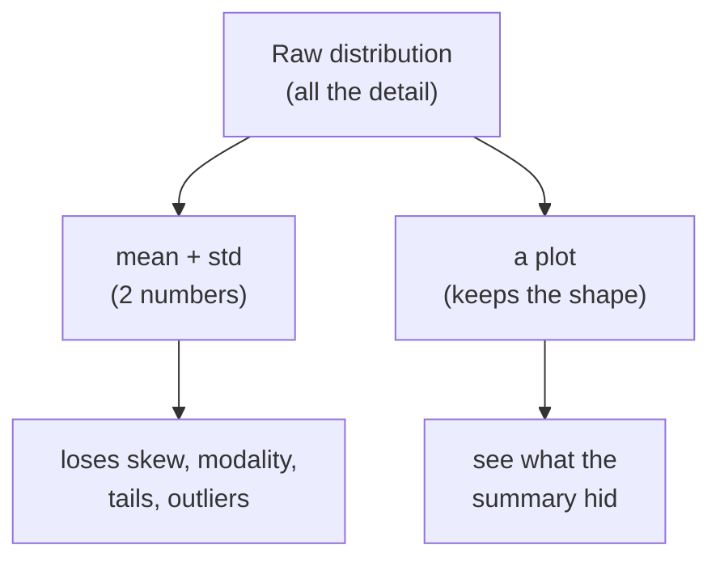
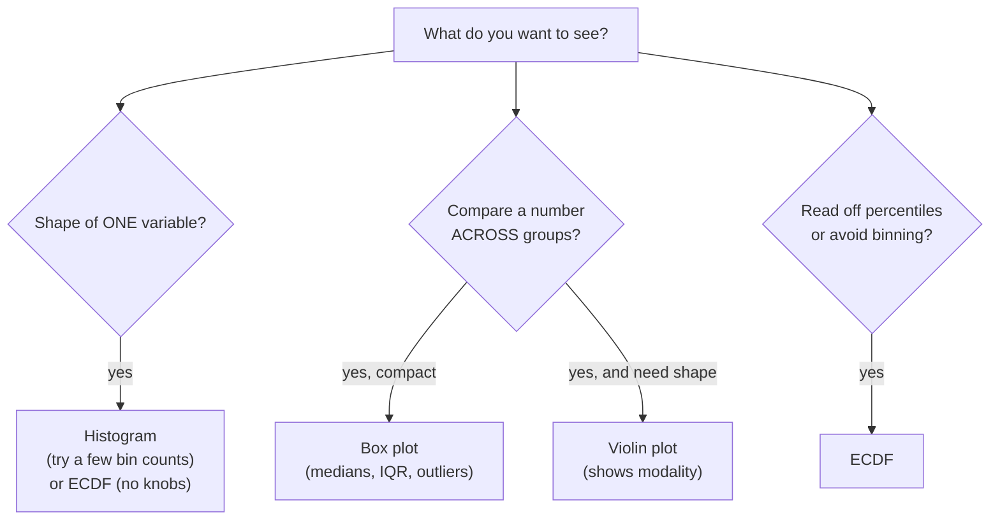

You can compute a mean, a standard deviation, and a skewness
coefficient without ever looking at your data. You shouldn't. A
handful of summary numbers can be identical across distributions that
look nothing alike — one a tidy bell, another two humps, a third a
flat slab with a spike. Before you summarize, before you run a test,
**plot the distribution**. This page is the visual companion to
*Shape and Outliers*: the same ideas (skew, modality, tails, outliers),
seen directly instead of inferred from coefficients.

The plots are simple — histograms, box plots, violins, and ECDFs — but
each answers a different question, and knowing which to reach for is a
real skill. We'll use Plotly Express and the built-in `tips` dataset so
every chart runs as-is.

<svg
  viewBox="0 0 640 200"
  role="img"
  aria-label="Three distributions — a tidy bell, two separated humps, and a flat slab — each sit above the exact same yellow mean dot and green spread pill, joined by equals signs — identical summaries, completely different shapes, so plot before you summarize"
  style={{ display: "block", width: "100%", maxWidth: "640px", height: "auto", margin: "2.5rem auto" }}
>
  <g fill="currentColor" opacity="0.18">
    <rect x="60" y="128" width="160" height="4" rx="2" />
    <rect x="240" y="128" width="160" height="4" rx="2" />
    <rect x="420" y="128" width="160" height="4" rx="2" />
  </g>
  <g style={{ color: "var(--ds-blue-500)" }} fill="currentColor" fillOpacity="0.35">
    <path d="M 70 130 C 100 130 105 58 140 58 C 175 58 180 130 210 130 Z" />
    <path d="M 250 130 C 268 130 270 78 290 78 C 310 78 308 118 320 118 C 332 118 330 78 350 78 C 370 78 372 130 390 130 Z" />
    <rect x="430" y="88" width="140" height="42" rx="8" />
  </g>
  <g style={{ color: "var(--ds-yellow-500)" }} fill="currentColor">
    <circle cx="140" cy="154" r="5" />
    <circle cx="320" cy="154" r="5" />
    <circle cx="500" cy="154" r="5" />
  </g>
  <g style={{ color: "var(--ds-green-500)" }} fill="currentColor" fillOpacity="0.45">
    <rect x="110" y="166" width="60" height="7" rx="3.5" />
    <rect x="290" y="166" width="60" height="7" rx="3.5" />
    <rect x="470" y="166" width="60" height="7" rx="3.5" />
  </g>
  <g fill="currentColor" opacity="0.5">
    <text x="230" y="166" textAnchor="middle" fontFamily="var(--font-mono), ui-monospace, monospace" fontSize="20">=</text>
    <text x="410" y="166" textAnchor="middle" fontFamily="var(--font-mono), ui-monospace, monospace" fontSize="20">=</text>
  </g>
</svg>

## Why summaries lie: always plot first

The classic demonstration is **Anscombe's quartet** — four datasets
with nearly identical means, variances, and correlations that look
completely different when plotted. The same trap shows up in one
dimension: distributions with the *same mean and standard deviation*
can have utterly different shapes. A summary is a lossy compression;
the plot is the original.

<CodeBlock
  adapter="python"
  files={[
    {
      filename: "main.py",
      starterCode: `import numpy as np

rng = np.random.default_rng(0)

# Three samples engineered to share (about) the same mean and std,
# but with totally different shapes.
n = 3000
bell = rng.normal(50, 15, size=n)
bimodal = np.concatenate([rng.normal(30, 6, n // 2), rng.normal(70, 6, n // 2)])
uniform = rng.uniform(50 - 15 * np.sqrt(3), 50 + 15 * np.sqrt(3), size=n)

for name, x in [("bell", bell), ("bimodal", bimodal), ("uniform", uniform)]:
    print(f"{name:>8}: mean={x.mean():5.1f}  std={x.std():4.1f}")

print("\\nNearly identical mean and std. Three completely different shapes.")
print("A mean and an SD cannot tell these apart — only a plot can.")
`,
    },
  ]}
/>

<Callout type="danger" title="Misconception: a mean and standard deviation fully describe a distribution">
They describe *center and spread* and nothing else — not the number of
peaks, not the skew, not the tails, not the outliers. Two datasets with
identical means and SDs can be a smooth bell and a pair of separated
humps. Reaching for a summary before a plot is how analysts miss
bimodality, outliers, and skew that change the whole conclusion.
</Callout>

## Histograms: the workhorse, and the bin trap

A **histogram** slices the range into bins and counts how many values
fall in each. It's the first plot you reach for to see shape: skew,
peaks, gaps, outliers all jump out. But a histogram has a hidden knob —
the **bin count** — and *the same data can tell different stories at
different bin counts*. Too few bins hides structure (two peaks blur into
one); too many bins turns signal into noise (every bin has one or two
points). There is no single "objective" bin count.

<svg
  viewBox="0 0 640 180"
  role="img"
  aria-label="The same data binned three ways: two fat bars that blur the shape away, a six-bar version where the hump appears with a green dot of approval above it, and a forest of skinny one-count spikes — the bin knob decides which story a histogram tells"
  style={{ display: "block", width: "100%", maxWidth: "640px", height: "auto", margin: "2.5rem auto" }}
>
  <g fill="currentColor" opacity="0.18">
    <rect x="56" y="140" width="160" height="4" rx="2" />
    <rect x="240" y="140" width="160" height="4" rx="2" />
    <rect x="424" y="140" width="160" height="4" rx="2" />
  </g>
  <g style={{ color: "var(--ds-blue-500)" }} fill="currentColor" fillOpacity="0.45">
    <rect x="64" y="66" width="70" height="74" rx="6" />
    <rect x="140" y="96" width="70" height="44" rx="6" />
  </g>
  <g style={{ color: "var(--ds-blue-500)" }} fill="currentColor" fillOpacity="0.6">
    <rect x="248" y="124" width="20" height="16" rx="3" />
    <rect x="272" y="102" width="20" height="38" rx="3" />
    <rect x="296" y="78" width="20" height="62" rx="3" />
    <rect x="320" y="88" width="20" height="52" rx="3" />
    <rect x="344" y="112" width="20" height="28" rx="3" />
    <rect x="368" y="128" width="20" height="12" rx="3" />
  </g>
  <g style={{ color: "var(--ds-blue-500)" }} fill="currentColor" fillOpacity="0.5">
    <rect x="430" y="118" width="6" height="22" rx="2" />
    <rect x="440" y="92" width="6" height="48" rx="2" />
    <rect x="450" y="126" width="6" height="14" rx="2" />
    <rect x="460" y="74" width="6" height="66" rx="2" />
    <rect x="470" y="110" width="6" height="30" rx="2" />
    <rect x="480" y="84" width="6" height="56" rx="2" />
    <rect x="490" y="120" width="6" height="20" rx="2" />
    <rect x="500" y="98" width="6" height="42" rx="2" />
    <rect x="510" y="130" width="6" height="10" rx="2" />
    <rect x="520" y="88" width="6" height="52" rx="2" />
    <rect x="530" y="116" width="6" height="24" rx="2" />
    <rect x="540" y="102" width="6" height="38" rx="2" />
    <rect x="550" y="126" width="6" height="14" rx="2" />
    <rect x="560" y="108" width="6" height="32" rx="2" />
  </g>
  <g style={{ color: "var(--ds-green-500)" }} fill="currentColor">
    <circle cx="320" cy="52" r="7" />
  </g>
</svg>

<CodeBlock
  adapter="python"
  files={[
    {
      filename: "main.py",
      starterCode: `import plotly.express as px

tips = px.data.tips()

# The SAME column, three bin counts — three different impressions.
for nbins in [5, 20, 80]:
    fig = px.histogram(
        tips, x="total_bill", nbins=nbins, title=f"total_bill with nbins={nbins}"
    )
    fig.show()

print("Few bins: smooth but hides detail. Many bins: spiky and noisy.")
print("Try several bin counts before trusting any single shape.")
`,
    },
  ]}
/>

<Callout type="warn" title="Misconception: there's one correct, objective bin count">
Bin count is a *choice*, and it changes the story. Plotting libraries
pick a default with a rule of thumb, but that default is not "the
truth." Good practice: view your histogram at a few bin counts (and
consider an ECDF, below, which has no bins at all) before concluding
anything about shape.
</Callout>

<MultipleChoice
  markdown={`You plot a histogram of session durations with 6 bins and see a single smooth hump. A colleague plots the *same data* with 60 bins and sees two clear peaks. Who is right?

- The 6-bin version, because fewer bins is less noisy
  > Fewer bins can smooth genuine structure away, merging two real peaks into one — "less noisy" can also mean "hiding the signal."
- The 60-bin version, because more bins always shows more truth
  > More bins can also manufacture spurious spikiness from random sampling, so "more bins = more truth" isn't a reliable rule either.
- [o] Neither bin count is automatically authoritative; you should view several and likely confirm the two peaks with an ECDF or by checking for two subgroups
  > Because bin count is a tunable choice that changes the picture, the responsible move is to look across bin counts and corroborate with a bin-free view before concluding.
- They cannot both be looking at the same data
  > They can: identical data routinely yields different-looking histograms purely from the bin-count setting, which is the whole point of the bin trap.

Bin count is a knob, not a fact — corroborate apparent structure rather than trusting one setting.`}
/>

## Box plots: five-number summary and outliers at a glance

A **box plot** draws the distribution's skeleton: the box spans `Q1` to
`Q3` (the IQR), a line marks the median, and the whiskers reach to the
last points within the `1.5×IQR` fences from *Measures of Spread* and
*Shape and Outliers*. Points beyond the whiskers show as individual
outlier dots. Box plots are compact and *brilliant for comparing
groups* side by side — but they hide modality, because a box plot of a
two-humped distribution looks just like a box plot of a one-humped one.

<CodeBlock
  adapter="python"
  files={[
    {
      filename: "main.py",
      starterCode: `import plotly.express as px

tips = px.data.tips()

# Compare the bill distribution across days, with outliers shown.
fig = px.box(
    tips,
    x="day",
    y="total_bill",
    color="day",
    points="outliers",
    title="total_bill by day (box = IQR, line = median, dots = outliers)",
)
fig.update_layout(showlegend=False)
fig.show()

print("Box plots make group comparisons easy and flag outliers,")
print("but a box plot CANNOT show whether a group is bimodal.")
`,
    },
  ]}
/>

<Callout type="warn" title="Box plots hide modality">
Because a box plot only knows quartiles, two distinct humps and one
broad hump can produce the *identical* box. When you need to see whether
a group has multiple peaks, use a histogram or a violin plot, not a box
plot alone.
</Callout>

## Violin plots: shape plus summary

A **violin plot** is a box plot wearing the distribution's silhouette.
It mirrors a smoothed density (a KDE, below) on each side, so you see
the actual shape — including **bimodality** that a box plot would hide —
while still comparing groups. The cost is that the smooth outline
depends on a smoothing choice, so very small samples can look smoother
and more reliable than they are.

<CodeBlock
  adapter="python"
  files={[
    {
      filename: "main.py",
      starterCode: `import plotly.express as px

tips = px.data.tips()

fig = px.violin(
    tips,
    x="day",
    y="total_bill",
    color="day",
    box=True,  # draw the box plot inside the violin
    points=False,
    title="total_bill by day (violin shows the full shape)",
)
fig.update_layout(showlegend=False)
fig.show()

print("The violin's width shows where data is dense; a second bulge")
print("would reveal bimodality that the inner box plot alone cannot.")
`,
    },
  ]}
/>

## KDE: a smooth histogram (intuition only)

A **kernel density estimate (KDE)** is the smooth curve you often see
draped over a histogram or forming a violin's outline. The intuition:
instead of dropping each point into a hard bin, you place a little
smooth bump on each point and add the bumps up, giving a continuous
estimate of the density. It trades the histogram's jagged,
bin-dependent steps for a smooth curve — but it has its *own* knob (the
**bandwidth**, analogous to bin width): too smooth erases peaks, too
wiggly invents them. Treat a KDE as a smoothed impression of shape, not
ground truth.

<Callout type="info" title="Histogram vs KDE">
A histogram shows *counts* in discrete bins (honest about the raw data,
jagged). A KDE shows a *smooth density* (easy to read, but smoothing can
add or hide features). They're two views of the same thing; the
bin-count trap and the bandwidth trap are the same trap in different
clothes. When in doubt, the ECDF below sidesteps both.
</Callout>

## ECDF: the plot with no knobs

The **empirical cumulative distribution function (ECDF)** answers, for
every value `x`, "what fraction of the data is `≤ x`?" You sort the
data and walk upward from 0 to 1. Its superpower: it has **no bins and
no bandwidth** — nothing to tune, nothing to accidentally hide. Every
data point is shown exactly. It's less intuitive at a glance than a
histogram, but it's the honest choice for reading off **percentiles**
("90% of orders are under \\$40"), comparing groups, and spotting
features without worrying you've smoothed them away.

<CodeBlock
  adapter="python"
  files={[
    {
      filename: "main.py",
      starterCode: `import plotly.express as px

tips = px.data.tips()

fig = px.ecdf(
    tips,
    x="total_bill",
    color="sex",
    title="ECDF of total_bill: fraction of bills at or below each value",
)
fig.show()

print("Read it like this: find a dollar amount on the x-axis, go up to")
print("the curve, and the y-value is the proportion of bills at or below it.")
print("No bins, no bandwidth — nothing tuned away.")
`,
    },
  ]}
/>

The y-value at any `x` is a **percentile read directly off the curve** —
which is exactly the quantity the second challenge below asks you to
compute by hand.

## Which plot when?

Each plot is tuned to a different question. This is the decision you'll
make dozens of times in real EDA.

<Callout type="tip" title="A reliable first pass">
For a single variable, start with a **histogram** at a couple of bin
counts to read shape, then an **ECDF** to nail down percentiles without
binning artifacts. To compare groups, use **box plots** for a compact
overview and **violins** when modality matters. Pair every plot with the
shape statistics from *Shape and Outliers* — eyes and numbers
cross-checking each other.
</Callout>

## Challenge 1: histogram bin counts by hand

`np.histogram` is the numeric engine under every histogram: give it
data and a bin count and it returns the **counts per bin** plus the
**bin edges** — no chart required. Computing these yourself is how you'd
power a custom plot or test a binning rule.

<ChallengeCard
  adapter="python"
  title="Compute histogram bin counts with NumPy"
  instructions={`Use \`np.histogram\` to bin the provided array \`values\` into **10 equal-width bins**.

Produce:

- **\`counts\`** — a NumPy array of length 10 giving how many values fall in each bin.
- **\`edges\`** — a NumPy array of length 11 giving the bin edges (\`np.histogram\` returns both).
- **\`total_counted\`** — an \`int\` equal to the sum of \`counts\` (it should equal \`len(values)\`, since the outer edges span the full range).
- **\`fullest_bin\`** — an \`int\`, the index (0-based) of the bin with the most values, via \`np.argmax\`.

Use \`np.histogram(values, bins=10)\` and unpack its two return values.`}
  files={[
    {
      filename: "main.py",
      initCode: `import numpy as np

rng = np.random.default_rng(42)
values = rng.normal(100, 15, size=500)`,
      starterCode: `import numpy as np

# TODO: bin 'values' into 10 equal-width bins
counts = None
edges = None
total_counted = None
fullest_bin = None
`,
      solutionCode: `import numpy as np

counts, edges = np.histogram(values, bins=10)
total_counted = int(counts.sum())
fullest_bin = int(np.argmax(counts))

print("counts:", counts)
print("edges:", edges.round(1))
print("total_counted:", total_counted, "(len values =", len(values), ")")
print("fullest_bin index:", fullest_bin)
`,
    },
  ]}
  tests={[
    {
      id: "counts_shape",
      name: "counts has length 10",
      description: "Ten bins",
      code: `import numpy as np
assert isinstance(counts, np.ndarray)
assert counts.shape == (10,)`,
    },
    {
      id: "edges_shape",
      name: "edges has length 11",
      description: "Ten bins means eleven edges",
      code: `import numpy as np
assert isinstance(edges, np.ndarray)
assert edges.shape == (11,)`,
    },
    {
      id: "counts_correct",
      name: "counts match np.histogram",
      description: "Bin counts are correct",
      code: `import numpy as np
_c, _e = np.histogram(values, bins=10)
assert np.array_equal(counts, _c)`,
    },
    {
      id: "total",
      name: "total_counted is the sum of counts",
      description: "Equals len(values)",
      code: `assert isinstance(total_counted, int)
assert total_counted == int(counts.sum()) == len(values)`,
    },
    {
      id: "fullest",
      name: "fullest_bin is the argmax bin",
      description: "Index of the tallest bin",
      code: `import numpy as np
assert isinstance(fullest_bin, int)
assert fullest_bin == int(np.argmax(counts))`,
    },
  ]}
/>

## Challenge 2: ECDF values and a threshold

An ECDF is just sorted data paired with cumulative proportions. For
sorted values, the ECDF after the `i`-th point (1-based) is `i / n`.
Reading the curve at a threshold answers "what fraction of the data is
at or below this value?" — a percentile, computed directly.

<ChallengeCard
  adapter="python"
  title="Compute an ECDF and read it at a threshold"
  instructions={`Build the **empirical CDF** of the provided array \`data\` from scratch.

Produce:

- **\`x_sorted\`** — \`data\` sorted ascending, as a NumPy array (use \`np.sort\`).
- **\`ecdf\`** — a NumPy array the same length as \`data\` where the \`i\`-th entry (0-based) is \`(i + 1) / n\` (the cumulative proportion up to and including \`x_sorted[i]\`). With \`n = len(data)\`, the last value must be exactly \`1.0\`.
- **\`prop_at_threshold\`** — a plain Python \`float\`: the fraction of \`data\` **less than or equal to \`threshold\`** (the ECDF value at \`threshold\`). Compute it as \`(data <= threshold).mean()\`.

Use the provided \`data\` array and \`threshold\` value.`}
  files={[
    {
      filename: "main.py",
      initCode: `import numpy as np

rng = np.random.default_rng(7)
data = rng.normal(50, 10, size=400)
threshold = 55.0`,
      starterCode: `import numpy as np

# TODO: build the ECDF and read it at 'threshold'
x_sorted = None
ecdf = None
prop_at_threshold = None
`,
      solutionCode: `import numpy as np

n = len(data)
x_sorted = np.sort(data)
ecdf = np.arange(1, n + 1) / n
prop_at_threshold = float((data <= threshold).mean())

print("first 3 sorted:", x_sorted[:3].round(2))
print("last ecdf value:", ecdf[-1])
print(f"proportion <= {threshold}: {prop_at_threshold:.3f}")
`,
    },
  ]}
  tests={[
    {
      id: "sorted",
      name: "x_sorted is data sorted ascending",
      description: "Sorted copy of the data",
      code: `import numpy as np
assert isinstance(x_sorted, np.ndarray)
assert np.array_equal(x_sorted, np.sort(data))`,
    },
    {
      id: "ecdf_shape_end",
      name: "ecdf has the right length and ends at 1.0",
      description: "Cumulative proportions",
      code: `import numpy as np
assert isinstance(ecdf, np.ndarray)
assert ecdf.shape == (len(data),)
assert abs(ecdf[-1] - 1.0) < 1e-12`,
    },
    {
      id: "ecdf_values",
      name: "ecdf values are (i+1)/n",
      description: "Matches the empirical CDF definition",
      code: `import numpy as np
_n = len(data)
assert np.allclose(ecdf, np.arange(1, _n + 1) / _n)`,
    },
    {
      id: "threshold_type",
      name: "prop_at_threshold is a float",
      description: "Plain Python float",
      code: `assert isinstance(prop_at_threshold, float)`,
    },
    {
      id: "threshold_value",
      name: "prop_at_threshold is correct",
      description: "Fraction of data <= threshold",
      code: `import numpy as np
assert abs(prop_at_threshold - float((data <= threshold).mean())) < 1e-12
assert 0.0 <= prop_at_threshold <= 1.0`,
    },
  ]}
/>

## Check your understanding

<MultipleChoice
  markdown={`Two distributions have the same mean and the same standard deviation. What can you conclude about their shapes?

- They must have the same shape, since mean and SD define a distribution
  > Mean and SD pin down only center and spread; many different shapes (bell, bimodal, uniform, skewed) share the same pair of values.
- [o] Almost nothing — they could differ in skew, number of peaks, tail heaviness, and outliers, so you must plot them to compare shapes
  > Because those two numbers omit skew, modality, tails, and outliers, distributions with matching mean and SD can look entirely different, which is exactly why plotting comes first.
- They must both be approximately normal
  > Sharing a mean and SD says nothing about normality; uniform, bimodal, and heavily skewed data can all share the same mean and SD.
- One must be the other shifted left or right
  > A shift would change the mean; identical means rule that out, and equal SDs still permit completely different shapes.

Equal summaries do not imply equal shapes — the plot is where the differences live.`}
/>

<MultipleChoice
  markdown={`Which plot is the best choice when you specifically want to check whether a single variable is **bimodal** (has two peaks)?

- A box plot
  > A box plot is built from quartiles only, so a two-humped distribution and a single broad hump can produce the identical box — it cannot reveal modality.
- [o] A histogram (viewed at a sensible bin count) or a violin plot
  > Both display the density across the range, so a second peak shows up as a second bump — unlike a box plot, which hides it.
- A single reported median
  > A median is one number describing the middle; it carries no information about how many peaks the distribution has.
- A bar chart of the mean
  > A bar of the mean shows one summarized height and reveals nothing about the distribution's peaks.

To see peaks, you need a plot that shows density across the range — a histogram or violin, not a box plot.`}
/>

<MultipleChoice
  markdown={`A key advantage of the **ECDF** over a histogram is that it:

- Looks more intuitive to non-technical audiences
  > Histograms are usually the *more* intuitive choice for general audiences; the ECDF's edge is technical, not about intuitiveness.
- [o] Has no bin-count or bandwidth to tune, so it shows every data point without smoothing-driven artifacts and lets you read percentiles directly
  > Since it plots cumulative proportion against sorted values with nothing to set, the ECDF can't hide or invent structure the way bin or bandwidth choices can, and its height is a percentile.
- Automatically removes outliers from the display
  > The ECDF shows every point, including outliers — it doesn't remove anything; that's part of why it's considered honest.
- Always reveals bimodality more clearly than a histogram
  > Two peaks read as changes in *slope* on an ECDF, which is often *subtler* than the obvious double hump of a histogram — so "always more clearly" is false.

The ECDF's strength is being knob-free and exact, which makes percentiles trivial to read.`}
/>

<MultipleChoice
  markdown={`You change a histogram's bin count from 10 to 50 and the apparent shape changes noticeably. What's the right takeaway?

- The data changed, so you should recollect it
  > The underlying data is identical; only the binning changed, so there's nothing to recollect.
- The 50-bin version is correct because higher resolution is always better
  > Higher bin counts can fracture a smooth distribution into noisy spikes from random sampling, so more bins isn't automatically more correct.
- [o] Bin count is a display choice that shapes the impression; you should view several bin counts and cross-check with a bin-free view like an ECDF before trusting any single shape
  > Because the picture depends on a tunable setting, the disciplined response is to look across settings and corroborate with a method that has no bins, rather than trusting one histogram.
- Histograms are useless and should be avoided
  > Histograms are valuable for reading shape; you just have to remember the bin count is a knob and confirm features across settings.

The bin-count sensitivity is a reason to corroborate, not a reason to abandon histograms.`}
/>

<Callout type="success" title="Key takeaways">
- **Plot before you summarize.** Mean and SD compress away skew,
  modality, tails, and outliers — distributions with identical summaries
  can look nothing alike.
- **Histograms** show shape but depend on a **bin count** that changes
  the story; there is no single "objective" number — view several.
- **Box plots** are compact and great for **comparing groups** and
  flagging outliers, but they **hide modality**.
- **Violin plots** add the full shape (revealing bimodality) on top of a
  box.
- **KDE** smooths a histogram (with a bandwidth knob of its own); the
  **ECDF** has **no knobs**, shows every point, and lets you read
  percentiles directly.
- Cross-check every plot with the shape statistics from *Shape and
  Outliers*, and lean on these views again when we study *The Normal
  Distribution*.
</Callout>
