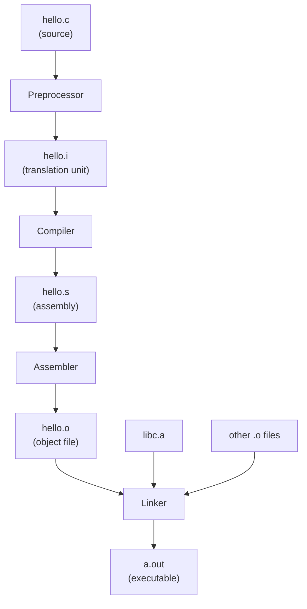

A C program is not "interpreted." It goes through four well-defined
stages to become something a CPU can run. Knowing what happens at
each stage is the difference between a confused programmer staring at
a *"undefined reference to `foo`"* error and one who instantly knows
to add `foo.c` to the link command.

## The four stages



In one `clang hello.c -o hello` command, the driver actually runs all
four stages in sequence — but you can stop after any one of them.

| Stage | Input | Output | Tool flag (clang/gcc) |
| --- | --- | --- | --- |
| Preprocess | `.c` | `.i` | `-E` |
| Compile | `.i` | `.s` | `-S` |
| Assemble | `.s` | `.o` | `-c` |
| Link | `.o` + libs | executable | (default) |

## Stage 1: the preprocessor

The preprocessor is a *text* engine. It runs before the compiler and
handles every line that starts with `#`:

- `#include <foo.h>` — paste the contents of `foo.h` here.
- `#define MAX 100` — replace every occurrence of `MAX` with `100`.
- `#ifdef DEBUG` / `#endif` — keep or drop the enclosed lines.
- `#pragma once` — non-standard but widely supported include guard.

It does **not** understand C syntax. It is just a smart find-and-
replace pass.

<CodeBlock
  adapter="c"
  initialCode={`#include <stdio.h>
#define SQUARE(x) ((x) * (x))
#define GREETING "Hello"

int main(void) {
    int n = 7;
    printf("%s, %d squared is %d\\n", GREETING, n, SQUARE(n));
    return 0;
}
`}
/>

After preprocessing, `SQUARE(n)` literally becomes `((n) * (n))`. The
outer parentheses are not decorative — they prevent surprises when
the macro is used in expressions like `SQUARE(a + b)`.

<Callout type="warn" title="Macros are textual, not function calls">
`#define DOUBLE(x) x * 2` looks fine until you write `DOUBLE(1 + 1)`,
which expands to `1 + 1 * 2 = 3` rather than `4`. **Always parenthesize
both the macro arguments and the whole macro body.**
</Callout>

## Header files and include guards

A header file (`.h`) typically contains type declarations, function
*declarations* (signatures, not bodies), and macros. It is shared
between several `.c` files via `#include`.

Because `#include` is just text substitution, including the same
header twice would re-declare everything and break the build. Two
fixes exist:

1. **Include guards** — the classic `#ifndef X / #define X / #endif`.
2. **`#pragma once`** — a one-liner supported by every modern compiler.

```c
// shapes.h
#ifndef SHAPES_H
#define SHAPES_H

double circle_area(double radius);

#endif
```

## Stage 2: compilation

The compiler takes one *translation unit* (a `.c` plus everything it
pulled in via `#include`) and produces assembly for the target CPU.
This is where syntax errors, type errors, and most warnings come from.

The compiler also runs your optimizations: dead-code elimination,
inlining, register allocation, loop unrolling, vectorization. Flags
like `-O0`, `-O1`, `-O2`, `-O3`, and `-Os` (size) control how
aggressively it does this.

## Stage 3: assembly

The assembler is the simplest stage: it translates human-readable
assembly into a binary object file (`.o` on Unix-like systems, `.obj`
on Windows). Object files contain machine code plus *symbols* — names
the linker can resolve.

## Stage 4: linking

The linker stitches multiple object files together. It also pulls in
standard libraries (libc for `printf`, libm for `sqrt`, etc.) and
resolves *undefined symbols* — references that one object file makes
to functions defined in another.

If you see:

```
undefined reference to `sqrt`
```

…it means the compiler found `#include <math.h>` (which declares
`sqrt`) but the linker never got `libm`. The fix is `-lm`.

If you see:

```
undefined reference to `greet`
```

…it means you declared `greet()` in a header and called it from
`main.c`, but never compiled or passed `greet.c` (or its `.o`) to the
linker.

<Callout type="info" title="The declaration / definition split">
A **declaration** says "such a function exists somewhere" — that's
what headers do. A **definition** is the actual body — that's what
`.c` files do. The compiler is happy with declarations; the *linker*
demands at least one definition per used symbol.
</Callout>

## Multi-file builds in the browser sandbox

The browser sandbox supports multiple translation units. Pass `files`
and `entryFilename` to `<CodeBlock>` and you can practice the same
header / implementation split you would use in a real project.

<CodeBlock
  adapter="c"
  entryFilename="main.c"
  files={[
    {
      filename: "main.c",
      initialContent: `#include <stdio.h>
#include "mathx.h"

int main(void) {
    int a = 6, b = 7;
    printf("add(%d, %d) = %d\\n", a, b, add(a, b));
    printf("mul(%d, %d) = %d\\n", a, b, mul(a, b));
    return 0;
}
`,
    },
    {
      filename: "mathx.h",
      initialContent: `#ifndef MATHX_H
#define MATHX_H

int add(int a, int b);
int mul(int a, int b);

#endif
`,
    },
    {
      filename: "mathx.c",
      initialContent: `#include "mathx.h"

int add(int a, int b) { return a + b; }
int mul(int a, int b) { return a * b; }
`,
    },
  ]}
/>

Try deleting `mathx.c` from the file tree (you cannot in this widget,
but imagine it) — you would get an *"undefined reference to add"*
error from the linker, not the compiler. The compiler was happy with
the declaration in `mathx.h`; the linker had nothing to point those
calls at.

## Static vs dynamic libraries

Two flavors of library exist on most systems:

- **Static library** (`libfoo.a` on Unix, `foo.lib` on Windows): the
  linker copies the needed object code *into your binary*. The
  resulting executable is self-contained but larger.
- **Shared / dynamic library** (`libfoo.so`, `libfoo.dylib`, `foo.dll`):
  the binary just records "I depend on `libfoo`"; the OS loads it at
  runtime and resolves the symbols. Smaller binaries; multiple
  programs share one copy in memory; but you must ship the library.

`printf` lives in libc, which is dynamic on virtually every desktop
system. That is why a "hello world" binary is so small.

## Common compiler flags worth knowing

| Flag | What it does |
| --- | --- |
| `-Wall -Wextra` | Turn on most useful warnings |
| `-Werror` | Treat warnings as errors (great for CI) |
| `-std=c11` / `-std=c17` | Pick the C standard version |
| `-O2`, `-O3`, `-Os` | Optimize for speed / size |
| `-g` | Embed debug info for gdb / lldb |
| `-fsanitize=address` | Compile with AddressSanitizer |
| `-pedantic` | Reject GNU extensions, stay portable |
| `-I path` | Add an include search path |
| `-L path -lfoo` | Add a library search path and link `libfoo` |

## Practice: split a program

<ChallengeCard
  adapter="c"
  title="Implement util.c so the program links"
  instructions={`The provided \`main.c\` includes \`util.h\` and calls \`square(int)\`. Implement \`square\` in \`util.c\` so it returns \`x * x\`. The program should print exactly \`49\`.`}
  entryFilename="main.c"
  files={[
    {
      filename: "main.c",
      initialContent: `#include <stdio.h>
#include "util.h"

int main(void) {
    printf("%d\\n", square(7));
    return 0;
}
`,
    },
    {
      filename: "util.h",
      initialContent: `#ifndef UTIL_H
#define UTIL_H
int square(int x);
#endif
`,
    },
    {
      filename: "util.c",
      initialContent: `#include "util.h"

int square(int x) {
    // your code here
    return 0;
}
`,
      solutionContent: `#include "util.h"

int square(int x) {
    return x * x;
}
`,
    },
  ]}
  tests={[
    {
      id: "square_7",
      name: "square(7) == 49",
      expect: { stdoutEquals: "49" },
    },
  ]}
/>

## Test your understanding

<MultipleChoice
  markdown={`Which build stage replaces \`#include <stdio.h>\` with the actual contents of \`stdio.h\`?

- [o] The preprocessor
  > \`#include\` is a textual directive handled before the compiler ever parses C.
- The compiler
  > By the time the compiler runs, the include has already been expanded into the translation unit.
- The assembler
  > The assembler turns assembly text into machine code; it does not know about C headers.
- The linker
  > The linker resolves symbols across object files; it does not handle \`#include\`.`}
/>

<MultipleChoice
  markdown={`You see the error \`undefined reference to 'strdup'\` when linking. Which is the most likely cause?

- A syntax error in \`strdup\`'s declaration.
  > A syntax error would have stopped compilation long before linking.
- A missing semicolon in your code.
  > That would also be a compile-time error, not a link-time error.
- [o] The function was declared (via a header) but the library that defines it was not passed to the linker, or the object file containing it was not compiled in.
  > "Undefined reference" is the linker's way of saying it cannot find a body for a name.
- The CPU does not support the \`strdup\` instruction.
  > CPUs do not have function-specific instructions for libc functions.`}
/>

<MultipleChoice
  markdown={`Why are header files typically wrapped in \`#ifndef X / #define X / #endif\` (include guards)?

- To make the compiler optimize the header more aggressively.
  > Include guards do not affect optimization.
- To hide the contents of the header from other developers.
  > Include guards do not hide anything; the file is still plain text.
- [o] To prevent the same header from being textually included more than once in a single translation unit, which would re-declare types and functions.
  > Without guards, transitive includes can re-declare the same names and break compilation.
- Because the C standard library requires it.
  > It is a convention, not a standard library requirement.`}
/>

<Callout type="success" title="On to types">
Now that you know how source becomes a binary, the next page looks at what your variables actually look like once they get there: bytes, widths, signedness, and endianness.
</Callout>
