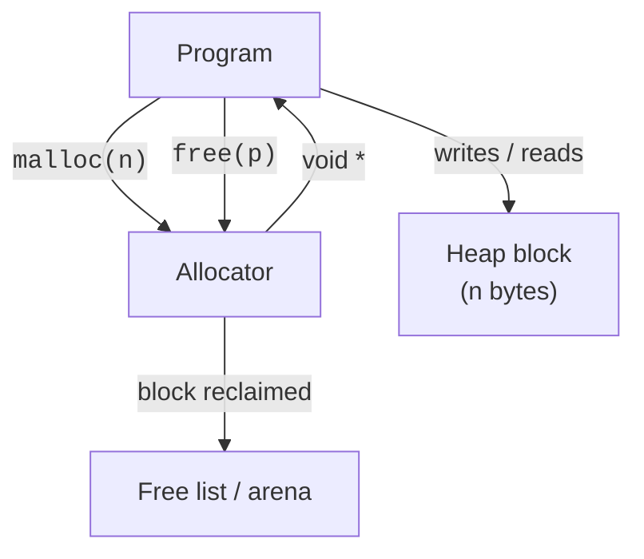

The stack is fast but rigid: every allocation dies when its function
returns. To make memory **outlive** the function that created it —
to build a linked list, a dynamic array, a parsed AST, anything —
you ask the runtime for a piece of the **heap** with `malloc` and
return it later with `free`.

Manual heap management is C's most distinctive (and most dangerous)
feature. This page is the long, careful introduction.

<svg
  viewBox="0 0 640 230"
  role="img"
  aria-label="A wall of storage lockers run from a small allocator kiosk: a yellow key arcs out to open one green locker, several others sit claimed, and one locker stays latched forever because its red key lies lost beneath the floor — malloc hands out space that only free can return"
  style={{ display: "block", width: "100%", maxWidth: "640px", height: "auto", margin: "2.5rem auto" }}
>
  <g fill="currentColor" opacity="0.1">
    <rect x="64" y="40" width="56" height="40" rx="5" />
    <rect x="196" y="40" width="56" height="40" rx="5" />
    <rect x="262" y="40" width="56" height="40" rx="5" />
    <rect x="394" y="40" width="56" height="40" rx="5" />
    <rect x="130" y="90" width="56" height="40" rx="5" />
    <rect x="328" y="90" width="56" height="40" rx="5" />
    <rect x="130" y="140" width="56" height="40" rx="5" />
    <rect x="196" y="140" width="56" height="40" rx="5" />
    <rect x="262" y="140" width="56" height="40" rx="5" />
    <rect x="328" y="140" width="56" height="40" rx="5" />
  </g>
  <g style={{ color: "var(--ds-green-500)" }} fill="currentColor">
    <rect x="130" y="40" width="56" height="40" rx="5" fillOpacity="0.45" />
    <rect x="328" y="40" width="56" height="40" rx="5" fillOpacity="0.45" />
    <rect x="196" y="90" width="56" height="40" rx="5" fillOpacity="0.45" />
    <rect x="64" y="140" width="56" height="40" rx="5" fillOpacity="0.45" />
    <rect x="64" y="90" width="56" height="40" rx="5" fillOpacity="0.45" />
    <rect x="262" y="90" width="56" height="40" rx="5" fillOpacity="0.9" />
  </g>
  <g fill="currentColor" opacity="0.3">
    <circle cx="148" cy="60" r="3" />
    <circle cx="346" cy="60" r="3" />
    <circle cx="214" cy="110" r="3" />
    <circle cx="82" cy="160" r="3" />
    <circle cx="82" cy="110" r="3" />
  </g>
  <g style={{ color: "var(--ds-green-500)" }} fill="currentColor">
    <rect x="394" y="140" width="56" height="40" rx="5" fillOpacity="0.45" />
  </g>
  <g fill="currentColor" opacity="0.45">
    <rect x="412" y="156" width="20" height="7" rx="3.5" />
  </g>
  <g fill="currentColor" opacity="0.35">
    <circle cx="500" cy="92" r="2.5" />
    <circle cx="470" cy="80" r="2.5" />
    <circle cx="436" cy="76" r="2.5" />
    <circle cx="400" cy="80" r="2.5" />
    <circle cx="366" cy="90" r="2.5" />
  </g>
  <g style={{ color: "var(--ds-yellow-500)" }} fill="currentColor">
    <circle cx="326" cy="100" r="7" />
    <rect x="333" y="97" width="16" height="6" rx="2" />
    <rect x="343" y="103" width="4" height="7" rx="1.5" />
    <rect x="337" y="103" width="3" height="5" rx="1.5" />
  </g>
  <circle cx="326" cy="100" r="3" fill="var(--ds-white)" />
  <g fill="currentColor" opacity="0.12">
    <rect x="488" y="68" width="104" height="122" rx="12" />
  </g>
  <g style={{ color: "var(--ds-blue-500)" }} fill="currentColor">
    <path d="M508 130 A22 22 0 0 1 552 130 L552 152 L508 152 Z" fillOpacity="0.45" />
    <rect x="500" y="156" width="60" height="8" rx="4" fillOpacity="0.25" />
  </g>
  <rect x="40" y="190" width="560" height="7" rx="3.5" fill="currentColor" opacity="0.2" />
  <g style={{ color: "var(--ds-red-500)" }} fill="currentColor" fillOpacity="0.55">
    <circle cx="414" cy="208" r="6" />
    <rect x="420" y="205" width="14" height="5" rx="2" />
  </g>
</svg>

## The four heap functions

| Function | Purpose | Returns |
| --- | --- | --- |
| `malloc(n)` | Reserve `n` bytes, contents *uninitialized* | `void *` or `NULL` on failure |
| `calloc(count, size)` | Reserve `count * size` bytes, zeroed | `void *` or `NULL` |
| `realloc(p, n)` | Resize an existing block; may move it | `void *` (new ptr) or `NULL` |
| `free(p)` | Release a block previously returned by `malloc`/`calloc`/`realloc` | `void` |

They all live in `<stdlib.h>`.

It is worth pausing on what `malloc` actually *is*: not a syscall,
not magic, just a library function managing a big region of memory
with ordinary data structures — free lists, size bins, boundary
tags. Anyone can write one, and one person famously did. In 1987,
computer science professor Doug Lea began writing a general-purpose
allocator, **dlmalloc**, and placed it in the public domain. It was
so well engineered that the GNU C library's allocator (ptmalloc2,
which Linux programs use to this day) was built directly on it. For
decades, nearly every `malloc` call on a Linux box has been running
a descendant of one professor's freely given code — a useful thing
to remember when the allocator feels like an inscrutable black box.
Near the end of this course's roadmap you will find "write a toy
malloc" as a suggested project; after this page you will know enough
to try.

## Your first malloc

<CodeBlock
  adapter="c"
  files={[
    {
      filename: "main.c",
      starterCode: `#include <stdio.h>
#include <stdlib.h>

int main(void) {
  int *p = malloc(sizeof(int));
  if (p == NULL) {
    fprintf(stderr, "out of memory\\n");
    return 1;
  }

  *p = 42;
  printf("*p = %d at %p\\n", *p, (void *)p);

  free(p);
  // Do not use p again — it now points at memory we no longer own.
  return 0;
}
`,
    },
  ]}
/>

Three rules visible in that tiny example:

1. **Always check for `NULL`.** `malloc` can fail.
2. **Initialize before reading.** `malloc` does *not* zero memory;
   reading uninitialized bytes is undefined behavior.
3. **Free exactly once.** Not zero times (leak). Not two times
   (double-free, often crash). Exactly once, then stop using the
   pointer.

## A growable array of N ints

This is the most common use of `malloc`: you only know the size at
runtime.

<CodeBlock
  adapter="c"
  files={[
    {
      filename: "main.c",
      starterCode: `#include <stdio.h>
#include <stdlib.h>

int main(void) {
  int n = 6;
  int *arr = malloc((size_t)n * sizeof *arr); // sizeof *arr == sizeof(int)
  if (!arr)
    return 1;

  for (int i = 0; i < n; i++)
    arr[i] = i * i;
  for (int i = 0; i < n; i++)
    printf("arr[%d] = %d\\n", i, arr[i]);

  free(arr);
  return 0;
}
`,
    },
  ]}
/>

<Callout type="info" title="The `sizeof *ptr` idiom">
Writing `malloc(n * sizeof *arr)` instead of `malloc(n * sizeof(int))`
means the line stays correct if you ever change `arr`'s element type.
It is a small habit that prevents large bugs.
</Callout>

## `calloc`: zeroed and overflow-checked

`calloc(count, size)` does two extra things compared to
`malloc(count * size)`:

1. It zeroes the memory before returning.
2. It checks `count * size` for integer overflow.

<CodeBlock
  adapter="c"
  files={[
    {
      filename: "main.c",
      starterCode: `#include <stdio.h>
#include <stdlib.h>

int main(void) {
  int *zeros = calloc(8, sizeof *zeros);
  if (!zeros)
    return 1;

  for (int i = 0; i < 8; i++)
    printf("%d ", zeros[i]);
  printf("\\n");

  free(zeros);
  return 0;
}
`,
    },
  ]}
/>

Prefer `calloc` whenever you would otherwise call `malloc` followed
by `memset(p, 0, ...)`.

## `realloc`: grow or shrink

`realloc(p, new_size)` is the resizing primitive. It may:

- expand the existing block in place (best case), or
- allocate a *new* block, copy the old contents, and free the old one,
- or return `NULL` (the old block is **still valid** in this case).

<svg
  viewBox="0 0 640 170"
  role="img"
  aria-label="Four dots move from a snug container along a dotted arc into a roomier one with four empty slots waiting — realloc copies the contents to a bigger block and retires the old one, marked with a red dot"
  style={{ display: "block", width: "100%", maxWidth: "520px", height: "auto", margin: "2.5rem auto" }}
>
  <g style={{ color: "var(--ds-blue-500)" }} fill="currentColor">
    <rect x="70" y="62" width="128" height="56" rx="12" fillOpacity="0.12" />
    <circle cx="96" cy="90" r="9" fillOpacity="0.4" />
    <circle cx="120" cy="90" r="9" fillOpacity="0.4" />
    <circle cx="144" cy="90" r="9" fillOpacity="0.4" />
    <circle cx="168" cy="90" r="9" fillOpacity="0.4" />
  </g>
  <g style={{ color: "var(--ds-red-500)" }} fill="currentColor">
    <circle cx="198" cy="62" r="5" fillOpacity="0.8" />
  </g>
  <g fill="currentColor" opacity="0.35">
    <circle cx="222" cy="56" r="2.5" />
    <circle cx="250" cy="44" r="2.5" />
    <circle cx="282" cy="38" r="2.5" />
    <circle cx="314" cy="40" r="2.5" />
    <circle cx="344" cy="48" r="2.5" />
  </g>
  <g style={{ color: "var(--ds-blue-500)" }} fill="currentColor">
    <rect x="330" y="62" width="240" height="56" rx="12" fillOpacity="0.2" />
    <circle cx="358" cy="90" r="9" />
    <circle cx="384" cy="90" r="9" />
    <circle cx="410" cy="90" r="9" />
    <circle cx="436" cy="90" r="9" />
  </g>
  <g fill="currentColor" opacity="0.18">
    <path d="M453 90 a9 9 0 1 1 18 0 a9 9 0 1 1 -18 0 Z M456 90 a6 6 0 1 1 12 0 a6 6 0 1 1 -12 0 Z" fillRule="evenodd" />
    <path d="M479 90 a9 9 0 1 1 18 0 a9 9 0 1 1 -18 0 Z M482 90 a6 6 0 1 1 12 0 a6 6 0 1 1 -12 0 Z" fillRule="evenodd" />
    <path d="M505 90 a9 9 0 1 1 18 0 a9 9 0 1 1 -18 0 Z M508 90 a6 6 0 1 1 12 0 a6 6 0 1 1 -12 0 Z" fillRule="evenodd" />
    <path d="M531 90 a9 9 0 1 1 18 0 a9 9 0 1 1 -18 0 Z M534 90 a6 6 0 1 1 12 0 a6 6 0 1 1 -12 0 Z" fillRule="evenodd" />
  </g>
  <g style={{ color: "var(--ds-green-500)" }} fill="currentColor">
    <circle cx="570" cy="62" r="5" />
  </g>
</svg>

<Callout type="warn" title="Never assign realloc's result back over the only pointer">
`p = realloc(p, n);` leaks the original block if `realloc` fails. The
safe pattern is to use a temporary.
</Callout>

<CodeBlock
  adapter="c"
  files={[
    {
      filename: "main.c",
      starterCode: `#include <stdio.h>
#include <stdlib.h>

int main(void) {
  size_t cap = 4;
  int *arr = malloc(cap * sizeof *arr);
  if (!arr)
    return 1;
  for (size_t i = 0; i < cap; i++)
    arr[i] = (int)i;

  // Need more space — double the capacity.
  size_t new_cap = cap * 2;
  int *tmp = realloc(arr, new_cap * sizeof *arr);
  if (!tmp) {
    free(arr); // realloc failed; original block still valid
    return 1;
  }
  arr = tmp;
  for (size_t i = cap; i < new_cap; i++)
    arr[i] = (int)i;

  for (size_t i = 0; i < new_cap; i++)
    printf("%d ", arr[i]);
  printf("\\n");

  free(arr);
  return 0;
}
`,
    },
  ]}
/>

## Building a dynamic array (mini `std::vector`)

Everything on this page comes together in one small data structure:
a growable array. The struct and its boilerplate live in the
read-only setup; the part worth your attention is `vec_push`, which
contains the whole growth strategy — when the array is full, double
the capacity with `realloc` (using the safe temporary pattern from
above), then append.

<CodeBlock
  adapter="c"
  files={[
    {
      filename: "main.c",
      initCode: `#include <stdio.h>
#include <stdlib.h>

typedef struct {
  int *data;
  size_t len;
  size_t cap;
} Vec;

static void vec_init(Vec *v) { v->data = NULL; v->len = v->cap = 0; }

static void vec_free(Vec *v) {
  free(v->data);
  v->data = NULL;
  v->len = v->cap = 0;
}`,
      starterCode: `static int vec_push(Vec *v, int x) {
  if (v->len == v->cap) {
    size_t new_cap = v->cap == 0 ? 4 : v->cap * 2;
    int *tmp = realloc(v->data, new_cap * sizeof *v->data);
    if (!tmp)
      return -1;
    v->data = tmp;
    v->cap = new_cap;
  }
  v->data[v->len++] = x;
  return 0;
}

int main(void) {
  Vec v;
  vec_init(&v);
  for (int i = 0; i < 10; i++)
    vec_push(&v, i * i);

  for (size_t i = 0; i < v.len; i++) {
    printf("%d ", v.data[i]);
  }
  printf("\\n(len=%zu cap=%zu)\\n", v.len, v.cap);

  vec_free(&v);
  return 0;
}
`,
    },
  ]}
/>

Watch the final line of output: after ten pushes the length is 10
but the capacity is 16, because the array grew 4 → 8 → 16. Try
pushing 17 elements and predict the capacity before you run.

Doubling the capacity each time gives amortized O(1) `push`. This is
exactly how `std::vector<T>` in C++ and `Vec<T>` in Rust grow.

<svg
  viewBox="0 0 640 200"
  role="img"
  aria-label="Capacity columns double from two to four to eight slots as green pushes fill them, with yellow arcs marking the occasional copy-everything resize — rare big moves that stay cheap on average"
  style={{ display: "block", width: "100%", maxWidth: "520px", height: "auto", margin: "2.5rem auto" }}
>
  <rect x="80" y="174" width="480" height="5" rx="2.5" fill="currentColor" opacity="0.18" />
  <g style={{ color: "var(--ds-green-500)" }} fill="currentColor" fillOpacity="0.85">
    <rect x="120" y="152" width="40" height="14" rx="3" />
    <rect x="120" y="134" width="40" height="14" rx="3" />
    <rect x="240" y="152" width="40" height="14" rx="3" />
    <rect x="240" y="134" width="40" height="14" rx="3" />
    <rect x="240" y="116" width="40" height="14" rx="3" />
    <rect x="240" y="98" width="40" height="14" rx="3" />
    <rect x="400" y="152" width="40" height="14" rx="3" />
    <rect x="400" y="134" width="40" height="14" rx="3" />
    <rect x="400" y="116" width="40" height="14" rx="3" />
    <rect x="400" y="98" width="40" height="14" rx="3" />
    <rect x="400" y="80" width="40" height="14" rx="3" />
    <rect x="400" y="62" width="40" height="14" rx="3" />
  </g>
  <g style={{ color: "var(--ds-blue-500)" }} fill="currentColor" fillOpacity="0.15">
    <rect x="400" y="44" width="40" height="14" rx="3" />
    <rect x="400" y="26" width="40" height="14" rx="3" />
  </g>
  <g style={{ color: "var(--ds-yellow-500)" }} fill="currentColor">
    <circle cx="176" cy="120" r="3" />
    <circle cx="198" cy="106" r="3" />
    <circle cx="220" cy="100" r="3" fillOpacity="0.7" />
    <circle cx="298" cy="78" r="3" />
    <circle cx="330" cy="58" r="3" />
    <circle cx="364" cy="50" r="3" fillOpacity="0.7" />
  </g>
  <g style={{ color: "var(--ds-green-500)" }} fill="currentColor">
    <circle cx="504" cy="44" r="6" />
  </g>
  <g fill="currentColor" opacity="0.3">
    <circle cx="488" cy="48" r="2" />
    <circle cx="472" cy="50" r="2" />
    <circle cx="456" cy="51" r="2" />
  </g>
</svg>

## Ownership: who frees what?

C has no automatic memory management. *Someone* must call `free` on
every heap block exactly once. The way to keep this manageable is to
make **ownership** explicit:

- The function that *creates* a block usually documents whether it
  returns the block to the caller (caller frees) or keeps it
  internally (the library frees later).
- The function that *takes* a block usually documents whether it
  takes ownership (and will free it) or just borrows it (caller still
  frees).
- A struct with a heap-allocated member usually has a matching `_free`
  function (or `_destroy`, or `_release`) that knows how to clean up.

<CodeBlock
  adapter="c"
  files={[
    {
      filename: "main.c",
      starterCode: `#include <stdio.h>
#include <stdlib.h>
#include <string.h>

// Allocate and return a heap copy of \`s\`. Caller is responsible for free().
char *xstrdup(const char *s) {
  size_t n = strlen(s) + 1;
  char *out = malloc(n);
  if (!out)
    return NULL;
  memcpy(out, s, n);
  return out;
}

int main(void) {
  char *greeting = xstrdup("Hello, owner!");
  if (!greeting)
    return 1;
  printf("%s\\n", greeting);
  free(greeting); // caller owns it; caller frees it
  return 0;
}
`,
    },
  ]}
/>

## Allocating into a caller's pointer

Sometimes the *function* needs to allocate and *replace* the caller's
pointer with the new address. That's a pointer-to-pointer parameter.

<CodeBlock
  adapter="c"
  files={[
    {
      filename: "main.c",
      starterCode: `#include <stdio.h>
#include <stdlib.h>

int make_zeros(size_t n, int **out) {
  int *p = calloc(n, sizeof *p);
  if (!p)
    return -1;
  *out = p; // store the new address through the out param
  return 0;
}

int main(void) {
  int *arr = NULL;
  if (make_zeros(5, &arr) != 0)
    return 1;
  for (int i = 0; i < 5; i++)
    printf("%d ", arr[i]);
  printf("\\n");
  free(arr);
  return 0;
}
`,
    },
  ]}
/>

## Memory leaks

A *leak* is a heap block that the program no longer has any pointer
to but has not freed. The block sits there until the process exits.
Long-running programs (servers, daemons, GUIs) that leak slowly may
eventually exhaust memory and crash.

<CodeBlock
  adapter="c"
  files={[
    {
      filename: "main.c",
      starterCode: `#include <stdio.h>
#include <stdlib.h>

void leak(void) {
  int *p = malloc(sizeof(int) * 1000); // allocated...
  if (!p)
    return;
  // ...used briefly...
  p[0] = 1;
  // ...and forgotten. No free, and the only pointer p dies with this frame.
}

int main(void) {
  for (int i = 0; i < 5; i++)
    leak();
  printf("leaked 5 blocks; in a real program this would accumulate\\n");
  return 0;
}
`,
    },
  ]}
/>

We will see leaks again — alongside double-frees and
use-after-frees — in the *Memory Bugs* chapter.

## Practice: average of N numbers from the heap

<ChallengeCard
  adapter="c"
  title="Allocate, fill, average, free"
  instructions={`Allocate a heap array of \`N = 5\` ints, fill it with the values 10, 20, 30, 40, 50 (in that order), print their integer average, then \`free\` the array. The output must be exactly \`30\`.`}
  files={[
    {
      filename: "main.c",
      starterCode: `#include <stdio.h>
#include <stdlib.h>

int main(void) {
  int N = 5;
  // your code here
  return 0;
}
`,
      solutionCode: `#include <stdio.h>
#include <stdlib.h>

int main(void) {
  int N = 5;
  int *a = malloc((size_t)N * sizeof *a);
  if (!a)
    return 1;
  int values[] = {10, 20, 30, 40, 50};
  long sum = 0;
  for (int i = 0; i < N; i++) {
    a[i] = values[i];
    sum += a[i];
  }
  printf("%ld\\n", sum / N);
  free(a);
  return 0;
}
`,
    },
  ]}
  tests={[
    {
      id: "avg",
      name: "Average is 30",
      expect: { stdoutEquals: "30" },
    },
  ]}
/>

## Practice: heap-allocated string copy

<ChallengeCard
  adapter="c"
  title="Implement my_strdup"
  instructions={`Implement \`char *my_strdup(const char *s)\` that returns a heap-allocated copy of \`s\` (caller frees it). The provided \`main\` calls it, prints the copy, and frees it.`}
  files={[
    {
      filename: "main.c",
      starterCode: `#include <stdio.h>
#include <stdlib.h>
#include <string.h>

char *my_strdup(const char *s) {
  // your code here
  return NULL;
}

int main(void) {
  char *copy = my_strdup("heap copy");
  if (!copy)
    return 1;
  printf("%s\\n", copy);
  free(copy);
  return 0;
}
`,
      solutionCode: `#include <stdio.h>
#include <stdlib.h>
#include <string.h>

char *my_strdup(const char *s) {
  if (!s)
    return NULL;
  size_t n = strlen(s) + 1;
  char *out = malloc(n);
  if (!out)
    return NULL;
  memcpy(out, s, n);
  return out;
}

int main(void) {
  char *copy = my_strdup("heap copy");
  if (!copy)
    return 1;
  printf("%s\\n", copy);
  free(copy);
  return 0;
}
`,
    },
  ]}
  tests={[
    {
      id: "copied",
      name: "Copy prints correctly",
      expect: { stdoutEquals: "heap copy" },
    },
  ]}
/>

## Test your understanding

<MultipleChoice
  markdown={`What is the safest way to handle a failed \`realloc\`?

- Assume it succeeded and keep using the same pointer.
  > A failed \`realloc\` returns \`NULL\`; using \`NULL\` as if it were the old block is UB.
- [o] Assign the result to a temporary first; if \`NULL\`, free the old block (which is still valid) and bail out.
  > \`p = realloc(p, n);\` leaks the original on failure; the temporary pattern avoids it.
- Call \`realloc\` again immediately; the second call usually succeeds.
  > Failure usually means low memory; retrying without changes does not help.
- Use \`free\` on the original block and then \`malloc\` a new one.
  > That works but defeats the purpose of \`realloc\` (which can resize in place).`}
/>

<MultipleChoice
  markdown={`Why does \`malloc\` not zero-initialize the memory it returns?

- The standard requires that it does.
  > It does not.
- Zeroing is impossible without kernel support.
  > The OS does sometimes pre-zero pages, but the standard library is allowed to skip it.
- [o] Zeroing has a cost; programs that are about to overwrite every byte anyway should not pay it. \`calloc\` exists for when you actually want zeros.
  > \`malloc\` is the bare-minimum allocator; \`calloc\` is the zeroing variant.
- Because \`malloc\` always returns memory that was previously \`free\`d, which is already zeroed.
  > Freed memory is **not** guaranteed to be zeroed; it contains the previous user's bytes.`}
/>

<MultipleChoice
  markdown={`After \`free(p);\`, what should you do with \`p\`?

- Read it once more to confirm the contents were cleared.
  > Reading freed memory is undefined behavior — use-after-free.
- Pass it to \`free\` again to be safe.
  > That is a *double-free*, which is also undefined and often crashes.
- Print it to stdout for debugging.
  > Even printing the value (as a pointer) is fine, but *dereferencing* it is UB. Most code should simply stop using it.
- [o] Stop using it (and ideally set it to \`NULL\` so accidental later uses become immediate NULL-pointer crashes instead of silent corruption).
  > \`free(p); p = NULL;\` is a well-known defensive pattern.`}
/>
