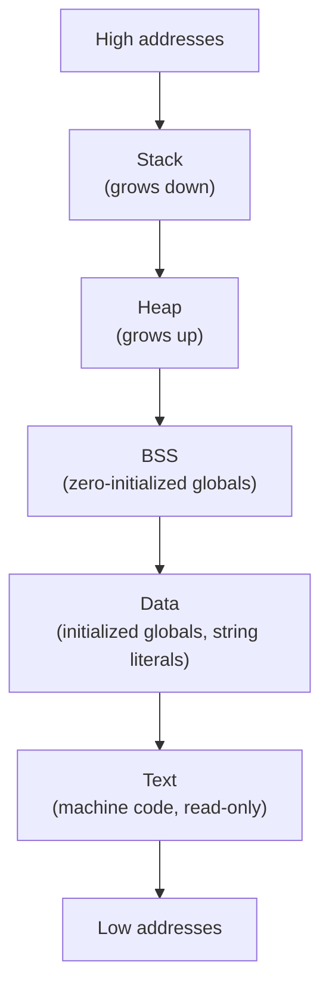
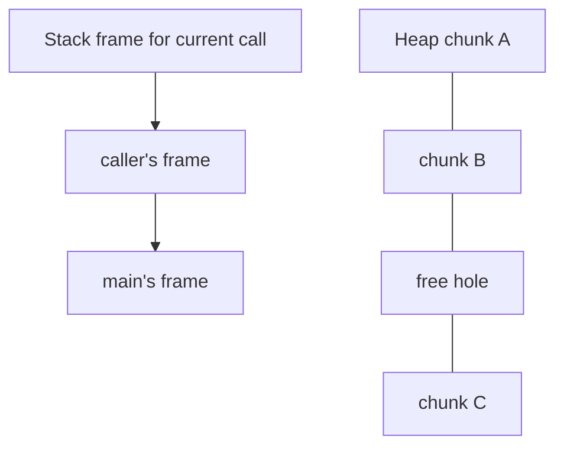

A running C program is not just "code." Its address space is
partitioned into several regions, each with different rules about
*who can write*, *how it grows*, and *when its memory is reclaimed*.
Understanding the map is the foundation for understanding `malloc`,
the stack, and every memory bug class.

## The classic four-segment map

On a typical Unix-style process the layout looks like this:

| Region | What lives here | Lifetime | Writable? |
| --- | --- | --- | --- |
| Text (code) | Compiled machine instructions, often string literals | program lifetime | no |
| Data | Globals / `static` with non-zero initializers | program lifetime | yes |
| BSS | Globals / `static` initialized to zero | program lifetime | yes |
| Heap | `malloc` / `calloc` / `realloc` allocations | until `free` | yes |
| Stack | Function parameters and local variables | function call lifetime | yes |

The WASI runtime uses a similar layout in linear memory; the
addresses just happen to be inside the WebAssembly module's memory
rather than your laptop's physical RAM.

## Seeing the regions

You can roughly identify which region a variable lives in by printing
its address.

<CodeBlock
  adapter="c"
  files={[
    {
      filename: "main.c",
      starterCode: `#include <stdio.h>
#include <stdlib.h>

int g_init = 42; // .data    (initialized global)
int g_zero;      // .bss     (zero-initialized global)
static const char *g_literal =
    "hello"; // pointer in .data, "hello" in .rodata/.text

void show(void) {} // .text    (code)

int main(void) {
  int local = 7;                   // stack
  int *heap = malloc(sizeof(int)); // heap
  *heap = 99;

  printf("Code (function show):  %p\\n", (void *)&show);
  printf("Literal \\"hello\\":      %p\\n", (void *)g_literal);
  printf("Initialized global:    %p\\n", (void *)&g_init);
  printf("Zero global:           %p\\n", (void *)&g_zero);
  printf("Heap allocation:       %p\\n", (void *)heap);
  printf("Stack local:           %p\\n", (void *)&local);

  free(heap);
  return 0;
}
`,
    },
  ]}
/>

The exact addresses will differ run to run (modern OSes randomize
them with ASLR), but you should see a rough ordering: code and
literals at the lowest addresses, then globals, then the heap
allocation somewhere higher, and the stack local at the highest
address of all.

## Text and read-only data

The text segment holds the compiled instructions of every function in
your program. It is typically mapped *read-only* — the CPU will fault
if you try to write to it. Many systems also put string literals and
other `const` data in a read-only segment called `.rodata`.

This is why writing through `char *s = "hello"; s[0] = 'X';` is
undefined behavior: the literal `"hello"` lives in `.rodata`, and the
OS will not let you modify it.

## Data and BSS — the globals

C splits globals into two pieces purely as a file-size optimization:

- `.data` holds globals with explicit non-zero initializers. Those
  initial bytes have to be stored in the executable file.
- `.bss` ("Block Started by Symbol") holds globals initialized to
  zero. They take *no space in the executable file* — the OS just
  zeroes a region of memory at load time.

<CodeBlock
  adapter="c"
  files={[
    {
      filename: "main.c",
      starterCode: `#include <stdio.h>

int counter = 0; // BSS (zero init takes no file bytes)
int answer = 42; // DATA (must store the 42 in the binary)
int big[10000];  // BSS — does NOT bloat the binary by 40 KB

int main(void) {
  counter++;
  printf("counter=%d answer=%d big[0]=%d\\n", counter, answer, big[0]);
  return 0;
}
`,
    },
  ]}
/>

A common surprise: declaring a 10-million-element zero-initialized
global does **not** make your binary 40 MB larger, because BSS is
"described by metadata" rather than stored as bytes.

## Storage classes for variables

C has several ways to control where a variable lives:

| Declaration | Where it lives | Lifetime |
| --- | --- | --- |
| `int x;` inside a function | Stack | until function returns |
| `int x;` at file scope | BSS (or .data if initialized) | program |
| `static int x;` inside a function | BSS / .data | program (but only visible to that function) |
| `static int x;` at file scope | Like a global, but only visible to that file | program |
| `int *p = malloc(...);` | Heap (the bytes) + wherever `p` is declared (the pointer) | until `free` |
| `register int x;` | Hint to keep in a CPU register | until function returns |

`static` inside a function is a great way to give a function its own
private "memory across calls":

<CodeBlock
  adapter="c"
  files={[
    {
      filename: "main.c",
      starterCode: `#include <stdio.h>

int next_id(void) {
  static int counter = 0; // initialized once, lives in BSS/.data
  return ++counter;
}

int main(void) {
  for (int i = 0; i < 5; i++) {
    printf("id = %d\\n", next_id());
  }
  return 0;
}
`,
    },
  ]}
/>

The `counter` is *not* on the stack — if it were, it would be reset
to zero on every call.

## Stack and heap: the two dynamic regions

The two regions you will think about most are the **stack** and the
**heap**. They are also the two that grow and shrink at runtime.

| | Stack | Heap |
| --- | --- | --- |
| Allocates with | function call (push frame) | `malloc`/`calloc`/`realloc` |
| Frees with | `return` (pop frame) | `free` |
| Speed | very fast (just move a pointer) | slower (bookkeeping) |
| Size limit | small (usually a few MB) | large (gigabytes) |
| Lives across function calls? | no | yes |
| Risk class | stack overflow, dangling pointer to local | leaks, double-free, use-after-free |

The next two pages explore the stack and heap in detail. Before then,
one critical rule:

<Callout type="warn" title="Never return the address of a local variable">
A local variable lives in your stack frame. When you return, the
frame is gone. A pointer to it now refers to whatever the next
function call uses — almost always *not* what you wanted.
</Callout>

<CodeBlock
  adapter="c"
  files={[
    {
      filename: "main.c",
      starterCode: `#include <stdio.h>

int *bad(void) {
  int x = 42; // lives on the stack
  return &x;  // returning the address of a soon-to-die local — UB!
}

int main(void) {
  int *p = bad();
  // Reading *p here is undefined. It may print 42 or anything else.
  printf("*p = %d  (undefined; may be garbage)\\n", *p);
  return 0;
}
`,
    },
  ]}
/>

The correct fix is to either (a) allocate on the heap and let the
caller `free` it, or (b) have the caller pass in a buffer.

## Practice: place variables in the right region

<ChallengeCard
  adapter="c"
  title="Make next_id persist across calls"
  instructions={`Implement \`int next_id(void)\` so that calling it five times in a row returns \`1 2 3 4 5\` (one per line). Use a function-local variable, not a global. Hint: \`static\` changes the storage class.`}
  files={[
    {
      filename: "main.c",
      starterCode: `#include <stdio.h>

int next_id(void) {
  // your code here — make the counter persist across calls
  int counter = 0;
  return ++counter;
}

int main(void) {
  for (int i = 0; i < 5; i++) {
    printf("%d\\n", next_id());
  }
  return 0;
}
`,
      solutionCode: `#include <stdio.h>

int next_id(void) {
  static int counter = 0;
  return ++counter;
}

int main(void) {
  for (int i = 0; i < 5; i++) {
    printf("%d\\n", next_id());
  }
  return 0;
}
`,
    },
  ]}
  tests={[
    {
      id: "ids",
      name: "Counter persists across calls",
      expect: { stdoutLines: ["1", "2", "3", "4", "5"], stdoutLinesExact: true },
    },
  ]}
/>

## Test your understanding

<MultipleChoice
  markdown={`In which segment does a large zero-initialized global like \`int big[100000];\` live, and what does that mean for the executable file size?

- \`.data\` — the binary grows by ~400 KB to store the zeros.
  > That would be true if the array were *non-zero* initialized.
- [o] \`.bss\` — only metadata is stored; the OS zeroes the region at load time, so the binary stays small.
  > BSS exists precisely so zero-initialized globals do not bloat your binary.
- The heap — \`malloc\` is called implicitly at program start.
  > Globals are not heap-allocated; they have static storage duration.
- The stack — the runtime pushes the array on entry to \`main\`.
  > The stack is for function locals, not globals.`}
/>

<MultipleChoice
  markdown={`Why is it dangerous to return \`&local_variable\` from a function?

- Because the address may be the same as another local on the heap.
  > Locals do not live on the heap.
- [o] The local lives in the function's stack frame, which is destroyed when the function returns; the returned address is now dangling.
  > Reading or writing through that pointer is undefined behavior.
- Because the compiler aliases it to \`NULL\` automatically.
  > It does not.
- Because the OS swaps the variable out of memory to disk.
  > That would just be paging; the address would still be valid.`}
/>

<MultipleChoice
  markdown={`What changes if you add \`static\` to a variable declared *inside* a function, like \`static int counter = 0;\`?

- The variable becomes shared across threads.
  > It does not, unless you add synchronization yourself.
- It becomes \`const\` and cannot be modified.
  > \`static\` does not imply \`const\`.
- [o] Its storage class changes from automatic (stack) to static (BSS/.data); it is initialized once and keeps its value across calls.
  > The variable's *visibility* stays local to the function, but its *lifetime* becomes the whole program.
- The variable is moved to the heap.
  > Static variables live in BSS or .data, not on the heap.`}
/>
