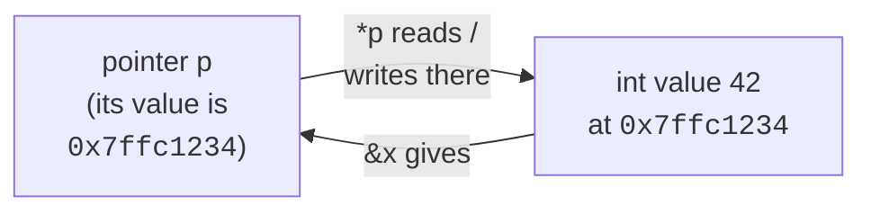

A pointer is just a variable whose value is the address of another
piece of memory. That one sentence is the whole concept — and also
the source of half the things that make C feel hard.

<svg
  viewBox="0 0 640 220"
  role="img"
  aria-label="A street of houses, each door wearing a pip-numbered address plate; a held card bearing three green pips arcs to the matching third door, while the vacant lot next to it posts a red no-entry sign — a pointer is an address, and NULL points at nothing"
  style={{ display: "block", width: "100%", maxWidth: "640px", height: "auto", margin: "2.5rem auto" }}
>
  <g fill="currentColor" opacity="0.2">
    <circle cx="600" cy="60" r="3" />
    <circle cx="40" cy="120" r="3" />
  </g>
  <rect x="50" y="190" width="540" height="6" rx="3" fill="currentColor" opacity="0.2" />
  <g fill="currentColor">
    <path d="M114 130 L152 100 L190 130 Z" opacity="0.25" />
    <rect x="120" y="130" width="64" height="60" opacity="0.13" />
    <rect x="144" y="156" width="16" height="34" rx="3" opacity="0.3" />
    <rect x="138" y="138" width="28" height="13" rx="4" opacity="0.12" />
    <path d="M204 130 L242 100 L280 130 Z" opacity="0.25" />
    <rect x="210" y="130" width="64" height="60" opacity="0.13" />
    <rect x="234" y="156" width="16" height="34" rx="3" opacity="0.3" />
    <rect x="228" y="138" width="28" height="13" rx="4" opacity="0.12" />
    <path d="M294 130 L332 100 L370 130 Z" opacity="0.25" />
    <rect x="300" y="130" width="64" height="60" opacity="0.13" />
    <rect x="318" y="138" width="28" height="13" rx="4" opacity="0.12" />
    <path d="M474 130 L512 100 L550 130 Z" opacity="0.25" />
    <rect x="480" y="130" width="64" height="60" opacity="0.13" />
    <rect x="504" y="156" width="16" height="34" rx="3" opacity="0.3" />
    <rect x="498" y="138" width="28" height="13" rx="4" opacity="0.12" />
  </g>
  <g style={{ color: "var(--ds-blue-500)" }} fill="currentColor">
    <circle cx="152" cy="144.5" r="2.2" />
    <circle cx="237" cy="144.5" r="2.2" />
    <circle cx="247" cy="144.5" r="2.2" />
    <circle cx="504" cy="144.5" r="2.2" />
    <circle cx="509.5" cy="144.5" r="2.2" />
    <circle cx="515" cy="144.5" r="2.2" />
    <circle cx="520.5" cy="144.5" r="2.2" />
    <rect x="56" y="44" width="74" height="46" rx="8" fillOpacity="0.16" />
  </g>
  <g style={{ color: "var(--ds-green-500)" }} fill="currentColor">
    <rect x="324" y="156" width="16" height="34" rx="3" />
    <circle cx="325" cy="144.5" r="2.2" />
    <circle cx="332" cy="144.5" r="2.2" />
    <circle cx="339" cy="144.5" r="2.2" />
    <circle cx="78" cy="67" r="3.5" />
    <circle cx="93" cy="67" r="3.5" />
    <circle cx="108" cy="67" r="3.5" />
  </g>
  <g fill="currentColor" opacity="0.35">
    <circle cx="150" cy="52" r="2.5" />
    <circle cx="195" cy="42" r="2.5" />
    <circle cx="243" cy="46" r="2.5" />
    <circle cx="283" cy="62" r="2.5" />
    <circle cx="312" cy="90" r="2.5" />
    <circle cx="328" cy="118" r="2.5" />
  </g>
  <g fill="currentColor" opacity="0.15">
    <circle cx="392" cy="184" r="2" />
    <circle cx="408" cy="180" r="2" />
    <circle cx="430" cy="184" r="2" />
    <circle cx="448" cy="181" r="2" />
  </g>
  <rect x="417" y="148" width="6" height="42" rx="2" fill="currentColor" opacity="0.3" />
  <g style={{ color: "var(--ds-red-500)" }} fill="currentColor">
    <circle cx="420" cy="136" r="13" />
  </g>
  <rect x="411" y="133" width="18" height="6" rx="3" fill="var(--ds-white)" />
</svg>

## Variables live at addresses

When you write `int x = 42;`, the compiler picks a memory address for
`x`, makes sure that address holds the four bytes of `42`, and from
then on the *name* `x` refers to that address.

The `&` operator gives you the address itself. The `%p` format
specifier prints it in hex (after a cast to `void *`).

<CodeBlock
  adapter="c"
  files={[
    {
      filename: "main.c",
      starterCode: `#include <stdio.h>

int main(void) {
  int x = 42;
  double y = 3.14;
  char c = 'Q';

  printf("x = %d  at address %p\\n", x, (void *)&x);
  printf("y = %g  at address %p\\n", y, (void *)&y);
  printf("c = %c  at address %p\\n", c, (void *)&c);
  return 0;
}
`,
    },
  ]}
/>

The addresses you see are inside the WASI sandbox's virtual address
space; they are not your laptop's RAM addresses. But the *idea* is
universal.

## Declaring and dereferencing pointers

A pointer's type tells the compiler what it points to:

```c
int    *pi;   // pi is a pointer to int
double *pd;   // pd is a pointer to double
char   *ps;   // ps is a pointer to char (often the start of a string)
```

Two operators move between values and addresses:

| Operator | Reads as | Returns |
| --- | --- | --- |
| `&x` | "address of `x`" | a pointer |
| `*p` | "value at `p`" | the thing it points to (dereference) |



<CodeBlock
  adapter="c"
  files={[
    {
      filename: "main.c",
      starterCode: `#include <stdio.h>

int main(void) {
  int x = 10;
  int *p = &x; // p now holds the address of x

  printf("x is %d\\n", x);
  printf("*p is %d\\n", *p);

  *p = 99; // write through the pointer
  printf("After *p = 99, x is %d\\n", x);
  return 0;
}
`,
    },
  ]}
/>

## NULL: the "points to nothing" pointer

A pointer that does not point anywhere meaningful should be `NULL`
(defined in `<stddef.h>`, usually as `((void*)0)`). Dereferencing a
`NULL` pointer is undefined behavior — usually a crash.

<CodeBlock
  adapter="c"
  files={[
    {
      filename: "main.c",
      starterCode: `#include <stddef.h>
#include <stdio.h>

void print_if_some(int *p) {
  if (p == NULL) {
    printf("(nothing)\\n");
  } else {
    printf("value: %d\\n", *p);
  }
}

int main(void) {
  int x = 7;
  print_if_some(&x);
  print_if_some(NULL);
  return 0;
}
`,
    },
  ]}
/>

<Callout type="warn" title="Always initialize pointers">
An uninitialized pointer holds *garbage* — whatever bytes happened to
be in that memory before. Dereferencing it is undefined behavior.
Either give it a real address or set it to `NULL`.
</Callout>

## Why pointers matter: pass-by-pointer

C passes arguments **by value**. If a function takes an `int`, it
gets a copy. Modifying that copy does nothing to the caller.

<svg
  viewBox="0 0 640 180"
  role="img"
  aria-label="Left: a function edits only a faded photocopy and the yellow sticker never reaches the original; right: it receives a green address tag tied to the real box, so the sticker lands on the original — pass by value versus pass by pointer"
  style={{ display: "block", width: "100%", maxWidth: "520px", height: "auto", margin: "2.5rem auto" }}
>
  <rect x="318" y="28" width="4" height="124" rx="2" fill="currentColor" opacity="0.12" />
  <g style={{ color: "var(--ds-blue-500)" }} fill="currentColor">
    <rect x="84" y="56" width="56" height="56" rx="10" />
    <rect x="180" y="56" width="56" height="56" rx="10" fillOpacity="0.2" />
  </g>
  <g fill="currentColor" opacity="0.3">
    <circle cx="148" cy="84" r="2.5" />
    <circle cx="160" cy="84" r="2.5" />
    <circle cx="172" cy="84" r="2.5" />
  </g>
  <g style={{ color: "var(--ds-yellow-500)" }} fill="currentColor">
    <circle cx="222" cy="66" r="7" />
    <circle cx="426" cy="66" r="7" />
  </g>
  <g style={{ color: "var(--ds-blue-500)" }} fill="currentColor">
    <rect x="384" y="56" width="56" height="56" rx="10" />
  </g>
  <g fill="currentColor" opacity="0.3">
    <circle cx="450" cy="87" r="2" />
    <circle cx="464" cy="87" r="2" />
    <circle cx="478" cy="87" r="2" />
    <circle cx="492" cy="87" r="2" />
  </g>
  <g style={{ color: "var(--ds-green-500)" }} fill="currentColor">
    <rect x="498" y="72" width="52" height="30" rx="8" fillOpacity="0.85" />
  </g>
  <circle cx="508" cy="87" r="4" fill="var(--ds-white)" />
</svg>

<CodeBlock
  adapter="c"
  files={[
    {
      filename: "main.c",
      starterCode: `#include <stdio.h>

void try_to_swap(int a, int b) {
  int t = a;
  a = b;
  b = t;
  printf("inside: a=%d b=%d\\n", a, b);
}

int main(void) {
  int x = 1, y = 2;
  try_to_swap(x, y);
  printf("outside: x=%d y=%d\\n", x, y);
  return 0;
}
`,
    },
  ]}
/>

The `try_to_swap` function does swap its *local copies*, but the
caller's `x` and `y` are untouched. To actually modify the caller's
variables, pass their addresses:

<CodeBlock
  adapter="c"
  files={[
    {
      filename: "main.c",
      starterCode: `#include <stdio.h>

void swap(int *a, int *b) {
  int t = *a;
  *a = *b;
  *b = t;
}

int main(void) {
  int x = 1, y = 2;
  swap(&x, &y);
  printf("x=%d y=%d\\n", x, y);
  return 0;
}
`,
    },
  ]}
/>

This is also how functions can "return" multiple values — give them
output pointers.

<CodeBlock
  adapter="c"
  files={[
    {
      filename: "main.c",
      starterCode: `#include <stdio.h>

// Returns 0 on success and fills *quot and *rem.
// Returns -1 if denom is zero.
int divmod(int num, int denom, int *quot, int *rem) {
  if (denom == 0) {
    return -1;
  }
  *quot = num / denom;
  *rem = num % denom;
  return 0;
}

int main(void) {
  int q, r;
  if (divmod(17, 5, &q, &r) == 0) {
    printf("17 / 5 = %d remainder %d\\n", q, r);
  }
  return 0;
}
`,
    },
  ]}
/>

## `const` pointers vs pointers to `const`

Two `const` positions, two meanings:

| Declaration | Can you change the pointer? | Can you change what it points to? |
| --- | --- | --- |
| `int *p` | yes | yes |
| `const int *p` (pointer to const) | yes | no |
| `int *const p` (const pointer) | no | yes |
| `const int *const p` | no | no |

Read right-to-left: "p is a const pointer to a const int."

<Callout type="info" title="Library convention: const pointers for read-only inputs">
When a function only reads through a pointer, declare it
`const T *`. It signals intent, lets callers pass pointers to
read-only data, and helps the compiler optimize.
</Callout>

## `void *`: the type-erased pointer

A `void *` is a pointer with no element type. It can hold the address
of *anything*, but you cannot dereference it directly — the compiler
does not know how many bytes to read or how to interpret them.

`malloc` returns `void *`. So do many generic library functions like
`memcpy`. You assign or cast it back to a typed pointer to use it.

<CodeBlock
  adapter="c"
  files={[
    {
      filename: "main.c",
      starterCode: `#include <stdio.h>
#include <string.h>

int main(void) {
  int a = 0xDEADBEEF;
  int b = 0;

  // memcpy takes void * — works with any types.
  memcpy(&b, &a, sizeof(int));
  printf("b = 0x%X\\n", b);
  return 0;
}
`,
    },
  ]}
/>

## Pointers to pointers

A pointer is a value, so you can take *its* address too. Patterns
like this are how you write functions that allocate memory on behalf
of the caller and store the new pointer in one of the caller's
variables.

<svg
  viewBox="0 0 640 150"
  role="img"
  aria-label="A card whose picture is another card, a dotted hop to that second card, and a final hop to the little green-doored house — pointer to pointer to value, two dereferences from the data"
  style={{ display: "block", width: "100%", maxWidth: "480px", height: "auto", margin: "2.5rem auto" }}
>
  <g style={{ color: "var(--ds-blue-500)" }} fill="currentColor">
    <rect x="76" y="50" width="64" height="44" rx="8" fillOpacity="0.15" />
    <rect x="94" y="62" width="28" height="20" rx="4" fillOpacity="0.45" />
    <rect x="102" y="68" width="12" height="8" rx="2" fillOpacity="0.9" />
    <rect x="266" y="50" width="64" height="44" rx="8" fillOpacity="0.3" />
  </g>
  <g style={{ color: "var(--ds-green-500)" }} fill="currentColor">
    <circle cx="292" cy="72" r="4" />
    <circle cx="304" cy="72" r="4" />
  </g>
  <g fill="currentColor" opacity="0.35">
    <circle cx="152" cy="66" r="2.5" />
    <circle cx="182" cy="56" r="2.5" />
    <circle cx="214" cy="52" r="2.5" />
    <circle cx="246" cy="58" r="2.5" />
    <circle cx="342" cy="66" r="2.5" />
    <circle cx="374" cy="56" r="2.5" />
    <circle cx="408" cy="52" r="2.5" />
    <circle cx="442" cy="60" r="2.5" />
  </g>
  <g fill="currentColor">
    <path d="M454 70 L492 44 L530 70 Z" opacity="0.25" />
    <rect x="460" y="70" width="64" height="52" opacity="0.13" />
  </g>
  <g style={{ color: "var(--ds-green-500)" }} fill="currentColor">
    <rect x="484" y="94" width="16" height="28" rx="3" />
  </g>
</svg>

<CodeBlock
  adapter="c"
  files={[
    {
      filename: "main.c",
      starterCode: `#include <stdio.h>

int main(void) {
  int x = 7;
  int *p = &x;   // p points to x
  int **pp = &p; // pp points to p

  printf("x  = %d\\n", x);
  printf("*p = %d\\n", *p);
  printf("**pp = %d\\n", **pp);

  **pp = 99;
  printf("after **pp = 99, x = %d\\n", x);
  return 0;
}
`,
    },
  ]}
/>

We will see this pattern again in the heap chapter when a function
needs to *replace* the caller's pointer with a new allocation.

## Practice: swap two integers

<ChallengeCard
  adapter="c"
  title="Implement swap()"
  instructions={`Implement \`void swap(int *a, int *b)\` so that, after the call, the values pointed to by \`a\` and \`b\` are exchanged. The provided \`main\` calls \`swap\` and prints the result.`}
  files={[
    {
      filename: "main.c",
      starterCode: `#include <stdio.h>

void swap(int *a, int *b) {
  // your code here
}

int main(void) {
  int x = 11, y = 22;
  swap(&x, &y);
  printf("%d %d\\n", x, y);
  return 0;
}
`,
      solutionCode: `#include <stdio.h>

void swap(int *a, int *b) {
  int t = *a;
  *a = *b;
  *b = t;
}

int main(void) {
  int x = 11, y = 22;
  swap(&x, &y);
  printf("%d %d\\n", x, y);
  return 0;
}
`,
    },
  ]}
  tests={[
    {
      id: "swapped",
      name: "Values are swapped",
      expect: { stdoutEquals: "22 11" },
    },
  ]}
/>

## Practice: min and max via output pointers

<ChallengeCard
  adapter="c"
  title="Return two values via output pointers"
  instructions={`Implement \`void min_max(int a, int b, int c, int *out_min, int *out_max)\` so it writes the minimum of \`a, b, c\` to \`*out_min\` and the maximum to \`*out_max\`. The provided \`main\` calls it for \`(7, 2, 9)\` and prints \`min=2 max=9\`.`}
  files={[
    {
      filename: "main.c",
      starterCode: `#include <stdio.h>

void min_max(int a, int b, int c, int *out_min, int *out_max) {
  // your code here
}

int main(void) {
  int lo = 0, hi = 0;
  min_max(7, 2, 9, &lo, &hi);
  printf("min=%d max=%d\\n", lo, hi);
  return 0;
}
`,
      solutionCode: `#include <stdio.h>

void min_max(int a, int b, int c, int *out_min, int *out_max) {
  int lo = a;
  if (b < lo)
    lo = b;
  if (c < lo)
    lo = c;
  int hi = a;
  if (b > hi)
    hi = b;
  if (c > hi)
    hi = c;
  *out_min = lo;
  *out_max = hi;
}

int main(void) {
  int lo = 0, hi = 0;
  min_max(7, 2, 9, &lo, &hi);
  printf("min=%d max=%d\\n", lo, hi);
  return 0;
}
`,
    },
  ]}
  tests={[
    {
      id: "min_max_basic",
      name: "Correct min and max",
      expect: { stdoutEquals: "min=2 max=9" },
    },
  ]}
/>

## Test your understanding

<MultipleChoice
  markdown={`What does the expression \`*p\` do when \`p\` is an \`int *\`?

- It computes the product of \`p\` with itself.
  > That would only be true if \`p\` were a number being multiplied.
- It takes the address of \`p\`.
  > That is the unary \`&\` operator.
- [o] It reads (or assigns to) the \`int\` value stored at the address \`p\` holds.
  > \`*\` is the *dereference* operator.
- It marks \`p\` as a pointer in the declaration.
  > That meaning of \`*\` only applies in declarations, not in expressions.`}
/>

<MultipleChoice
  markdown={`Why does the function \`void try_to_swap(int a, int b)\` fail to actually swap the caller's variables?

- Because C does not support swapping at all.
  > C absolutely supports swapping; you just need pointers.
- Because the compiler optimizes the swap away.
  > Even with optimization disabled, the function still cannot affect the caller's variables.
- [o] Because C passes arguments **by value** — the function gets copies of the caller's ints, and modifying the copies leaves the originals untouched.
  > To modify the caller's variables you must pass *pointers* to them.
- Because \`int\` is not large enough to be swapped on this machine.
  > Size has nothing to do with it.`}
/>

<MultipleChoice
  markdown={`Given \`const int *p\`, which statement is true?

- You cannot change \`p\` to point at a different \`int\`.
  > That would require \`int *const p\` (a const *pointer*, not a pointer to const).
- [o] You cannot modify the \`int\` that \`p\` currently points at through \`p\`.
  > \`const int *p\` is a pointer to a *const* int; the pointer itself can be reassigned, but writes through it are forbidden.
- The pointer is automatically initialized to \`NULL\`.
  > Initialization is unrelated to \`const\`.
- The compiler stores the int in read-only memory.
  > \`const\` is a promise about access through this pointer, not a statement about where the int lives.`}
/>
