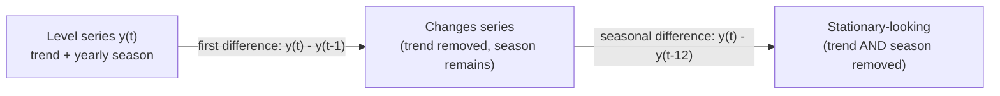

The Augmented Dickey-Fuller test kept handing us the same prescription:
*difference the series*. **Differencing** is the workhorse transformation
that turns a trending, non-stationary series into a stationary one — and it's
the operation hiding behind the `d` in **ARIMA**. This page is about *why*
it works, how far to take it, and the classic mistake of taking it one step
too far.

## What differencing is

First differencing replaces each value with the **change since the previous
value**:

`y'(t) = y(t) - y(t-1)`

You stop modeling the *level* of the series and start modeling its
*step-to-step change*. That single shift in perspective is what removes a
trend — because a series can wander far from its starting level while its
*changes* stay small and well-behaved.

<CodeBlock
  adapter="python"
  files={[
    {
      filename: "main.py",
      initCode: `import pandas as pd
import numpy as np
_passengers = [
    112,118,132,129,121,135,148,148,136,119,104,118,
    115,126,141,135,125,149,170,170,158,133,114,140,
    145,150,178,163,172,178,199,199,184,162,146,166,
    171,180,193,181,183,218,230,242,209,191,172,194,
    196,196,236,235,229,243,264,272,237,211,180,201,
    204,188,235,227,234,264,302,293,259,229,203,229,
    242,233,267,269,270,315,364,347,312,274,237,278,
    284,277,317,313,318,374,413,405,355,306,271,306,
    315,301,356,348,355,422,465,467,404,347,305,336,
    340,318,362,348,363,435,491,505,404,359,310,337,
    360,342,406,396,420,472,548,559,463,407,362,405,
    417,391,419,461,472,535,622,606,508,461,390,432,
]
idx = pd.date_range("1949-01-01", periods=len(_passengers), freq="MS")
air = pd.Series(_passengers, index=idx, name="passengers")`,
      starterCode: `# Differencing by hand is just "value minus its lag":
manual = air - air.shift(1)
builtin = air.diff()  # the convenient version

frame = pd.DataFrame(
    {
        "passengers": air,
        "shift(1)": air.shift(1),
        "manual diff": manual,
        ".diff()": builtin,
    }
).head(6)
print(frame)
print()
print("They match exactly:", manual.dropna().equals(builtin.dropna()))
print("The first value is NaN -- there's no earlier month to subtract.")
`,
    },
  ]}
/>

`y.diff()` is exactly `y - y.shift(1)`. The first entry is `NaN` because the
very first observation has no predecessor — differencing always costs you
one row per difference.

## Why differencing kills a trend

Here's the intuition made exact: **the difference of a straight line is a
constant.** If a series climbs by the same amount every step, then its
*changes* are all identical — a flat, stationary series. Differencing
converts "a steadily rising level" into "a steady rate," and a steady rate
has no trend.

<CodeBlock
  adapter="python"
  files={[
    {
      filename: "main.py",
      starterCode: `import pandas as pd
import numpy as np

# A PERFECT linear trend: y = 3t + 10.
t = np.arange(12)
line = pd.Series(3 * t + 10, name="line")

print("The line itself climbs forever (non-stationary mean):")
print(line.tolist())
print()
print("Its first difference is a CONSTANT 3 -- the trend is gone:")
print(line.diff().dropna().tolist())
print()
print("Differencing turned 'rising level' into 'constant change'.")
print("A curved (quadratic) trend needs a SECOND difference to flatten;")
print("each difference peels off one degree of polynomial trend.")
`,
    },
  ]}
/>

A linear trend vanishes after **one** difference; a curved (quadratic) trend
needs **two**. In practice almost every real series is stationary after
`d = 1` or `d = 2` differences — you rarely need more.

<CodeBlock
  adapter="python"
  files={[
    {
      filename: "main.py",
      initCode: `import pandas as pd
import numpy as np
import warnings
warnings.filterwarnings("ignore")
from statsmodels.tsa.stattools import adfuller
import matplotlib.pyplot as plt
_passengers = [
    112,118,132,129,121,135,148,148,136,119,104,118,
    115,126,141,135,125,149,170,170,158,133,114,140,
    145,150,178,163,172,178,199,199,184,162,146,166,
    171,180,193,181,183,218,230,242,209,191,172,194,
    196,196,236,235,229,243,264,272,237,211,180,201,
    204,188,235,227,234,264,302,293,259,229,203,229,
    242,233,267,269,270,315,364,347,312,274,237,278,
    284,277,317,313,318,374,413,405,355,306,271,306,
    315,301,356,348,355,422,465,467,404,347,305,336,
    340,318,362,348,363,435,491,505,404,359,310,337,
    360,342,406,396,420,472,548,559,463,407,362,405,
    417,391,419,461,472,535,622,606,508,461,390,432,
]
idx = pd.date_range("1949-01-01", periods=len(_passengers), freq="MS")
air = pd.Series(_passengers, index=idx, name="passengers")`,
      starterCode: `import matplotlib.pyplot as plt
from statsmodels.tsa.stattools import adfuller

diff1 = air.diff().dropna()

fig, (a1, a2) = plt.subplots(2, 1, figsize=(10, 6))
air.plot(ax=a1, title="Raw passengers: strong upward TREND (non-stationary)")
diff1.plot(ax=a2, title="First difference: trend gone, now hovers around a level")
a2.axhline(0, color="grey", lw=0.8)
plt.tight_layout()
plt.show()

print(f"Raw ADF p-value          : {adfuller(air)[1]:.4f}  (non-stationary)")
print(f"First-difference ADF p   : {adfuller(diff1)[1]:.4f}  (much lower!)")
print()
print("Notice the differenced series still has a SEASONAL wobble -- the yearly")
print("hump survived. First differencing removed the trend, not the season.")
`,
    },
  ]}
/>

The trend is gone after one difference, and the ADF p-value collapses. But
look closely: a *seasonal* wobble remains. First differencing removes the
**trend**, not the **seasonality** — those need a different cut.

## Seasonal differencing: subtract one season ago

To remove a seasonal cycle of period `m`, subtract the value from one full
season earlier: `y(t) - y(t-m)`. For monthly data with a yearly cycle that's
`y.diff(12)` — each month minus the same month last year. The repeating
pattern cancels against its own copy.

<CodeBlock
  adapter="python"
  files={[
    {
      filename: "main.py",
      initCode: `import pandas as pd
import numpy as np
import warnings
warnings.filterwarnings("ignore")
from statsmodels.tsa.stattools import adfuller
import matplotlib.pyplot as plt
_passengers = [
    112,118,132,129,121,135,148,148,136,119,104,118,
    115,126,141,135,125,149,170,170,158,133,114,140,
    145,150,178,163,172,178,199,199,184,162,146,166,
    171,180,193,181,183,218,230,242,209,191,172,194,
    196,196,236,235,229,243,264,272,237,211,180,201,
    204,188,235,227,234,264,302,293,259,229,203,229,
    242,233,267,269,270,315,364,347,312,274,237,278,
    284,277,317,313,318,374,413,405,355,306,271,306,
    315,301,356,348,355,422,465,467,404,347,305,336,
    340,318,362,348,363,435,491,505,404,359,310,337,
    360,342,406,396,420,472,548,559,463,407,362,405,
    417,391,419,461,472,535,622,606,508,461,390,432,
]
idx = pd.date_range("1949-01-01", periods=len(_passengers), freq="MS")
air = pd.Series(_passengers, index=idx, name="passengers")`,
      starterCode: `import numpy as np
import matplotlib.pyplot as plt
from statsmodels.tsa.stattools import adfuller

# The full recipe for the airline series:
#   1) log    -> stabilize the growing variance
#   2) diff(1) -> remove the trend
#   3) diff(12)-> remove the yearly seasonality
log_air = np.log(air)
stage = {
    "1) log(air)": log_air,
    "2) + first difference": log_air.diff(),
    "3) + seasonal difference": log_air.diff().diff(12),
}
for name, s in stage.items():
    print(f"{name:28s} ADF p = {adfuller(s.dropna())[1]:.4f}")

final = log_air.diff().diff(12).dropna()
fig, ax = plt.subplots(figsize=(10, 3.5))
final.plot(ax=ax, title="log -> diff(1) -> diff(12): looks stationary at last")
ax.axhline(0, color="grey", lw=0.8)
plt.tight_layout()
plt.show()

print()
print("Each transform drives the p-value down. The final series has no trend,")
print("no yearly cycle, and a stable spread -- ready for an ARIMA-style model.")
`,
    },
  ]}
/>

<Callout type="info" title="This is exactly what SARIMA automates">
The recipe "log, then a regular difference, then a seasonal difference" is
what a *seasonal* ARIMA (SARIMA) encodes in its orders. We'll keep our hands
on the wheel with plain ARIMA and pre-difference manually, but know that the
`d` (regular differences) and `D` (seasonal differences) parameters are just
this page, parameterized. Differencing isn't a side-trick — it's half of
what ARIMA *is*.
</Callout>

## The over-differencing trap

If one difference is good, are two always better? **No.** Differencing a
series that's *already* stationary doesn't help — it *injects* artificial
structure and inflates the variance. The fingerprint of over-differencing is
a strong **negative lag-1 autocorrelation** (around `-0.5`) and a variance
that went *up* instead of down.

<CodeBlock
  adapter="python"
  files={[
    {
      filename: "main.py",
      starterCode: `import pandas as pd
import numpy as np

rng = np.random.default_rng(0)
noise = pd.Series(rng.normal(0, 1, 500))  # ALREADY stationary white noise
over = noise.diff().dropna()  # difference it anyway (a mistake)

print(f"Variance before differencing : {noise.var():.3f}")
print(f"Variance after  differencing : {over.var():.3f}   (went UP ~2x -- bad)")
print()
print(f"Lag-1 autocorrelation before : {noise.autocorr(1):+.3f}  (~0, as expected)")
print(
    f"Lag-1 autocorrelation after  : {over.autocorr(1):+.3f}  (~ -0.5 -- the over-diff signature)"
)
print()
print("Differencing stationary data manufactured a strong negative correlation")
print("and doubled the variance. Use the SMALLEST d that achieves stationarity.")
`,
    },
  ]}
/>

<Callout type="danger" title="Use the minimum number of differences">
More differencing is not safer. Each unnecessary difference adds noise,
raises the variance, and stamps a spurious `-0.5` lag-1 autocorrelation onto
the series that your model will then waste effort "explaining." The goal is
the **smallest `d`** that makes the series stationary (usually 0, 1, or 2) —
not the `d` that gives the tiniest ADF p-value. If a series is already
stationary, the correct `d` is **0**.
</Callout>

<MultipleChoice
  markdown={`After differencing, a series shows a variance *higher* than before and a lag-1 autocorrelation of about **-0.5**. What likely happened?

- The series became more stationary; this is ideal
  > A jump in variance and a strong negative lag-1 autocorrelation are *warning signs*, not signs of success. A well-differenced series has lower or similar variance and near-zero short-lag autocorrelation.
- [o] It was over-differenced — differencing an already-stationary series injected a spurious negative autocorrelation and inflated the variance
  > Those two symptoms together are the classic over-differencing fingerprint. The fix is to step back to fewer differences (use the minimum \`d\` that reaches stationarity).
- The seasonal period is wrong
  > A wrong seasonal period shows up as leftover seasonal spikes, not as a uniform +variance and -0.5 lag-1 autocorrelation. This pattern points specifically to over-differencing.
- The data must be re-logged
  > A log addresses growing *variance from a multiplicative effect*, not the artifacts of over-differencing. The remedy here is fewer differences, not another transform.

Inflated variance plus a ~-0.5 lag-1 autocorrelation is the textbook signature of over-differencing; reduce \`d\`.`}
/>

## Undoing it: integration (the 'I' in ARIMA)

If you difference a series to model it, you must eventually **undo** the
difference to get a forecast back on the original scale. The inverse of
differencing is a **cumulative sum** plus the starting value — a process
called **integration**. That's literally what the "I" in AR**I**MA stands
for: *Integrated*, meaning the model works on a differenced series and
integrates its forecasts back up.

<CodeBlock
  adapter="python"
  files={[
    {
      filename: "main.py",
      initCode: `import pandas as pd
import numpy as np
_passengers = [112,118,132,129,121,135,148,148,136,119,104,118,
               115,126,141,135,125,149,170,170,158,133,114,140]
idx = pd.date_range("1949-01-01", periods=len(_passengers), freq="MS")
air = pd.Series(_passengers, index=idx, name="passengers")`,
      starterCode: `import numpy as np

changes = air.diff().dropna()  # the differenced series
start = air.iloc[0]  # the one anchor we must remember

# Integrate: cumulative-sum the changes and add back the starting level.
reconstructed = pd.concat(
    [
        pd.Series([start], index=[air.index[0]]),
        start + changes.cumsum(),
    ]
)

print("Original vs reconstructed (first 6):")
print(pd.DataFrame({"original": air, "reconstructed": reconstructed}).head(6))
print()
print("Perfect recovery:", np.allclose(air.values, reconstructed.values))
print()
print("Differencing is reversible IF you keep the starting value. ARIMA does")
print("this bookkeeping for you -- you give it 'd' and it integrates forecasts back.")
`,
    },
  ]}
/>

<MultipleChoice
  markdown={`What does the **"I" (Integrated)** in ARIMA refer to?

- That the model integrates data from multiple sources
  > "Integrated" here is a time-series term, not a data-engineering one. It has nothing to do with combining datasets.
- [o] That the model is fit on a *differenced* series and its forecasts are integrated (cumulatively summed) back to the original scale
  > Differencing makes the series stationary; "integration" is the inverse operation that reverses the differencing so forecasts land on the original units. The \`d\` parameter says how many times.
- That it numerically integrates a differential equation
  > Despite the shared word, ARIMA's "integration" is just the discrete inverse of differencing (a cumulative sum), not calculus on a differential equation.
- That all components are combined into one number
  > The "I" specifically denotes differencing-and-undoing, separate from the AR and MA parts. It isn't a generic "combine everything" step.

The "I" means the model operates on differenced data and integrates (cumulatively sums) its forecasts back to the original scale.`}
/>

## Practice

<ChallengeCard
  adapter="python"
  title="Difference by hand, the seasonal way"
  instructions={`The airline \`air\` series is loaded. Without using \`.diff()\`, build the **seasonal difference** at period 12 using \`shift\`: \`seasonal(t) = air(t) - air(t-12)\`. Call it \`manual_sdiff\`.

Then confirm it equals the built-in \`air.diff(12)\` by setting \`matches\` to \`True\` if they're equal everywhere both are defined (drop NaNs before comparing).`}
  files={[
    {
      filename: "main.py",
      initCode: `import pandas as pd
import numpy as np
_passengers = [
    112,118,132,129,121,135,148,148,136,119,104,118,
    115,126,141,135,125,149,170,170,158,133,114,140,
    145,150,178,163,172,178,199,199,184,162,146,166,
    171,180,193,181,183,218,230,242,209,191,172,194,
    196,196,236,235,229,243,264,272,237,211,180,201,
    204,188,235,227,234,264,302,293,259,229,203,229,
    242,233,267,269,270,315,364,347,312,274,237,278,
    284,277,317,313,318,374,413,405,355,306,271,306,
    315,301,356,348,355,422,465,467,404,347,305,336,
    340,318,362,348,363,435,491,505,404,359,310,337,
    360,342,406,396,420,472,548,559,463,407,362,405,
    417,391,419,461,472,535,622,606,508,461,390,432,
]
idx = pd.date_range("1949-01-01", periods=len(_passengers), freq="MS")
air = pd.Series(_passengers, index=idx, name="passengers")`,
      starterCode: `manual_sdiff = None  # air(t) - air(t-12), using shift
matches = None  # True if it equals air.diff(12)
print(manual_sdiff.dropna().head() if manual_sdiff is not None else None)
print("matches:", matches)
`,
      solutionCode: `manual_sdiff = air - air.shift(12)
matches = bool(manual_sdiff.dropna().round(9).equals(air.diff(12).dropna().round(9)))
print(manual_sdiff.dropna().head())
print("matches:", matches)
`,
    },
  ]}
  tests={[
    {
      id: "shape",
      name: "first 12 are NaN",
      description: "No 'same month last year' for the first year",
      code: `assert manual_sdiff.iloc[:12].isna().all(), "First 12 should be NaN"`,
    },
    {
      id: "value",
      name: "correct seasonal difference",
      description: "Jan 1950 minus Jan 1949 = 115 - 112 = 3",
      code: `import pandas as pd
assert manual_sdiff.loc[pd.Timestamp("1950-01-01")] == 3`,
    },
    {
      id: "matches_builtin",
      name: "equals air.diff(12)",
      description: "Manual and built-in agree",
      code: `assert matches is True`,
    },
  ]}
/>

<ChallengeCard
  adapter="python"
  title="Pick the minimum d (don't over-difference)"
  instructions={`A series \`s\` is loaded that is stationary after exactly **one** difference. For \`d\` in 0, 1, 2, 3, compute the ADF p-value of the \`d\`-times-differenced series and the lag-1 autocorrelation. Choose \`best_d\`: the **smallest** \`d\` whose ADF p-value is below 0.05 (the minimum differences that achieve stationarity — do NOT just pick the smallest p-value).

Also set \`over_diff_ac\` to the lag-1 autocorrelation at \`d = 2\` (one difference too many), which should be clearly negative — the over-differencing signature.`}
  files={[
    {
      filename: "main.py",
      initCode: `import numpy as np
import pandas as pd
import warnings
warnings.filterwarnings("ignore")
from statsmodels.tsa.stattools import adfuller
rng = np.random.default_rng(7)
# Random walk with drift -> stationary after ONE difference.
s = pd.Series(np.cumsum(rng.normal(0.3, 1.0, 300)), name="s")`,
      starterCode: `best_d = None  # smallest d with ADF p < 0.05
over_diff_ac = None  # lag-1 autocorrelation at d = 2
print("best_d:", best_d, " over-diff lag-1 ac:", over_diff_ac)
`,
      solutionCode: `best_d = None
acs = {}
for d in range(0, 4):
    x = s.copy()
    for _ in range(d):
        x = x.diff()
    x = x.dropna()
    p = adfuller(x)[1]
    acs[d] = float(x.autocorr(1))
    if best_d is None and p < 0.05:
        best_d = d
over_diff_ac = acs[2]
print("best_d:", best_d, " over-diff lag-1 ac:", round(over_diff_ac, 3))
`,
    },
  ]}
  tests={[
    {
      id: "min_d",
      name: "minimum d is 1",
      description: "One difference reaches stationarity",
      code: `assert best_d == 1, f"Expected best_d=1, got {best_d}"`,
    },
    {
      id: "over_negative",
      name: "d=2 shows negative lag-1 autocorrelation",
      description: "Over-differencing signature",
      code: `assert over_diff_ac is not None and over_diff_ac < -0.2, f"Expected clearly negative, got {over_diff_ac}"`,
    },
  ]}
/>

## Check your understanding

<MultipleChoice
  markdown={`Why does taking the **first difference** of a series remove a *linear* trend?

- Because it deletes the largest values
  > Differencing doesn't delete values by size; it subtracts each value from the next. Magnitude isn't the mechanism.
- [o] Because the difference of a straight line is a constant, so a steadily-rising level becomes a flat (trend-free) series of changes
  > A linear trend climbs by the same amount each step; those equal steps are a constant when you difference, leaving a series with no trend in its mean.
- Because it converts the data to percentages
  > Differencing yields absolute changes, not percentages. (Percentage change is a *different* transform.) Either way, it's the constant-difference-of-a-line property that removes the trend.
- Because it makes all values positive
  > Differenced values are frequently negative (whenever the series falls). Sign has nothing to do with why the trend disappears.

The difference of a line is a constant, so first differencing turns a rising level into trend-free changes.`}
/>

<MultipleChoice
  markdown={`Your monthly series has both a trend and a strong yearly cycle. First differencing removed the trend but a 12-month wobble remains. What should you do?

- Difference again with \`diff()\` (a second regular difference)
  > A second *regular* difference targets curvature in the trend, not seasonality. The yearly wobble would survive, and you'd risk over-differencing.
- [o] Apply a *seasonal* difference, \`diff(12)\`, to subtract each month from the same month a year earlier
  > Seasonal differencing at the cycle length cancels the repeating yearly pattern against its own prior-year copy — exactly the leftover structure here.
- Increase the rolling-window size
  > A larger rolling window smooths for *visualization* but doesn't remove seasonality from the series you'll model. Seasonal differencing is the targeted fix.
- Re-run the ADF test until it passes
  > Re-running a test changes nothing about the data. You must transform the series (seasonal difference) to remove the cycle, then test.

Leftover seasonality after a regular difference calls for a *seasonal* difference at the cycle length (\`diff(12)\` for monthly-yearly).`}
/>

<MultipleChoice
  markdown={`A series tests stationary (ADF p = 0.01) with **no** differencing. What is the appropriate \`d\`?

- [o] d = 0 — it's already stationary, so differencing would only add noise
  > A low ADF p-value with the raw series means stationarity is already satisfied. The correct number of differences is zero; differencing further would over-difference.
- d = 1, because every series needs at least one difference
  > Not every series needs differencing — only non-stationary ones. An already-stationary series should be left at d = 0.
- d = 2, to be safe
  > "To be safe" is exactly the over-differencing mindset. Extra differences inject a spurious negative autocorrelation and inflate variance.
- Whatever gives the smallest p-value
  > Chasing the smallest p-value leads straight to over-differencing. The aim is the *minimum* d that achieves stationarity, which here is 0.

If the raw series is already stationary, the right choice is d = 0; more differencing only harms.`}
/>

<Callout type="success" title="Key takeaways">
- **Differencing** (`y.diff()` = `y - y.shift(1)`) models the *change* rather
  than the *level*, which removes a trend because the difference of a line is
  a constant.
- A **linear** trend needs one difference; a **curved** trend needs two —
  rarely more.
- **Seasonal differencing** (`y.diff(m)`) removes a cycle of period `m`
  (`diff(12)` for monthly-yearly). The airline recipe is **log → diff(1) →
  diff(12)**.
- This is the **`d`** (and seasonal `D`) of ARIMA, made explicit.
- **Over-differencing** is real: it inflates variance and stamps a `-0.5`
  lag-1 autocorrelation. Use the **minimum `d`** that reaches stationarity;
  if already stationary, `d = 0`.
- **Integration** (cumulative sum + starting value) inverts differencing —
  the **"I"** in ARIMA, used to put forecasts back on the original scale.
</Callout>

We now have a stationary series. But "stationary" only means the *rules* are
fixed — it doesn't tell us *what* those rules are. To choose a model we need
to read the series' internal echoes: how strongly each value relates to the
ones before it. That's the job of the ACF and PACF plots.
