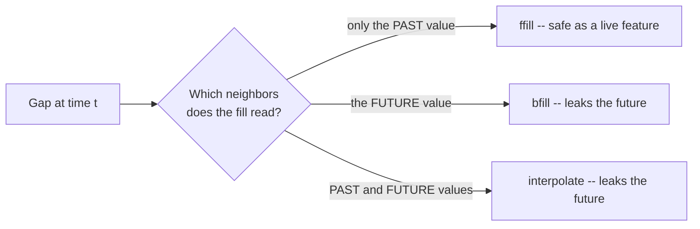

In an ordinary table, a missing value is often handled by deleting the row.
In a time series you usually **can't** — drop a row and you punch a hole in
the regular spacing that `resample`, `rolling`, and every model rely on.
Worse, a single `NaN` poisons any window that touches it. So the temporal
question is rarely "drop or keep?" but "**what do I believe happened
during the gap?**" — and every fill method is a different answer to that
question.

<Callout type="info" title="Two kinds of 'missing' in time series">
1. **A missing value at a present timestamp** — the row exists, but the
   value is `NaN` (the sensor returned nothing at 14:00).
2. **A missing timestamp entirely** — the row isn't even there (no record
   for 14:00 at all), so the gap is *invisible* until you put the series on
   a complete calendar.

The second is sneakier, because the series *looks* complete. Always check.
</Callout>

## Step 1: expose the gaps with `reindex`

A series can hide gaps simply by skipping timestamps. The fix is to
`reindex` onto a *complete* `date_range`, which turns every absent
timestamp into an explicit `NaN` you can see and deal with.

<CodeBlock
  adapter="python"
  starterCode={`import pandas as pd

# Daily readings, but Jan 3 and Jan 4 were never recorded -- the rows are
# simply absent, so the series LOOKS like 4 tidy points.
s = pd.Series(
    [10, 12, 18, 20],
    index=pd.to_datetime(["2014-01-01", "2014-01-02", "2014-01-05", "2014-01-06"]),
    name="reading",
)
print("As delivered (gaps are invisible):")
print(s)
print()

# Put it on a COMPLETE daily calendar to surface the holes.
full = pd.date_range(s.index.min(), s.index.max(), freq="D")
exposed = s.reindex(full)
print("After reindexing to a full daily range (gaps now show as NaN):")
print(exposed)
print()
print("Missing days revealed:", int(exposed.isna().sum()))
`}
/>

Until you reindex, those two missing days are silent — averages and plots
quietly pretend Jan 2 connects straight to Jan 5. Surfacing the gaps is the
prerequisite for filling them honestly.

## The three core fill strategies

Once gaps are explicit `NaN`s, you choose how to fill. The three workhorses
encode three different beliefs about the unseen interval:

Take the same gap — two missing points between a known `10` and a known
`40` — and watch each method fill the two interior slots differently
(filled values in **bold**):

| Method | known | gap | gap | known |
| --- | --- | --- | --- | --- |
| **Forward-fill** — carry the LAST known value forward | 10 | **10** | **10** | 40 |
| **Back-fill** — pull the NEXT known value backward (uses the future!) | 10 | **40** | **40** | 40 |
| **Linear interpolation** — glide in a straight line between knowns | 10 | **20** | **30** | 40 |

The same gap gets three different answers. Let's compute exactly that:

<CodeBlock
  adapter="python"
  starterCode={`import pandas as pd
import numpy as np

s = pd.Series(
    [10, np.nan, np.nan, 40],
    index=pd.date_range("2014-01-01", periods=4, freq="D"),
    name="y",
)

table = pd.DataFrame(
    {
        "raw": s,
        "ffill": s.ffill(),  # last known value carried forward
        "bfill": s.bfill(),  # next known value pulled back
        "linear": s.interpolate(method="linear"),  # straight line between knowns
    }
)
print(table)
print()
print("ffill  -> 10, 10  (assumes the value HELD until it next changed)")
print("bfill  -> 40, 40  (assumes the next value applied retroactively)")
print("linear -> 20, 30  (assumes a smooth, steady glide)")
print()
print("Three different stories about the same two unknown days.")
`}
/>

### When each one is right

- **Forward-fill (`ffill`)** — "the last value **held** until it next
  changed." Perfect for *state* / *step* signals: a thermostat setting, a
  posted price, an account balance, a configuration flag. These genuinely
  stay constant until an event changes them.
- **Backward-fill (`bfill`)** — "the **next** known value applied during the
  gap." Useful for the *leading edge* (filling `NaN`s before the first real
  reading) or when a value is logged at the *end* of the period it describes.
- **Linear interpolation** — "the value **glided smoothly** between the two
  knowns." Ideal for *continuous physical* quantities sampled with dropouts:
  temperature, sensor voltage, a slowly drifting measurement.

<CodeBlock
  adapter="python"
  starterCode={`import pandas as pd
import numpy as np
import matplotlib.pyplot as plt

# A smooth-ish daily temperature with three dropout days.
idx = pd.date_range("2014-05-01", periods=15, freq="D")
temp = pd.Series(
    [18, 19, 21, np.nan, np.nan, np.nan, 24, 23, 22, 24, 25, np.nan, 26, 27, 28.0],
    index=idx,
    name="temp_c",
)

fig, ax = plt.subplots(figsize=(10, 4))
temp.interpolate(method="linear").plot(ax=ax, marker="o", label="linear interpolation")
temp.ffill().plot(ax=ax, marker="s", alpha=0.6, label="forward-fill (flat steps)")
ax.scatter(
    temp.dropna().index,
    temp.dropna().values,
    color="black",
    zorder=5,
    label="actually measured",
)
ax.legend()
ax.set_title("For a smooth physical quantity, interpolation looks natural")
plt.tight_layout()
plt.show()

print("Interpolation traces a believable glide for temperature.")
print("Forward-fill makes ugly flat steps here -- wrong assumption for a")
print("continuously varying quantity (but right for a thermostat SETTING).")
`}
/>

## The leakage twist: which fills peek at the future?

Here is the subtlety that separates a careful analyst from a sloppy one.
Look again at *what each method reads*:

- **`ffill`** uses only the **past** (the last value before the gap). It is
  the **only** method here you can compute *online*, at the moment of the
  gap, without seeing the future.
- **`bfill`** reads the **next** value — which is in the **future** relative
  to the gap.
- **Linear interpolation** reads **both** the value before *and* the value
  after — so it also uses the **future**.

<Callout type="danger" title="bfill and interpolation are future-aware">
For *historical analysis and charting*, interpolation and back-fill are
perfectly fine — the whole series already exists, so using both neighbors
is legitimate. But if you are filling gaps in a **feature that feeds a
forecast**, `bfill` and `interpolate` smuggle the future into the present —
the same leakage sin as a centered rolling window or a random split. In an
online/forecasting setting, **forward-fill is the safe default**, because it
only ever looks backward.
</Callout>

<MultipleChoice
  markdown={`You're building features to forecast tomorrow's value and need to fill an occasional missing sensor reading *as the data streams in*. Which fill method is safe to use, and why?

- Linear interpolation, because it's the most accurate
  > Interpolation reads the value *after* the gap to draw its straight line. At the moment of the gap that future value doesn't exist yet, so using it leaks future information into a live feature.
- Backward-fill, because it carries the correct next value
  > The "next value" is in the future relative to the gap. Pulling it backward into a forecasting feature is leakage — you couldn't actually know it at prediction time.
- [o] Forward-fill, because it uses only the last known (past) value and never reads anything after the gap
  > \`ffill\` is past-only: it carries the most recent observation forward. That's computable in real time without peeking ahead, which is exactly what an online forecasting feature requires.
- It doesn't matter; all fills use the same information
  > They use very different information: \`ffill\` looks back, \`bfill\` looks forward, and interpolation looks both ways. Only the backward-looking one is leakage-free for live features.

Online/forecasting features must be computable from the past alone, so \`ffill\` is the safe choice; \`bfill\` and interpolation read the future.`}
/>

## The domain question: is "missing" really zero?

Before any fill method, ask the most important question: **does this gap
mean "unknown," or does it mean "nothing happened"?** They are completely
different, and choosing wrong fabricates data.

<CodeBlock
  adapter="python"
  starterCode={`import pandas as pd
import numpy as np

# A shop's daily sales. It is CLOSED on Sundays, so those days have no sales
# rows -- but that's not "unknown sales," it's "zero sales."
idx = pd.date_range("2014-03-03", periods=7, freq="D")  # Mon .. Sun
sales = pd.Series([200, 180, 210, 190, 260, 300, np.nan], index=idx, name="sales")
print("Sunday is missing because the shop was CLOSED:")
print(sales)
print()

wrong = sales.interpolate(method="linear")  # holds Saturday's 300 as phantom Sunday sales
right = sales.fillna(0)  # closed means zero

print(f"Interpolation invents Sunday sales of ~{wrong.iloc[-1]:.0f} (PHANTOM revenue).")
print(f"The correct fill is 0 -- the shop genuinely sold nothing.")
`}
/>

<Callout type="warn" title="No method substitutes for domain knowledge">
Forward-fill, interpolation, and the rest are *mechanical*. They don't know
whether your gap is an unrecorded measurement or a real zero. A closed shop,
a sensor that's off, a holiday with no trading — these are *zeros or
genuine absences*, not values to interpolate. Decide what the gap *means*
first; only then pick a fill.
</Callout>

## When dropping is actually fine

Filling isn't always required. `dropna()` is acceptable when gaps are
**rare and scattered**, you're computing an order-independent summary (like
an overall mean), and you won't subsequently rely on regular spacing. But
for anything that needs an unbroken timeline — resampling, rolling windows,
most models — fill rather than drop, so the calendar stays intact.

<MultipleChoice
  markdown={`Why is deleting rows with \`dropna()\` often a poor choice for time series, even though it's common for cross-sectional data?

- It always changes the column dtypes
  > Dropping rows doesn't alter dtypes. The real issue is structural, not about types.
- [o] It breaks the regular time spacing the series depends on, so resampling, rolling windows, and models that assume evenly spaced observations misbehave
  > Removing a timestamp leaves an uneven gap. A 7-day rolling window or a model expecting monthly steps will now silently span the wrong real-world interval, corrupting results.
- It's computationally too expensive
  > \`dropna\` is cheap. Cost isn't the concern — preserving the timeline is.
- pandas forbids dropping rows from a time series
  > pandas allows it; it's just usually unwise. Sometimes (rare, scattered gaps) dropping is fine — but it's a judgment call, not a prohibition.

Dropping rows punctures the even spacing that time-series tooling assumes, which is why filling (preserving the calendar) is usually preferred.`}
/>

## Practice

<ChallengeCard
  adapter="python"
  title="Expose gaps, then forward-fill a state signal"
  instructions={`A series \`status\` records a machine's power setting, logged only when it *changes*. Two calendar days have no row at all. Produce \`filled\`:

1. Reindex \`status\` onto a **complete daily** range from its first to its last timestamp (exposing the missing days as \`NaN\`).
2. **Forward-fill** the gaps, because a power setting *holds* until it's next changed.

The result should be a daily Series with no \`NaN\`s, where each missing day carries the most recent prior setting.`}
  initCode={`import pandas as pd
status = pd.Series(
    [3, 5, 2],
    index=pd.to_datetime(["2014-07-01", "2014-07-02", "2014-07-05"]),
    name="power",
)`}
  starterCode={`filled = None  # reindex to daily, then forward-fill
print(filled)
`}
  solutionCode={`full = pd.date_range(status.index.min(), status.index.max(), freq="D")
filled = status.reindex(full).ffill()
print(filled)
`}
  tests={[
    {
      id: "daily_complete",
      name: "complete daily calendar (5 days)",
      description: "Jul 1 through Jul 5, no gaps",
      code: `import pandas as pd
assert len(filled) == 5
assert (filled.index == pd.date_range("2014-07-01", "2014-07-05", freq="D")).all()`,
    },
    {
      id: "no_nans",
      name: "no missing values remain",
      description: "Every day has a setting",
      code: `assert filled.notna().all()`,
    },
    {
      id: "ffill_semantics",
      name: "gaps carry the LAST prior value",
      description: "Jul 3 and Jul 4 should hold Jul 2's value (5)",
      code: `import pandas as pd
assert filled.loc[pd.Timestamp("2014-07-03")] == 5
assert filled.loc[pd.Timestamp("2014-07-04")] == 5`,
    },
    {
      id: "not_interpolated",
      name: "not interpolated",
      description: "Forward-fill makes flat steps, not a glide",
      code: `import pandas as pd
assert filled.loc[pd.Timestamp("2014-07-04")] == 5, "Interpolation would give ~4.x here; ffill must give 5"`,
    },
  ]}
/>

<ChallengeCard
  adapter="python"
  title="Interpolate a continuous sensor (and only the interior)"
  instructions={`A daily \`temp\` Series of temperatures has interior dropout days as \`NaN\`. Temperature varies continuously, so fill the *interior* gaps with **linear interpolation**. Produce \`smooth\` where every originally-interior \`NaN\` is replaced by the straight-line value between its known neighbours.

Then compute \`may4\` — the interpolated value on \`2014-05-04\`, which sits exactly halfway between the known May 3 (=20.0) and May 5 (=24.0), so it should be \`22.0\`.`}
  initCode={`import pandas as pd
import numpy as np
idx = pd.date_range("2014-05-01", periods=7, freq="D")
temp = pd.Series([18.0, 19.0, 20.0, np.nan, 24.0, 25.0, 26.0], index=idx, name="temp")`}
  starterCode={`smooth = None  # linear interpolation of the interior gap
may4 = None  # the value on 2014-05-04
print(smooth)
print("May 4:", may4)
`}
  solutionCode={`smooth = temp.interpolate(method="linear")
may4 = float(smooth.loc[pd.Timestamp("2014-05-04")])
print(smooth)
print("May 4:", may4)
`}
  tests={[
    {
      id: "no_interior_nans",
      name: "interior gap is filled",
      description: "No NaNs remain",
      code: `assert smooth.notna().all()`,
    },
    {
      id: "halfway",
      name: "May 4 is the midpoint 22.0",
      description: "Linear interpolation between 20 and 24",
      code: `assert abs(may4 - 22.0) < 1e-9, f"Expected 22.0, got {may4}"`,
    },
    {
      id: "knowns_untouched",
      name: "known values are unchanged",
      description: "Interpolation only fills NaNs",
      code: `import pandas as pd
assert smooth.loc[pd.Timestamp("2014-05-01")] == 18.0
assert smooth.loc[pd.Timestamp("2014-05-05")] == 24.0`,
    },
  ]}
/>

## Check your understanding

<MultipleChoice
  markdown={`A gap sits between a known value of 100 (Monday) and a known value of 160 (Thursday), with Tuesday and Wednesday missing. Match each method to the Tuesday/Wednesday pair it produces.

- ffill -> 120/140, bfill -> 100/100, interpolate -> 160/160
  > These are scrambled. Forward-fill copies the *past* (100), not a glide; interpolation produces the in-between glide (120/140); back-fill copies the *future* (160).
- [o] ffill -> 100/100, bfill -> 160/160, interpolate -> 120/140
  > Forward-fill carries Monday's 100 forward; back-fill pulls Thursday's 160 backward; linear interpolation steps evenly from 100 to 160 (120 then 140).
- ffill -> 160/160, bfill -> 100/100, interpolate -> 130/130
  > Forward-fill uses the *last* value (100), not the next; back-fill uses the *next* (160), not the previous; and interpolation gives a rising 120/140, not a flat 130/130.
- All three give 130/130
  > Only a midpoint-constant scheme would give 130/130. The three real methods give distinctly different shapes: flat-back, flat-forward, and a rising line.

Forward-fill copies the prior value, back-fill copies the next, and linear interpolation walks a straight line between them.`}
/>

<MultipleChoice
  markdown={`A store is **closed on public holidays**, so those days have no sales rows. What's the right way to handle them before computing monthly totals?

- Linearly interpolate the holiday sales from the surrounding open days
  > Interpolation would invent sales on days the store was shut, inflating the monthly total with revenue that never happened.
- Forward-fill the previous day's sales onto the holiday
  > Forward-fill would also fabricate sales for a closed day. The shop sold nothing; carrying yesterday's figure forward overstates the total.
- [o] Fill those days with 0, because "closed" means genuinely zero sales, not unknown sales
  > The gap here encodes a real zero, not a missing measurement. Filling with 0 records the truth; any interpolation or carry-forward would invent phantom revenue.
- Drop the holidays and ignore them
  > Dropping is defensible for a *mean*, but for a monthly *total* you want the holiday counted as the zero it truly was, so the month's sum is correct and the calendar stays intact.

When a gap means "nothing happened" (a closed store), the correct fill is 0 — fill methods that infer a value fabricate data.`}
/>

<MultipleChoice
  markdown={`For *historical analysis of an already-complete dataset* (not a live forecast), is it acceptable to use linear interpolation to fill interior gaps in a continuously varying sensor signal?

- No, interpolation is never allowed
  > Interpolation is a standard, sensible choice for continuous quantities. The only context where it's off-limits is a *live forecasting feature*, where reading the future value is leakage.
- [o] Yes — on a complete historical series, using both neighbours is legitimate, and interpolation suits a continuously varying quantity
  > When the whole series already exists and you're analysing the past, reading the point after the gap isn't leakage; it's just using available data. For smooth physical signals, interpolation is often the most faithful fill.
- Only if you also shuffle the series first
  > Shuffling would destroy the temporal order entirely and is never appropriate for a time series. It has nothing to do with whether interpolation is acceptable.
- Only for categorical data
  > Interpolation is for *numeric*, continuous data; it's meaningless for categories. Categorical gaps are better handled with forward-fill or an explicit "unknown" label.

Interpolation is appropriate for continuous signals in retrospective analysis; it's only problematic as a *forward-looking feature*, where it leaks the future.`}
/>

<Callout type="success" title="Key takeaways">
- In time series you usually **fill** gaps rather than drop rows, to
  preserve the regular spacing tooling depends on.
- **Expose hidden gaps** by `reindex`-ing onto a complete `date_range` —
  missing *timestamps* are invisible until you do.
- The three fills are three *assumptions*: **`ffill`** (value held),
  **`bfill`** (next value applied), **linear interpolation** (smooth glide).
- **Leakage check:** `ffill` looks only backward (safe for live features);
  `bfill` and `interpolate` read the **future** (fine for retrospective
  analysis, leakage for forecasting features).
- Ask whether a gap means **"unknown" or "zero"** — a closed shop is a real
  0, not a value to interpolate. Domain knowledge beats any method.
</Callout>

Your series is now clean, evenly spaced, and gap-free. That means we can
finally take it apart — separating the trend, the seasonal cycle, and the
leftover noise into pieces we can study one at a time.
