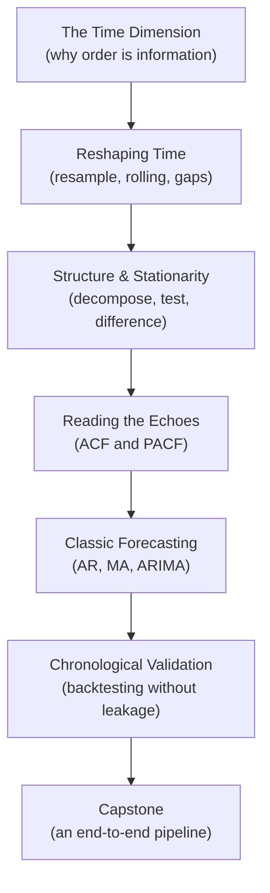

Welcome to **Time Series Analysis with Python**. You already know how to
load a DataFrame, filter it, group it, and plot a line chart. You can
answer "*what happened?*" This course teaches the harder, more valuable
question: "*what happens next — and how much should I trust my answer?*"

That second question is where time series analysis lives. A table of
sales numbers and a table of *monthly* sales numbers look almost
identical, but they are not the same kind of object. The second one has
a **spine**: each row is glued to the rows before and after it by the
passage of time. Reorder the rows of an ordinary table and you lose
nothing. Reorder the rows of a time series and you have **destroyed the
data** — because in a time series, the *order is the information*.

<Callout type="info" title="What we assume you already know">
You can write basic Python (slicing, list comprehensions), use pandas
(`DataFrame`, `Series`, filtering), make a simple line chart, and you
remember what a mean, a variance, and a correlation are. You do **not**
need any prior time series, signal processing, or forecasting
background. We build all of that from intuition.
</Callout>

## See the thesis in ten seconds

Here is the whole course in one experiment. We take a real monthly series
— airline passenger counts — and measure how strongly each month relates
to the month before it (its **lag-1 autocorrelation**). Then we *shuffle*
the rows and measure again. Run it.

<CodeBlock
  adapter="python"
  initCode={`import pandas as pd
import numpy as np

# Monthly international airline passengers (thousands), Jan 1949 - Dec 1960.
# The single most famous teaching series in all of forecasting.
_passengers = [
    112,118,132,129,121,135,148,148,136,119,104,118,
    115,126,141,135,125,149,170,170,158,133,114,140,
    145,150,178,163,172,178,199,199,184,162,146,166,
    171,180,193,181,183,218,230,242,209,191,172,194,
    196,196,236,235,229,243,264,272,237,211,180,201,
    204,188,235,227,234,264,302,293,259,229,203,229,
    242,233,267,269,270,315,364,347,312,274,237,278,
    284,277,317,313,318,374,413,405,355,306,271,306,
    315,301,356,348,355,422,465,467,404,347,305,336,
    340,318,362,348,363,435,491,505,404,359,310,337,
    360,342,406,396,420,472,548,559,463,407,362,405,
    417,391,419,461,472,535,622,606,508,461,390,432,
]
idx = pd.date_range("1949-01-01", periods=len(_passengers), freq="MS")
air = pd.Series(_passengers, index=idx, name="passengers")`}
  starterCode={`# Correlation of each month with the PREVIOUS month (lag-1 autocorrelation).
ordered_corr = air.corr(air.shift(1))

# Now shuffle the values, destroying their time order, and measure again.
shuffled = air.sample(frac=1.0, random_state=0).reset_index(drop=True)
shuffled_corr = shuffled.corr(shuffled.shift(1))

print(f"Lag-1 correlation, time order intact : {ordered_corr:.3f}")
print(f"Lag-1 correlation, after shuffling   : {shuffled_corr:.3f}")
print()
print("The ordered series is almost perfectly predictable from its own past.")
print("Shuffling threw that predictability in the trash. The order WAS the signal.")
`}
/>

The ordered series has a lag-1 correlation near **0.95** — knowing this
month tells you almost exactly what last month was. After shuffling, that
structure collapses toward zero. Every tool in this course exists to
*find, measure, and exploit* that kind of temporal structure — and the
final third of the course is about **not fooling yourself** when you use
it to predict the future.

<Callout type="tip" title="The mantra for this whole course">
Cross-sectional data answers "*who?*" Time series data answers
"*when?*" — and "when" comes with a rule cross-sectional data never has:
**you may only ever learn from the past to predict the future, never the
reverse.** Break that rule and every accuracy number you compute becomes
a comfortable lie.
</Callout>

## This is a reasoning course, not an API reference

Most time series material is either a wall of equations or a tour of
function signatures (`resample`, `rolling`, `adfuller`, `ARIMA`...) with
no story connecting them. This course is the opposite. For every concept
and every transformation we ask:

- **What temporal problem does it solve?** Why was it invented?
- **When should you use it — and when should you *not*?**
- **What do people get wrong about it?** (The misconceptions sink more
  projects than the math ever does.)
- **Where does it show up in real work?** — energy demand, inventory
  planning, web traffic, retail sales.

You will still see formulas and tests, but only when they make the
intuition *clearer*. The computer does the arithmetic; your job is to
know which question you're asking and whether the answer makes sense.

## What you'll be able to do by the end

- Recognize **why temporal data needs its own toolkit** and why ordinary
  machine-learning habits (shuffling, random splits) quietly corrupt it.
- Wield pandas's **time machinery** — `DatetimeIndex`, frequencies,
  partial-string slicing, `shift`, `resample`, `rolling`.
- **Resample** between time resolutions (daily ⇄ weekly ⇄ monthly) and
  know when you are *summarizing* versus *inventing* data.
- Fill **missing timestamps** the right way — and explain why forward-fill,
  back-fill, and interpolation are three different *assumptions*, not three
  buttons.
- **Decompose** a series into trend, seasonality, and residual, and read
  each piece.
- Define **stationarity**, test for it with the **Augmented Dickey-Fuller**
  test, and create it with **differencing**.
- Read **ACF and PACF** plots well enough to propose ARIMA orders by eye.
- Fit and interpret **AR, MA, ARMA, and ARIMA** models with statsmodels.
- Evaluate forecasts with **MAE, RMSE, and MAPE** coded by hand in NumPy.
- Design a **chronological backtest** that estimates real-world forecast
  skill without leaking the future into the past.

## How the course is organized

We move from *understanding* time, to *reshaping* it, to *modeling* its
structure, and finally to *forecasting and honestly evaluating* the
result.

Each section builds on the one before it. The conceptual heart of the
course is the run of pages on **stationarity**, **differencing**,
**ACF/PACF**, and especially **chronological validation** — if those
click, forecasting becomes a craft you can reason about instead of a
black box you poke.

<Callout type="warn" title="The most important page is near the end">
We treat **validation** as the single most important topic in the whole
course — more important than any individual model. A mediocre model
honestly evaluated is worth ten brilliant models evaluated with a leaky
random split. We will hammer this point until it is reflex.
</Callout>

## The tools we use

Every code block on every page is runnable. Edit it, click **Run**, and
the output appears underneath. We lean on four libraries and nothing
heavier — no scikit-learn, no deep learning, no automated forecasting
frameworks. Classical time series analysis needs surprisingly little
machinery.

| Library | What we use it for |
| --- | --- |
| **pandas** | The `DatetimeIndex`, resampling, rolling windows, gap-filling |
| **NumPy** | Simulating series, vectorized math, hand-coded error metrics |
| **matplotlib** | Line charts, component subplots, ACF/PACF plots |
| **statsmodels** | Decomposition, the ADF test, ACF/PACF, ARIMA models |

<Callout type="info" title="Each code block runs on its own">
Variables you define in one code block are **not** shared with the next,
even on the same page. Every block starts fresh, so each example is
self-contained. When a block needs setup data (like the airline series
above), it is created in collapsed **initialization code** you can expand
to inspect.
</Callout>

## Meet the datasets

Real time series teaching needs data with *visible* structure. We use a
small, hand-picked cast that runs instantly in your browser:

- **Airline passengers** (144 monthly points, 1949-1960) — our hero
  series. It has a rising **trend**, a strong yearly **seasonal** swing
  that *grows* over time, and is gloriously non-stationary. Perfect for
  decomposition, differencing, and ARIMA.
- **Simulated series** with *known* trend, seasonality, and noise — so we
  can check whether a tool recovers the truth we baked in.
- **Small, gappy sensor and traffic series** — for practicing missing-data
  strategies where the right answer depends on the assumption you make.

Nothing here is bigger than a few hundred numbers. Time series intuition
does not come from big data; it comes from *seeing* the structure, and a
few hundred well-chosen points show it more clearly than a million noisy
ones.

## How the interactive widgets work

You'll meet three kinds of interactive elements:

1. **Code blocks** — editable, runnable Python. Change a window size, a
   differencing order, an ARIMA parameter, and re-run to see the effect.
2. **Challenge cards** — small problems with hidden tests. Write a
   solution, click **Submit**, and see which tests pass. These are where
   the learning sticks, so do them.
3. **Multiple-choice questions** — quick conceptual checks with an
   explanation for *every* option, right or wrong.

Let's begin where every honest time series project must: with *why* this
data refuses to be treated like an ordinary table.
