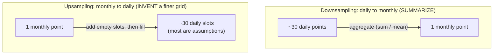

Real time series rarely arrive at the resolution you want to analyze them
at. Sensors log every second but you reason in hours; sales come in daily
but the business plans monthly. **Resampling** is how you change the
*temporal resolution* of a series — and it splits cleanly into two
operations with very different risks.

- **Downsampling** goes from fine to coarse (daily → monthly). You have
  *more* data than you need and must **summarize** it. The only question is
  *which* summary: sum? mean? last value?
- **Upsampling** goes from coarse to fine (monthly → daily). You have
  *fewer* points than the target grid and must **invent** the in-between
  values. This does not create information — it encodes an assumption.

<Callout type="info" title="resample is groupby for time">
`df.resample("ME")` is the time-aware twin of `df.groupby(...)`. It slices
the timeline into regular buckets ("every month," "every week") and then
waits for you to tell it how to aggregate each bucket. The frequency string
("D", "W", "ME") names the bucket size; the method (`.sum()`, `.mean()`)
names the summary.
</Callout>

## Downsampling: summarizing to a coarser grid

Let's build a daily series — website visits with a slow upward trend and a
weekend dip — and roll it up.

<CodeBlock
  adapter="python"
  initCode={`import pandas as pd
import numpy as np

rng = np.random.default_rng(0)
days = pd.date_range("2014-01-01", periods=120, freq="D")
trend = np.linspace(100, 160, 120)
weekend_dip = np.where(days.weekday >= 5, -25, 5)   # Sat/Sun are quieter
visits = pd.Series(
    (trend + weekend_dip + rng.normal(0, 6, 120)).round().astype(int),
    index=days, name="visits",
)`}
  initialCode={`print("Daily visits (first 10 days):")
print(visits.head(10))
print()

# Weekly TOTAL visits (sum), weeks ending Sunday:
print("Weekly totals (sum):")
print(visits.resample("W").sum().head())
print()

# Monthly AVERAGE daily visits (mean):
print("Monthly average daily visits (mean):")
print(visits.resample("ME").mean().round(1))
`}
/>

One series, two resamples, two very different numbers — and they answer
different questions:

- `resample("W").sum()` → "**how many** visits did we get each week?"
- `resample("ME").mean()` → "what did a **typical day** look like each
  month?"

### Sum or mean? Match the aggregation to the quantity

This is the choice beginners get wrong most often. The rule:

- **Sum** when the values are *flows / counts* that accumulate: sales,
  visits, units sold, rainfall, energy *consumed*. Ten daily visit counts
  genuinely add up to a weekly total.
- **Mean** when the values are *levels / rates* that don't accumulate:
  temperature, price, CPU utilization, a stock's closing level. The monthly
  "temperature" is the *average* of its days, never their sum (summing 30
  daily temperatures of 20°C into "600°C for the month" is nonsense).

<CodeBlock
  adapter="python"
  initCode={`import pandas as pd
import numpy as np
rng = np.random.default_rng(1)
days = pd.date_range("2014-06-01", periods=30, freq="D")
# A FLOW: units sold per day. A LEVEL: that day's average temperature.
units_sold = pd.Series(rng.integers(20, 60, 30), index=days, name="units")
temp_c     = pd.Series((22 + 4*np.sin(np.arange(30)/3) + rng.normal(0,1,30)).round(1),
                       index=days, name="temp_c")`}
  initialCode={`# Roll both up to a single monthly number, the RIGHT way for each.
print("Units sold is a FLOW -> SUM:")
print("  June total units:", units_sold.resample("ME").sum().iloc[0])
print()
print("Temperature is a LEVEL -> MEAN:")
print("  June average temp:", temp_c.resample("ME").mean().round(2).iloc[0], "C")
print()
print("Summing temperatures would be meaningless:")
print("  WRONG 'June temp' as a sum:", temp_c.resample("ME").sum().round(1).iloc[0], "C  <- nonsense")
`}
/>

<MultipleChoice
  markdown={`You have **hourly air-temperature** readings and want one value per day. Which resampling aggregation is correct?

- \`resample("D").sum()\`
  > Summing 24 hourly temperatures produces a meaningless number in the hundreds. Temperature is a *level*, not a flow — adding it up has no physical meaning.
- [o] \`resample("D").mean()\`
  > Temperature is a level/rate, so the natural daily summary is the average of the day's hourly readings. (A max/min is also reasonable if you specifically want the day's high or low.)
- \`resample("D").count()\`
  > \`count\` returns *how many* readings there were that day (usually 24), not the temperature itself. It answers a question about data completeness, not climate.
- It doesn't matter; all aggregations give the same answer
  > They give very different answers — sum is ~24x the mean here. Choosing the aggregation that matches the quantity is the whole point.

Levels (temperature, price) call for \`mean\` (or min/max); flows (sales, visits) call for \`sum\`.`}
/>

### More than one summary at once

You don't have to pick a single aggregation. `.agg([...])` returns several
columns side by side — handy for a quick profile of each bucket.

<CodeBlock
  adapter="python"
  initCode={`import pandas as pd
import numpy as np
rng = np.random.default_rng(0)
days = pd.date_range("2014-01-01", periods=120, freq="D")
trend = np.linspace(100, 160, 120)
weekend_dip = np.where(days.weekday >= 5, -25, 5)
visits = pd.Series(
    (trend + weekend_dip + rng.normal(0, 6, 120)).round().astype(int),
    index=days, name="visits",
)`}
  initialCode={`weekly = visits.resample("W").agg(["sum", "mean", "min", "max"]).round(1)
print("Per-week profile:")
print(weekly.head())
print()
print("The 'max' and 'min' columns show the best and worst day each week.")
`}
/>

And monthly data downsamples further still — our airline series rolls up to
quarterly or yearly views that make the long-run **trend** obvious:

<CodeBlock
  adapter="python"
  initCode={`import pandas as pd
import numpy as np
_passengers = [
    112,118,132,129,121,135,148,148,136,119,104,118,
    115,126,141,135,125,149,170,170,158,133,114,140,
    145,150,178,163,172,178,199,199,184,162,146,166,
    171,180,193,181,183,218,230,242,209,191,172,194,
    196,196,236,235,229,243,264,272,237,211,180,201,
    204,188,235,227,234,264,302,293,259,229,203,229,
    242,233,267,269,270,315,364,347,312,274,237,278,
    284,277,317,313,318,374,413,405,355,306,271,306,
    315,301,356,348,355,422,465,467,404,347,305,336,
    340,318,362,348,363,435,491,505,404,359,310,337,
    360,342,406,396,420,472,548,559,463,407,362,405,
    417,391,419,461,472,535,622,606,508,461,390,432,
]
idx = pd.date_range("1949-01-01", periods=len(_passengers), freq="MS")
air = pd.Series(_passengers, index=idx, name="passengers")`}
  initialCode={`# Monthly -> yearly average: the trend, stripped of seasonality.
print("Average monthly passengers, by YEAR:")
print(air.resample("YE").mean().round(0))
print()
# Monthly -> yearly TOTAL: total passengers flown each year (a flow -> sum).
print("Total passengers flown each YEAR:")
print(air.resample("YE").sum())
print()
print("Downsampling to yearly removes the within-year seasonal wiggle,")
print("leaving the steady climb in air travel - the long-run trend.")
`}
/>

<Callout type="tip" title="Downsampling is a seasonality filter">
Notice the yearly resample above has *no* summer hump — averaging a full
year folds the 12-month seasonal cycle into a single number. Downsampling
to the seasonal period (or a multiple of it) is a quick, crude way to
*see the trend* without the seasonality shouting over it. We'll do this far
more carefully with decomposition soon.
</Callout>

## Upsampling: stretching onto a finer grid

Upsampling is the riskier direction. Going monthly → daily, you're asking
for ~30x more rows than you have data for. pandas inserts the new
timestamps but leaves them empty — because it has no honest value to put
there.

<CodeBlock
  adapter="python"
  initCode={`import pandas as pd
import numpy as np
_passengers = [
    112,118,132,129,121,135,148,148,136,119,104,118,
    115,126,141,135,125,149,170,170,158,133,114,140,
    145,150,178,163,172,178,199,199,184,162,146,166,
]
idx = pd.date_range("1949-01-01", periods=len(_passengers), freq="MS")
air3 = pd.Series(_passengers, index=idx, name="passengers")  # first 3 years`}
  initialCode={`# Upsample monthly -> daily. asfreq() lays down the finer grid and leaves
# the brand-new in-between days as NaN, because there is no data for them.
daily = air3.resample("D").asfreq()

print("First 8 daily slots after upsampling a MONTHLY series:")
print(daily.head(8))
print()
print(f"Real data points : {air3.notna().sum()}")
print(f"Rows after upsample: {len(daily)}")
print(f"NaNs introduced  : {daily.isna().sum()}  <- pandas refuses to fabricate these")
`}
/>

Those `NaN`s are pandas being *honest*: it knows the value on January 15th
1949, but it has no idea what happened on January 16th — that day was never
measured. To get numbers there you must **assume** something, and the
assumption you choose is a modeling decision (the entire subject of the
next page):

<CodeBlock
  adapter="python"
  initCode={`import pandas as pd
import numpy as np
_passengers = [
    112,118,132,129,121,135,148,148,136,119,104,118,
    115,126,141,135,125,149,170,170,158,133,114,140,
    145,150,178,163,172,178,199,199,184,162,146,166,
]
idx = pd.date_range("1949-01-01", periods=len(_passengers), freq="MS")
air3 = pd.Series(_passengers, index=idx, name="passengers")`}
  initialCode={`daily = air3.resample("D").asfreq()

# Assumption A: "the value holds until the next reading" (forward fill).
held = daily.ffill()
# Assumption B: "the value glides smoothly between readings" (interpolate).
glided = daily.interpolate(method="linear")

print("Jan 1 .. Jan 5 under two different ASSUMPTIONS:")
compare = pd.DataFrame({"forward_fill": held, "interpolate": glided})
print(compare.head(5))
print()
print("Same data, different invented values. Upsampling didn't add knowledge;")
print("it forced us to declare what we believe happened between observations.")
`}
/>

<Callout type="danger" title="Upsampling does not create information">
The most dangerous misconception about resampling: that upsampling
*reveals* finer detail. It does not. A monthly series upsampled to daily
has exactly as much information as it did before — one real number per
month — now smeared across 30 invented slots. Every value between the real
observations is a guess whose quality depends entirely on whether your
fill assumption matches reality. Never report upsampled points as if they
were measured.
</Callout>

<MultipleChoice
  markdown={`A colleague upsamples a **monthly** revenue series to **daily** with linear interpolation and announces, "Now we have daily revenue figures." What's the problem?

- Nothing — interpolation correctly recovers the daily values
  > Interpolation can't recover values that were never recorded. The smooth daily line is a straight-line *guess* between the two monthly anchors, not measured daily revenue.
- Linear interpolation is too slow on large data
  > Performance isn't the issue here; correctness of interpretation is. Even if it ran instantly, the "daily revenue" would still be fabricated.
- [o] Upsampling invents the in-between values; the "daily" figures are interpolated assumptions, not measurements, and carry no new information
  > One real number per month, stretched across ~30 slots, is still one number per month of actual information. Presenting the interpolated days as data overstates what is known.
- They should have used \`sum\` instead of interpolation
  > \`sum\` is an aggregation for *downsampling*; it doesn't apply when going to a finer grid. The real fix is to stop treating invented values as measurements, not to switch aggregation.

Upsampling reshapes the grid and forces an assumption; it never adds information that wasn't measured.`}
/>

## `resample().asfreq()` vs `resample().mean()`: a quick contrast

- **Downsampling** *must* aggregate (`.sum()`, `.mean()`, `.last()`, ...)
  because many points fall in each new bucket.
- **Upsampling** has *at most one* original point per new bucket, so there's
  nothing to aggregate — you use `.asfreq()` to lay down the grid, then a
  fill method to populate it.

<MultipleChoice
  markdown={`Which statement correctly pairs the direction with what you must supply?

- Downsampling needs a fill method; upsampling needs an aggregation
  > This is backwards. Going to a *coarser* grid has many points per bucket (needs an aggregation); going to a *finer* grid has empty slots (needs a fill).
- [o] Downsampling needs an aggregation (sum/mean/...); upsampling needs a fill method (ffill/interpolate/...)
  > Coarser buckets contain multiple original points, so you must summarize them; finer buckets contain gaps, so you must decide how to fill them. The direction dictates the tool.
- Both directions need an aggregation
  > Upsampling has at most one real point per new slot, so there's nothing to aggregate. It needs a fill rule, not a summary.
- Neither needs anything; pandas picks automatically
  > pandas deliberately refuses to pick for you — it leaves \`NaN\`s on upsample and requires an explicit method on downsample, precisely so you make the modeling choice consciously.

Coarser grid -> aggregate the many; finer grid -> fill the gaps.`}
/>

## Practice

<ChallengeCard
  adapter="python"
  title="Daily visits to weekly totals"
  instructions={`A daily \`visits\` Series (90 days) is loaded. Build \`weekly_total\`: the **total** visits per week, with weeks ending on **Sunday** (the \`"W"\` default). The result should be a Series indexed by week-ending dates.

Then also compute \`busiest_week\` — the week-ending \`Timestamp\` with the highest total.`}
  initCode={`import pandas as pd
import numpy as np
rng = np.random.default_rng(7)
days = pd.date_range("2014-01-01", periods=90, freq="D")
visits = pd.Series(rng.integers(80, 200, 90), index=days, name="visits")`}
  initialCode={`weekly_total = None   # total visits per week (sum)
busiest_week = None   # week-ending Timestamp with the max total
print(weekly_total.head() if weekly_total is not None else None)
print("busiest:", busiest_week)
`}
  solutionCode={`weekly_total = visits.resample("W").sum()
busiest_week = weekly_total.idxmax()
print(weekly_total.head())
print("busiest:", busiest_week.date(), "with", int(weekly_total.max()), "visits")
`}
  tests={[
    {
      id: "is_series",
      name: "weekly_total is a Series",
      description: "Type check",
      code: `import pandas as pd
assert isinstance(weekly_total, pd.Series)`,
    },
    {
      id: "is_sum",
      name: "values are weekly sums",
      description: "Total visits across the whole series is preserved",
      code: `assert int(weekly_total.sum()) == int(visits.sum()), "Sum of weekly totals must equal the grand total"`,
    },
    {
      id: "weekly_freq",
      name: "buckets are weekly",
      description: "Roughly 90/7 ~ 13-14 weeks",
      code: `assert 12 <= len(weekly_total) <= 14, f"Expected ~13 weekly buckets, got {len(weekly_total)}"`,
    },
    {
      id: "busiest",
      name: "busiest_week is the argmax",
      description: "It matches the week with the largest total",
      code: `assert weekly_total.loc[busiest_week] == weekly_total.max()`,
    },
  ]}
/>

<ChallengeCard
  adapter="python"
  title="Choose the right aggregation for each series"
  instructions={`You have two daily series for June: \`rainfall_mm\` (millimetres of rain that fell each day — a FLOW) and \`humidity_pct\` (the day's average relative humidity — a LEVEL). Produce a one-row-per-month summary as a dict \`june\` with:

- \`"total_rain"\` — June's total rainfall (the correct aggregation for a flow), as a float
- \`"avg_humidity"\` — June's typical humidity (the correct aggregation for a level), as a float rounded to 1 decimal

Pick \`sum\` vs \`mean\` to match what each quantity *means*.`}
  initCode={`import pandas as pd
import numpy as np
rng = np.random.default_rng(3)
days = pd.date_range("2014-06-01", periods=30, freq="D")
rainfall_mm  = pd.Series(rng.gamma(1.2, 3.0, 30).round(1), index=days, name="rain")
humidity_pct = pd.Series((60 + rng.normal(0, 8, 30)).clip(20, 100).round(1),
                         index=days, name="humidity")`}
  initialCode={`june = {
    "total_rain": None,     # rainfall is a FLOW
    "avg_humidity": None,   # humidity is a LEVEL
}
print(june)
`}
  solutionCode={`june = {
    "total_rain": float(rainfall_mm.resample("ME").sum().iloc[0]),
    "avg_humidity": float(humidity_pct.resample("ME").mean().round(1).iloc[0]),
}
print(june)
`}
  tests={[
    {
      id: "keys",
      name: "june has both float values",
      description: "Correct keys and types",
      code: `assert set(june.keys()) == {"total_rain", "avg_humidity"}
assert all(isinstance(v, float) for v in june.values())`,
    },
    {
      id: "rain_is_sum",
      name: "total_rain is the SUM of daily rainfall",
      description: "Flows accumulate",
      code: `assert abs(june["total_rain"] - float(rainfall_mm.sum())) < 1e-6, "Rainfall should be summed"`,
    },
    {
      id: "humidity_is_mean",
      name: "avg_humidity is the MEAN of daily humidity",
      description: "Levels average",
      code: `assert abs(june["avg_humidity"] - round(float(humidity_pct.mean()), 1)) < 0.05, "Humidity should be averaged"`,
    },
    {
      id: "not_swapped",
      name: "aggregations are not swapped",
      description: "Sum and mean are clearly different here",
      code: `assert june["total_rain"] > june["avg_humidity"], "Looks like sum/mean were swapped"`,
    },
  ]}
/>

## Check your understanding

<MultipleChoice
  markdown={`How is \`df.resample("ME")\` most accurately described?

- A way to delete rows to make the series shorter
  > Resampling reorganizes the timeline into buckets and aggregates; it isn't row deletion. Downsampling *summarizes* groups of rows rather than dropping them arbitrarily.
- [o] A time-aware \`groupby\` that buckets the index into regular periods, awaiting an aggregation to summarize each bucket
  > \`resample\` groups by fixed time windows the way \`groupby\` groups by a key, then applies a summary (\`.sum()\`, \`.mean()\`, ...) to each window.
- A method that always returns one row per original row
  > Downsampling returns *fewer* rows (one per bucket) and upsampling returns *more*; it rarely preserves the original row count.
- A plotting function
  > Resampling transforms data; it draws nothing. You might plot the result afterward, but that's a separate step.

\`resample\` is \`groupby\` for the time axis: bucket by period, then aggregate.`}
/>

<MultipleChoice
  markdown={`A daily count of **support tickets** is resampled to monthly. Which aggregation gives "how many tickets did we handle that month," and why?

- \`mean\`, because monthly figures should be averages
  > \`mean\` gives the typical tickets-per-day, not the monthly workload. "How many that month" is a total, not an average.
- [o] \`sum\`, because ticket counts are a flow that accumulates over the month
  > Counts of events are flows; the month's volume is the sum of its days. \`sum\` answers "how many in total," which is the question asked.
- \`last\`, because only the final day matters
  > \`last\` keeps a single day's count and discards the rest of the month — it answers nothing about the month's volume.
- \`max\`, because the busiest day represents the month
  > \`max\` reports the single worst day, not the monthly total. It's a useful extra statistic but not "how many that month."

Event counts are flows, so the monthly volume is a \`sum\`; \`mean\` would answer a different ("typical day") question.`}
/>

<Callout type="success" title="Key takeaways">
- **Resampling changes temporal resolution**; it's `groupby` for the time
  axis.
- **Downsampling** (fine → coarse) **summarizes**: choose **`sum`** for
  *flows* (sales, visits, rainfall) and **`mean`** (or min/max) for *levels*
  (temperature, price). Picking the wrong one produces nonsense.
- **Upsampling** (coarse → fine) **invents** the in-between values. `asfreq`
  lays down the grid as `NaN`s; you then fill with an *assumption*.
- **Upsampling adds no information** — never present interpolated points as
  measurements.
- Downsampling to (a multiple of) the seasonal period is a quick way to see
  the underlying **trend**.
</Callout>

Upsampling left us staring at a grid full of `NaN`s, and even real-world
data arrives with holes. How you fill those gaps is not a button-press but
a genuine assumption about what happened when you weren't looking — which
is exactly the next page.
