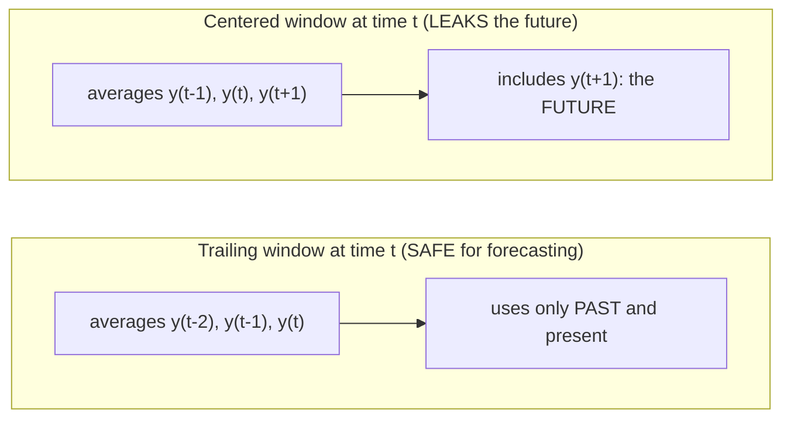

Raw time series are noisy. Underneath the jitter there's usually a calmer
story — a trend, a seasonal shape — and **moving-window** statistics are
how you turn the volume down on the noise to hear it. This page covers
three closely related tools: **`shift`** (look at the past), **`rolling`**
(summarize a sliding window of the past), and **`expanding`** (summarize
everything so far). It also covers the two ways people quietly cheat with
them.

<svg
  viewBox="0 0 640 210"
  role="img"
  aria-label="A glowing yellow pane slides along a row of dim noisy dots, lighting the few inside it blue, while a calm green trail of averages forms beneath the positions it has already visited — a rolling window summarizes a sliding stretch of the recent past"
  style={{ display: "block", width: "100%", maxWidth: "640px", height: "auto", margin: "2.5rem auto" }}
>
  <g style={{ color: "var(--ds-yellow-500)" }} fill="currentColor">
    <rect x="86" y="62" width="150" height="104" rx="14" fillOpacity="0.07" />
    <rect x="206" y="62" width="150" height="104" rx="14" fillOpacity="0.12" />
    <rect x="326" y="62" width="150" height="104" rx="14" fillOpacity="0.24" />
  </g>
  <g fill="currentColor" opacity="0.3">
    <circle cx="60" cy="118" r="5" />
    <circle cx="96" cy="96" r="5" />
    <circle cx="132" cy="132" r="5" />
    <circle cx="168" cy="104" r="5" />
    <circle cx="204" cy="142" r="5" />
    <circle cx="240" cy="98" r="5" />
    <circle cx="276" cy="126" r="5" />
    <circle cx="312" cy="92" r="5" />
    <circle cx="512" cy="100" r="5" />
    <circle cx="548" cy="134" r="5" />
    <circle cx="584" cy="108" r="5" />
  </g>
  <g style={{ color: "var(--ds-blue-500)" }} fill="currentColor">
    <circle cx="348" cy="136" r="5.5" />
    <circle cx="382" cy="88" r="5.5" />
    <circle cx="416" cy="122" r="5.5" />
    <circle cx="450" cy="104" r="5.5" />
  </g>
  <g style={{ color: "var(--ds-green-500)" }} fill="currentColor">
    <circle cx="161" cy="184" r="3.5" fillOpacity="0.45" />
    <circle cx="201" cy="184" r="3.5" fillOpacity="0.55" />
    <circle cx="241" cy="184" r="3.5" fillOpacity="0.65" />
    <circle cx="281" cy="184" r="3.5" fillOpacity="0.75" />
    <circle cx="321" cy="184" r="3.5" fillOpacity="0.85" />
    <circle cx="361" cy="184" r="3.5" fillOpacity="0.95" />
    <circle cx="401" cy="184" r="6" />
  </g>
</svg>

## First, looking backward: `shift`

Almost every time series operation needs to compare *now* to *then*.
`shift(k)` moves the data forward by `k` steps, so each row lines up with a
value from its own past (a **lag**). `shift(-k)` does the reverse (a
**lead**, peeking ahead).

<CodeBlock
  adapter="python"
  files={[
    {
      filename: "main.py",
      starterCode: `import pandas as pd

s = pd.Series(
    [10, 12, 11, 15, 14],
    index=pd.date_range("2014-01-01", periods=5, freq="D"),
    name="y",
)

frame = pd.DataFrame(
    {
        "y": s,
        "lag1 (yesterday)": s.shift(1),  # pull the PAST up to today
        "lead1 (tomorrow)": s.shift(-1),  # pull the FUTURE back to today
    }
)
print(frame)
print()

# 'shift' is how you compute change over time:
print("Day-over-day change (y - y.shift(1)):")
print((s - s.shift(1)).tolist())
`,
    },
  ]}
/>

`shift(1)` is the building block for almost everything later: a lag feature,
a day-over-day change, a percentage return, and — crucially — the
**differencing** we'll use to fight non-stationarity. Notice the first
`lag1` is `NaN`: there's no day *before* the first day to borrow from.

<Callout type="warn" title="shift(-1) peeks at the future — handle with care">
`shift(1)` (a lag) is always safe: it brings *past* information to the
present. `shift(-1)` (a lead) brings *future* information to the present,
which is exactly the kind of move that causes leakage if it sneaks into a
forecasting feature. Leads are fine for analysis ("what happened next?")
but must never become an input your model uses to predict the present.
</Callout>

## The moving average: `rolling`

A **rolling** (or *moving*) statistic slides a fixed-size window along the
series and computes a summary at each stop. The **moving average** —
`rolling(window=N).mean()` — is the classic noise filter: each point
becomes the average of itself and its `N-1` predecessors, so random
up-and-down jitter cancels out while the slow signal survives.

A **rolling** window is a fixed size that slides forward; an **expanding**
window is anchored at the start and grows. Watch what each averages as it
advances:

| Step | Rolling, window = 3 (fixed size, slides) | Expanding (grows from the start) |
| --- | --- | --- |
| 1 | mean of `y1, y2, y3` | mean of `y1` |
| 2 | mean of `y2, y3, y4` | mean of `y1, y2` |
| 3 | mean of `y3, y4, y5` | mean of `y1, y2, y3` |

Watch a 12-month moving average dissolve the airline series' seasonal hump
and lay its trend bare. **Change the `window` and re-run** to feel the
trade-off.

<CodeBlock
  adapter="python"
  files={[
    {
      filename: "main.py",
      initCode: `import pandas as pd
import numpy as np
_passengers = [
    112,118,132,129,121,135,148,148,136,119,104,118,
    115,126,141,135,125,149,170,170,158,133,114,140,
    145,150,178,163,172,178,199,199,184,162,146,166,
    171,180,193,181,183,218,230,242,209,191,172,194,
    196,196,236,235,229,243,264,272,237,211,180,201,
    204,188,235,227,234,264,302,293,259,229,203,229,
    242,233,267,269,270,315,364,347,312,274,237,278,
    284,277,317,313,318,374,413,405,355,306,271,306,
    315,301,356,348,355,422,465,467,404,347,305,336,
    340,318,362,348,363,435,491,505,404,359,310,337,
    360,342,406,396,420,472,548,559,463,407,362,405,
    417,391,419,461,472,535,622,606,508,461,390,432,
]
idx = pd.date_range("1949-01-01", periods=len(_passengers), freq="MS")
air = pd.Series(_passengers, index=idx, name="passengers")`,
      starterCode: `import matplotlib.pyplot as plt

window = 12  # <-- change me! try 3 (noisy), 12 (kills seasonality), 36 (very smooth)

ma = air.rolling(window=window).mean()

fig, ax = plt.subplots(figsize=(10, 4))
air.plot(ax=ax, alpha=0.4, label="raw (monthly)")
ma.plot(ax=ax, linewidth=2.5, label=f"{window}-month moving average")
ax.legend()
ax.set_title(f"Rolling mean smooths the noise (window = {window})")
plt.tight_layout()
plt.show()

print(f"The first {window - 1} values are NaN: a full {window}-wide window")
print("isn't available until that many points have gone by.")
`,
    },
  ]}
/>

A 12-month window is special here: because it spans exactly one seasonal
cycle, averaging over it *cancels the seasonality* and leaves a clean
trend. Try `window=3` and the line stays jagged (barely any smoothing);
try `window=36` and it becomes a sweeping curve that lags far behind the
data. That tension is the whole art of choosing a window.

<Callout type="info" title="The window-size trade-off">
- **Small window** → *responsive* but *noisy*. It hugs the data and reacts
  fast, but barely smooths.
- **Large window** → *smooth* but *laggy*. It produces a clean line, but it
  reacts slowly and trails behind turning points.

There's no universally right size — it depends on what you're trying to
see. To remove a known cycle, set the window to that cycle's length (12 for
monthly-yearly, 7 for daily-weekly).
</Callout>

### The leading NaNs and `min_periods`

By default a rolling statistic refuses to compute until it has a *full*
window, so the first `N-1` results are `NaN`. If you'd rather get partial
answers at the start, allow them with `min_periods`.

<CodeBlock
  adapter="python"
  files={[
    {
      filename: "main.py",
      initCode: `import pandas as pd
import numpy as np
_passengers = [112,118,132,129,121,135,148,148,136,119,104,118]
idx = pd.date_range("1949-01-01", periods=len(_passengers), freq="MS")
air = pd.Series(_passengers, index=idx, name="passengers")`,
      starterCode: `print("Default: needs a full window, so the first 2 are NaN:")
print(air.rolling(3).mean().round(1).head())
print()
print("min_periods=1: compute as soon as there's at least 1 point:")
print(air.rolling(3, min_periods=1).mean().round(1).head())
`,
    },
  ]}
/>

## The trailing-vs-centered trap (a leakage classic)

By default, `rolling` is **trailing**: the window at time *t* ends at *t*
and reaches *backward*. That's exactly right for forecasting — at time *t*
you only know the past and present. But pandas also offers `center=True`,
which centers the window on *t*, reaching *into the future*. That's fine
for *visualizing* a trend, but poison if the result becomes a model input.

<CodeBlock
  adapter="python"
  files={[
    {
      filename: "main.py",
      starterCode: `import pandas as pd

s = pd.Series(
    [10, 20, 30, 40, 50],
    index=pd.date_range("2014-01-01", periods=5, freq="D"),
    name="y",
)

frame = pd.DataFrame(
    {
        "y": s,
        "trailing": s.rolling(3).mean(),  # ends AT t (past-facing)
        "centered": s.rolling(3, center=True).mean(),  # straddles t (future-facing)
    }
)
print(frame)
print()
print("On 2014-01-02 the centered mean is (10+20+30)/3 = 20.0 -- it used")
print("2014-01-03, a day that hadn't happened yet at the time of 01-02.")
print("Great for a smooth trend line; FORBIDDEN as a forecasting feature.")
`,
    },
  ]}
/>

<MultipleChoice
  markdown={`You're engineering features to **forecast** tomorrow's demand and add a 7-day moving average computed with \`rolling(7, center=True)\`. Why is this a problem?

- Centered windows are slower to compute
  > Performance is irrelevant. The issue is *what information* the feature contains, not how fast it's produced.
- [o] A centered window at day t averages in days *after* t, so the feature secretly contains future values — data leakage that inflates accuracy and can't be reproduced at prediction time
  > To center a 7-day window on day t you need days t+1, t+2, t+3, which don't exist yet when you're forecasting. The feature smuggles the future into the present; in production those days are unknown, so the model collapses.
- Nothing is wrong; centering is more accurate
  > It *looks* more accurate precisely because it cheated. The apparent accuracy evaporates in production, where future days aren't available to center on.
- It only matters if the window is larger than 7
  > Any centered window of size > 1 reaches into the future. The leakage exists at window 3 just as at window 70.

Centered rolling features include future observations, which is leakage; forecasting features must use trailing windows only.`}
/>

## The biggest misconception: a moving average is **not** a forecast

This one sinks real projects. A rolling mean is a **smoother of data you
already have**. It describes the *past*. It has no machinery to project
*beyond* the last observation — the line simply *stops* where your data
stops. People see a smooth upward moving-average curve and imagine it
"continuing," but the moving average itself predicts nothing.

<svg
  viewBox="0 0 640 180"
  role="img"
  aria-label="A smooth blue average ribbon glides upward and halts at a red post where the data ends, leaving only hollow slots and a question mark in the space beyond — a moving average describes the past and cannot step into the future"
  style={{ display: "block", width: "100%", maxWidth: "560px", height: "auto", margin: "2.5rem auto" }}
>
  <rect x="44" y="156" width="552" height="4" rx="2" fill="currentColor" opacity="0.2" />
  <g style={{ color: "var(--ds-blue-500)" }} fill="currentColor">
    <circle cx="70" cy="122" r="3.5" fillOpacity="0.35" />
    <circle cx="106" cy="106" r="3.5" fillOpacity="0.35" />
    <circle cx="142" cy="118" r="3.5" fillOpacity="0.35" />
    <circle cx="178" cy="92" r="3.5" fillOpacity="0.35" />
    <circle cx="214" cy="104" r="3.5" fillOpacity="0.35" />
    <circle cx="250" cy="80" r="3.5" fillOpacity="0.35" />
    <circle cx="286" cy="92" r="3.5" fillOpacity="0.35" />
    <circle cx="322" cy="70" r="3.5" fillOpacity="0.35" />
    <circle cx="358" cy="82" r="3.5" fillOpacity="0.35" />
    <circle cx="394" cy="62" r="3.5" fillOpacity="0.35" />
    <path d="M 64 120 C 150 110 200 96 280 84 C 340 75 380 68 424 62 L 425 74 C 381 80 341 87 282 96 C 202 108 152 122 66 132 Z" fillOpacity="0.6" />
  </g>
  <g style={{ color: "var(--ds-red-500)" }} fill="currentColor">
    <rect x="434" y="44" width="7" height="112" rx="3.5" />
  </g>
  <g fill="currentColor" opacity="0.25">
    <path d="M 466 68 a 6 6 0 1 0 12 0 a 6 6 0 1 0 -12 0 Z M 469 68 a 3 3 0 1 0 6 0 a 3 3 0 1 0 -6 0 Z" fillRule="evenodd" />
    <path d="M 502 62 a 6 6 0 1 0 12 0 a 6 6 0 1 0 -12 0 Z M 505 62 a 3 3 0 1 0 6 0 a 3 3 0 1 0 -6 0 Z" fillRule="evenodd" />
    <path d="M 538 56 a 6 6 0 1 0 12 0 a 6 6 0 1 0 -12 0 Z M 541 56 a 3 3 0 1 0 6 0 a 3 3 0 1 0 -6 0 Z" fillRule="evenodd" />
  </g>
  <text x="500" y="124" fontFamily="ui-monospace, monospace" fontSize="30" fill="currentColor" opacity="0.45" textAnchor="middle">?</text>
</svg>

<CodeBlock
  adapter="python"
  files={[
    {
      filename: "main.py",
      initCode: `import pandas as pd
import numpy as np
_passengers = [
    112,118,132,129,121,135,148,148,136,119,104,118,
    115,126,141,135,125,149,170,170,158,133,114,140,
    145,150,178,163,172,178,199,199,184,162,146,166,
    171,180,193,181,183,218,230,242,209,191,172,194,
    196,196,236,235,229,243,264,272,237,211,180,201,
    204,188,235,227,234,264,302,293,259,229,203,229,
    242,233,267,269,270,315,364,347,312,274,237,278,
    284,277,317,313,318,374,413,405,355,306,271,306,
    315,301,356,348,355,422,465,467,404,347,305,336,
    340,318,362,348,363,435,491,505,404,359,310,337,
    360,342,406,396,420,472,548,559,463,407,362,405,
    417,391,419,461,472,535,622,606,508,461,390,432,
]
idx = pd.date_range("1949-01-01", periods=len(_passengers), freq="MS")
air = pd.Series(_passengers, index=idx, name="passengers")`,
      starterCode: `import matplotlib.pyplot as plt

ma = air.rolling(12).mean()

fig, ax = plt.subplots(figsize=(10, 4))
air.plot(ax=ax, alpha=0.35, label="raw")
ma.plot(ax=ax, linewidth=2.5, label="12-month moving average")

# Mark where the DATA ends. The moving average ends there too -- it cannot
# step a single month into 1961 on its own.
last = air.index[-1]
ax.axvline(last, color="crimson", linestyle="--")
ax.text(
    last,
    air.min(),
    " data ends here\\n the MA cannot go further",
    color="crimson",
    va="bottom",
)
ax.legend()
ax.set_title("A moving average smooths the past; it does not forecast")
plt.tight_layout()
plt.show()

print("The orange curve stops at the red line. To say anything about 1961")
print("you need a MODEL (ARIMA, later) - not a backward-looking average.")
`,
    },
  ]}
/>

<Callout type="danger" title="Smoother vs forecast">
A moving average answers "*what has the recent level been?*" A forecast
answers "*what will the value be next?*" They are different questions. The
moving average has no concept of "next" — at the final point it's just the
average of the last `N` observations, and it physically cannot extend past
your data. When you need the future, you need a *model*. Confusing a
trailing average with a projection is one of the most common rookie errors
in forecasting.
</Callout>

## Rolling spread: measuring changing volatility

`rolling` isn't only for means. A rolling **standard deviation** tracks how
*volatile* the series is over time — and on the airline data it climbs,
quantifying the "swings get bigger" effect we eyeballed earlier. (That
growing spread is a non-stationarity we'll learn to fix.)

<CodeBlock
  adapter="python"
  files={[
    {
      filename: "main.py",
      initCode: `import pandas as pd
import numpy as np
_passengers = [
    112,118,132,129,121,135,148,148,136,119,104,118,
    115,126,141,135,125,149,170,170,158,133,114,140,
    145,150,178,163,172,178,199,199,184,162,146,166,
    171,180,193,181,183,218,230,242,209,191,172,194,
    196,196,236,235,229,243,264,272,237,211,180,201,
    204,188,235,227,234,264,302,293,259,229,203,229,
    242,233,267,269,270,315,364,347,312,274,237,278,
    284,277,317,313,318,374,413,405,355,306,271,306,
    315,301,356,348,355,422,465,467,404,347,305,336,
    340,318,362,348,363,435,491,505,404,359,310,337,
    360,342,406,396,420,472,548,559,463,407,362,405,
    417,391,419,461,472,535,622,606,508,461,390,432,
]
idx = pd.date_range("1949-01-01", periods=len(_passengers), freq="MS")
air = pd.Series(_passengers, index=idx, name="passengers")`,
      starterCode: `import matplotlib.pyplot as plt

roll_std = air.rolling(12).std()

fig, ax = plt.subplots(figsize=(10, 3.5))
roll_std.plot(ax=ax, color="purple")
ax.set_title("12-month rolling standard deviation (volatility) is RISING")
ax.set_ylabel("std of passengers")
plt.tight_layout()
plt.show()

print(
    "Early years:",
    round(roll_std.dropna().iloc[0], 1),
    " Late years:",
    round(roll_std.dropna().iloc[-1], 1),
)
print("The spread roughly TRIPLES - the variance is not constant over time.")
`,
    },
  ]}
/>

## Expanding windows: everything so far

Where `rolling(N)` looks back a fixed `N` steps, **`expanding`** looks back
*all the way to the start*, growing as it goes. `expanding().mean()` is the
running (cumulative) average — "the average of everything up to and
including now." It's the honest, leakage-free way to say "the typical value
*so far*," because at each point it only knows the past.

<svg
  viewBox="0 0 640 200"
  role="img"
  aria-label="On the left a fixed-width blue pane slides along its dots, trailing a ghost of where it just was; on the right green panes grow from one anchored dot, each wider than the last — a rolling window forgets old data while an expanding window remembers everything so far"
  style={{ display: "block", width: "100%", maxWidth: "640px", height: "auto", margin: "2.5rem auto" }}
>
  <g fill="currentColor" opacity="0.3">
    <circle cx="70" cy="106" r="4.5" />
    <circle cx="102" cy="92" r="4.5" />
    <circle cx="134" cy="112" r="4.5" />
    <circle cx="166" cy="96" r="4.5" />
    <circle cx="198" cy="116" r="4.5" />
    <circle cx="230" cy="100" r="4.5" />
    <circle cx="262" cy="88" r="4.5" />
    <circle cx="404" cy="108" r="4.5" />
    <circle cx="436" cy="94" r="4.5" />
    <circle cx="468" cy="114" r="4.5" />
    <circle cx="500" cy="98" r="4.5" />
    <circle cx="532" cy="118" r="4.5" />
    <circle cx="564" cy="102" r="4.5" />
  </g>
  <g style={{ color: "var(--ds-blue-500)" }} fill="currentColor">
    <rect x="92" y="66" width="92" height="78" rx="12" fillOpacity="0.1" />
    <rect x="156" y="66" width="92" height="78" rx="12" fillOpacity="0.26" />
  </g>
  <g style={{ color: "var(--ds-green-500)" }} fill="currentColor">
    <rect x="362" y="74" width="96" height="62" rx="12" fillOpacity="0.12" />
    <rect x="362" y="68" width="160" height="74" rx="12" fillOpacity="0.12" />
    <rect x="362" y="62" width="224" height="86" rx="12" fillOpacity="0.12" />
    <circle cx="372" cy="102" r="6.5" />
  </g>
  <g fill="currentColor" opacity="0.2">
    <rect x="318" y="58" width="4" height="96" rx="2" />
  </g>
</svg>

<CodeBlock
  adapter="python"
  files={[
    {
      filename: "main.py",
      starterCode: `import pandas as pd
import numpy as np

rng = np.random.default_rng(0)
s = pd.Series(
    rng.normal(50, 10, 30), index=pd.date_range("2014-01-01", periods=30, freq="D")
)

cmp = pd.DataFrame(
    {
        "value": s.round(1),
        "rolling7_mean": s.rolling(7).mean().round(1),  # last 7 days
        "expanding_mean": s.expanding().mean().round(1),  # all days so far
    }
)
print(cmp.head(10))
print()
print("rolling7 forgets data older than 7 days; expanding never forgets.")
print("Both use only PAST+present, so both are safe to use as-of each date.")
`,
    },
  ]}
/>

<Callout type="tip" title="Rolling vs expanding, in one line">
Use **rolling** when only the *recent* past is relevant (last week's
traffic, last 30 days' volatility). Use **expanding** when *all* history
should count equally (a running lifetime average, a cumulative total). For
something in between — recent points matter more but old ones still count —
there's exponential weighting, `ewm(span=...).mean()`.
</Callout>

## Practice

<ChallengeCard
  adapter="python"
  title="A trailing 7-day average (no peeking)"
  instructions={`A daily \`visits\` Series is loaded. Compute \`smooth\`: a **7-day trailing** moving average (each day = the mean of that day and the 6 days before it). It must use only past-and-present data — do **not** center the window.

The first 6 entries should be \`NaN\` (a full 7-day window isn't available yet), and from day 7 onward each value is a true 7-day mean.`}
  files={[
    {
      filename: "main.py",
      initCode: `import pandas as pd
import numpy as np
rng = np.random.default_rng(11)
days = pd.date_range("2014-01-01", periods=40, freq="D")
visits = pd.Series((150 + rng.normal(0, 20, 40)).round().astype(int),
                   index=days, name="visits")`,
      starterCode: `smooth = None  # 7-day TRAILING moving average
print(smooth.head(10) if smooth is not None else None)
`,
      solutionCode: `smooth = visits.rolling(window=7).mean()
print(smooth.head(10))
`,
    },
  ]}
  tests={[
    {
      id: "type_len",
      name: "smooth is a Series of the right length",
      description: "Same length as input",
      code: `import pandas as pd
assert isinstance(smooth, pd.Series) and len(smooth) == len(visits)`,
    },
    {
      id: "leading_nans",
      name: "first 6 are NaN, 7th is not",
      description: "Full-window default behavior (trailing)",
      code: `assert smooth.iloc[:6].isna().all(), "First 6 should be NaN"
assert not pd.isna(smooth.iloc[6]), "7th value should be defined"`,
    },
    {
      id: "is_trailing",
      name: "window is trailing, not centered",
      description: "7th value equals the mean of the first 7 days",
      code: `import numpy as np
assert abs(smooth.iloc[6] - visits.iloc[:7].mean()) < 1e-9, "Value at index 6 must be mean of days 0..6 (trailing)"`,
    },
    {
      id: "not_centered",
      name: "not accidentally centered",
      description: "A centered window would define index 3, not leave it NaN",
      code: `import pandas as pd
assert pd.isna(smooth.iloc[3]), "Index 3 should be NaN for a trailing window (it wouldn't be if centered)"`,
    },
  ]}
/>

<ChallengeCard
  adapter="python"
  title="Prove that a centered window leaks the future"
  instructions={`Using the loaded series \`s\`, compute two 3-wide moving averages at index position 1 (the second point):

- \`trailing_at_1\` — \`s.rolling(3, min_periods=1).mean()\` value at position 1
- \`centered_at_1\` — \`s.rolling(3, center=True).mean()\` value at position 1

Then set \`uses_future\` to \`True\` if the centered value at position 1 depends on \`s.iloc[2]\` (a point *after* position 1), and \`False\` otherwise. Decide it by checking whether the centered average at position 1 equals \`(s.iloc[0] + s.iloc[1] + s.iloc[2]) / 3\`.`}
  files={[
    {
      filename: "main.py",
      initCode: `import pandas as pd
s = pd.Series([10.0, 20.0, 30.0, 40.0, 50.0],
              index=pd.date_range("2014-01-01", periods=5, freq="D"), name="s")`,
      starterCode: `trailing_at_1 = None
centered_at_1 = None
uses_future = None
print(trailing_at_1, centered_at_1, uses_future)
`,
      solutionCode: `trailing_at_1 = float(s.rolling(3, min_periods=1).mean().iloc[1])
centered_at_1 = float(s.rolling(3, center=True).mean().iloc[1])
uses_future = abs(centered_at_1 - (s.iloc[0] + s.iloc[1] + s.iloc[2]) / 3) < 1e-9
print(
    "trailing@1:",
    trailing_at_1,
    " centered@1:",
    centered_at_1,
    " uses_future:",
    uses_future,
)
`,
    },
  ]}
  tests={[
    {
      id: "trailing_value",
      name: "trailing@1 uses only points 0 and 1",
      description: "(10+20)/2 = 15",
      code: `assert abs(trailing_at_1 - 15.0) < 1e-9, f"Expected 15.0, got {trailing_at_1}"`,
    },
    {
      id: "centered_value",
      name: "centered@1 = (10+20+30)/3 = 20",
      description: "It pulled in point 2 (the future)",
      code: `assert abs(centered_at_1 - 20.0) < 1e-9, f"Expected 20.0, got {centered_at_1}"`,
    },
    {
      id: "leak_flag",
      name: "uses_future is True",
      description: "The centered window depended on a later point",
      code: `assert uses_future is True, "Centered window at index 1 does depend on s.iloc[2]"`,
    },
  ]}
/>

## Check your understanding

<MultipleChoice
  markdown={`What is the primary purpose of a moving (rolling) average?

- To forecast future values of the series
  > A moving average can't step beyond the last data point — it only summarizes data you already have. Forecasting needs a model, not a backward-looking average.
- [o] To smooth out short-term noise so longer-term structure (trend, seasonal shape) becomes visible
  > Averaging a sliding window cancels random jitter while preserving slow movements, which is exactly what makes the trend easier to see.
- To remove all the data points and replace them with one number
  > It produces one smoothed value *per position*, not a single number. The series keeps its length (minus the leading window).
- To convert the series to a different frequency
  > Changing frequency is resampling. A rolling mean keeps the original frequency and just smooths it.

A rolling average is a noise filter that reveals slow structure — it is not a forecaster and doesn't change frequency.`}
/>

<MultipleChoice
  markdown={`You apply \`rolling(30).mean()\` and the line becomes very smooth but reacts slowly, trailing well behind sharp turns in the data. To make it track turning points more responsively, you should:

- Increase the window to 60
  > A larger window smooths *more* and lags *more*, making the trailing problem worse, not better.
- [o] Decrease the window (e.g., to 7), accepting more noise in exchange for faster responsiveness
  > Smaller windows hug the data and react quickly. The cost is less smoothing — the responsiveness-vs-smoothness trade-off in action.
- Switch to \`center=True\`
  > Centering shifts *when* the average is plotted (and leaks the future), but it doesn't fundamentally make a 30-wide window more responsive. It would also be unsafe for forecasting.
- Use \`expanding().mean()\` instead
  > An expanding window includes *all* history, so it reacts even more sluggishly than a 30-day window, not less.

Responsiveness comes from a smaller window; smoothness comes from a larger one — you trade one for the other.`}
/>

<MultipleChoice
  markdown={`Which window type uses **all** observations from the start of the series up to the current point?

- \`rolling(10)\`
  > A rolling window of size 10 forgets anything older than 10 steps; it does not span the whole history.
- [o] \`expanding()\`
  > An expanding window grows from the first observation, so at each point it summarizes every value seen so far — the running/cumulative view.
- \`shift(1)\`
  > \`shift\` just lags the series by one step; it computes no window statistic at all.
- \`rolling(1)\`
  > A window of 1 contains only the current point — the opposite of "all history."

\`expanding()\` accumulates the entire past; \`rolling(N)\` keeps only the most recent \`N\`.`}
/>

<Callout type="success" title="Key takeaways">
- **`shift(k)`** lags the series (`k>0`, safe, past-facing) or leads it
  (`k<0`, future-facing — leakage risk). It's the basis of change, returns,
  and differencing.
- **`rolling(N).mean()`** is a moving-average **smoother**: small `N` =
  responsive but noisy, large `N` = smooth but laggy. Match `N` to a cycle
  to cancel it (12 for monthly-yearly).
- Rolling defaults to **trailing** (past-facing, safe). **`center=True`**
  reaches into the future — fine for visualizing, **leakage** if used as a
  forecasting feature.
- A moving average **describes the past and cannot forecast** — it stops
  where your data stops. Confusing a smoother with a projection is a classic
  error.
- **`rolling(N).std()`** tracks changing volatility; **`expanding()`**
  accumulates all history (running mean/total).
</Callout>

Windows assume the data is *there* to average. But real series have holes —
a sensor drops out, a day goes unrecorded — and a single `NaN` can poison a
rolling window. How you fill those gaps is a genuine assumption about the
unseen, and that's next.
