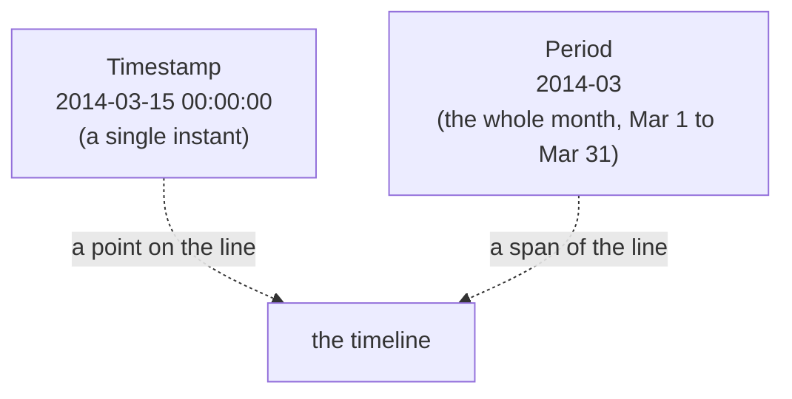
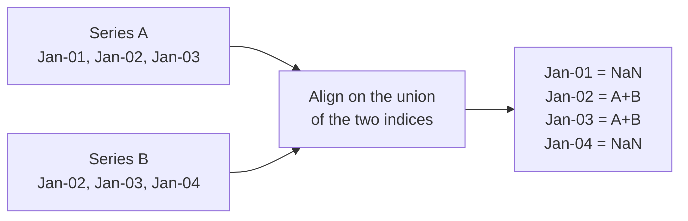
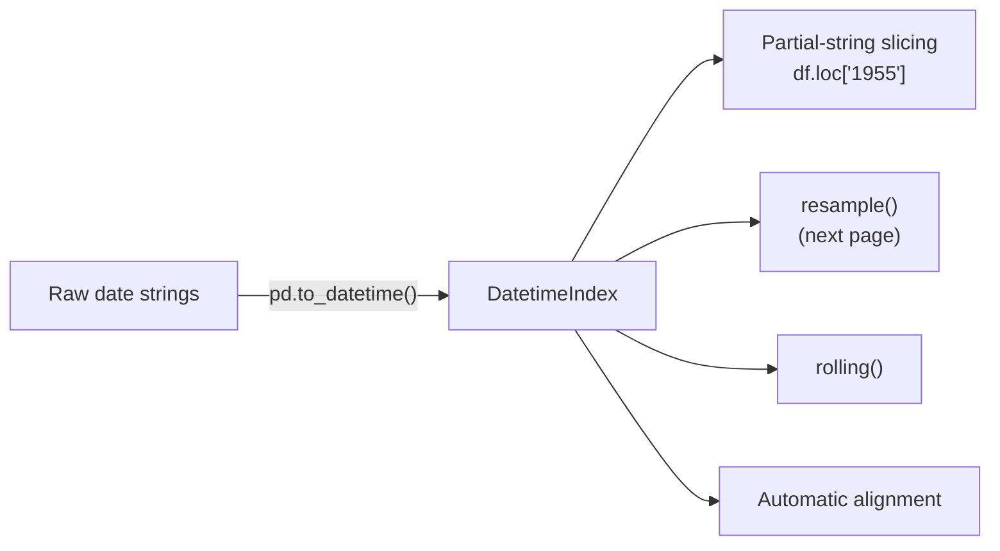

A time series only becomes *easy* in pandas once the timestamps live in the
**index**, not in an ordinary column. Promote your dates to a
`DatetimeIndex` and a whole toolbox unlocks: slice by `"1955"`, resample to
weekly, roll a 7-day average, and — the quiet hero of this page —
**automatically align** two series by date so you never make an
off-by-one error again. This page is about getting your data onto that
timeline correctly.

## From strings to timestamps: `pd.to_datetime`

Dates almost always arrive as **text**. The first job of any time series
workflow is to parse that text into real timestamps. `pd.to_datetime` is
the workhorse.

<CodeBlock
  adapter="python"
  starterCode={`import pandas as pd

raw = ["2014-01-05", "2014-02-10", "2014-03-30"]
ts = pd.to_datetime(raw)

print(ts)
print()
print("type of the whole thing:", type(ts).__name__)  # DatetimeIndex
print("type of one element:    ", type(ts[0]).__name__)  # Timestamp
print()
print("It understands the calendar:")
print("  day names:", list(ts.day_name()))
print("  is 2014 a leap year? Feb has", ts[1].days_in_month, "days")
`}
/>

Two new types just appeared, and they matter:

- **`Timestamp`** — pandas's version of a single moment in time (one
  observation's "when"). It's calendar-aware: it knows weekdays, month
  lengths, leap years.
- **`DatetimeIndex`** — an *array* of `Timestamp`s, purpose-built to be a
  DataFrame or Series index.

<Callout type="tip" title="Parse early, parse once">
Convert date columns to real timestamps the moment the data lands, then
forget they were ever strings. String dates are a trap: `"2014-1-5"`,
`"01/05/2014"`, and `"Jan 5, 2014"` all *look* like dates but sort and
compare like gibberish until parsed. `pd.to_datetime` handles all three.
</Callout>

When some values are unparseable, choose your failure mode explicitly:

<CodeBlock
  adapter="python"
  starterCode={`import pandas as pd

messy = pd.Series(["2014-01-05", "not-a-date", "2014-03-30"])

# errors="coerce" turns the bad value into NaT (Not-a-Time), the datetime
# equivalent of NaN, while keeping the column a proper datetime.
parsed = pd.to_datetime(messy, errors="coerce")
print(parsed)
print()
print("dtype stays datetime:", parsed.dtype)
print("count of valid dates:", parsed.notna().sum())
`}
/>

`NaT` ("Not a Time") is to timestamps what `NaN` is to numbers. Using
`errors="coerce"` keeps the column correctly typed while flagging the bad
rows — far better than letting one typo turn the whole column back into
text.

## Setting a `DatetimeIndex`

The pivotal move: take a parsed date column and make it the index.

<CodeBlock
  adapter="python"
  starterCode={`import pandas as pd

df = pd.DataFrame(
    {
        "date": ["2014-01-05", "2014-01-06", "2014-01-07", "2014-01-08"],
        "sales": [120, 135, 98, 110],
    }
)

# Step 1: parse the text into timestamps.
df["date"] = pd.to_datetime(df["date"])
# Step 2: promote that column to the index.
df = df.set_index("date")

print(df)
print()
print("index type:", type(df.index).__name__)  # DatetimeIndex
print("Now the timeline tools are available.")
`}
/>

<Callout type="info" title="Why the index, not a column?">
pandas reserves its time-series superpowers — partial-string slicing,
`resample`, `rolling`, automatic alignment — for data indexed by a
`DatetimeIndex`. A date sitting in a normal column is just data; a date in
the *index* is a coordinate the library can navigate. When in doubt with
time series, **put time in the index**.
</Callout>

## Building a timeline from scratch: `date_range`

When you need a regular grid of timestamps — for simulated data, for a
forecast horizon, or to reindex onto a clean calendar — `pd.date_range`
generates one. The `freq` argument sets the spacing.

<CodeBlock
  adapter="python"
  starterCode={`import pandas as pd

print("Six month-STARTS (freq='MS'):")
print(pd.date_range("2014-01-01", periods=6, freq="MS").tolist())
print()
print("Six calendar days (freq='D'):")
print(pd.date_range("2014-01-01", periods=6, freq="D").tolist())
print()
print("Four weekly points, weeks ending Sunday (freq='W'):")
print(pd.date_range("2014-01-01", periods=4, freq="W").tolist())
print()
print("End-date form instead of periods:")
print(pd.date_range(start="2014-01-01", end="2014-06-01", freq="MS").tolist())
`}
/>

### The frequency cheat sheet (and a version gotcha)

Frequency strings are short codes for "how far apart." The ones you'll use
constantly:

| Code | Meaning | Example use |
| --- | --- | --- |
| `D` | calendar day | daily sales, daily visits |
| `W` | weekly (Sunday-ending by default; `W-MON` to change) | weekly reports |
| `MS` | month **start** | monthly series labeled on the 1st |
| `ME` | month **end** | monthly series labeled on the last day |
| `QE` | quarter end | quarterly revenue |
| `YE` | year end | annual totals |
| `h` | hourly | energy demand per hour |
| `min` | minute | sensor readings |

<Callout type="danger" title="The 'M' -> 'ME' rename you WILL trip over">
In **older pandas** (and almost every tutorial and Stack Overflow answer
online), monthly frequency was just `"M"` (month end) and `"A"`/`"Y"` was
year end. Modern pandas (2.2+) **renamed** these to `"ME"`, `"YE"`,
`"QE"`, and lowercased hourly to `"h"`. The old codes still *work* for now
but emit a noisy `FutureWarning`. This course uses the modern codes
(`"ME"`, `"YE"`, `"h"`) so output stays clean — but when you paste code
from the internet and see "M is deprecated," now you know the one-line
fix: append an `E`.
</Callout>

## Partial-string slicing: the feature you'll use hourly

With a `DatetimeIndex`, you can select by *partial* date strings. pandas
figures out the range you mean. We'll use the airline series to show it
off.

<CodeBlock
  adapter="python"
  initCode={`import pandas as pd
import numpy as np
_passengers = [
    112,118,132,129,121,135,148,148,136,119,104,118,
    115,126,141,135,125,149,170,170,158,133,114,140,
    145,150,178,163,172,178,199,199,184,162,146,166,
    171,180,193,181,183,218,230,242,209,191,172,194,
    196,196,236,235,229,243,264,272,237,211,180,201,
    204,188,235,227,234,264,302,293,259,229,203,229,
    242,233,267,269,270,315,364,347,312,274,237,278,
    284,277,317,313,318,374,413,405,355,306,271,306,
    315,301,356,348,355,422,465,467,404,347,305,336,
    340,318,362,348,363,435,491,505,404,359,310,337,
    360,342,406,396,420,472,548,559,463,407,362,405,
    417,391,419,461,472,535,622,606,508,461,390,432,
]
idx = pd.date_range("1949-01-01", periods=len(_passengers), freq="MS")
air = pd.Series(_passengers, index=idx, name="passengers")`}
  starterCode={`# A whole year, just by naming it:
print("All of 1955:")
print(air.loc["1955"].tolist())
print()

# A date-string RANGE (inclusive on both ends):
print("Summer 1955 (June to September):")
print(air.loc["1955-06":"1955-09"])
print()

# Aggregate a slice directly:
print("Average monthly passengers in 1960:", round(air.loc["1960"].mean(), 1))
print("Peak month across the whole series:", air.idxmax().date(), "=", air.max())
`}
/>

Notice that `air.loc["1955-06":"1955-09"]` is **inclusive of the end** —
unlike normal Python slicing, which excludes the stop. That's deliberate:
you asked for "through September," so you get September. This partial-string
slicing is the single most convenient thing about a `DatetimeIndex`.

<MultipleChoice
  markdown={`With a \`DatetimeIndex\`, what does \`air.loc["1955-06":"1955-09"]\` return?

- The single value at 1955-06 only
  > A colon makes it a *range*, not a single lookup. This selects every month in the span, not one point.
- [o] Every monthly value from June 1955 through September 1955, inclusive of September
  > Partial-string slicing on a DatetimeIndex expands each endpoint to the period it names and includes the end — so June, July, August, and September 1955 all come back.
- June through August 1955, excluding September (like normal Python slicing)
  > Label-based datetime slicing is *inclusive* of the stop, unlike positional Python slicing. September is included.
- An error, because those strings are not exact timestamps in the index
  > Partial strings are exactly what datetime slicing is built for; pandas resolves "1955-09" to that whole month. No exact-match is required.

DatetimeIndex slicing resolves partial strings to spans and is inclusive of the end label.`}
/>

## Reading calendar parts: the `.dt` accessor and index attributes

To pull out the year, month, weekday, or quarter, use `.dt` on a datetime
*column*, or the matching attribute directly on a `DatetimeIndex`.

<CodeBlock
  adapter="python"
  initCode={`import pandas as pd
import numpy as np
_passengers = [
    112,118,132,129,121,135,148,148,136,119,104,118,
    115,126,141,135,125,149,170,170,158,133,114,140,
    145,150,178,163,172,178,199,199,184,162,146,166,
    171,180,193,181,183,218,230,242,209,191,172,194,
    196,196,236,235,229,243,264,272,237,211,180,201,
    204,188,235,227,234,264,302,293,259,229,203,229,
    242,233,267,269,270,315,364,347,312,274,237,278,
    284,277,317,313,318,374,413,405,355,306,271,306,
    315,301,356,348,355,422,465,467,404,347,305,336,
    340,318,362,348,363,435,491,505,404,359,310,337,
    360,342,406,396,420,472,548,559,463,407,362,405,
    417,391,419,461,472,535,622,606,508,461,390,432,
]
idx = pd.date_range("1949-01-01", periods=len(_passengers), freq="MS")
air = pd.Series(_passengers, index=idx, name="passengers")`}
  starterCode={`import pandas as pd

# Directly off the index:
print("First five years :", air.index.year[:5].tolist())
print("First five months:", air.index.month[:5].tolist())

# As a DataFrame with derived calendar columns via .dt:
df = air.reset_index()
df.columns = ["date", "passengers"]
df["year"] = df["date"].dt.year
df["month"] = df["date"].dt.month_name().str[:3]
df["quarter"] = df["date"].dt.quarter

# Which month, on average, is busiest? (Seasonality, previewed.)
by_month = df.groupby(df["date"].dt.month)["passengers"].mean().round(0)
print()
print("Average passengers by calendar month (1=Jan ... 12=Dec):")
print(by_month)
print()
print("Peak travel months are the summer (Jul/Aug) - that's the seasonality.")
`}
/>

Grouping by `date.dt.month` already reveals the yearly seasonal shape —
summer months tower over winter ones. We'll formalize that into a proper
*seasonal component* later; for now, notice how `.dt` turns timestamps into
ordinary grouping keys.

## Timestamp vs Period: a point versus a span

There are two honest ways to say "March 2014," and pandas gives you both:

- A **`Timestamp`** is an *instant* — "the reading taken at 14:32:05."
- A **`Period`** is a *span* — "the month of March," "the year 1955," "Q3."

Monthly sales aren't really a value *at* March 1st; they're the total *over
all of March*. That's conceptually a `Period`. Most of the time we still
use a `Timestamp` index (it plays nicer with plotting and resampling) and
just remember the value summarizes a span — but knowing the distinction
keeps you from nonsense like "the sales at exactly midnight on the 1st."

<CodeBlock
  adapter="python"
  starterCode={`import pandas as pd

instant = pd.Timestamp("2014-03-15 14:32:05")
month = pd.Period("2014-03", freq="M")

print("Timestamp:", instant, "-> just the minute:", instant.minute)
print("Period:   ", month, "-> spans", month.start_time, "to", month.end_time)
print()

# A Period knows what comes next, calendar-correctly:
print("This period:", month, " next period:", month + 1)

# Is our instant inside that month?
print(
    "Is the instant within the period?", month.start_time <= instant <= month.end_time
)
`}
/>

<MultipleChoice
  markdown={`A dataset holds **total monthly electricity consumption**. Conceptually, is each value better described as a \`Timestamp\` or a \`Period\`?

- A \`Timestamp\`, because every value needs an exact moment
  > A monthly total isn't measured *at* one instant; it accumulates across the whole month. Forcing it to a single instant ("midnight on the 1st") misrepresents what the number means.
- [o] A \`Period\`, because the value summarizes consumption over an entire month-long span, not at one instant
  > Totals and averages over a calendar month are spans by nature — exactly what a \`Period\` represents. (In practice we often still index by a \`Timestamp\` for convenience, while remembering it stands for the whole month.)
- Neither — monthly data can't be represented in pandas
  > pandas represents monthly data comfortably with either type; the question is which one matches the *meaning*. A span-valued total maps most naturally to a \`Period\`.
- It must be a \`Timestamp\` or resampling won't work
  > Resampling works on a \`DatetimeIndex\` regardless of this conceptual point. The distinction here is about correctly interpreting what the value represents.

A total accumulated over a month is a span — conceptually a \`Period\` — even if we often store it under a \`Timestamp\` for tooling convenience.`}
/>

## The quiet hero: automatic alignment

Here is the feature that prevents a whole category of silent bugs. When you
combine two pandas objects, the operation aligns them **by index label**,
not by position. Add two series and pandas matches March-to-March,
April-to-April — even if they're in different orders or have different
lengths. Where a label is missing on one side, the result is `NaN`.

<CodeBlock
  adapter="python"
  starterCode={`import pandas as pd

a = pd.Series(
    [1, 2, 3], index=pd.to_datetime(["2014-01-01", "2014-01-02", "2014-01-03"])
)
b = pd.Series(
    [10, 20, 30], index=pd.to_datetime(["2014-01-02", "2014-01-03", "2014-01-04"])
)

print("a + b aligns by DATE, not by position:")
print(a + b)
print()
print("Jan-01 and Jan-04 are NaN: each exists in only ONE series, so")
print("there's nothing to add. pandas refuses to guess.")
`}
/>

Compare that to plain Python lists or NumPy arrays, which add by
*position*: `[1,2,3] + [10,20,30]` would pair the first with the first
regardless of what dates they represent. If your two series happened to
start on different dates, NumPy would happily add January to February and
hand you a confidently wrong answer. pandas's label alignment is the
guardrail.

<Callout type="warn" title="Alignment is a feature, but watch for the NaNs">
Label alignment saves you from off-by-one disasters — but it *introduces*
`NaN`s wherever the two indices don't overlap. After combining series with
different date ranges, always check for new missing values. The fix is
usually `.dropna()`, an explicit `.reindex(...)`, or `fill_value=0` on the
arithmetic (e.g. `a.add(b, fill_value=0)`).
</Callout>

## How it all fits together

Everything on this page is one pipeline: get messy date text onto a clean
timeline, and the rest of pandas' time tooling switches on.

## Practice

<ChallengeCard
  adapter="python"
  title="Put a sales log on the timeline"
  instructions={`A small DataFrame \`log\` has two columns: \`day\` (date strings) and \`units\` (integers). Build a Series called \`daily\` that:

1. Parses \`day\` into real timestamps.
2. Uses those timestamps as a \`DatetimeIndex\`.
3. Contains the \`units\` values, ordered by date ascending.

The result must be a \`pd.Series\` whose \`.index\` is a \`DatetimeIndex\` of length 5, sorted in time order.`}
  initCode={`import pandas as pd

log = pd.DataFrame({
    "day":   ["2014-02-03", "2014-02-01", "2014-02-04", "2014-02-02", "2014-02-05"],
    "units": [9, 5, 12, 7, 3],
})`}
  starterCode={`# Build the time-indexed Series 'daily' here.
daily = None
print(daily)
`}
  solutionCode={`parsed = pd.to_datetime(log["day"])
daily = pd.Series(log["units"].values, index=parsed, name="units").sort_index()
print(daily)
print()
print("index type:", type(daily.index).__name__)
`}
  tests={[
    {
      id: "is_series",
      name: "daily is a Series",
      description: "Type check",
      code: `import pandas as pd
assert isinstance(daily, pd.Series), "daily should be a pandas Series"`,
    },
    {
      id: "datetime_index",
      name: "index is a DatetimeIndex",
      description: "Timestamps are in the index",
      code: `import pandas as pd
assert isinstance(daily.index, pd.DatetimeIndex), "index must be a DatetimeIndex"`,
    },
    {
      id: "length",
      name: "five rows",
      description: "All observations kept",
      code: `assert len(daily) == 5`,
    },
    {
      id: "sorted",
      name: "sorted in time order",
      description: "Index is monotonically increasing",
      code: `assert daily.index.is_monotonic_increasing, "index must be sorted ascending"`,
    },
    {
      id: "value_at_date",
      name: "values match their dates",
      description: "Feb 4 should hold 12 units",
      code: `import pandas as pd
assert daily.loc[pd.Timestamp("2014-02-04")] == 12`,
    },
  ]}
/>

<ChallengeCard
  adapter="python"
  title="Combine two partial series with alignment"
  instructions={`Two daily Series, \`store_a\` and \`store_b\`, cover *overlapping but not identical* date ranges. Produce a Series \`total\` giving the **combined** daily units across both stores, where:

- On days present in both, add them.
- On days present in only one store, use that store's value alone (treat the missing store as 0).

The result should have **one row per date in the union** of the two indices, sorted ascending, with no \`NaN\`s. (Hint: \`Series.add(other, fill_value=0)\`.)`}
  initCode={`import pandas as pd

store_a = pd.Series(
    [10, 12, 9],
    index=pd.to_datetime(["2014-03-01", "2014-03-02", "2014-03-03"]),
)
store_b = pd.Series(
    [4, 6, 8],
    index=pd.to_datetime(["2014-03-02", "2014-03-03", "2014-03-04"]),
)`}
  starterCode={`total = None  # combine with alignment; missing -> 0
print(total)
`}
  solutionCode={`total = store_a.add(store_b, fill_value=0).sort_index()
print(total)
`}
  tests={[
    {
      id: "union_length",
      name: "covers the union of dates (4 days)",
      description: "Mar 1 through Mar 4",
      code: `assert len(total) == 4, f"Expected 4 dates, got {len(total)}"`,
    },
    {
      id: "no_nans",
      name: "no missing values",
      description: "fill_value=0 removed the gaps",
      code: `assert total.notna().all(), "There should be no NaNs after fill_value=0"`,
    },
    {
      id: "overlap_added",
      name: "overlap days are summed",
      description: "Mar 2 = 12 + 4 = 16",
      code: `import pandas as pd
assert total.loc[pd.Timestamp("2014-03-02")] == 16`,
    },
    {
      id: "solo_days_kept",
      name: "solo days keep their single value",
      description: "Mar 1 = 10 (store_a only), Mar 4 = 8 (store_b only)",
      code: `import pandas as pd
assert total.loc[pd.Timestamp("2014-03-01")] == 10
assert total.loc[pd.Timestamp("2014-03-04")] == 8`,
    },
  ]}
/>

## Check your understanding

<MultipleChoice
  markdown={`Why promote a date column to the **index** instead of leaving it as a regular column?

- It saves memory
  > Memory is not the motivation, and the savings are negligible. The point is unlocking behavior, not shrinking storage.
- [o] A \`DatetimeIndex\` unlocks partial-string slicing, \`resample\`, \`rolling\`, and automatic alignment — features that don't work on a plain column
  > pandas attaches its time-series machinery to the index. With dates in the index you can write \`df.loc["1955"]\`, \`df.resample("ME")\`, and rely on label alignment; with dates in a column you can't.
- It automatically removes duplicate dates
  > Setting an index does not deduplicate; you can have repeated index labels. Deduplication is a separate, explicit step.
- It converts the data to a NumPy array
  > Indexing has nothing to do with converting to NumPy, and you wouldn't want that — you'd lose the very label-awareness that makes the index useful.

The index is where pandas keeps its time-series powers; a date in a column is inert by comparison.`}
/>

<MultipleChoice
  markdown={`You write \`pd.date_range("2024-01-01", periods=6, freq="M")\` and pandas prints a \`FutureWarning\` about \`'M'\` being deprecated. What's the corrected frequency code in modern pandas?

- \`"Month"\`
  > Frequency codes are short aliases, not English words. \`"Month"\` is not a valid alias.
- [o] \`"ME"\` (month end) — modern pandas renamed \`"M"\` to \`"ME"\` and \`"Y"\`/\`"A"\` to \`"YE"\`
  > The deprecation is purely a rename: append \`E\` for the "end" anchored aliases. \`"M"\` becomes \`"ME"\`, \`"Q"\` becomes \`"QE"\`, \`"Y"\` becomes \`"YE"\`.
- \`"MS"\`, which is identical to the old \`"M"\`
  > \`"MS"\` is month *start* (labels on the 1st); the old \`"M"\` was month *end* (labels on the last day). They are not identical — the direct replacement for \`"M"\` is \`"ME"\`.
- There is no replacement; monthly frequency was removed
  > Monthly frequency is alive and well — only its spelling changed. \`"ME"\` is the current month-end alias.

The \`'M'\` -> \`'ME'\` rename (and \`'Y'\` -> \`'YE'\`, \`'Q'\` -> \`'QE'\`) is a spelling change; the behavior is unchanged.`}
/>

<MultipleChoice
  markdown={`Two Series indexed by date are added with \`a + b\`. \`a\` covers Jan 1-3 and \`b\` covers Jan 2-4. What happens on Jan 1 and Jan 4 in the result?

- They're dropped from the output entirely
  > Alignment uses the *union* of indices, so both dates appear in the result — they aren't silently dropped.
- They're added to the nearest available date
  > pandas never guesses by proximity. It matches labels exactly and refuses to invent a partner for an unmatched date.
- [o] Both become \`NaN\`, because each date exists in only one of the two Series and there's nothing to add it to
  > Label alignment pairs identical dates; Jan 1 (only in \`a\`) and Jan 4 (only in \`b\`) have no counterpart, so the sum is undefined and pandas marks it \`NaN\`.
- They use 0 for the missing side automatically
  > Plain \`+\` does not assume 0 for missing labels — that would be a silent guess. You'd get \`NaN\`. To treat missing as 0 you must opt in with \`a.add(b, fill_value=0)\`.

Arithmetic aligns on the union of labels and yields \`NaN\` where a label is missing on one side, unless you explicitly supply a \`fill_value\`.`}
/>

<Callout type="success" title="Key takeaways">
- **`pd.to_datetime`** parses date text into **`Timestamp`** values; bad
  rows become **`NaT`** with `errors="coerce"`.
- Put time in the **index** (a **`DatetimeIndex`**) to unlock slicing,
  resampling, rolling, and alignment.
- **`pd.date_range(..., freq=...)`** builds a regular timeline. Modern freq
  codes: `D`, `W`, **`ME`**/`MS`, `QE`, **`YE`**, `h`, `min` — and remember
  the old **`M`** is now **`ME`**.
- **Partial-string slicing** (`air.loc["1955"]`, `air.loc["1955-06":"1955-09"]`)
  is inclusive of the end and is the most convenient `DatetimeIndex` trick.
- **`Timestamp`** is an instant; **`Period`** is a span. Monthly totals are
  conceptually spans.
- **Automatic alignment** matches operations by index label, not position —
  a guardrail against off-by-one bugs — but it creates `NaN`s where indices
  don't overlap.
</Callout>

You can now get any dataset onto a clean timeline. Next we change the
*resolution* of that timeline — squeezing daily data up to monthly, or
stretching monthly data down to daily — with `resample`.
