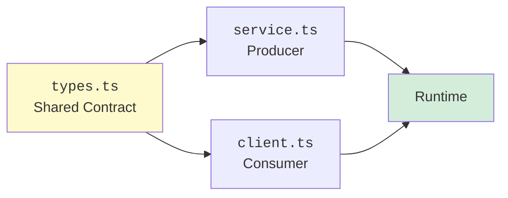
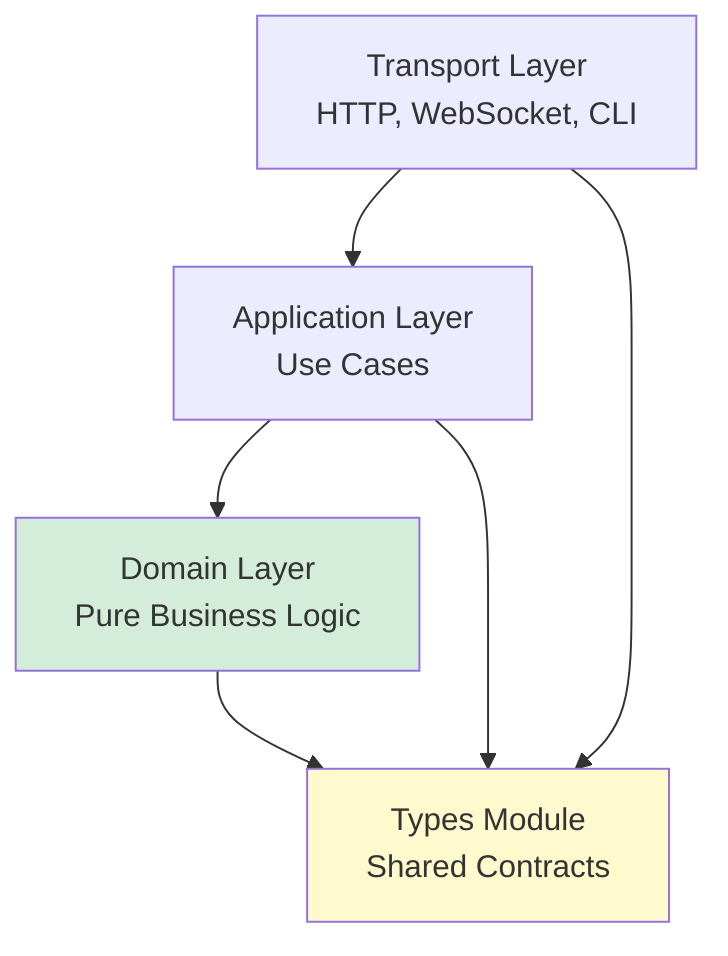

As systems grow, they're split into modules, services, and teams. Each boundary is a potential failure point: miscommunication, inconsistent data shapes, forgotten error cases. In dynamically typed languages, these issues surface at runtime — in production, under load, after deployment.

TypeScript offers a better way: **types as contracts**. By modeling your API surfaces with precise types, you move entire classes of integration bugs to compile time. In this chapter, you'll learn to design contracts that span module boundaries, model request/response cycles, separate domain logic from transport concerns, and build systems where the compiler enforces compatibility.

<svg
  viewBox="0 0 640 240"
  role="img"
  aria-label="Two halves of a bridge built from opposite cliffs meet mid-air in interlocking fingers and a parcel rolls across, while a faint earlier attempt below never met and lets a red drop fall through the gap — a shared type contract makes both sides meet exactly"
  style={{ display: "block", width: "100%", maxWidth: "640px", height: "auto", margin: "2.5rem auto" }}
>
  <g fill="currentColor" opacity="0.08">
    <path d="M40 128 L240 128 L240 232 L40 232 Z" />
    <path d="M400 128 L600 128 L600 232 L400 232 Z" />
  </g>
  <g style={{ color: "var(--ds-blue-500)" }} fill="currentColor">
    <rect x="120" y="84" width="180" height="32" rx="6" />
    <rect x="300" y="84" width="22" height="10" />
    <rect x="300" y="106" width="22" height="10" />
  </g>
  <g style={{ color: "var(--ds-green-500)" }} fill="currentColor">
    <rect x="342" y="84" width="180" height="32" rx="6" />
    <rect x="320" y="94" width="22" height="12" />
  </g>
  <g style={{ color: "var(--ds-yellow-500)" }} fill="currentColor">
    <circle cx="250" cy="72" r="9" />
  </g>
  <g fill="currentColor" opacity="0.3">
    <circle cx="180" cy="72" r="2.5" />
    <circle cx="210" cy="72" r="2.5" />
    <circle cx="288" cy="72" r="2.5" />
    <circle cx="318" cy="72" r="2.5" />
  </g>
  <g fill="currentColor" opacity="0.15">
    <rect x="160" y="176" width="120" height="20" rx="5" />
    <rect x="360" y="176" width="120" height="20" rx="5" />
  </g>
  <g style={{ color: "var(--ds-red-500)" }} fill="currentColor">
    <circle cx="320" cy="206" r="6" fillOpacity="0.7" />
    <circle cx="320" cy="188" r="2.5" fillOpacity="0.4" />
    <circle cx="320" cy="222" r="2.5" fillOpacity="0.3" />
  </g>
</svg>

---

## The Problem: Implicit Contracts

Consider a simple user service:

```ts
function getUser(id) {
  // Returns { id, name, email } ... or null? undefined? throws?
}
```

What's the contract? It's implicit, documented (maybe) in comments or external docs. Callers must guess:
- What does `id` expect? A number? String? UUID?
- What's returned? An object? `null`? Can it throw?
- If it returns an object, what fields are guaranteed?

Implicit contracts break silently. A refactor changes the return shape, and distant callers fail at runtime.

---

## Explicit Contracts with Types

Let's make the contract explicit:

<CodeBlock
  adapter="typescript"
  files={[
    {
      filename: "main.ts",
      starterCode: `type UserId = string;

type User = {
  id: UserId;
  name: string;
  email: string;
};

function getUser(id: UserId): User | null {
  // Simulate database lookup
  if (id === "user-1") {
    return { id: "user-1", name: "Alice", email: "alice@example.com" };
  }
  return null;
}

const user = getUser("user-1");
if (user) {
  console.log(\`User: \${user.name} (\${user.email})\`);
} else {
  console.log("User not found");
}
`,
    },
  ]}
/>

Now the contract is clear:
- Input: `UserId` (a string).
- Output: `User | null` (an object with three fields, or `null` if not found).

If you change `User`'s shape, every caller that accesses a field gets a compile error. The type is the source of truth.

---

## Shared Type Modules

In multi-module or multi-service systems, types should live in a **shared module** that both producer and consumer depend on. This ensures they agree on the shape.

<CodeBlock
  adapter="typescript"
  entryFilename="client.ts"
  files={[
    {
      filename: "client.ts",
      starterCode: `import { User, UserId } from "./types";
import { getUser } from "./service";

const userId: UserId = "user-1";
const user = getUser(userId);

if (user) {
  console.log(\`Fetched: \${user.name}\`);
} else {
  console.log("Not found");
}
`,
    },
    {
      filename: "service.ts",
      starterCode: `import { User, UserId } from "./types";

export function getUser(id: UserId): User | null {
  if (id === "user-1") {
    return { id: "user-1", name: "Alice", email: "alice@example.com" };
  }
  return null;
}
`,
    },
    {
      filename: "types.ts",
      starterCode: `export type UserId = string;

export type User = {
  id: UserId;
  name: string;
  email: string;
};
`,
    },
  ]}
/>

Both `service.ts` and `client.ts` import from `types.ts`. If you add a field to `User`, both sides see it immediately. If the service forgets to include it, the compiler complains.



---

## Request/Response DTOs

In HTTP-like systems, you model requests and responses as **Data Transfer Objects (DTOs)**. Even if you're not building a real network service, modeling synchronous functions this way clarifies intent.

<CodeBlock
  adapter="typescript"
  entryFilename="client.ts"
  files={[
    {
      filename: "client.ts",
      starterCode: `import { GetUserRequest, GetUserResponse } from "./types";
import { handleGetUser } from "./service";

const request: GetUserRequest = { userId: "user-1" };
const response = handleGetUser(request);

if (response.success) {
  console.log(\`User: \${response.user.name}\`);
} else {
  console.log(\`Error: \${response.error}\`);
}
`,
    },
    {
      filename: "service.ts",
      starterCode: `import { GetUserRequest, GetUserResponse, User } from "./types";

export function handleGetUser(req: GetUserRequest): GetUserResponse {
  if (req.userId === "user-1") {
    const user: User = {
      id: "user-1",
      name: "Alice",
      email: "alice@example.com",
    };
    return { success: true, user };
  }
  return { success: false, error: "User not found" };
}
`,
    },
    {
      filename: "types.ts",
      starterCode: `export type UserId = string;

export type User = {
  id: UserId;
  name: string;
  email: string;
};

export type GetUserRequest = {
  userId: UserId;
};

export type GetUserResponse =
  | { success: true; user: User }
  | { success: false; error: string };
`,
    },
  ]}
/>

This pattern:
- **Decouples transport from logic**: The handler is a pure function. You can swap HTTP, WebSocket, IPC, or in-process calls without changing the handler.
- **Makes errors explicit**: The response is a discriminated union. Callers must handle both success and error cases.
- **Documents the contract**: Anyone reading `types.ts` knows exactly what the service expects and returns.

---

## Generic API Response Envelopes

You can generalize the response pattern with a generic `Result<T, E>` or `ApiResponse<T>` type:

<svg
  viewBox="0 0 640 150"
  role="img"
  aria-label="Two identical envelopes differ only in their edge stripe: the green-striped one carries a blue payload disc, the red-striped one carries an error diamond — one generic envelope wraps every response with a status the caller must inspect"
  style={{ display: "block", width: "100%", maxWidth: "460px", height: "auto", margin: "2.5rem auto" }}
>
  <g fill="currentColor" opacity="0.1">
    <rect x="110" y="40" width="180" height="70" rx="16" />
    <rect x="350" y="40" width="180" height="70" rx="16" />
  </g>
  <g style={{ color: "var(--ds-green-500)" }} fill="currentColor">
    <rect x="110" y="40" width="14" height="70" rx="7" />
  </g>
  <g style={{ color: "var(--ds-red-500)" }} fill="currentColor">
    <rect x="350" y="40" width="14" height="70" rx="7" />
    <path d="M452 58 L466 75 L452 92 L438 75 Z" />
  </g>
  <g style={{ color: "var(--ds-blue-500)" }} fill="currentColor">
    <circle cx="212" cy="75" r="15" />
  </g>
  <g fill="currentColor" opacity="0.2">
    <circle cx="248" cy="75" r="3" />
    <circle cx="262" cy="75" r="3" />
    <circle cx="490" cy="75" r="3" />
    <circle cx="504" cy="75" r="3" />
  </g>
</svg>

<CodeBlock
  adapter="typescript"
  files={[
    {
      filename: "main.ts",
      starterCode: `type ApiResponse<T> =
  | { status: "ok"; data: T }
  | { status: "error"; message: string };

type User = { id: string; name: string };

function getUser(id: string): ApiResponse<User> {
  if (id === "user-1") {
    return { status: "ok", data: { id: "user-1", name: "Alice" } };
  }
  return { status: "error", message: "User not found" };
}

function getOrder(id: string): ApiResponse<{ orderId: string; total: number }> {
  if (id === "order-1") {
    return { status: "ok", data: { orderId: "order-1", total: 99.99 } };
  }
  return { status: "error", message: "Order not found" };
}

const userResp = getUser("user-1");
if (userResp.status === "ok") {
  console.log(\`User: \${userResp.data.name}\`);
} else {
  console.log(\`Error: \${userResp.message}\`);
}

const orderResp = getOrder("order-1");
if (orderResp.status === "ok") {
  console.log(\`Order total: $\${orderResp.data.total}\`);
} else {
  console.log(\`Error: \${orderResp.message}\`);
}
`,
    },
  ]}
/>

Now every handler returns `ApiResponse<T>`, and the client knows to check `.status` before accessing `.data`. This is a **uniform interface** — a contract that spans your entire API surface.

---

## Separating Domain and Transport Layers

A well-architected system separates:
1. **Domain layer**: Pure business logic and types (e.g., `User`, `Order`).
2. **Application layer**: Use cases that orchestrate domain logic (e.g., `getUserById`, `placeOrder`).
3. **Transport layer**: HTTP handlers, WebSocket listeners, CLI parsers — anything that talks to the outside world.

Types enforce these boundaries:

<CodeBlock
  adapter="typescript"
  entryFilename="transport.ts"
  files={[
    {
      filename: "transport.ts",
      starterCode: `import { getUserById } from "./application";
import { ApiResponse } from "./types";

// Simulates an HTTP handler
export function handleGetUserRequest(userId: string): string {
  const result = getUserById(userId);
  if (result.status === "ok") {
    return JSON.stringify({ user: result.data });
  } else {
    return JSON.stringify({ error: result.message });
  }
}

console.log(handleGetUserRequest("user-1"));
`,
    },
    {
      filename: "application.ts",
      starterCode: `import { User, ApiResponse } from "./types";
import { findUserInDatabase } from "./domain";

export function getUserById(id: string): ApiResponse<User> {
  const user = findUserInDatabase(id);
  if (user) {
    return { status: "ok", data: user };
  }
  return { status: "error", message: "User not found" };
}
`,
    },
    {
      filename: "domain.ts",
      starterCode: `import { User } from "./types";

// Simulates a database lookup
export function findUserInDatabase(id: string): User | null {
  if (id === "user-1") {
    return { id: "user-1", name: "Alice", email: "alice@example.com" };
  }
  return null;
}
`,
    },
    {
      filename: "types.ts",
      starterCode: `export type User = {
  id: string;
  name: string;
  email: string;
};

export type ApiResponse<T> =
  | { status: "ok"; data: T }
  | { status: "error"; message: string };
`,
    },
  ]}
/>

Here:
- `domain.ts` knows nothing about HTTP or `ApiResponse` — it just finds users.
- `application.ts` wraps domain logic in `ApiResponse`, making errors explicit.
- `transport.ts` serializes the response to JSON.

Each layer has a clear contract. If you swap HTTP for gRPC, only `transport.ts` changes. The domain and application layers are unaffected.



---

## Challenge: Implement a Typed Order Service

<ChallengeCard
  adapter="typescript"
  title="Typed Order Service"
  instructions={`You're building an order service. Implement the following:
- In \`types.ts\`: Define \`Order\` (orderId: string, total: number) and \`ApiResponse<T>\`.
- In \`service.ts\`: Implement \`getOrder(orderId: string): ApiResponse<Order>\` that returns a hardcoded order for \`"order-1"\`, otherwise an error.
- In \`main.ts\`: Call \`getOrder\` and print the result.

**Success case**: \`"Order order-1: $99.99"\`
**Error case**: \`"Error: Order not found"\``}
  entryFilename="main.ts"
  files={[
    {
      filename: "main.ts",
      starterCode: `import { getOrder } from "./service";

const resp = getOrder("order-1");
if (resp.status === "ok") {
  console.log(\`Order \${resp.data.orderId}: $\${resp.data.total}\`);
} else {
  console.log(\`Error: \${resp.message}\`);
}
`,
    },
    {
      filename: "service.ts",
      starterCode: `import { Order, ApiResponse } from "./types";

export function getOrder(orderId: string): ApiResponse<Order> {
  // Implement
  return { status: "error", message: "Not implemented" };
}
`,
      solutionCode: `import { Order, ApiResponse } from "./types";

export function getOrder(orderId: string): ApiResponse<Order> {
  if (orderId === "order-1") {
    return { status: "ok", data: { orderId: "order-1", total: 99.99 } };
  }
  return { status: "error", message: "Order not found" };
}
`,
    },
    {
      filename: "types.ts",
      starterCode: `export type Order = {
  orderId: string;
  total: number;
};

export type ApiResponse<T> =
  | { status: "ok"; data: T }
  | { status: "error"; message: string };
`,
    },
  ]}
  tests={[
    {
      id: "out",
      name: "Prints order-1 with total",
      description: "stdout includes 'order-1' and '99.99'",
      expect: { stdoutContains: ["order-1", "99.99"] },
    },
  ]}
/>

---

## Using Discriminated Unions for Multiple Response Types

Sometimes a single endpoint returns different shapes based on the request. Use discriminated unions:

<CodeBlock
  adapter="typescript"
  files={[
    {
      filename: "main.ts",
      starterCode: `type SearchRequest = {
  query: string;
  type: "user" | "order";
};

type User = { id: string; name: string };
type Order = { orderId: string; total: number };

type SearchResponse =
  | { type: "user"; results: User[] }
  | { type: "order"; results: Order[] }
  | { type: "error"; message: string };

function search(req: SearchRequest): SearchResponse {
  if (req.type === "user") {
    return { type: "user", results: [{ id: "user-1", name: "Alice" }] };
  }
  if (req.type === "order") {
    return { type: "order", results: [{ orderId: "order-1", total: 99.99 }] };
  }
  return { type: "error", message: "Unknown search type" };
}

const resp = search({ query: "Alice", type: "user" });
if (resp.type === "user") {
  console.log(\`Users: \${resp.results.map((u) => u.name).join(", ")}\`);
} else if (resp.type === "order") {
  console.log(\`Orders: \${resp.results.map((o) => o.orderId).join(", ")}\`);
} else {
  console.log(\`Error: \${resp.message}\`);
}
`,
    },
  ]}
/>

The compiler ensures you check `resp.type` before accessing `results`. If you add a new response variant, exhaustiveness checking forces you to handle it.

---

## Multiple Choice: Benefits of Shared Type Modules

<MultipleChoice
  markdown={`What's the main benefit of placing types in a shared module (\`types.ts\`) that both client and server import?

- Reduces code duplication
  > That's a benefit, but not the main one. The key is *synchronization*.
- [o] Ensures both sides agree on the contract at compile time
  > If the server changes a type, the client gets a compile error immediately. The contract is enforced by the compiler.
- Improves runtime performance
  > Types are erased at runtime; there's no performance impact.

Shared types act as a single source of truth, preventing version skew between producer and consumer.`}
/>

---

## Multiple Choice: Generic Response Envelopes

<MultipleChoice
  markdown={`Given:
\`\`\`ts
type ApiResponse<T> =
  | { status: "ok"; data: T }
  | { status: "error"; message: string };

function getUser(id: string): ApiResponse<User> { ... }
\`\`\`
What must the caller do to access \`data\`?

- Check \`data !== undefined\`
  > The type system guarantees \`data\` is present when \`status === "ok"\`, but you still need to narrow.
- [o] Check \`status === "ok"\` to narrow the discriminated union
  > Once you check \`status\`, TypeScript narrows to the \`ok\` branch, where \`data\` is guaranteed.
- Cast \`response.data as User\`
  > Casting is unsafe and defeats the purpose of the discriminated union.

Discriminated unions force you to check the tag before accessing variant-specific fields.`}
/>

---

## Summary

You've learned how to:
- **Make contracts explicit** with typed request/response shapes.
- **Organize types in shared modules** so producer and consumer agree.
- **Model APIs with DTOs** (request/response objects).
- **Generalize responses** with `ApiResponse<T>` or `Result<T, E>`.
- **Separate domain, application, and transport layers** using types to enforce boundaries.
- **Use discriminated unions** for endpoints with multiple response shapes.

Types as contracts shift entire classes of integration bugs leftward — from production to compile time. They're living documentation that never goes stale. In the next chapter, we'll apply these ideas to **error handling**, modeling failures as values rather than exceptions.

---

**Next**: [Error Handling with Types](./error-handling-with-types) — using `Result<T, E>` to make errors explicit and composable.
