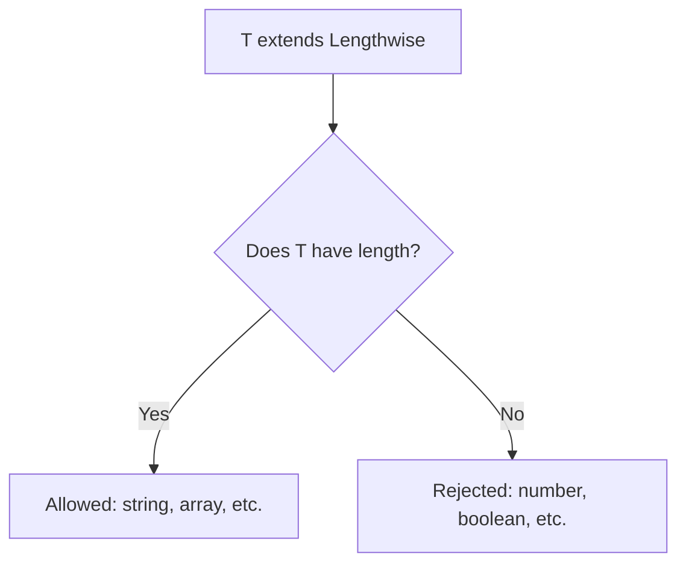

In [Generics Basics](./generics-basics), we saw how unconstrained type parameters like `<T>` let you write functions that work with *any* type. But sometimes "any type" is too permissive. What if you need to call a method on `T`, or access a property, or ensure `T` is a subtype of something?

This is where **generic constraints** come in. You can restrict a type parameter to types that satisfy certain conditions using the `extends` keyword. This unlocks richer operations: accessing properties, calling methods, indexing into objects, and more — all while keeping the code generic and type-safe.

## The problem: operations on unconstrained types

Suppose you want a function that logs the length of an array or a string. With an unconstrained type parameter, this doesn't work:

```ts
function logLength<T>(item: T): void {
  console.log(item.length); // ❌ Error: Property 'length' does not exist on type 'T'
}
```

The compiler doesn't know if `T` has a `length` property. For all it knows, `T` could be `number` or `boolean`, which don't have `length`.

The solution: **constrain** `T` to types that *do* have a `length` property.

<CodeBlock
  adapter="typescript"
  files={[
    {
      filename: "main.ts",
      starterCode: `// Define a constraint: T must have a 'length' property
interface Lengthwise {
  length: number;
}

function logLength<T extends Lengthwise>(item: T): void {
  console.log(\`Length: \${item.length}\`);
}

// Now we can call it with anything that has 'length'
logLength("hello"); // string has length
logLength([1, 2, 3]); // array has length
logLength({ length: 42, data: "custom" }); // custom object with length

// logLength(123); // ❌ Error: number doesn't have 'length'
`,
    },
  ]}
/>

The `<T extends Lengthwise>` syntax means "`T` can be any type, as long as it's assignable to `Lengthwise`." Inside the function, you can safely access `item.length` because the compiler knows it exists.

<Callout type="info" title="'extends' in generics">
In the context of generics, `extends` means "is assignable to" or "is a subtype of." It's the same `extends` you see in class inheritance (`class Dog extends Animal`), but here it constrains a type parameter rather than defining a class hierarchy.
</Callout>



## The `keyof` operator

One of the most useful constraints is `keyof`, which gives you the union of all keys of a type. Combined with `extends keyof`, you can write functions that safely access object properties.

<CodeBlock
  adapter="typescript"
  files={[
    {
      filename: "main.ts",
      starterCode: `function getProperty<T, K extends keyof T>(obj: T, key: K): T[K] {
  return obj[key];
}

const person = { name: "Alice", age: 30, city: "New York" };

const name = getProperty(person, "name"); // type: string
const age = getProperty(person, "age"); // type: number

console.log(\`Name: \${name}\`);
console.log(\`Age: \${age}\`);

// getProperty(person, "email"); // ❌ Error: "email" is not a key of person
`,
    },
  ]}
/>

Here's what's happening:

- `K extends keyof T` means "`K` must be one of the keys of `T`."
- For `person`, `keyof T` is `"name" | "age" | "city"`.
- So `K` can only be `"name"`, `"age"`, or `"city"` — anything else is a compile error.
- The return type `T[K]` is the type of the property at key `K`. For `"name"`, it's `string`. For `"age"`, it's `number`.

This is **type-safe property access**: the compiler guarantees the key exists and gives you the correct property type.

### Indexed access types

The syntax `T[K]` is an **indexed access type** (also called a **lookup type**). It looks up the type of property `K` in type `T`. This is how you get the precise type of a property dynamically:

<CodeBlock
  adapter="typescript"
  files={[
    {
      filename: "main.ts",
      starterCode: `type Person = {
  name: string;
  age: number;
  active: boolean;
};

// Lookup types
type NameType = Person["name"]; // string
type AgeType = Person["age"]; // number

function getValue<T, K extends keyof T>(obj: T, key: K): T[K] {
  return obj[key];
}

const p: Person = { name: "Bob", age: 25, active: true };
const nameValue = getValue(p, "name"); // type: string
const ageValue = getValue(p, "age"); // type: number

console.log(\`Name: \${nameValue}, Age: \${ageValue}\`);
`,
    },
  ]}
/>

The compiler infers `K = "name"`, so `T[K]` becomes `Person["name"]`, which is `string`. This is how libraries like Lodash's `get` or `pick` functions are typed — they use `keyof` and indexed access types to preserve precise property types.

## Default type parameters

Sometimes you want a type parameter to have a **default** value if the caller doesn't provide one explicitly. You can specify defaults with `<T = DefaultType>`.

<CodeBlock
  adapter="typescript"
  files={[
    {
      filename: "main.ts",
      starterCode: `// Default type parameter: T defaults to string if not provided
function createArray<T = string>(length: number, value: T): T[] {
  return Array(length).fill(value);
}

// Inferred as string[] because of the default
const strings = createArray(3, "hello");
console.log(strings); // ["hello", "hello", "hello"]

// Explicitly specify number
const numbers = createArray<number>(3, 42);
console.log(numbers); // [42, 42, 42]

// If we call with no second argument, we'd get string[] by default
// (though this example requires a value, so it's just illustrative)
`,
    },
  ]}
/>

Default type parameters are useful for APIs where most calls use the same type, but you want to allow overrides. React's `useState<T = undefined>()` is a classic example: if you don't provide a type, it defaults to `undefined`.

## Preserving precise input types

Sometimes you want to preserve the *exact* input type, not just its general category. For example, if the input is a readonly array, you want the output to be readonly too. Or if the input is a literal type, you want to keep it as a literal, not widen it to `string`.

The trick: use `extends` to constrain the input, but still bind to the precise type.

<CodeBlock
  adapter="typescript"
  files={[
    {
      filename: "main.ts",
      starterCode: `// Without 'extends readonly': input widens to string[]
function firstBad<T>(arr: T[]): T | undefined {
  return arr[0];
}

const literalArray = ["red", "green", "blue"] as const;
// literalArray is type: readonly ["red", "green", "blue"]

// const firstColor = firstBad(literalArray); // ❌ Error: readonly array not assignable to T[]

// With 'extends readonly': preserves readonly and literals
function first<T extends readonly unknown[]>(arr: T): T[0] | undefined {
  return arr[0];
}

const firstColor = first(literalArray); // type: "red" | undefined
console.log(\`First color: \${firstColor}\`);

const mutableArray = [1, 2, 3];
const firstNum = first(mutableArray); // type: number | undefined
console.log(\`First number: \${firstNum}\`);
`,
    },
  ]}
/>

By constraining `T extends readonly unknown[]`, we accept both mutable and readonly arrays, and the return type `T[0]` preserves the element type — including literal types like `"red"`.

<Callout type="success" title="Precise types unlock better inference">
When you preserve precise input types (readonly, literals, exact shapes), the compiler can give you more accurate autocomplete and catch more bugs. This is especially important in library code, where you don't control the input types.
</Callout>

| Stage | Readonly array of literals | Mutable array of strings |
| --- | --- | --- |
| Input | `readonly ["red", "green", "blue"]` | `string[]` |
| `T extends readonly unknown[]` | `T` binds to the precise tuple | `T` binds to `string[]` |
| Return `T[0]` | `"red"` (literal preserved) | `string` |

## A practical example: typed `pluck`

Let's build a `pluck` function that extracts a property from an array of objects, with full type safety:

<CodeBlock
  adapter="typescript"
  files={[
    {
      filename: "main.ts",
      starterCode: `function pluck<T, K extends keyof T>(array: T[], key: K): T[K][] {
  return array.map((item) => item[key]);
}

const users = [
  { id: 1, name: "Alice", age: 30 },
  { id: 2, name: "Bob", age: 25 },
  { id: 3, name: "Charlie", age: 35 },
];

const names = pluck(users, "name"); // type: string[]
const ages = pluck(users, "age"); // type: number[]

console.log(\`Names: \${names.join(", ")}\`);
console.log(\`Ages: \${ages.join(", ")}\`);

// pluck(users, "email"); // ❌ Error: "email" is not a key of user objects
`,
    },
  ]}
/>

The `pluck` function is generic over both the object type (`T`) and the key type (`K`). The constraint `K extends keyof T` ensures the key exists, and the return type `T[K][]` gives you an array of the property's type.

## A practical example: typed `pick`

Here's another useful utility: `pick`, which creates a new object with only the specified properties:

<CodeBlock
  adapter="typescript"
  files={[
    {
      filename: "main.ts",
      starterCode: `function pick<T, K extends keyof T>(obj: T, keys: K[]): Pick<T, K> {
  const result = {} as Pick<T, K>;
  for (const key of keys) {
    result[key] = obj[key];
  }
  return result;
}

const person = { name: "Alice", age: 30, city: "NYC", country: "USA" };

const subset = pick(person, ["name", "age"]);
// type: { name: string; age: number }

console.log(subset); // { name: "Alice", age: 30 }

// Access only picked properties
console.log(\`Name: \${subset.name}, Age: \${subset.age}\`);
// console.log(subset.city); // ❌ Error: 'city' does not exist on type Pick<...>
`,
    },
  ]}
/>

The built-in `Pick<T, K>` utility type creates a new type with only the properties `K` from `T`. We use it as the return type to guarantee that the result only has the picked properties.

<Callout type="info" title="Utility types recap">
TypeScript has many built-in utility types like `Pick<T, K>`, `Omit<T, K>`, `Partial<T>`, `Required<T>`, etc. They're all defined using generic constraints, mapped types, and conditional types. Understanding constraints is the first step to understanding these utilities.
</Callout>

## Variance and assignability (a preview)

When you have generic types, you might wonder: is `Box<Dog>` assignable to `Box<Animal>` if `Dog extends Animal`? The answer depends on **variance**:

- **Covariant:** If `A extends B`, then `Container<A>` extends `Container<B>`. (Most readonly containers are covariant.)
- **Contravariant:** If `A extends B`, then `Handler<B>` extends `Handler<A>`. (Function parameters are contravariant.)
- **Invariant:** No subtyping relationship. (Mutable containers are often invariant.)

TypeScript infers variance automatically based on how the type parameter is used. You don't usually need to think about it, but it's good to know the terms:

<CodeBlock
  adapter="typescript"
  files={[
    {
      filename: "main.ts",
      starterCode: `// Covariant example: readonly containers
type ReadonlyBox<T> = {
  readonly value: T;
};

function acceptAnimalBox(box: ReadonlyBox<{ species: string }>): void {
  console.log(\`Species: \${box.value.species}\`);
}

const dogBox: ReadonlyBox<{ species: string; breed: string }> = {
  value: { species: "Dog", breed: "Labrador" },
};

// ✅ OK: Dog is a subtype of Animal-like shape (covariance)
acceptAnimalBox(dogBox);

// Contravariant example: function parameters
type Handler<T> = (input: T) => void;

function registerHandler(
  handler: Handler<{ species: string; breed: string }>,
): void {
  handler({ species: "Dog", breed: "Poodle" });
}

const animalHandler: Handler<{ species: string }> = (animal) => {
  console.log(\`Handling: \${animal.species}\`);
};

// ✅ OK: Handler<Animal> can handle Handler<Dog> (contravariance)
registerHandler(animalHandler);
`,
    },
  ]}
/>

This is an advanced topic, and the compiler handles it automatically. The key takeaway: when you use generics with subtyping, the compiler checks whether the assignment is safe based on how the type parameter is used (in input positions, output positions, or both).

<Callout type="warning" title="Deep dive in advanced courses">
Variance is a deep topic that involves understanding how type parameters flow through function signatures, how they're used in properties, and how the compiler enforces soundness. For now, just know that the compiler is checking these rules behind the scenes. When you see an error like "Type 'A' is not assignable to type 'B'," variance might be the culprit.
</Callout>

## Challenge: Generic `groupBy`

Now it's your turn. You'll implement a generic `groupBy` function that groups an array of objects by a specified key.

<ChallengeCard
  adapter="typescript"
  title="Generic groupBy"
  instructions={`Implement a generic \`groupBy<T, K extends keyof T>\` function that:
- Takes an array of objects of type \`T\`.
- Takes a key \`K\` that exists in \`T\`.
- Returns a \`Record<string, T[]>\` where each key is a stringified value of \`T[K]\`, and each value is an array of objects with that key value.

**Hint:** Use \`String(item[key])\` to convert the key value to a string for use as a record key.`}
  entryFilename="main.ts"
  files={[
    {
      filename: "main.ts",
      starterCode: `import { groupBy } from "./groupBy";

const users = [
  { name: "Alice", role: "admin" },
  { name: "Bob", role: "user" },
  { name: "Charlie", role: "admin" },
  { name: "Diana", role: "user" },
];

const byRole = groupBy(users, "role");
console.log("Admins:", byRole["admin"]);
console.log("Users:", byRole["user"]);
`,
      solutionCode: `import { groupBy } from "./groupBy";

const users = [
  { name: "Alice", role: "admin" },
  { name: "Bob", role: "user" },
  { name: "Charlie", role: "admin" },
  { name: "Diana", role: "user" },
];

const byRole = groupBy(users, "role");
console.log("Admins:", byRole["admin"]);
console.log("Users:", byRole["user"]);
`,
    },
    {
      filename: "groupBy.ts",
      starterCode: `// TODO: Implement groupBy<T, K extends keyof T>
// It should return a Record<string, T[]>

export function groupBy<T, K extends keyof T>(
  array: T[],
  key: K,
): Record<string, T[]> {
  // TODO: implement
  return {};
}
`,
      solutionCode: `export function groupBy<T, K extends keyof T>(
  array: T[],
  key: K,
): Record<string, T[]> {
  const result: Record<string, T[]> = {};
  for (const item of array) {
    const keyValue = String(item[key]);
    if (!result[keyValue]) {
      result[keyValue] = [];
    }
    result[keyValue].push(item);
  }
  return result;
}
`,
    },
  ]}
  tests={[
    {
      id: "groups",
      name: "Groups by role",
      description: "groupBy groups objects by specified key",
      code: `
        const { groupBy } = require("./groupBy");
        const items = [
          { name: "A", role: "admin" },
          { name: "B", role: "user" },
          { name: "C", role: "admin" },
        ];
        const result = groupBy(items, "role");
        if (result["admin"].length !== 2) throw new Error("Expected 2 admins");
        if (result["user"].length !== 1) throw new Error("Expected 1 user");
      `,
    },
    {
      id: "preserves",
      name: "Preserves object structure",
      description: "Grouped objects retain all properties",
      code: `
        const { groupBy } = require("./groupBy");
        const items = [{ name: "Alice", age: 30 }, { name: "Bob", age: 30 }];
        const result = groupBy(items, "age");
        if (result["30"][0].name !== "Alice") throw new Error("Expected Alice");
      `,
    },
  ]}
/>

## Multiple choice check

<MultipleChoice
  markdown={`Given this function signature:

\`\`\`ts
function getValue<T, K extends keyof T>(obj: T, key: K): T[K] {
  return obj[key];
}
\`\`\`

If you call \`getValue({ x: 10, y: "hello" }, "y")\`, what is the return type?

- \`string | number\`
  > No. The compiler knows you passed \`"y"\`, so it narrows \`K\` to \`"y"\` specifically. The return type is \`T["y"]\`, which is \`string\`.
- [o] \`string\`
  > \`K\` is inferred as \`"y"\`, and \`T["y"]\` is \`string\`, so the return type is \`string\`.
- \`T[K]\`
  > Partially correct — the return type *is* \`T[K]\`, but the compiler simplifies it to \`string\` based on the specific call. The concrete return type is \`string\`.

The power of \`keyof\` and indexed access types is that the compiler tracks the specific key you passed and gives you the exact property type, not a union of all possible property types.`}
/>

## When to use generic constraints

Use constraints when:

1. **You need to access properties or methods on the type parameter.** `<T extends Lengthwise>` lets you use `item.length`.
2. **You're implementing property access utilities.** `<K extends keyof T>` ensures the key exists.
3. **You want to enforce a minimum structure.** `<T extends { id: string }>` ensures all inputs have an `id`.
4. **You need to preserve precise input types.** `<T extends readonly unknown[]>` accepts both mutable and readonly arrays.
5. **You want a default but allow overrides.** `<T = string>` defaults to `string` if not specified.

<Callout type="info" title="Don't over-constrain">
Only add constraints when you need them. If your function truly works with any type, leave it unconstrained. Over-constraining makes your API less flexible and harder to use.
</Callout>

## Recap

Generic constraints let you write generic code that's more expressive and type-safe. Instead of accepting *any* type, you can restrict type parameters to types that satisfy certain conditions — like having a `length` property, being a key of another type, or extending a base type.

**Key takeaways:**

- **`extends` constraints:** `<T extends BaseType>` restricts `T` to subtypes of `BaseType`.
- **`keyof` operator:** `K extends keyof T` restricts `K` to keys of `T`.
- **Indexed access types:** `T[K]` looks up the type of property `K` in `T`.
- **Default type parameters:** `<T = DefaultType>` provides a fallback if `T` isn't specified.
- **Preserving precise types:** Use `extends` carefully to keep readonly arrays, literal types, and exact shapes intact.
- **Variance (preview):** Covariant, contravariant, and invariant positions affect how generic types relate to each other under subtyping.

Generic constraints are the key to building rich, reusable abstractions like `pluck`, `pick`, `groupBy`, and the entire ecosystem of TypeScript utility types. Once you master them, you'll write libraries and helpers that feel as polished and type-safe as the standard library itself.

You've now completed the **Type-Driven Design** and **Generics** chapters. You've learned how to use type inference, structural typing, discriminated unions, domain modeling, and generic abstractions to write code that's both flexible and safe. The next step is to explore **advanced types** — conditional types, mapped types, template literal types, and more — but you already have the foundation to write world-class TypeScript.
