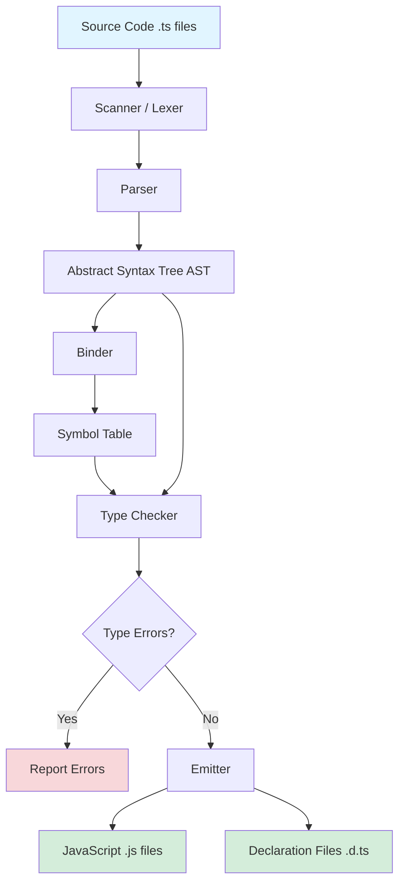
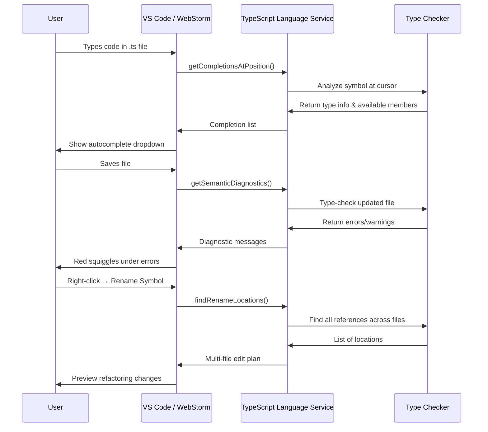

TypeScript is often described as "JavaScript with types." But what does that actually *mean*? What happens when you write `let x: number = 42;` and hit save? How does the compiler know that `x = "hello"` is an error? And how does your editor instantly underline mistakes and suggest fixes before you even run the code?

This page takes you inside TypeScript's architecture — from the relationship between TypeScript and JavaScript, through the compiler's internal pipeline, to the language service that powers VS Code, WebStorm, and every other modern editor.

<svg
  viewBox="0 0 640 230"
  role="img"
  aria-label="Twin block towers: the left one is wrapped in green scaffolding with a red bug pinned on a beam, the right one stands identical but bare while the scaffold dissolves into drifting dots beside a play button — types support the build, then erase before the code runs"
  style={{ display: "block", width: "100%", maxWidth: "640px", height: "auto", margin: "2.5rem auto" }}
>
  <g fill="currentColor" opacity="0.2">
    <rect x="90" y="190" width="470" height="4" rx="2" />
  </g>
  <g style={{ color: "var(--ds-blue-500)" }} fill="currentColor">
    <rect x="130" y="152" width="64" height="36" rx="6" />
    <rect x="130" y="112" width="64" height="36" rx="6" fillOpacity="0.9" />
    <rect x="130" y="72" width="64" height="36" rx="6" fillOpacity="0.8" />
    <rect x="430" y="152" width="64" height="36" rx="6" />
    <rect x="430" y="112" width="64" height="36" rx="6" fillOpacity="0.9" />
    <rect x="430" y="72" width="64" height="36" rx="6" fillOpacity="0.8" />
  </g>
  <g style={{ color: "var(--ds-green-500)" }} fill="currentColor">
    <rect x="112" y="52" width="6" height="136" rx="3" />
    <rect x="206" y="52" width="6" height="136" rx="3" />
    <rect x="106" y="60" width="112" height="5" rx="2.5" />
    <rect x="106" y="100" width="112" height="5" rx="2.5" />
    <rect x="106" y="140" width="112" height="5" rx="2.5" />
    <circle cx="412" cy="160" r="3" fillOpacity="0.25" />
    <circle cx="416" cy="120" r="3" fillOpacity="0.18" />
    <circle cx="414" cy="84" r="2.5" fillOpacity="0.12" />
    <circle cx="508" cy="150" r="3" fillOpacity="0.22" />
    <circle cx="512" cy="108" r="3" fillOpacity="0.15" />
    <circle cx="510" cy="76" r="2.5" fillOpacity="0.1" />
    <circle cx="446" cy="58" r="2.5" fillOpacity="0.14" />
    <circle cx="478" cy="50" r="2.5" fillOpacity="0.1" />
  </g>
  <g style={{ color: "var(--ds-red-500)" }} fill="currentColor">
    <circle cx="200" cy="96" r="5.5" />
  </g>
  <g fill="currentColor" opacity="0.3">
    <circle cx="270" cy="128" r="3" />
    <circle cx="292" cy="128" r="3" />
    <circle cx="314" cy="128" r="3" />
    <circle cx="336" cy="128" r="3" />
    <path d="M348 120 L364 128 L348 136 Z" />
  </g>
  <g style={{ color: "var(--ds-yellow-500)" }} fill="currentColor">
    <path d="M540 158 L558 169 L540 180 Z" />
  </g>
</svg>

## The JavaScript ↔ TypeScript relationship

Here's the most important fact about TypeScript: **TypeScript is a syntactic superset of JavaScript.** That means every valid JavaScript program is a valid TypeScript program. If you take a `.js` file and rename it to `.ts`, it compiles. You don't have to change a single character.

TypeScript adds *optional annotations* on top of JavaScript. These annotations describe the *types* of values — whether a variable holds a number, a string, an object with specific properties, or a function with a particular signature. The TypeScript compiler checks these annotations against your code, reports errors, and then *erases the types* to produce plain JavaScript.

Let's see this in action:

<CodeBlock
  adapter="typescript"
  files={[
    {
      filename: "main.ts",
      starterCode: `// Plain JavaScript — no type annotations
let x = 10;
x = "hello"; // JavaScript allows this
console.log(x);

// TypeScript will accept the above (x has inferred type 'number',
// but we reassign to string, which would be an error in strict mode)
// Let's demonstrate explicit types:

let y: number = 10;
// y = "hello";  // Uncommenting this line causes a compile error:
// Type 'string' is not assignable to type 'number'.

console.log("y is", y);

// TypeScript checks the types, then erases them.
// The compiled JS looks like:
// let y = 10;
// console.log("y is", y);
`,
    },
  ]}
/>

The code above shows the key mechanic: TypeScript checks that `y` is used consistently as a number. If you try to assign a string to `y`, the compiler stops you. But the *runtime* code — the JavaScript that actually executes — has no mention of `: number`. Types exist only at *compile time*.

## Compile time vs. runtime

This distinction is crucial: **TypeScript's types only exist during compilation. At runtime, TypeScript code is just JavaScript.**

When you write:

```typescript
function greet(name: string): string {
  return `Hello, ${name}!`;
}
```

The compiled JavaScript is:

```javascript
function greet(name) {
  return `Hello, ${name}!`;
}
```

The `: string` annotations vanish. There's no runtime type-checking of the `name` parameter. If you call `greet(42)` from JavaScript (or from untyped legacy code), the function will happily return `"Hello, 42!"`. TypeScript can't protect you from code it doesn't type-check.

This is by design. Type erasure keeps TypeScript's output clean and fast. It also means TypeScript can compile to older JavaScript versions (ES5, ES3) while using modern syntax (classes, async/await). The tradeoff is that TypeScript assumes you've type-checked your whole program — it doesn't add runtime guards.

<Callout type="warning" title="TypeScript is not a runtime guard">
If you're writing a public API or receiving data from an external source (like a REST endpoint), TypeScript alone won't validate it. You'll need runtime validation libraries (like Zod, io-ts, or Yup) to check incoming data at runtime. TypeScript's types are a *compile-time contract*, not a runtime fence.
</Callout>

## The structural type system (a first look)

One of TypeScript's defining features is its **structural type system** (also known as duck typing). In languages like Java or C#, two types are compatible only if one explicitly inherits from the other. In TypeScript, two types are compatible if they have the *same shape* — the same properties and methods.

<CodeBlock
  adapter="typescript"
  files={[
    {
      filename: "main.ts",
      starterCode: `interface User {
  name: string;
  age: number;
}

function printUser(user: User) {
  console.log(\`\${user.name} is \${user.age} years old\`);
}

// We didn't declare this object as 'User', but it has the right shape
const bob = { name: "Bob", age: 30, email: "bob@example.com" };

printUser(bob); // TypeScript accepts this!
// Extra properties (email) are okay; the object has at least name & age.

// But this fails:
const incomplete = { name: "Charlie" };
// printUser(incomplete); // Error: Property 'age' is missing
`,
    },
  ]}
/>

TypeScript doesn't care about class hierarchies or explicit `implements` declarations (though you can use them). It cares whether the object has the *right properties*. This makes TypeScript feel like JavaScript — where you often pass around plain objects — rather than forcing OOP patterns.

We'll explore structural typing in depth later. For now, just know: **TypeScript checks structure, not names.**

## The compiler pipeline

When you run `tsc` (the TypeScript compiler) or save a file in VS Code, your code flows through a multi-stage pipeline. Each stage transforms or analyzes the code, building up information until the type checker can prove your program is safe (or report errors).

Before we open it up, one detail worth savoring: **the TypeScript compiler is written in TypeScript.** Every stage you're about to read about — scanner, parser, binder, checker, emitter — is itself TypeScript source code, type-checked by an earlier build of itself. This is a classic compiler tradition called *self-hosting* (C's compilers are written in C, for the same reason), and it doubles as the ultimate confidence test: a language good enough to build its own hundred-thousand-line compiler is good enough for your application.

Here's the high-level flow:



Let's walk through each stage:

### 1. Scanner (Lexer)

The **scanner** reads your source code character by character and breaks it into **tokens** — the smallest meaningful units of syntax. For example, the line:

```typescript
let x: number = 42;
```

becomes:

```
LET_KEYWORD  IDENTIFIER("x")  COLON  IDENTIFIER("number")  EQUALS  NUMERIC_LITERAL(42)  SEMICOLON
```

The scanner doesn't understand *meaning* yet. It just recognizes keywords (`let`, `function`, `if`), identifiers (`x`, `myFunction`), operators (`+`, `=`), and literals (`42`, `"hello"`).

<svg
  viewBox="0 0 640 170"
  role="img"
  aria-label="A continuous flowing ribbon of source text falls apart into a neat row of small colored chips and beads — the scanner chopping raw characters into discrete tokens"
  style={{ display: "block", width: "100%", maxWidth: "520px", height: "auto", margin: "2.5rem auto" }}
>
  <g fill="currentColor" opacity="0.18">
    <path d="M60 50 C140 34 220 62 300 48 C380 36 460 60 580 44 L580 58 C460 74 380 50 300 62 C220 76 140 48 60 64 Z" />
  </g>
  <g fill="currentColor" opacity="0.25">
    <circle cx="110" cy="84" r="2.5" />
    <circle cx="190" cy="88" r="2.5" />
    <circle cx="270" cy="84" r="2.5" />
    <circle cx="350" cy="88" r="2.5" />
    <circle cx="430" cy="84" r="2.5" />
    <circle cx="510" cy="88" r="2.5" />
  </g>
  <g style={{ color: "var(--ds-blue-500)" }} fill="currentColor">
    <rect x="60" y="106" width="46" height="20" rx="10" />
    <rect x="240" y="106" width="38" height="20" rx="10" />
    <circle cx="398" cy="116" r="9" />
    <rect x="480" y="106" width="46" height="20" rx="10" />
  </g>
  <g style={{ color: "var(--ds-green-500)" }} fill="currentColor">
    <circle cx="130" cy="116" r="9" />
    <circle cx="212" cy="116" r="9" />
    <rect x="328" y="106" width="46" height="20" rx="10" />
  </g>
  <g style={{ color: "var(--ds-yellow-500)" }} fill="currentColor">
    <rect x="158" y="106" width="30" height="20" rx="10" />
    <circle cx="300" cy="116" r="9" />
    <rect x="426" y="106" width="30" height="20" rx="10" />
  </g>
  <g fill="currentColor" opacity="0.35">
    <circle cx="550" cy="116" r="4" />
  </g>
</svg>

### 2. Parser

The **parser** takes the stream of tokens and builds an **Abstract Syntax Tree (AST)** — a tree structure representing the program's syntactic structure. For the line above, the AST node might look like:

```
VariableStatement
  ├─ VariableDeclarationList
  │   └─ VariableDeclaration
  │       ├─ Identifier: "x"
  │       ├─ TypeAnnotation: NumberKeyword
  │       └─ Initializer: NumericLiteral(42)
```

The AST captures the *structure* of the code: "This is a variable declaration named `x`, with type `number`, initialized to `42`." The parser checks syntax (no missing semicolons or braces), but it doesn't check *types* yet.

### 3. Binder

The **binder** walks the AST and builds a **symbol table** — a map from names (`x`, `myFunction`) to their declarations. This is where TypeScript figures out *scope*. If you reference `x` inside a function, the binder determines which `x` you mean (the global one? a local variable? a parameter?).

The binder also links `import` and `export` statements across files, building a module graph. By the end of the binding phase, TypeScript knows what every identifier refers to.

### 4. Type Checker

The **type checker** is the heart of TypeScript. It walks the AST again (now enriched with symbol information) and assigns a **type** to every expression:

- `42` has type `number`
- `"hello"` has type `string`
- `x + y` has type `number` (if both `x` and `y` are numbers)
- `function greet(name: string): string { ... }` has type `(name: string) => string`

The type checker verifies that:

- Variables are used consistently with their declared types
- Functions are called with the right number and types of arguments
- Properties accessed on objects actually exist
- Control flow makes sense (e.g., you don't use a variable before it's defined)

If the type checker finds a violation, it reports an error. But it doesn't stop — it keeps checking the rest of the program so you can see all errors at once.

### 5. Emitter

If type checking succeeds (or if you've allowed errors with `--noEmitOnError false`), the **emitter** generates JavaScript. It walks the AST one more time, translating TypeScript syntax (like `let x: number = 42`) into equivalent JavaScript (`let x = 42`).

The emitter also:

- **Downlevels** modern syntax (like `async`/`await` or classes) to older JavaScript (like ES5 generators or prototype chains) based on your `target` setting.
- Generates **declaration files** (`.d.ts`) that describe the types of your exports, so other TypeScript projects can import and type-check against your code.
- Applies transformations (like JSX → `React.createElement` or decorators → metadata).

The output is clean, readable JavaScript — often indistinguishable from what a human would write.

## Control flow analysis

One of TypeScript's most powerful features is **control flow analysis** — the compiler's ability to track how types change within branches, loops, and conditionals.

<CodeBlock
  adapter="typescript"
  files={[
    {
      filename: "main.ts",
      starterCode: `function processValue(value: string | number) {
  // At this point, value could be string OR number

  if (typeof value === "string") {
    // TypeScript narrows the type to 'string' inside this block
    console.log("String length:", value.length);
  } else {
    // TypeScript narrows the type to 'number' here
    console.log("Number squared:", value * value);
  }

  // Outside the if/else, value is back to 'string | number'
}

processValue("hello");
processValue(42);
`,
    },
  ]}
/>

The type checker doesn't just look at the declared type `string | number`. It tracks the `typeof` check and *narrows* the type in each branch. This is called **type narrowing** or **flow-sensitive typing**, and it eliminates many casts and assertions you'd need in other languages.

We'll cover narrowing deeply in later lessons. For now, recognize that TypeScript is doing sophisticated reasoning about your program's logic, not just checking syntax.

## The language service: TypeScript in your editor

When you open a `.ts` file in VS Code or WebStorm, you get instant feedback: red squiggles under errors, autocomplete as you type, tooltips showing function signatures, refactorings like "Rename Symbol" that work across files. How?

The TypeScript compiler exposes a **language service** — an API that editors can call to ask questions like:

- "What's the type of this variable?"
- "What properties does this object have?" (for autocomplete)
- "If I rename this function, what files need to change?"
- "What are all the references to this symbol?"

The language service uses the same type checker that `tsc` uses. When you save a file, the editor sends the updated content to the language service, which re-runs the binder and checker on the changed file (and any files that import it), then reports errors and updated type information back to the editor.



This tight integration between the compiler and the editor is why TypeScript feels so *responsive*. You don't have to run a build command to see errors. You don't have to guess what properties an object has. The compiler is *always* running in the background, keeping your editor in sync with the type system.

## Incremental compilation and caching

Type-checking a large codebase (tens of thousands of files) would be slow if TypeScript re-checked everything from scratch every time. To stay fast, the compiler uses several strategies:

**Incremental compilation**: When you change one file, TypeScript only re-checks that file and the files that import it (transitively). Unchanged files are skipped.

**Declaration files** (`.d.ts`): When you import a third-party library (like React or Lodash), TypeScript doesn't re-check the library's source code. It reads the `.d.ts` declaration file — a compact summary of the library's types — which is much faster to parse.

**`tsc --watch` mode**: In watch mode, the compiler stays running, keeping an in-memory representation of your project. When you save a file, it incrementally updates its internal state rather than restarting from scratch. This makes type-checking feel near-instantaneous.

**Project references** (for monorepos): If you have multiple TypeScript projects in one repository, you can configure them as "project references." TypeScript builds each project once, emits `.d.ts` files, and then other projects import those declarations instead of re-checking the source.

These optimizations are why TypeScript scales to massive codebases (Microsoft's internal repos have hundreds of thousands of TypeScript files) while still providing instant feedback in editors.

<svg
  viewBox="0 0 640 230"
  role="img"
  aria-label="A grid of file tiles stays dim except one yellow edited file and the two blue files that import it, joined by dotted edges — incremental compilation re-checks only what changed"
  style={{ display: "block", width: "100%", maxWidth: "520px", height: "auto", margin: "2.5rem auto" }}
>
  <g fill="currentColor" opacity="0.1">
    <rect x="60" y="24" width="80" height="44" rx="9" />
    <rect x="168" y="24" width="80" height="44" rx="9" />
    <rect x="276" y="24" width="80" height="44" rx="9" />
    <rect x="492" y="24" width="80" height="44" rx="9" />
    <rect x="60" y="92" width="80" height="44" rx="9" />
    <rect x="168" y="92" width="80" height="44" rx="9" />
    <rect x="384" y="92" width="80" height="44" rx="9" />
    <rect x="492" y="92" width="80" height="44" rx="9" />
    <rect x="60" y="160" width="80" height="44" rx="9" />
    <rect x="168" y="160" width="80" height="44" rx="9" />
    <rect x="276" y="160" width="80" height="44" rx="9" />
    <rect x="492" y="160" width="80" height="44" rx="9" />
  </g>
  <g style={{ color: "var(--ds-yellow-500)" }} fill="currentColor">
    <rect x="276" y="92" width="80" height="44" rx="9" />
  </g>
  <g style={{ color: "var(--ds-blue-500)" }} fill="currentColor">
    <rect x="384" y="24" width="80" height="44" rx="9" fillOpacity="0.78" />
    <rect x="384" y="160" width="80" height="44" rx="9" fillOpacity="0.78" />
  </g>
  <g fill="currentColor" opacity="0.35">
    <circle cx="366" cy="100" r="2.5" />
    <circle cx="376" cy="84" r="2.5" />
    <circle cx="384" cy="66" r="2.5" />
    <circle cx="366" cy="128" r="2.5" />
    <circle cx="375" cy="144" r="2.5" />
    <circle cx="382" cy="158" r="2.5" />
  </g>
</svg>

## What the compiler can't do

TypeScript's type checker is powerful, but it has limits:

**It can't check runtime values.** If you fetch JSON from an API, TypeScript has no idea what shape it has. You must validate it yourself (or use a library like Zod) and cast it to a type.

**It can't prevent all logic errors.** TypeScript catches *type* errors (passing a string where a number is expected), but it won't catch off-by-one errors, infinite loops, or wrong business logic.

**It can't enforce exhaustiveness without help.** If you add a new case to a union type, TypeScript won't automatically force you to handle it everywhere — unless you use specific patterns (like `never` checks) that we'll cover later.

**It trusts your annotations.** If you write `const x: number = "hello" as any as number`, TypeScript believes you. Type assertions (`as`) and `any` are escape hatches — use them sparingly, or you'll defeat the purpose of static types.

Despite these limits, TypeScript catches the *majority* of bugs that plague JavaScript codebases: typos, refactoring mistakes, mismatched function arguments, missing properties, and null/undefined errors.

## Types as a design language

Beyond catching bugs, TypeScript changes *how you think about code*. Types become a **design language** — a way to communicate intent, document contracts, and encode constraints.

When you write:

```typescript
function fetchUser(id: string): Promise<User | null> {
  // ...
}
```

You're saying:

- "This function takes a string ID."
- "It returns a Promise — it's asynchronous."
- "The result is either a `User` object or `null` (maybe the user doesn't exist)."

Future you (and your teammates) don't have to read the implementation or write a test to understand this contract. It's right there in the signature. And if you refactor `fetchUser` to return `User | NotFoundError` instead of `User | null`, TypeScript will *force* every caller to update their error handling.

Types scale your brain. They let you work on one module without holding the entire system in your head. They make codebases *readable* and *navigable*.

## The journey from source to JavaScript

Let's summarize the full journey:

1. **You write** TypeScript with type annotations.
2. **The scanner** tokenizes your code.
3. **The parser** builds an Abstract Syntax Tree.
4. **The binder** resolves names and builds the symbol table.
5. **The type checker** verifies types and reports errors.
6. **The emitter** produces JavaScript (with types erased) and `.d.ts` declaration files.
7. **Your editor** uses the language service (same type checker) to provide instant feedback, autocomplete, and refactoring.

At the end of this pipeline, you have two artifacts:

- **JavaScript files** (`.js`) that run in any JavaScript engine (Node, browsers, Deno).
- **Declaration files** (`.d.ts`) that let other TypeScript projects import your code and get full type checking.

The types never reach production. They're a *compile-time tool* for correctness and productivity.

---

<MultipleChoice
  markdown={`What happens to TypeScript's type annotations at runtime?

- They are checked by the JavaScript engine for validation
  > JavaScript engines have no knowledge of TypeScript annotations; they only understand plain JavaScript.
- They are converted into runtime type guards
  > TypeScript does not generate any runtime checking code from annotations; type erasure removes them entirely.
- [o] They are erased during compilation and do not exist in the emitted JavaScript
  > TypeScript performs type checking at *compile time*, then removes all type annotations before emitting JavaScript. The runtime behavior is identical to plain JS — there's no runtime type enforcement unless you add it yourself.
- They are kept as comments in the JavaScript output
  > The emitter strips type annotations completely; they do not appear as comments or in any other form in the JavaScript output.

This is why TypeScript is so fast and lightweight: it adds zero runtime overhead. The tradeoff is that you can't rely on TypeScript to validate data from external sources (like APIs) — you need runtime validation for that.`}
/>
