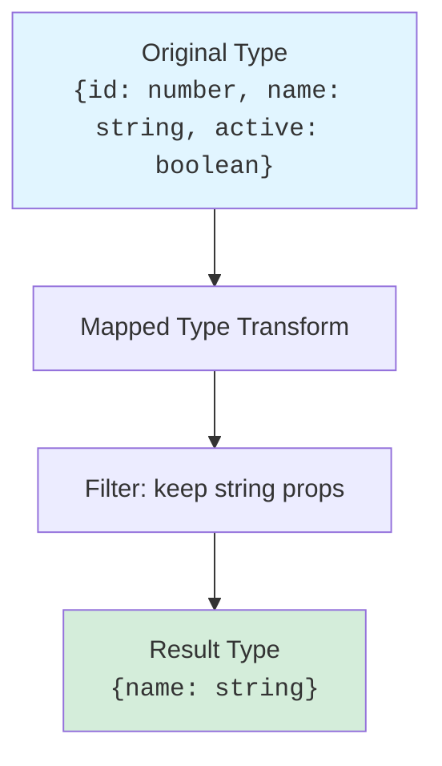

You've learned how to build generic types that work with any input. But what if you need to *transform* a type systematically — taking every property and making it optional, or readonly, or changing its value type? What if you need *conditional logic* at the type level — "if this type extends that, then produce X, otherwise Y"?

These questions lead us to **mapped types** and **conditional types**, two of TypeScript's most powerful metaprogramming tools. They let you write type-level functions that inspect, filter, and reshape other types. They're the building blocks behind the standard library's utility types (which we'll tour in the next chapter), and they're essential for modeling complex, real-world constraints.

---

## Mapped Types

A **mapped type** iterates over the keys of a type and produces a new type by transforming each property. The syntax looks like this:

```ts
type Mapped<T> = {
  [K in keyof T]: T[K];
};
```

Let's unpack:
- `keyof T` produces a union of `T`'s property names (we'll explore `keyof` deeply in [keyof, typeof & Template Literals](./keyof-typeof-template-literals)).
- `K in keyof T` iterates over each key.
- `T[K]` is an **indexed access type**: the type of property `K` in `T`.

Here's a simple example that copies a type unchanged:

<CodeBlock
  adapter="typescript"
  files={[
    {
      filename: "main.ts",
      starterCode: `type User = { id: number; name: string; active: boolean };

type CopiedUser = { [K in keyof User]: User[K] };

const u: CopiedUser = { id: 1, name: "Alice", active: true };
console.log(u);
`,
    },
  ]}
/>

This `CopiedUser` is structurally identical to `User`. But mapped types become powerful when you *change* something during the mapping.

---

## Modifiers: `readonly` and `?`

Inside a mapped type, you can add or remove modifiers:

- Prefix a property with `readonly` to make it immutable.
- Suffix a property with `?` to make it optional.

Here's a type that makes every property readonly:

<CodeBlock
  adapter="typescript"
  files={[
    {
      filename: "main.ts",
      starterCode: `type User = { id: number; name: string };

type ReadonlyUser = { readonly [K in keyof User]: User[K] };

const u: ReadonlyUser = { id: 1, name: "Alice" };
// u.name = "Bob"; // Error: Cannot assign to 'name' because it is a read-only property.
console.log(u);
`,
    },
  ]}
/>

And here's one that makes every property optional:

<CodeBlock
  adapter="typescript"
  files={[
    {
      filename: "main.ts",
      starterCode: `type User = { id: number; name: string };

type PartialUser = { [K in keyof User]?: User[K] };

const u: PartialUser = { id: 1 }; // 'name' is optional
console.log(u);
`,
    },
  ]}
/>

### Removing Modifiers with `-`

You can also *remove* modifiers with `-`:

- `-readonly` removes the `readonly` modifier.
- `-?` removes the optional modifier (making it required).

<CodeBlock
  adapter="typescript"
  files={[
    {
      filename: "main.ts",
      starterCode: `type OptionalUser = { id?: number; name?: string };

type RequiredUser = { [K in keyof OptionalUser]-?: OptionalUser[K] };

const u: RequiredUser = { id: 1, name: "Alice" }; // Both required now
console.log(u);
`,
    },
  ]}
/>

The `+` prefix is implicit (the default), so `+readonly` is the same as `readonly`. But being explicit helps when you're toggling modifiers dynamically.

---

## Key Remapping with `as`

TypeScript 4.1 introduced **key remapping** in mapped types: you can use `as` to rename keys during the mapping. The new key must resolve to a `string | number | symbol` (or `never` to *exclude* that key).

Here's a type that prefixes every key with `get`:

<CodeBlock
  adapter="typescript"
  files={[
    {
      filename: "main.ts",
      starterCode: `type User = { id: number; name: string };

type Getters<T> = {
  [K in keyof T as \`get\${Capitalize<string & K>}\`]: () => T[K];
};

type UserGetters = Getters<User>;

const userGetters: UserGetters = {
  getId: () => 1,
  getName: () => "Alice",
};
console.log(userGetters.getId(), userGetters.getName());
`,
    },
  ]}
/>

We'll cover template literal types like `` `get${...}` `` in the next chapter. For now, notice that `K` is remapped to a new string literal, and the property type becomes a function returning `T[K]`.

You can also filter keys by remapping to `never`:

<CodeBlock
  adapter="typescript"
  files={[
    {
      filename: "main.ts",
      starterCode: `type User = { id: number; name: string; active: boolean };

type StringPropsOnly<T> = {
  [K in keyof T as T[K] extends string ? K : never]: T[K];
};

type UserStrings = StringPropsOnly<User>;

const u: UserStrings = { name: "Alice" };
console.log(u);
`,
    },
  ]}
/>

The condition `T[K] extends string ? K : never` keeps only keys whose values are strings. Keys that don't match are mapped to `never`, which TypeScript omits.



---

## Conditional Types

A **conditional type** selects one of two types based on whether a constraint is satisfied. The syntax mirrors a ternary operator:

```ts
T extends U ? X : Y
```

If `T` is assignable to `U`, the type resolves to `X`; otherwise, `Y`.

Here's a simple example:

<CodeBlock
  adapter="typescript"
  files={[
    {
      filename: "main.ts",
      starterCode: `type IsString<T> = T extends string ? "yes" : "no";

type A = IsString<string>; // "yes"
type B = IsString<number>; // "no"

const a: A = "yes";
const b: B = "no";
console.log(a, b);
`,
    },
  ]}
/>

Conditional types become powerful when combined with generics. You can build type-level logic that branches based on the input.

---

## Distributive Conditional Types

When a conditional type is applied to a **naked type parameter** (one not wrapped in an array, tuple, or other construct), TypeScript distributes the conditional over each member of a union:

<CodeBlock
  adapter="typescript"
  files={[
    {
      filename: "main.ts",
      starterCode: `type ToArray<T> = T extends any ? T[] : never;

type Result = ToArray<string | number>;
// Distributes: ToArray<string> | ToArray<number>
// Result: string[] | number[]

const x: Result = ["a", "b"];
const y: Result = [1, 2];
console.log(x, y);
`,
    },
  ]}
/>

Notice that `Result` is `string[] | number[]`, not `(string | number)[]`. Each member of the union was processed separately.

To prevent distribution, wrap the type parameter in brackets:

<CodeBlock
  adapter="typescript"
  files={[
    {
      filename: "main.ts",
      starterCode: `type ToArrayNoDistribute<T> = [T] extends [any] ? T[] : never;

type Result = ToArrayNoDistribute<string | number>;
// Result: (string | number)[]

const x: Result = ["a", 1];
console.log(x);
`,
    },
  ]}
/>

Distributive behavior is useful for filtering unions. For example, extracting non-nullable types:

<CodeBlock
  adapter="typescript"
  files={[
    {
      filename: "main.ts",
      starterCode: `type NonNullable<T> = T extends null | undefined ? never : T;

type Result = NonNullable<string | number | null | undefined>;
// Distributes over union: string | number | never | never
// Simplifies to: string | number

const x: Result = "hello";
const y: Result = 42;
console.log(x, y);
`,
    },
  ]}
/>

---

## The `infer` Keyword

The `infer` keyword lets you **extract** parts of a type inside a conditional. It's like pattern matching for types.

For example, here's how to extract the return type of a function:

<CodeBlock
  adapter="typescript"
  files={[
    {
      filename: "main.ts",
      starterCode: `type ReturnType<T> = T extends (...args: any[]) => infer R ? R : never;

function greet(name: string): string {
  return \`Hello, \${name}!\`;
}

type GreetReturn = ReturnType<typeof greet>;

const msg: GreetReturn = "Hello, Alice!";
console.log(msg);
`,
    },
  ]}
/>

Here's how `infer` works:
1. `T extends (...args: any[]) => infer R` checks if `T` is a function.
2. If it is, `R` is inferred to be the return type.
3. If not, the type is `never`.

You can use `infer` in multiple positions:

<CodeBlock
  adapter="typescript"
  files={[
    {
      filename: "main.ts",
      starterCode: `type FirstArg<T> = T extends (first: infer F, ...rest: any[]) => any
  ? F
  : never;

function add(a: number, b: number): number {
  return a + b;
}

type AddFirstArg = FirstArg<typeof add>;

const x: AddFirstArg = 42;
console.log(x);
`,
    },
  ]}
/>

`infer` is powerful for unwrapping nested types. For example, extracting the element type of an array:

<CodeBlock
  adapter="typescript"
  files={[
    {
      filename: "main.ts",
      starterCode: `type Unpack<T> = T extends (infer U)[] ? U : T;

type Result1 = Unpack<number[]>; // number
type Result2 = Unpack<string>; // string

const x: Result1 = 42;
const y: Result2 = "hello";
console.log(x, y);
`,
    },
  ]}
/>

---

<Callout type="info" title="How Mapped and Conditional Types Relate">
Mapped types transform object types by iterating over keys. Conditional types branch based on type relationships. Together, they let you build sophisticated transformations: "map over this type's keys, and for each key, if its value is X, do Y; otherwise, do Z."
</Callout>

---

## Putting It Together

Let's build a type that makes all function properties in an object optional, leaving other properties unchanged:

<CodeBlock
  adapter="typescript"
  files={[
    {
      filename: "main.ts",
      starterCode: `type OptionalFunctions<T> = {
  [K in keyof T]: T[K] extends (...args: any[]) => any
    ? T[K] | undefined
    : T[K];
};

type Service = {
  name: string;
  start: () => void;
  stop: () => void;
};

type PartialService = OptionalFunctions<Service>;

const svc: PartialService = {
  name: "MyService",
  start: undefined, // OK now
  stop: () => console.log("Stopping..."),
};
console.log(svc);
`,
    },
  ]}
/>

Here, the conditional type checks if `T[K]` is a function. If so, it unions with `undefined`. Otherwise, it's unchanged.

---

## Challenge: Implement `Mutable<T>`

<ChallengeCard
  adapter="typescript"
  title="Mutable<T>"
  instructions={`The standard library provides \`Readonly<T>\`, which adds \`readonly\` to every property. Your task is to implement the opposite: \`Mutable<T>\`, which removes \`readonly\` from every property.

**Hint**: Use a mapped type with the \`-readonly\` modifier.`}
  files={[
    {
      filename: "main.ts",
      initCode: `type Mutable<T> = any; // Replace 'any' with your implementation
`,
      starterCode: `type Mutable<T> = any;

type ReadonlyUser = { readonly id: number; readonly name: string };
type MutableUser = Mutable<ReadonlyUser>;

const u: MutableUser = { id: 1, name: "Alice" };
u.name = "Bob"; // Should compile without error
console.log(u);
`,
      solutionCode: `type Mutable<T> = { -readonly [K in keyof T]: T[K] };

type ReadonlyUser = { readonly id: number; readonly name: string };
type MutableUser = Mutable<ReadonlyUser>;

const u: MutableUser = { id: 1, name: "Alice" };
u.name = "Bob";
console.log(u);
`,
    },
  ]}
  tests={[
    {
      id: "t1",
      name: "Removes readonly",
      description: "u.name can be reassigned",
      code: `const u: Mutable<{ readonly x: number }> = { x: 1 };
u.x = 2;
if (u.x !== 2) throw new Error("expected u.x to be mutable");`,
    },
  ]}
/>

---

## Multiple Choice: Distributive Behavior

<MultipleChoice
  markdown={`Given:
\`\`\`ts
type Wrap<T> = T extends any ? { value: T } : never;
type Result = Wrap<"a" | "b">;
\`\`\`
What is \`Result\`?

- \`{ value: "a" | "b" }\`
  > This would be true if the conditional didn't distribute. But it does.
- [o] \`{ value: "a" } | { value: "b" }\`
  > The conditional distributes over the union, producing two separate object types, then unioning them.
- \`never\`
  > The condition \`T extends any\` is always true, so we always get the true branch.

Conditional types distribute over naked type parameters when given a union, applying the logic to each member separately.`}
/>

---

## Multiple Choice: Key Remapping

<MultipleChoice
  markdown={`Given:
\`\`\`ts
type Test<T> = { [K in keyof T as K extends string ? K : never]: T[K] };
type Result = Test<{ a: number; 0: string }>;
\`\`\`
What properties does \`Result\` have?

- Both \`a\` and \`0\`
  > Remapping with \`never\` filters out that key. Since \`0\` is a number key, it's excluded.
- [o] Only \`a\`
  > The remapping \`K extends string ? K : never\` keeps only string keys. The numeric key \`0\` is mapped to \`never\` and omitted.
- Neither (empty object)
  > \`a\` is a string key, so it passes the filter.

Key remapping with \`never\` is a powerful technique for filtering properties.`}
/>

---

## Summary

You've learned how to:
- **Map** over a type's keys with `{ [K in keyof T]: ... }`.
- Add or remove `readonly` and optional modifiers with `+`/`-`.
- **Remap** keys with `as` to rename or filter them.
- Write **conditional types** with `T extends U ? X : Y`.
- Leverage **distributive** behavior to process unions member-by-member.
- Use **`infer`** to extract parts of a type.

These are the foundational tools for advanced type modeling. In the next chapter, we'll tour the standard library's **utility types** — and you'll see that they're all built from mapped and conditional types. There's no magic; you now have the tools to build them yourself.

---

**Next**: [Utility Types](./utility-types) — a practical tour of `Partial`, `Pick`, `ReturnType`, and friends, plus how they're implemented.
