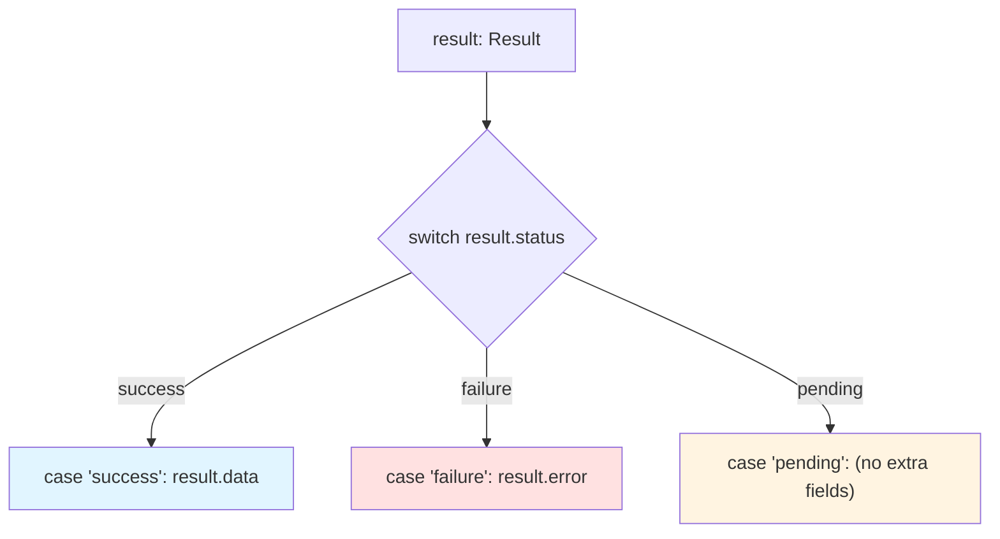

When you work with union types (`string | number`, `Shape`, `Result<T>`),
the compiler doesn't initially know *which* member of the union you have.
But TypeScript is smart: it tracks control flow — `if` checks, `switch`
statements, `throw`s — and **narrows** the type in each branch based on
what your code reveals. This is called **type narrowing** (or "control
flow analysis"), and it's one of TypeScript's most powerful features.

This chapter covers: **`typeof` guards**, **`instanceof` guards**,
**equality narrowing**, **`in` operator narrowing**, **truthiness
narrowing**, **user-defined type predicates**, and **assertion
functions**.

## The narrowing problem

Given a union type, you can only access properties or call methods that
exist on *all* members:

<CodeBlock
  adapter="typescript"
  initialCode={`function print(value: string | number): void {
  // console.log(value.length);  // ❌ Property 'length' does not exist on type 'number'
  console.log("value:", value);
}

print("hello");
print(42);
`}
/>

To call `value.length`, you need to prove to the compiler that `value` is
a `string`. That's where narrowing comes in.

## `typeof` guards

The **`typeof`** operator checks the primitive type at runtime. TypeScript
recognizes `typeof` checks and narrows the type accordingly:

<CodeBlock
  adapter="typescript"
  initialCode={`function print(value: string | number): void {
  if (typeof value === "string") {
    // In this branch, value is narrowed to string
    console.log("String length:", value.length);
  } else {
    // In this branch, value is narrowed to number
    console.log("Number squared:", value * value);
  }
}

print("hello");
print(42);
`}
/>

**What the compiler now knows:** Inside the `if` branch, `value` is
definitely a `string`. Inside the `else` branch, it's definitely a
`number`. The narrowing is automatic — you don't need a cast or
assertion.

`typeof` works for all primitive types:

<CodeBlock
  adapter="typescript"
  initialCode={`function describe(value: string | number | boolean | undefined): string {
  if (typeof value === "string") {
    return \`String: "\${value}"\`;
  } else if (typeof value === "number") {
    return \`Number: \${value}\`;
  } else if (typeof value === "boolean") {
    return \`Boolean: \${value}\`;
  } else {
    return "Undefined";
  }
}

console.log(describe("hello"));
console.log(describe(42));
console.log(describe(true));
console.log(describe(undefined));
`}
/>

Each branch refines the type. By the final `else`, the compiler knows
`value` is `undefined`.

## `instanceof` guards

The **`instanceof`** operator checks if a value is an instance of a
class. TypeScript narrows based on `instanceof`:

<CodeBlock
  adapter="typescript"
  initialCode={`class Dog {
  bark() { console.log("Woof!"); }
}

class Cat {
  meow() { console.log("Meow!"); }
}

function speak(animal: Dog | Cat): void {
  if (animal instanceof Dog) {
    animal.bark();  // animal is narrowed to Dog
  } else {
    animal.meow();  // animal is narrowed to Cat
  }
}

speak(new Dog());
speak(new Cat());
`}
/>

`instanceof` is essential for narrowing class-based unions. It works with
any JavaScript constructor (including built-ins like `Date`, `Array`,
`Error`).

## Equality narrowing

Comparing a value to a literal (via `===`, `!==`, `==`, `!=`) also
narrows the type:

<CodeBlock
  adapter="typescript"
  initialCode={`function process(value: string | null): void {
  if (value === null) {
    console.log("Value is null");
  } else {
    // value is narrowed to string
    console.log("String length:", value.length);
  }
}

process("hello");
process(null);
`}
/>

The check `value === null` proves that `value` is `null` in the `if`
branch, and *not* `null` in the `else` branch (so it must be `string`).

You can also compare against literal types:

<CodeBlock
  adapter="typescript"
  initialCode={`type Direction = "north" | "south" | "east" | "west";

function turn(direction: Direction): void {
  if (direction === "north") {
    console.log("Heading north!");
  } else if (direction === "south") {
    console.log("Heading south!");
  } else {
    // direction is narrowed to "east" | "west"
    console.log("Heading east or west:", direction);
  }
}

turn("north");
turn("east");
`}
/>

## `in` operator narrowing

The **`in`** operator checks if a property exists on an object. TypeScript
uses this to narrow object unions:

<CodeBlock
  adapter="typescript"
  initialCode={`type Circle = { kind: "circle"; radius: number };
type Rectangle = { kind: "rectangle"; width: number; height: number };
type Shape = Circle | Rectangle;

function describe(shape: Shape): string {
  if ("radius" in shape) {
    // shape is narrowed to Circle
    return \`Circle with radius \${shape.radius}\`;
  } else {
    // shape is narrowed to Rectangle
    return \`Rectangle \${shape.width}x\${shape.height}\`;
  }
}

const circle: Shape = { kind: "circle", radius: 10 };
const rect: Shape = { kind: "rectangle", width: 20, height: 30 };

console.log(describe(circle));
console.log(describe(rect));
`}
/>

The check `"radius" in shape` proves that `shape` has a `radius`
property, so it must be a `Circle`.

## Truthiness narrowing

TypeScript can narrow based on **truthiness checks** — if a value is
truthy or falsy:

<CodeBlock
  adapter="typescript"
  initialCode={`function printLength(value: string | null | undefined): void {
  if (value) {
    // value is truthy, so it's narrowed to string (null and undefined are falsy)
    console.log("Length:", value.length);
  } else {
    console.log("Value is null or undefined");
  }
}

printLength("hello");
printLength(null);
printLength(undefined);
`}
/>

The check `if (value)` eliminates `null` and `undefined` (both falsy),
leaving only `string`. This is a common pattern for handling optional
values.

**Caveat:** Truthiness narrowing can be imprecise. The empty string `""`
is falsy, so `if (value)` will treat it the same as `null`. If you need
to distinguish `""` from `null`, use an explicit check: `if (value !==
null && value !== undefined)`.

## Control flow with `switch`

The `switch` statement also triggers narrowing:

<CodeBlock
  adapter="typescript"
  initialCode={`type Result = 
  | { status: "success"; data: string }
  | { status: "failure"; error: string }
  | { status: "pending" };

function handle(result: Result): void {
  switch (result.status) {
    case "success":
      console.log("Data:", result.data);  // result is narrowed to success
      break;
    case "failure":
      console.log("Error:", result.error);  // result is narrowed to failure
      break;
    case "pending":
      console.log("Still loading...");  // result is narrowed to pending
      break;
    default:
      // Exhaustiveness check: if you add a new variant, this line errors
      const _exhaustive: never = result;
      console.log("Unreachable:", _exhaustive);
  }
}

handle({ status: "success", data: "All good!" });
handle({ status: "failure", error: "Something broke" });
`}
/>

The `switch` on `result.status` narrows `result` in each `case`.

## User-defined type predicates

Sometimes the compiler can't infer narrowing on its own. You can define a
**type predicate** — a function that returns `x is T` instead of
`boolean`:

<CodeBlock
  adapter="typescript"
  initialCode={`function isString(value: unknown): value is string {
  return typeof value === "string";
}

function process(value: unknown): void {
  if (isString(value)) {
    // value is narrowed to string
    console.log("String length:", value.length);
  } else {
    console.log("Not a string:", value);
  }
}

process("hello");
process(42);
`}
/>

The return type `value is string` tells the compiler: "If this function
returns `true`, then `value` is a `string` in the caller's scope." This
is more powerful than returning `boolean`, because it lets you encapsulate
complex checks in a reusable function.

Another example with custom objects:

<CodeBlock
  adapter="typescript"
  initialCode={`interface Dog {
  breed: string;
  bark(): void;
}

interface Cat {
  color: string;
  meow(): void;
}

function isDog(animal: Dog | Cat): animal is Dog {
  return "breed" in animal;
}

function interact(animal: Dog | Cat): void {
  if (isDog(animal)) {
    console.log("Dog breed:", animal.breed);
    animal.bark();
  } else {
    console.log("Cat color:", animal.color);
    animal.meow();
  }
}

const dog: Dog = { breed: "Labrador", bark: () => console.log("Woof!") };
const cat: Cat = { color: "Gray", meow: () => console.log("Meow!") };

interact(dog);
interact(cat);
`}
/>

The predicate `isDog` narrows `Dog | Cat` based on the presence of
`breed`.

## Assertion functions

TypeScript 3.7+ supports **assertion functions** — functions that throw
if a condition is false, and *assert* the type if they return:

<CodeBlock
  adapter="typescript"
  initialCode={`function assertIsString(value: unknown): asserts value is string {
  if (typeof value !== "string") {
    throw new Error(\`Expected string, got \${typeof value}\`);
  }
}

function process(value: unknown): void {
  assertIsString(value);
  // After the assertion, value is narrowed to string
  console.log("String length:", value.length);
}

process("hello");

try {
  process(42);
} catch (e: any) {
  console.log("Caught error:", e.message);
}
`}
/>

The return type `asserts value is string` tells the compiler: "If this
function returns (doesn't throw), then `value` is a `string` from that
point forward." This is like a type predicate, but it affects the type
*after* the call, not in an `if` branch.

Assertion functions are useful for validation logic:

<CodeBlock
  adapter="typescript"
  initialCode={`function assertNonNull<T>(value: T | null | undefined): asserts value is T {
  if (value === null || value === undefined) {
    throw new Error("Value is null or undefined");
  }
}

function getLength(value: string | null): number {
  assertNonNull(value);
  // value is now string (null is eliminated)
  return value.length;
}

console.log("Length:", getLength("hello"));

try {
  getLength(null);
} catch (e: any) {
  console.log("Caught error:", e.message);
}
`}
/>

## Narrowing with array methods

Some array methods (like `filter`) can narrow types if you use type
predicates:

<CodeBlock
  adapter="typescript"
  initialCode={`const mixed: (string | number)[] = [1, "two", 3, "four"];

// Filter to only strings
const strings = mixed.filter((x): x is string => typeof x === "string");
console.log("strings:", strings);  // strings is string[]

// Filter to only numbers
const numbers = mixed.filter((x): x is number => typeof x === "number");
console.log("numbers:", numbers);  // numbers is number[]
`}
/>

The predicate `(x): x is string` tells the compiler that the returned
array contains only `string`s.

## Practice: a shape area calculator with narrowing

Let's solidify these concepts with a challenge. You'll define a
discriminated union for shapes and implement a function that computes
area using narrowing.

<ChallengeCard
  adapter="typescript"
  title="Shape Area with Type Guards"
  instructions={`Define a discriminated union \`Shape = Circle | Rectangle | Triangle\` where \`Circle = { kind: "circle"; radius: number }\`, \`Rectangle = { kind: "rectangle"; width: number; height: number }\`, and \`Triangle = { kind: "triangle"; base: number; height: number }\`. Implement \`area(shape: Shape): number\` that computes the area (circle: π·r², rectangle: w·h, triangle: ½·b·h). Use a \`switch\` statement with exhaustiveness checking.`}
  initialCode={`type Circle = { kind: "circle"; radius: number };
type Rectangle = { kind: "rectangle"; width: number; height: number };
type Triangle = { kind: "triangle"; base: number; height: number };
type Shape = Circle | Rectangle | Triangle;

function area(shape: Shape): number {
  // Your code here
  return 0;
}

const circle: Shape = { kind: "circle", radius: 10 };
const rect: Shape = { kind: "rectangle", width: 20, height: 30 };
const tri: Shape = { kind: "triangle", base: 10, height: 5 };

console.log("Circle area:", area(circle).toFixed(2));
console.log("Rectangle area:", area(rect));
console.log("Triangle area:", area(tri));
`}
  solutionCode={`type Circle = { kind: "circle"; radius: number };
type Rectangle = { kind: "rectangle"; width: number; height: number };
type Triangle = { kind: "triangle"; base: number; height: number };
type Shape = Circle | Rectangle | Triangle;

function area(shape: Shape): number {
  switch (shape.kind) {
    case "circle":
      return Math.PI * shape.radius ** 2;
    case "rectangle":
      return shape.width * shape.height;
    case "triangle":
      return 0.5 * shape.base * shape.height;
    default:
      const _exhaustive: never = shape;
      throw new Error("Unreachable: " + _exhaustive);
  }
}

const circle: Shape = { kind: "circle", radius: 10 };
const rect: Shape = { kind: "rectangle", width: 20, height: 30 };
const tri: Shape = { kind: "triangle", base: 10, height: 5 };

console.log("Circle area:", area(circle).toFixed(2));
console.log("Rectangle area:", area(rect));
console.log("Triangle area:", area(tri));
`}
  tests={[
    {
      id: "circle",
      name: "Circle area",
      description: "area({kind:'circle',radius:10}) ≈ 314.16",
      code: `
const result = area({ kind: "circle", radius: 10 });
if (Math.abs(result - 314.159) > 0.01) throw new Error("Expected ~314.16, got " + result);
`,
    },
    {
      id: "rectangle",
      name: "Rectangle area",
      description: "area({kind:'rectangle',width:20,height:30}) === 600",
      code: `
const result = area({ kind: "rectangle", width: 20, height: 30 });
if (result !== 600) throw new Error("Expected 600, got " + result);
`,
    },
    {
      id: "triangle",
      name: "Triangle area",
      description: "area({kind:'triangle',base:10,height:5}) === 25",
      code: `
const result = area({ kind: "triangle", base: 10, height: 5 });
if (result !== 25) throw new Error("Expected 25, got " + result);
`,
    },
  ]}
/>

## Check your understanding

<MultipleChoice
  markdown={`Which of the following checks will narrow \`value: string | number\` to \`string\`?

- \`if (value) { ... }\`
- [o] \`if (typeof value === "string") { ... }\`
  > Correct! The \`typeof\` guard narrows to \`string\` in the \`if\` branch.
- \`if (value instanceof String) { ... }\`
- \`if ("length" in value) { ... }\`

\`typeof\` is the standard way to narrow primitive types. The \`instanceof\` check works for classes, and \`in\` works for object properties, but neither is appropriate here.`}
/>

<MultipleChoice
  markdown={`What does a type predicate like \`function isString(x: unknown): x is string\` do?

- It converts \`x\` to a string at runtime
- [o] It tells the compiler that \`x\` is a \`string\` if the function returns \`true\`
  > Correct! Type predicates enable custom narrowing logic.
- It asserts that \`x\` is always a string
- It's a syntax error

Type predicates let you encapsulate complex checks in reusable functions and still get narrowing.`}
/>

## Summary

Type narrowing is TypeScript's way of tracking what your code *proves*
about a value's type. `typeof`, `instanceof`, `===`, `in`, and truthiness
checks all trigger narrowing. You can define custom narrowing logic with
type predicates (`x is T`) and assertion functions (`asserts x is T`).
The compiler tracks control flow through `if`, `switch`, and even
early-return patterns, refining the type in each branch.

This is the magic that makes union types practical: you declare a broad
type (`string | number | null`), then let the compiler track the
narrowing as you drill down to specifics. No casts, no `any`, no
runtime overhead — just compile-time proof that your code is safe.

In the next chapter, [Any, Unknown,
Never](./any-unknown-never), we'll explore the three "special" types:
`any` (the escape hatch), `unknown` (the safe top type), and `never` (the
uninhabited bottom type). They're the edges of the type lattice, and
understanding them is key to mastering TypeScript.
